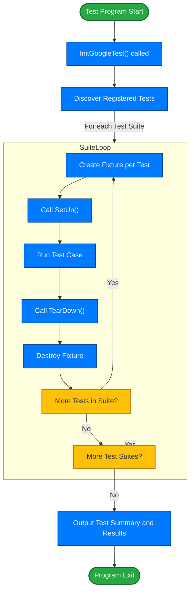

# Test Discovery & Execution Lifecycle

Understand how GoogleTest automatically discovers, initializes, and executes tests, including setup, teardown, and reporting mechanics. Learn how test suites and test cases are registered and run, and the flow from test entry point to result output.

---

## Introduction

When you run your GoogleTest-based test program, the framework handles the entire lifecycle of test discovery, initialization, execution, and report generation without requiring any manual enumeration of tests. This seamless orchestration ensures that all your defined tests run in a controlled, predictable manner, providing immediate feedback and detailed results.

This page explains the key concepts involved in the test discovery and execution process, explaining how test suites and test cases are registered, how setup and teardown happen, and how the execution flows from the `main()` entry point to the final test output.

## How GoogleTest Discovers Tests Automatically

GoogleTest uses powerful **automatic test registration** to keep track of all your defined tests and test suites.

### Defining Tests

- You define individual tests using the `TEST()` macro (or `TEST_F()` for fixtures).
- Each test defines a test suite name and test name.
- When these macros are compiled, they register the test metadata behind the scenes.

### Test Registration

- At program initialization, all registered tests are collected into a global registry.
- This registry maintains the list of test suites and their associated test cases.

This automatic registration means you never need to manually list or invoke your tests — simply linking your test files into a binary is sufficient.

<Info>
This automatic discovery is one of GoogleTest's core conveniences, ensuring seamless scalability as your project grows.
</Info>

## Test Program Entry and Initialization

The typical test program starts execution at `main()`, which can be provided by you or automatically supplied through GoogleTest libraries like `gtest_main` or `gmock_main`.

### Initialization Sequence

1. **Initialize the Testing Framework**
   - Call `testing::InitGoogleTest(&argc, argv)` to parse command-line flags relevant to GoogleTest.
   - This handles test filtering, output format selection, catch-exit behavior, and other configuration.

2. **Run Tests**
   - Call `RUN_ALL_TESTS()` to execute all discovered tests.
   - GoogleTest returns `0` if all tests pass, or `1` if any fail.

### Example main() Boilerplate

```cpp
#include <gtest/gtest.h>

int main(int argc, char** argv) {
  testing::InitGoogleTest(&argc, argv);  // Setup GoogleTest
  return RUN_ALL_TESTS();                // Trigger test execution
}
```

<Note>
You should always check the return code of `RUN_ALL_TESTS()` as it indicates success or failure of your test suite.
</Note>

## Test Execution Flow

Once the test program starts execution, GoogleTest runs each test case in the order determined by the registry, handling setup and teardown for each.

### Running a Single Test

For each test case:

1. **Create Test Fixture Object**
   - GoogleTest instantiates the fixture class for the test (or a default if none).

2. **Call Setup**
   - Runs `SetUp()` method on the fixture.
   - This prepares any shared state or resources needed for the test.

3. **Execute Test**
   - Runs the test body defined by you within `TEST_F` or `TEST`.

4. **Call Teardown**
   - Runs `TearDown()` on the fixture to clean up.

5. **Destroy Fixture Object**

This lifecycle isolates each test case to ensure no side-effects propagate across test boundaries.

<Warning>
If initialization or teardown throws an error or crashes, the current test is aborted but the framework continues with other tests.
</Warning>

### Parallelism and Ordering

- By default, tests run sequentially. Some build systems can configure parallel execution but GoogleTest does not manage thread safety internally.
- Respect test independence to avoid flaky results.

## Setup and Teardown Mechanics

### Test Fixtures

- Fixtures are classes derived from `::testing::Test`.
- You can override `SetUp()` and `TearDown()` to initialize and clean up state shared across tests in a suite.
- Each test case gets a fresh fixture instance, ensuring isolation.

### Constructor and Destructor

- GoogleTest constructs and destructs the fixture object around each test.
- Use constructors if setup does not require failure handling; otherwise prefer `SetUp()` and `TearDown()`.

<Check>
Best practice is to keep `SetUp()` and `TearDown()` lightweight to maintain fast test execution.
</Check>

## Test Suites and Test Cases

### Structure

- A **test suite** groups multiple related individual tests.
- Each **test case** is a discrete, runnable unit within a suite.

This hierarchical organization makes it easier to understand and run specific subsets.

### Registration

- Both test suites and test cases are registered internally during static initialization.
- Users interact primarily with individual or grouped tests through command-line flags or test filters.

### Filtering Tests

- Use `--gtest_filter=` to limit which tests run by suite or test name.
- This enables faster feedback loops when working on specific areas of code.

### Example

```shell
./my_test_binary --gtest_filter=MyTestSuite.MyTestCase
```

## Reporting and Result Output

### Summary of Results

After all tests run, GoogleTest prints a summary including:

- Passed test count
- Failed test count
- Any tests skipped or disabled

### Failure Messages

- Detailed messages are printed for failed tests.
- Includes file and line where the failure occurred, the expression that failed, and any custom messages.

### Output Formats

- Human-readable
- XML format for integration with CI systems (`--gtest_output=xml:path/to/file.xml`)

### Options for Verbosity

- Customize output with flags for more or less detail.

## Typical User Flow

<Steps>
<Step title="Write and Compile Tests">
Define your tests with `TEST()` and `TEST_F()`, build your test binary linking GoogleTest.
</Step>
<Step title="Run Tests via CLI">
Run your test binary to perform test discovery and execution automatically.
</Step>
<Step title="Interpret Results">
Read detailed output to identify failures or errors and debug accordingly.
</Step>
<Step title="Rerun with Filters">
Narrow the test set by using filters to work iteratively on fixes.
</Step>
</Steps>

## Best Practices

- **Ensure isolation:** Design tests so each can run independently without side effects.
- **Use fixtures wisely:** Shared setup/teardown reduces boilerplate.
- **Leverage test filtering:** Keep turnaround time short by selectively running tests.
- **Check return codes:** Always use the return code of `RUN_ALL_TESTS()`.
- **Use provided main():** Whenever possible, link with `gtest_main` or `gmock_main` to avoid boilerplate.

## Troubleshooting Tips

- **Tests not running?**
  - Make sure tests are linked into the executable.
  - Verify macros `TEST` or `TEST_F` are used correctly.
- **Setup or teardown not called?**
  - Check proper overrides of `SetUp()` and `TearDown()`, and spelling.
- **Tests failing unexpectedly?**
  - Consider setup side-effects or shared state not properly reset.
- **Filtering not working?**
  - Double-check filter syntax and test names (case-sensitive).

## Related Concepts

- Integration with Build Systems: [Guides / Integrating with Build Systems](https://github.com/google/googletest/tree/main/docs/guides/real-world-guidance/project-integration.md)
- Test Assertions and Matchers: [Concepts / Assertions & Matchers](https://github.com/google/googletest/tree/main/docs/concepts/core-architecture/assertions-matchers.md)
- Writing Your First Test: [Getting Started / Writing Your First Test](https://github.com/google/googletest/tree/main/docs/guides/getting-started/writing-your-first-test.md)

---

## Simplified Lifecycle Diagram



---

## Summary

GoogleTest's **test discovery and execution lifecycle** transparently manages your tests from registration through to result reporting. By defining tests with macros like `TEST` and `TEST_F`, your tests are automatically registered and invoked. Initialization with `InitGoogleTest` followed by execution via `RUN_ALL_TESTS()` drives the lifecycle, handling fixtures, setup, teardown, test invocation, and output with fine control.

Mastering this flow enables you to write efficient, isolated tests and harness GoogleTest's powerful features effectively.

---

For comprehensive instructions on writing tests and controlling execution, consult these guides:

- [Writing Your First Test](https://github.com/google/googletest/tree/main/docs/guides/getting-started/writing-your-first-test.md)
- [Organizing and Running Test Suites](https://github.com/google/googletest/tree/main/docs/guides/getting-started/organizing-test-suites.md)
- [Assertions & Matchers](https://github.com/google/googletest/tree/main/docs/concepts/core-architecture/assertions-matchers.md)
- [Initialization and Flag Reference](https://github.com/google/googletest/tree/main/docs/api-reference/platform-flags/flags-and-init.md)

For embedding GoogleMock alongside GoogleTest in your mocks, explore the [GoogleMock documentation](https://github.com/google/googletest/blob/main/docs/gmock_for_dummies.md).


---

**Tip:** Use test filtering (`--gtest_filter`) and parameterized tests to manage complex test architectures efficiently.

---


