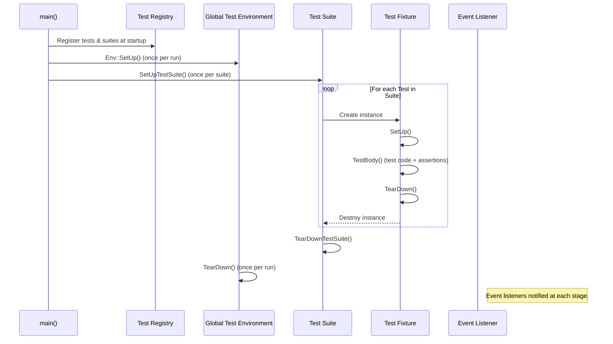

# Test Execution Life Cycle

Understanding the test execution life cycle in GoogleTest reveals how a test flows through multiple orchestrated steps—from initial registration and setup, through execution and assertion evaluation, and finally teardown. GoogleTest and GoogleMock work together behind the scenes to ensure that each test runs in a predictable, controlled environment, guaranteeing isolation, environmental consistency, and reliable state management.

---

## 1. Test Registration and Discovery

Before execution even begins, GoogleTest builds an internal registry of all tests in your program:

- **Macro-based Registration**: Each test defined via `TEST()`, `TEST_F()`, or `TEST_P()` macros automatically registers itself with the framework upon program start.
- **TestInfo and TestSuite**: For each test, GoogleTest creates a `TestInfo` object storing metadata (name, location, fixture type, parameters). Related tests are grouped into a `TestSuite`.
- **Automatic Test Collection**: GoogleTest maintains these registries automatically, freeing you from manual test enumeration.

This system ensures GoogleTest knows about every test and its grouping, supporting filtering, parallelization, and result reporting.

---

## 2. Environment and Suite-Level Setup

Tests often share expensive or global resources. GoogleTest provides hooks that prepare and clean up these shared resources:

- **Global Test Environment** (`Environment` class): You can define custom global environments by subclassing `::testing::Environment`. Their `SetUp()` and `TearDown()` methods run once per entire program run—before and after *all* tests respectively.

- **Test Suite Setup and Teardown** (`SetUpTestSuite()` / `TearDownTestSuite()` static methods): These are called once before the *first* test and once after the *last* test in a test suite. They prepare/cleanup shared test fixture data.

This layered setup ensures efficient resource use and consistent test context across multiple tests.

---

## 3. Per-Test Setup

When running each individual test, GoogleTest:

1. **Creates a fresh test fixture instance** (the test class derived from `::testing::Test`). This guarantees test isolation.
2. Runs the fixture’s `SetUp()` method, preparing the fresh state needed for this test.
3. Runs the test body (the code inside your `TEST` or `TEST_F` macro).
4. Runs the fixture’s `TearDown()` method to release any acquired state.
5. Destroys the test fixture instance.

This per-test lifecycle ensures troubled tests don’t pollute each other's environment.

---

## 4. Assertion Evaluation and Failure Handling

Within the test body, your assertions (`EXPECT_*`, `ASSERT_*`, etc.) play a critical role:

- **Assertion Result Types**:
  - *Success* – the assertion passed.
  - *Non-fatal failure* (e.g., `EXPECT_*` failures) – the test continues, but failure is recorded.
  - *Fatal failure* (e.g., `ASSERT_*` failures) – aborts current function immediately.

- **Impact on Test Execution**:
  - Fatal assertions abort the current function, *not* the entire test. This behavior means care is needed when calling subroutines that use assertions — fatal failures will propagate only to the caller unless manually checked.
  - The framework provides macros like `ASSERT_NO_FATAL_FAILURE(statement)` to help propagate failures properly.

- **Skipping Tests**:
  - `GTEST_SKIP()` can be used inside a test or fixture to skip remaining test execution gracefully.

These mechanics provide granular control over how assertions influence test flow and allow multiple verifications even in presence of failures.

---

## 5. Test Execution Reporting and Event Listeners

GoogleTest emits detailed notifications incrementally throughout the test life cycle:

- **Test Event Listeners**: The framework supports a listener API to receive callbacks for key events:
  - Program start/end
  - Test iteration start/end
  - Environment setup/teardown
  - Test suite start/end
  - Test start/end
  - Assertion results

- **Default Listeners**:
  - The default console printer outputs formatted progress and results.
  - Optional XML or JSON listeners generate structured reports.

- **Custom Listeners**: You can register custom listeners (via `UnitTest::GetInstance()->listeners().Append()`) to create alternative reports or integrate with tools.

This architecture enables GoogleTest to provide rich, real-time feedback and extensibility.

---

## 6. Teardown and Cleanup

After each test completes:

- The fixture's `TearDown()` is called.
- The fixture instance is destroyed.

Following the completion of all tests in a test suite:

- `TearDownTestSuite()` is called.

Finally, after *all* test suites:

- The global test environments’ `TearDown()` methods are called in reverse of their registration order.

This lifecycle guarantees that resources are released in a logical, reliable manner, and facilitates detecting leaks or unexpected errors during cleanup.

---

## Visual Flow of a Single Test Execution

---

## Practical Tips and Best Practices

- **Always call `InitGoogleTest()` before running tests** to ensure flag parsing and environment setup.
- **Use `SetUpTestSuite()` and `TearDownTestSuite()` judiciously** to share expensive resources safely between tests.
- **Prefer `EXPECT_*` over `ASSERT_*` for multiple checks** in a test unless failure abort is critical.
- **Use `SCOPED_TRACE` or `ScopedTrace`** to add context to failures inside subroutines.
- **Implement `GTEST_SKIP()` in setup routines** to guard against unmet preconditions that invalidate all tests.
- **Leverage event listeners** to customize reporting or integrate with CI tools.
- **Be cautious with test ordering dependencies**, as GoogleTest runs tests independently and in unpredictable order.

---

## Troubleshooting Common Issues

- **Test Skipping Unexpectedly**: Ensure `GTEST_SKIP()` is not being triggered unintentionally in `SetUp()` or environment setup.
- **Resources Not Reset Between Tests**: Always perform cleanup in `TearDown()` or `TearDownTestSuite()` to maintain isolation.
- **Fatal Assertion in Helper Functions**: Remember fatal failures abort only the current function. Use macros like `ASSERT_NO_FATAL_FAILURE()` to detect failures in called code.
- **Mixing TEST() and TEST_F() in Same Suite**: This causes runtime errors. Keep consistent fixture usage in each test suite.
- **Event Listener Ordering Confusion**: Listener execution order varies, with start events in registration order and end events in reverse. Unintended side effects can cause confusion.

---

## Further Reading and References

- [GoogleTest Primer](primer.md) — get started with writing and running tests.
- [Testing Reference](reference/testing.md) — detailed macro and API documentation.
- [Advanced GoogleTest Topics](advanced.md) — for deep dives into setup, parameterized tests, and advanced assertions.
- [Test Structure & Discovery](concepts/core-architecture/test-structure-discovery.md) — details on registration and organization.
- [Assertion Model](concepts/core-architecture/assertion-model.md) — in-depth discussion on assertions and failures.
- [Test Results and Reporting](api-reference/core-apis/test-results.md) — internals of result aggregation and reporting.

---

GoogleTest and GoogleMock together ensure a systematic test execution life cycle that maximizes test isolation, clarity, and reliability, giving you confidence in code correctness and robustness.
