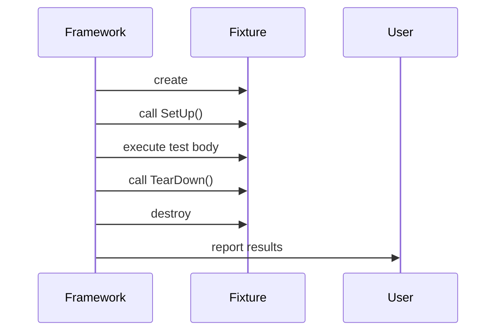

# Test Framework Fundamentals

Welcome to the core of GoogleTest's test execution model. This guide exposes you to the underlying xUnit structure of GoogleTest, detailing how test suites and test cases organize your tests, the lifecycle stages each test undergoes, and how GoogleTest discovers and executes them. You will also learn about the interplay between GoogleTest and GoogleMock, which coexist in a single merged repository, facilitating smooth mocking capabilities within your tests.

---

## 1. Understanding the xUnit-Based Test Structure

GoogleTest aligns closely with the xUnit architecture familiar from other unit testing frameworks like JUnit and PyUnit. Understanding this structure will give you a mental model to organize and navigate your tests.

### 1.1 Test Suites and Test Cases: Clarifying Terminology

-  **Test Suite**: A logical grouping of related tests sharing common setup and teardown. A test suite helps you organize tests by functionality or feature set.

-  **Test Case (Deprecated Term)**: Historically used synonymously with Test Suite in GoogleTest's community, but now superseded by 'Test Suite' to match industry standards.

### 1.2 Test Cases (Tests): The Basic Unit

Each individual check, known technically as a **test** (historically called a test case), is a function validated for certain code behavior. Test cases live inside test suites.

#### Example:

```cpp
// Defines test suite "MathTest" and test "HandlesZeroInput".
TEST(MathTest, HandlesZeroInput) {
  EXPECT_EQ(Factorial(0), 1);
}
```

### 1.3 Test Fixtures: Reusing Setup and Teardown

When multiple tests share common initialization or cleanup routines, encapsulate those in a **test fixture** class derived from `testing::Test`. It allows:

- Setup code to run before each test: `SetUp()`
- Cleanup code to run after each test: `TearDown()`

#### Example:

```cpp
class QueueTest : public testing::Test {
 protected:
  void SetUp() override {
    q_.Enqueue(1);
  }

  Queue<int> q_;  // Shared resource
};

TEST_F(QueueTest, DequeueReturnsEnqueuedElement) {
  EXPECT_EQ(q_.Dequeue(), 1);
}
```

Notice the use of `TEST_F` indicating the test uses a fixture.

---

## 2. Test Discovery and Execution Lifecycle

GoogleTest automatically discovers tests by scanning all compiled tests declared via `TEST()`, `TEST_F()`, and other test macros during program initialization. This dynamic discovery ensures that you never manually register your tests.

### 2.1 Lifecycle Phases of a Test

Each test progresses through the following phases:

1.  **Construction**: A fresh fixture object is created for the test.
2.  **SetUp()**: Optional, invoked to prepare the test environment.
3.  **Test body execution**: Test code runs.
4.  **TearDown()**: Optional, cleans up after the test.
5.  **Destruction**: The fixture object is destroyed.

This lifecycle guarantees test isolation. Each test runs in a pristine state, preventing side effects from leaking across tests.

### 2.2 Behavior on Failures

- Non-fatal failures (`EXPECT_*`) allow the test to continue, collecting multiple failures.
- Fatal failures (`ASSERT_*`) abort the test immediately.

### 2.3 Test Execution Flow Visualization



---

## 3. Integration of GoogleTest and GoogleMock within the Repository

GoogleTest and GoogleMock are merged into a single repository to streamline test development by combining testing and mocking in one unified toolset.

### 3.1 GoogleMock as an Extension

GoogleMock extends GoogleTest’s capabilities by providing mocking functionalities:

- **Mock Classes**: Create mock implementations for interfaces.
- **Expectations and Matchers**: Set precise call expectations with argument matchers.
- **Actions**: Define behavior when mocked methods are invoked.

This close coupling enables users to write interaction-based tests, verifying not just final states but the exact calls their code makes.

### 3.2 Interoperability Considerations

- GoogleMock requires GoogleTest’s core test-running capabilities.
- GoogleMock dependencies are included by default in the GoogleTest build.
- Using `#include <gmock/gmock.h>` brings in GoogleMock’s mocking features.

### 3.3 Example: Mocking Workflow in GoogleTest

```cpp
#include <gmock/gmock.h>
#include <gtest/gtest.h>

// Interface
class Turtle {
 public:
  virtual ~Turtle() {}
  virtual void PenUp() = 0;
  virtual void PenDown() = 0;
};

// Mock class
class MockTurtle : public Turtle {
 public:
  MOCK_METHOD(void, PenUp, (), (override));
  MOCK_METHOD(void, PenDown, (), (override));
};

TEST(DrawTest, UsesPenDown) {
  MockTurtle mock_turtle;
  EXPECT_CALL(mock_turtle, PenDown()).Times(1);

  // Code under test exercising mock...
  mock_turtle.PenDown();
}
```

---

## 4. Best Practices & Tips

- **Write One Test Per Test Case**: Keeps tests focused and easier to debug.
- **Use Test Fixtures for Shared Setup**: Avoid redundancy.
- **Use GoogleMock for Interaction Verification**: Ideal for testing components with external dependencies.
- **Set Expectations Before Running Tests**: GoogleMock requires expectations to be in place before calls.
- **Leverage Test Suites to Organize Tests**: Reflect your project structure.
- **Use `EXPECT_*` vs `ASSERT_*` Appropriately**: Fail fast or accumulate errors.
- **Run Tests Frequently in Isolation**: To catch issues early.

---

## 5. Troubleshooting Common Issues

### 5.1 Tests Not Running

Ensure tests are properly declared with `TEST()` or `TEST_F()`. Confirm the test executable is built and executed correctly.

### 5.2 Unexpected Failures

- Check if expectations match actual calls in mock objects.
- Use `--gmock_verbose=info` to see detailed matching attempts.

### 5.3 Test Order Dependencies

Tests should be independent. Leaks or shared global states can cause flaky failures.

### 5.4 Mock Objects Not Verified

Make sure mock objects are properly destroyed or verify expectations explicitly with `Mock::VerifyAndClearExpectations()`.

---

## References and Further Learning

- [gMock Cookbook](https://google.github.io/googletest/gmock_cook_book.html)
- [Mocking Reference](https://google.github.io/googletest/reference/mocking.html)
- [gMock for Dummies](https://google.github.io/googletest/gmock_for_dummies.html)
- [GoogleTest Primer](primer.md)
- [GoogleTest Test Fixtures and Lifecycle](api-reference/core-apis/test-fixtures-and-lifecycle.md)

---

## Summary
This guide breaks down the fundamental structure and workflows of the GoogleTest framework, emphasizing its xUnit compatibility, test suite/test case organization, lifecycle management, and the integrated GoogleMock mocking capabilities. It equips developers with a clear mental model and best practices to write robust, reusable, and maintainable C++ tests exploiting the power of GoogleTest and GoogleMock together.
