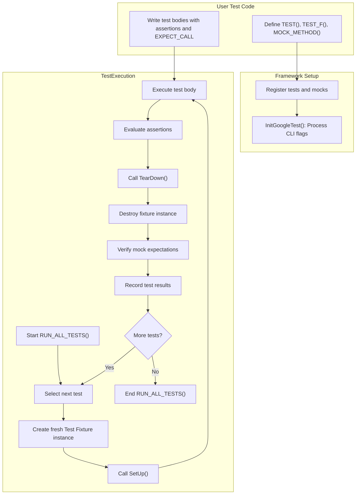

# GoogleTest & GoogleMock Architecture Overview

## Introduction

GoogleTest and GoogleMock form a comprehensive C++ testing framework rooted in the well-established xUnit architecture. Designed with the needs of modern C++ developers in mind, this combined system enables efficient test writing, discovery, and execution, as well as advanced mocking capabilities for simulating component interactions.

This page gives you a high-level understanding of how GoogleTest and GoogleMock work internally, focusing on their overall design, the main execution flow, test lifecycle, and the interaction among core subsystems during a test run.

Whether you are new to the framework or aiming to deepen your understanding of its operation, this overview will introduce the key concepts and prepare you to navigate related detailed documentation effectively.

---

## The xUnit Foundation

GoogleTest builds upon the classical xUnit pattern common to many testing frameworks such as JUnit (Java) and PyUnit (Python). This architecture provides:

- **Test Suites and Tests:** Tests are grouped into test suites that mirror the structure of the code being validated. Each test within a suite runs independently.
- **Fixtures:** Reusable setup and teardown code shared across individual tests within a suite.
- **Assertions:** Mechanisms to verify expected conditions within tests, with granular control over test abort behaviors.
- **Test Runner:** Orchestrates test discovery, execution, reporting, and summarization.

GoogleMock complements this by offering advanced mocking features, letting you create mock objects with configurable expectations and behaviors to verify interactions rather than just outcomes.

---

## GoogleTest & GoogleMock Core Architecture

GoogleTest and GoogleMock operate as integrated yet modular frameworks. Their core responsibilities and interactions during a test run are outlined as follows:

### Test Discovery

- All tests defined using macros (`TEST()`, `TEST_F()`, etc.) are automatically registered at program startup.
- GoogleTest maintains a registry of all test suites and tests, eliminating manual enumeration.

### Test Initialization

- Before any test runs, global environment setups are performed.
- The framework processes command-line arguments to configure flags such as filtering, repeat counts, and output formats.

### Test Execution

- Test execution happens one test at a time.
- For each test:
  1. A fresh test fixture instance is created.
  2. Fixture setup (`SetUp()`) runs.
  3. The test body executes.
  4. Assertions are evaluated, and fatal failures cause immediate test termination.
  5. Fixture teardown (`TearDown()`) completes.
  6. The fixture instance is destroyed.

- GoogleMock expectations and default mock behaviors apply seamlessly within the test body.

### Mocking Mechanism

- Mock classes inherit from original interfaces and use macros (`MOCK_METHOD`) to define mock methods.
- Using macros like `EXPECT_CALL` and `ON_CALL`, users specify expected mock interactions and behaviors.
- GoogleMock intercepts calls to mock methods, matches them against expectations in a last-declared-wins order, and enforces call counts, argument matching, and ordering.

### Verification and Reporting

- After each test, GoogleMock verifies whether all expectations on mock objects were satisfied.
- Tests report successes, failures (fatal and non-fatal), and skips, writing to console and optional XML reports.
- Aggregated results are summarized with timing and failure details.

---

## Test Lifecycle and Main Execution Flow

Understanding the sequence of operations from program start to test completion is essential for leveraging the full power of GoogleTest and GoogleMock.

<Steps>
<Step title="Initialization & Registration">
GoogleTest captures test definitions during static initialization through macros like `TEST()` and `TEST_F()`. This invisible registration phase builds an internal registry of test suites and their tests.
</Step>
<Step title="Main Function Execution">
The test binary’s `main()` function typically calls `testing::InitGoogleTest()` to parse command-line flags and `RUN_ALL_TESTS()` to execute tests.
</Step>
<Step title="Test Iteration">
`RUN_ALL_TESTS()` iterates over the registered tests applying filters if specified, running them sequentially in a well-defined order.
</Step>
<Step title="Individual Test Execution">
For each test:
- A new test fixture instance is constructed.
- `SetUp()` is called for preparing preconditions.
- Test code runs, containing assertions and calling mocked methods.
- Assertions evaluate outcomes; fatal ones terminate the test early.
- `TearDown()` is called for cleanup.
- The fixture instance is destroyed.
</Step>
<Step title="Mock Verification">
As the fixture instance is destroyed, GoogleMock automatically verifies that all set expectations on mocks were met, failing the test if not.
</Step>
<Step title="Result Reporting">
Results are collected and reported incrementally during the run and summarized at the end.
</Step>
</Steps>

---

## Subsystem Interactions

The interplay between user test code, GoogleTest framework components, and GoogleMock is orchestrated as follows:

- **Test Code:** Defines tests and mocks. Uses assertions and mock expectations.
- **Test Runner:** Orchestrates life cycle — discovery, executing each test, calling setup/teardown, and capturing results.
- **Assertion Engine:** Evaluates assertions, differentiates fatal and non-fatal failures, and logs failures with detailed context.
- **Mocking Engine:** Manages mock object lifecycle, expectation matching, call count enforcement, and behavior invocation.
- **Event Listeners:** Handle hooks for custom reporting, logging, or integration with other tools.

This orchestration ensures your tests run predictably, independently, and provide detailed feedback.

---

## Diagram: GoogleTest & GoogleMock Architecture Flow

---

## Key Concepts to Remember

- **Tests are isolated:** Each test runs with its own fixture instance, avoiding side effects.
- **Uninteresting calls:** Methods without explicit expectations produce warnings by default, which can be controlled.
- **Sticky expectations:** Unless configured otherwise, expectations remain active until explicitly retired or sequences progress.
- **Ordering:** Calls can be ordered strictly or partially using sequences and `After()` clauses.
- **Mock Verification:** Happens automatically at mock destruction time.

---

## Practical Tips for Users

- **Focus on behavior:** Write tests that verify what your code should do, not how it does it.
- **Leverage fixtures:** Reuse setup code for clarity and reduction of duplication.
- **Use mocks wisely:** Mock collaborators to isolate tested units; use expectations to verify interactions, not just outputs.
- **Control strictness:** Choose between `NiceMock`, `NaggyMock`, and `StrictMock` to balance feedback and test brittleness.
- **Manage test run:** Use filters and repeat counts at run time to focus debugging efforts.

---

For further detail on each subsystem or concept, please refer to:

- [System Architecture (with Diagram)](/overview/architecture-concepts/system-architecture)
- [Core Concepts and Terminology](/overview/architecture-concepts/core-concepts-terminology)
- [The GoogleMock Engine: Mocks and Expectations](/concepts/core-architecture/mocking-engine)
- [Creating and Using Mock Objects](/guides/mocking-techniques/creating-mocks)
- [Writing Your First Test](/guides/getting-started/basic-test-workflow)

---

## Summary

This overview equips you with a conceptual framework to understand how GoogleTest and GoogleMock manage the lifecycle of tests and mock interactions from definition through execution and verification. The modular design promotes portability, clarity, and robust test practices.

---

## References

- [GoogleTest Primer](primer.md)
- [gMock for Dummies](gmock_for_dummies.md)
- [Mocking Reference](docs/reference/mocking.md)
- [System Architecture](overview/architecture-concepts/system-architecture.mdx)
- [Core Concepts and Terminology](overview/architecture-concepts/core-concepts-terminology.mdx)

---