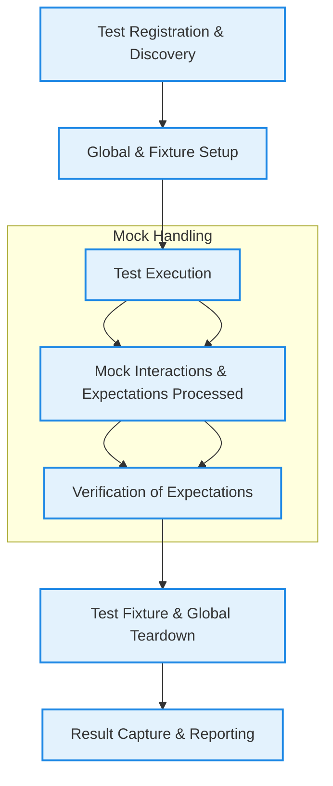

# Test Lifecycle and Data Flow

Understanding the lifecycle of tests in GoogleTest is crucial for writing effective and maintainable tests. This guide walks you through the major stages of test execution — from discovery to teardown — and explains how data, expectations, and results propagate through these phases. You'll gain clarity into how test registration, execution coordination, and result reporting work together seamlessly behind the scenes.

---

## Overview of the Test Lifecycle

The lifecycle of a test in GoogleTest can be viewed as a series of distinct, sequential stages that transform user-defined test code into verified results. These stages include:

- **Test Discovery & Registration**
- **Test Environment Setup**
- **Test Execution**
- **Expectation Verification & Teardown**
- **Result Capture & Reporting**

This process ensures that tests run in a controlled, consistent manner with automatic handling of setup, execution, and verification. It abstracts complex mechanics, letting you focus on expressing your test intent.

---

## 1. Test Discovery & Registration

GoogleTest automatically discovers test cases defined with the `TEST()` and `TEST_F()` macros. These macros register tests with the framework before execution begins.

### How Discovery Works:

- Each test file, when linked into the test binary, includes static objects that register the test cases during program initialization.
- This registration associates test **suites** (groups of related tests) with individual **test cases**.

### Why It Matters:

Registration enables GoogleTest to:

- Enumerate all available tests
- Support filtering to run specific tests
- Integrate with test runners that execute tests one by one or in batches

---

## 2. Test Environment Setup

Before any actual test methods run, GoogleTest calls global and test fixture setup methods to prepare the environment.

### Involved Components:

- **Global SetUp and TearDown:** via `Environment` classes registered with GoogleTest, executed before and after all tests
- **Test Fixture Setup:** for tests with fixtures (`TEST_F()`), `SetUp()` is invoked before each test

### What Happens Here:

- Resources shared across multiple tests (e.g., databases or mock servers) can be initialized once
- Each individual test prepares its unique environment for execution

### Best Practice Tip:

Keep setup methods focused and lightweight to reduce test runtime and avoid flaky tests.

---

## 3. Test Execution

The core of the test lifecycle is the execution of test methods written by the user.

### Key Points:

- The test runner calls the test function (like the body inside `TEST()` or `TEST_F()`)
- Within this, users typically perform assertions (`EXPECT_`, `ASSERT_` macros) to verify behavior
- For tests using mocks, the mock objects intercept calls and validate expectations during this phase

### User Intent:

Tests should clearly express the behavior they validate, focusing on what is expected from the code under test.

---

## 4. Expectation Verification & Teardown

After a test finishes executing, GoogleTest performs verification and cleanup automatically.

### What Happens:

- For tests using GoogleMock, mock objects are destructed, and gMock verifies that all expectations set via `EXPECT_CALL` were satisfied.
- Test fixtures run their `TearDown()` methods to clean up test-specific resources.
- Any global teardown from `Environment` classes happens after all tests complete.

### Common Pitfalls to Avoid:

- Delaying expectation verification by destructing mocks late or reusing mocks across tests can lead to false positives/negatives.
- Always let GoogleTest manage your mock lifetimes or explicitly invoke verification using `Mock::VerifyAndClearExpectations` if necessary.

---

## 5. Result Capture & Reporting

Finally, the outcomes from assertions and mock verifications are collected and reported.

### Internals:

- GoogleTest captures pass/fail results of each assertion within the test.
- Failures related to unmet mock expectations or unexpected calls are automatically reported.
- Results are aggregated to show summaries like total tests run, passed, failed, and skipped.
- Reporting formats include console output, XML reports, and integration with CI dashboards.

### User Perspective:

- Test reports provide precise locations and descriptive messages for failures.
- Enables rapid debugging and correction with contextual information.

---

## Data and Expectation Flow

Understanding how data and expectations move across the lifecycle clarifies test behavior.

1. **Registration Phase:**
   - Test metadata and mock definitions are registered.
   - Internal data structures keep track of test suite membership and order.

2. **Setup Phase:**
   - Shared/global resources are initialized.
   - Test fixtures prepare the context including mock object creation.
   - Default mock behaviors (`ON_CALL`) and expectations (`EXPECT_CALL`) are configured.

3. **Execution Phase:**
   - Mock methods validate expected calls against the expectations.
   - Each call counts towards its expectation's cardinality (`Times`).
   - Mocked actions (e.g., return values, side effects) are invoked.

4. **Verification Phase:**
   - On mock object destruction, gMock checks that all expectations were met.
   - Any deviations (unexpected calls, missing calls, excessive calls) trigger failures.

5. **Reporting Phase:**
   - GoogleTest combines assertion and mock verification results.
   - Test runner prints detailed output for any failures or warnings.

---

## Visualizing Test Lifecycle & Data Flow

---

## Practical Tips for Users

- **Define all mocks and expectations before running test code.** Setting expectations afterwards results in undefined behavior.
- **Use test fixtures (`TEST_F`) to centralize setup and teardown, including common mock configuration.**
- **Keep test methods focused on a single logical validation for clarity and maintainability.**
- **Use `ON_CALL` for default mock behaviors and `EXPECT_CALL` only for interactions your test explicitly verifies.**
- **Use `NiceMock`, `NaggyMock`, and `StrictMock` wrappers to control uninteresting call behaviors depending on your test tolerance for extraneous calls.**
- **If you allocate mocks dynamically, ensure they are destroyed to trigger expectations verification, or explicitly verify and clear them when appropriate.**

---

## Common Failure Scenarios & Troubleshooting

### 1. Unmet Expectations

**Symptoms:** Test fails indicating some expected mock calls were not made.

**Cause:** Either the code under test did not call the mock method as expected, or the expectations were set incorrectly or incompletely.

**Solution:**
- Verify that the code calls the expected methods with matching arguments.
- Enable `--gmock_verbose=info` to get detailed call-matching logs to diagnose matching problems.

---

### 2. Unexpected Calls

**Symptoms:** Test fails due to mock methods being called with arguments or order not covered by expectations.

**Cause:** Insufficient expectations; mock was called in ways not anticipated.

**Solution:**
- Add explicit expectations covering the calls.
- Use catch-all `EXPECT_CALL(mock, method(_)).Times(AnyNumber());` to allow other cases.
- Consider `NiceMock` to suppress warnings if appropriate.

---

### 3. Excessive Calls

**Symptoms:** Mock method called more times than specified in expectations.

**Cause:** The set `Times` cardinality is too narrow or missing `.RetiresOnSaturation()` if applicable.

**Solution:**
- Adjust `Times` to accommodate more calls.
- Use `.RetiresOnSaturation()` if you intend expectations to become inactive after saturation.
- Refactor test to better represent call sequences.

---

### 4. Leaked Mocks

**Symptoms:** Test finalization detects that mock objects were never destroyed, causing expectations verification to be skipped.

**Cause:** Mocks not properly cleaned up.

**Solution:**
- Ensure mock lifetimes are tied to test lifetimes.
- Call `Mock::VerifyAndClearExpectations(&mock)` explicitly if you can't rely on destruction.
- Use `Mock::AllowLeak(&mock)` to suppress warnings if leakage is intentional (not recommended).

---

## Summary

The test lifecycle in GoogleTest orchestrates the discovery, execution, verification, and reporting of test cases in a reliable, automated manner, while GoogleMock extends this by enforcing interaction contracts via mock expectations. This design provides a clear, user-centric testing flow that simplifies the complex underpinning processes, empowers expressive test definitions, and ensures accurate feedback.

For a complete mastery, pair your understanding of the lifecycle with detailed guides on:

- [Test Structure and Lifecycle](../api-reference/core-api/test-structure)
- [Mocking Methods and Classes](../api-reference/mocking-api/mock-methods)
- [Expectations and Actions](../api-reference/mocking-api/expectations-actions)
- [Controlling Mock Behavior](../api-reference/mocking-api/mock-behavior-control)

---

## Additional Resources

- **Understanding the use of `EXPECT_CALL()` and `ON_CALL()`**: see the [gMock Cookbook - Knowing When to Expect](docs/gmock_cook_book.md#UseOnCall).
- **Debugging mismatched expectations**: run tests with `--gmock_verbose=info` for call traces.
- **Managing test setup and teardown**: refer to [Test Structure and Lifecycle](../api-reference/core-api/test-structure).
- **Mock Object Verification**: learn how destruction and explicit verification work together to enforce expectations.

---