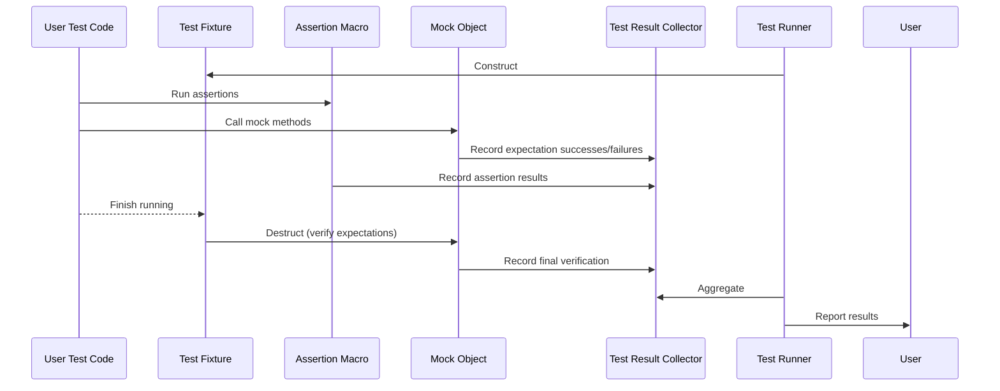
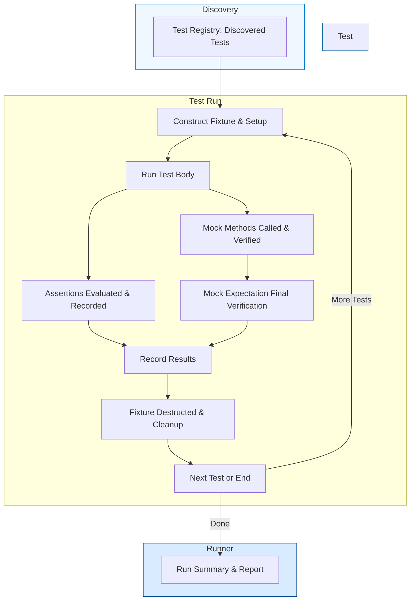

# Test Lifecycle and Data Flow in GoogleTest

Understanding the life of a test in GoogleTest reveals how your test code, GoogleTest's infrastructure, and GoogleMock orchestration collaborate to verify expected behavior. This guide walks you through the test lifecycle from discovery to teardown and illustrates how data and control flow among various GoogleTest components.

---

## Introduction

When you write a test using GoogleTest, your goal is simple: run your test code, check your assertions, and get fast, reliable feedback. Yet beneath this simplicity lies a well-coordinated lifecycle ensuring test discovery, execution, result capturing, and teardown happen seamlessly.

This page explains this lifecycle from a user perspective, emphasizing how your user code interacts with assertion macros, mock expectations, result collectors, and the test runner.

---

## High-Level Overview of the Test Lifecycle

At a high level, a test run in GoogleTest unfolds as follows:

1. **Test Discovery**: GoogleTest finds all tests compiled into your test binary.
2. **Test Setup**: For each test, test fixtures (if any) are constructed.
3. **Test Execution**: Your test body runs, typically containing assertions and mock expectations.
4. **Assertion Evaluation**: Assertions check conditions and record pass/fail.
5. **Mock Verification**: Mock objects verify whether expectations were satisfied.
6. **Test Teardown**: Test fixtures are destructed.
7. **Result Collection**: Results from assertions and mocks are collected.
8. **Test Runner Reporting**: The test runner aggregates results and reports summary.

This cycle repeats for each test case.

---

## Detailed Flow and Data Movement

### 1. Test Discovery

GoogleTest automatically discovers tests via a global registry where your `TEST()` and `TEST_F()` macros register tests at program startup. This eliminates manual test enumeration.

### 2. Test Setup

Before each test runs, GoogleTest constructs test fixtures (if using `TEST_F()` or similar). This involves calling the fixture's constructor and optional setup methods for preparing the test environment.

### 3. Test Execution

Your test code executes inside the test method. This is where you invoke:

- Assertion macros like `EXPECT_EQ()`, `ASSERT_TRUE()`, etc.
- Functions with calls to mock objects created via GoogleMock, exercising `EXPECT_CALL()` expectations.

GoogleMock calls interleave with your test flow, allowing interaction-based testing.

### 4. Assertion Evaluation and Recording

Each assertion macro evaluates the condition immediately. On failure, it records a failure inside GoogleTest’s result framework but continues execution for non-fatal assertions (`EXPECT_` macros).

Assertions update the internal test result collector with information on:

- Success or failure of each assertion
- Location in source code
- Failure messages

### 5. Mock Expectation Verification

When mock methods are called, GoogleMock tests argument matchers and call counts in real time.

- If calls violate expectations, GoogleMock immediately reports failures.
- At test teardown, GoogleMock verifies that all expectations declared via `EXPECT_CALL()` were satisfied.

Mock verification results are recorded in the test’s result collector.

### 6. Test Teardown

After test body completion:

- The test fixture is destructed.
- Mock objects are destructed, triggering final verification.

GoogleTest ensures proper resource release and mocks final checks.

### 7. Result Aggregation

GoogleTest collates results from all assertion checks, mock verifications, and test fixtures.

Results include:

- Number of passed and failed assertions
- Test status (PASS, FAIL)
- Any runtime failures related to mock misuses

### 8. Test Runner Reporting

The test runner aggregates all test case results, printing:

- Per-test pass/fail summary
- Counts of total tests, tests run, failures
- Summarized failure reports with source locations and expected vs actual values

---

## User Intent and Workflows

The lifecycle aligns tightly with your goals as a developer:

- **Write Test**: Define tests using `TEST()`, `TEST_F()`, and mock classes.
- **Set Expectations**: Use `EXPECT_CALL()` on mock objects to specify desired interactions.
- **Run Tests**: Execute tests via your test executable. GoogleTest discovers and runs them.
- **View Results**: Immediate feedback on assertion and mock expectation results.
- **Iterate**: Refine test logic, expand mock expectations, fix failures.

This flow helps you design tests that confirm both state and interaction correctness.

---

## Concrete Example: Interactions Among Test Components

---

## Best Practices and Tips

- **Set Expectations Before Exercising Mocks**: Always define `EXPECT_CALL()` statements prior to any code that triggers mock method calls to ensure correct behavior verification.

- **Use `ON_CALL()` for Default Behavior**: Use `ON_CALL()` to specify default mock method behavior without forcing expectations on every call.

- **Distinguish Between Uninteresting and Unexpected Calls**: Uninteresting calls (to mock methods without expectations) generate warnings; unexpected calls violate expectations and cause test failures. Use `NiceMock` or `StrictMock` wrappers to control this behavior.

- **Manage Expectation Lifecycles**: Expectations are "sticky" by default and persist even after expected call counts are reached unless `RetiresOnSaturation()` is used to retire them when saturated.

- **Take Advantage of `InSequence` and `After`**: Control call ordering when needed using `InSequence` or `After` clauses to specify sequential or partial order mandates.

- **Review Verbose Logs for Debugging**: Run tests with `--gmock_verbose=info` to get detailed logs of mock expectations and calls including stack traces to aid troubleshooting.

---

## Troubleshooting Common Issues

- **Test Not Discovering your Tests**: Ensure you register tests with GoogleTest macros and link properly.

- **Mock Expectation Failures**:
  - Verify calls match expected arguments.
  - Confirm the expected number of calls matches usage.
  - Check whether expectations are defined before executing code.

- **Unexpected or Uninteresting Call Warnings**:
  - Use `EXPECT_CALL(...).Times(AnyNumber())` to catch uninteresting calls you allow.
  - Use `NiceMock` to suppress warnings for uninteresting calls.

- **Leaked Mocks Detected**:
  - Make sure all heap-allocated mocks are deleted or use `Mock::AllowLeak()` explicitly if intentional.

- **Overlapping Expectations**:
  - Order matters. More specific expectations should be defined after more general ones.

---

## Related Components and Concepts

### Interaction with Other Documentation

- **Core Concepts & Terminology**: For basic GoogleTest and GoogleMock concepts that underpin the test lifecycle.
- **Mock Object Lifecycle**: Covers specific lifecycle details for mock expectations and object states.
- **Test Runner and Main Entry**: For how the test executable initializes and runs tests.
- **Setting Expectations**: To master how to define mock method calls and behaviors.
- **Strict, Naggy, and Nice Mocks**: To control severity of unexpected and uninteresting calls.

---

## Summary

Understanding the test lifecycle clarifies what happens when your test runs and why your assertions and mock expectations behave as they do. This empowers you to write robust, reliable tests and interpret failures meaningfully, unlocking the full power of GoogleTest and GoogleMock.

---

## Additional References

- [gMock for Dummies](https://google.github.io/googletest/gmock_for_dummies.html)
- [Setting Expectations: EXPECT_CALL and ON_CALL](https://google.github.io/googletest/reference/mocking.html#EXPECT_CALL)
- [Mocking Best Practices](https://google.github.io/googletest/gmock_cook_book.html#BestPractices)
- [Strict, Naggy, and Nice Mocks](https://google.github.io/googletest/gmock_cook_book.html#StrictNaggyNice)

---

## Visualization: Test Lifecycle

This diagram maps the key phases of the test lifecycle and how they loop until all tests are run.

---