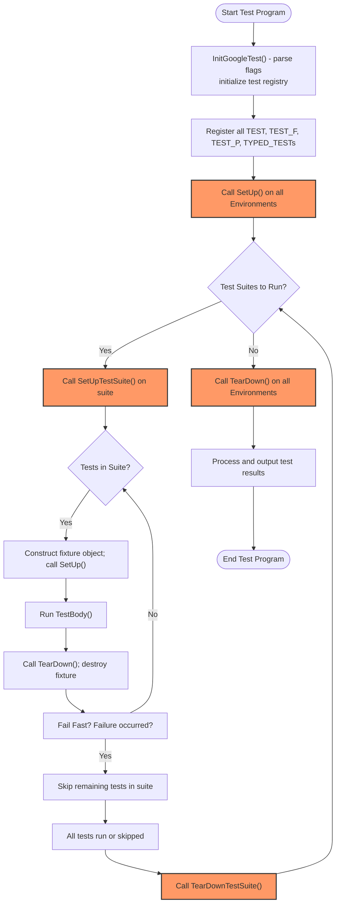

# Test Lifecycle and Execution Flow

Understand how tests are initialized, run, and reported in GoogleTest and GoogleMock. Examine the flow from test setup through teardown, including support for event listeners and test environment management for robust and flexible testing.

---

## Overview

GoogleTest and GoogleMock implement a robust testing framework that automates the lifecycle of tests—from setup, execution, to teardown—while offering extensive hooks for customization through event listeners and environment management. This page details the user-centric flow of test execution, helping you understand how GoogleTest manages tests behind the scenes, so you can better write, organize, and debug your tests.

---

## Test Lifecycle in GoogleTest

The test lifecycle describes the phases a test goes through during execution. GoogleTest organizes tests into **test suites**, which group logically related tests. Each test in the suite is an instance of a test fixture or a plain test function.

### Core Stages of Running Tests

1. **Global Setup via Environments**
   - Before any tests run, registered global test environments have their `SetUp()` methods called in the registered order.
   - These environments are often used for expensive or system-wide setup tasks needed across multiple test suites.

2. **Test Suite Setup**
   - Prior to running the first test in a suite, GoogleTest calls its fixture class’s static `SetUpTestSuite()` method.
   - This stage is ideal for preparing shared resources used by all tests within the suite.

3. **Per-Test Fixture Lifecycle**
   For each test:
   - **Fixture Construction:** GoogleTest creates a new test fixture object.
   - **Test SetUp:** Calls the `SetUp()` method on the fixture to prepare test-specific state.
   - **TestBody Execution:** The actual test code runs inside the `TestBody()` method.
   - **Test TearDown:** Calls `TearDown()` on the fixture for clean-up.
   - **Fixture Destruction:** The test fixture object is deleted.
   
   This architecture guarantees test isolation, ensuring tests do not affect one another.

4. **Test Suite Teardown**
   - After the last test in the suite has run, GoogleTest calls the fixture’s static `TearDownTestSuite()` method.
   - It should free shared resources allocated in `SetUpTestSuite()`.

5. **Global Teardown via Environments**
   - Once all tests have run, global test environments’ `TearDown()` methods are called in reverse order of their setup.

### Outcomes and Reporting

Tests conclude with a result: **Success**, **Failure (Fatal or Nonfatal)**, or **Skipped**. GoogleTest gathers these results per test and aggregates them per suite and for the entire test program. Test failure messages, stack traces, and additional test properties can be automatically collected and displayed.

---

## Test Execution Flow: What Happens When You Run Tests

When you invoke `RUN_ALL_TESTS()`, GoogleTest performs the following actions sequentially:

### Initialization
- Ensures GoogleTest is properly initialized, including flag parsing by `InitGoogleTest()`.
- Registers parameterized and type-parameterized tests.
- Prepares any configured output formats, such as XML or JSON report output.
- Prepares event listeners, including the default console output printer.

### Test Filtering and Sharding
- Processes `--gtest_filter` to select tests to run, with support for positive and negative patterns.
- If sharding is enabled (`GTEST_SHARD_INDEX`, `GTEST_TOTAL_SHARDS`), selects the subset of tests for the current shard.

### Running Tests
- Calls `SetUp()` on all registered environments.
- For each test suite marked to run:
  - Invokes `SetUpTestSuite()`.
  - Runs each test in the suite following the per-test fixture lifecycle.
  - Stops running further tests in the suite immediately if `--gtest_fail_fast` is set and a failure occurs.
  - Invokes `TearDownTestSuite()`.
- Calls `TearDown()` on all registered environments.

### Reporting
- Event listeners receive notifications about test progress and results, enabling output updating in real-time.
- After all tests complete, GoogleTest reports a final summary including passing, failing, and skipped tests.
- If XML/JSON output is configured, writes a detailed report file.

### Termination
- Appropriate cleanup takes place for test infrastructure.
- The program exits with a status code indicating whether tests passed or failed.

---

## Test Fixtures and Suite Lifecycle

GoogleTest’s **test fixtures** are the cornerstone for organizing tests that share common data and setup/teardown routines.

### Shared Setup with `SetUpTestSuite()` and `TearDownTestSuite()`
- Define **static** methods in your fixture class named `SetUpTestSuite()` and `TearDownTestSuite()`.
- Used to allocate and clean up expensive shared resources.
- Called exactly once per suite run: before the first test and after the last test.
- Can be declared public (required for some features like `TEST_P`).

### Per-Test Setup and Teardown:
- Override `SetUp()` and `TearDown()` in your fixture class to prepare and clean up resources used only within tests.
- GoogleTest creates a fresh fixture object per test to isolate test state.

### Important Notes
- The order of test execution is undefined; do not write tests depending on execution order.
- Modifications to shared resources by tests must be avoided or undone.

---

## Handling Test Environments

Global test environments (`::testing::Environment`) provide setup and teardown around *all* tests in the program.

### Registering Global Environments
- Use `AddGlobalTestEnvironment(new YourEnvironment)` before calling `RUN_ALL_TESTS()`.
- GoogleTest owns these objects and will delete them after test execution.

### Environment Lifecycle
- `SetUp()` methods are called prior to running any tests.
- `TearDown()` methods are called after all tests finish.
- Environments are set up in registration order, torn down in reverse order.

### Use Cases
- Initializing global state needed by multiple test suites.
- Managing shared resources expensive to create multiple times.

---

## Event Listeners: Monitoring and Extending Test Execution

GoogleTest provides an **event listener API** to observe and handle test execution events, enabling rich capabilities like custom reporting, logging, and integration with CI systems.

### Default and User-Defined Listeners
- GoogleTest installs default listeners responsible for console and XML/JSON output.
- You can subclass `TestEventListener` or use `EmptyTestEventListener` and override only needed callbacks.
- Add listeners via `UnitTest::GetInstance()->listeners().Append(new YourListener)`.

### Key Events
- `OnTestProgramStart` / `OnTestProgramEnd`
- `OnTestIterationStart` / `OnTestIterationEnd` (useful for repeated runs)
- `OnEnvironmentsSetUpStart` / `OnEnvironmentsSetUpEnd`
- `OnTestSuiteStart` / `OnTestSuiteEnd`
- `OnTestStart` / `OnTestEnd`
- `OnTestPartResult` (reports assertion results)

### Best Practices
- Remove the default result printer if you don’t want default console output:
  ```cpp
  auto& listeners = UnitTest::GetInstance()->listeners();
  delete listeners.Release(listeners.default_result_printer());
  listeners.Append(new YourCustomListener);
  ```
- Don’t generate failures inside `OnTestPartResult()`.
- Chain listeners carefully to control event notification order.

---

## Parameterized and Typed Tests

GoogleTest supports advanced test patterns for running tests repeatedly with various parameters or types without duplication.

### Parameterized Tests
- Use `TEST_P` to define tests that operate on a set of values.
- `GetParam()` fetches the current test parameter.
- Instantiate test suites with `INSTANTIATE_TEST_SUITE_P`.

### Typed Tests
- Define template test fixtures parameterized by type.
- Use `TYPED_TEST_SUITE` to provide types.
- Use `TYPED_TEST` for test definitions, where `TypeParam` denotes the current type.

### Type-Parameterized Tests
- Define test suite templates with `TYPED_TEST_SUITE_P`.
- Use `TYPED_TEST_P` to declare tests.
- Register test names with `REGISTER_TYPED_TEST_SUITE_P`.
- Instantiate with `INSTANTIATE_TYPED_TEST_SUITE_P`, allowing multiple instantiations.

See the [Practical Testing Patterns: Parameterized and Typed Tests](guides/practical-testing-patterns/parameterized-testing) and [Advanced GoogleTest Topics](docs/advanced.md#typed-tests) for detailed usage.

---

## Reporting Test Results

GoogleTest automatically collects and reports detailed results for every test run.

### Types of Results
- **Success:** Test passed without failures.
- **Nonfatal Failure:** Test encountered a failure but continued.
- **Fatal Failure:** Test aborted due to failed assertion or exception.
- **Skipped:** Test was skipped via `GTEST_SKIP()` or suite/environment skipping.

### Output Formats
- Console output with color coding and detailed messages.
- XML output suitable for CI integrations with JUnit format.
- JSON output alternative for structured consumption.

### Customizing Reporting
- Use event listeners to modify or replace default outputs.
- Call `RecordProperty` from within tests, test suites, or environments to add custom metadata to XML/JSON outputs.

### Example: Adding a Test Property
```cpp
TEST_F(MyFixture, SampleTest) {
  // Run test logic ...

  ::testing::Test::RecordProperty("MyCustomProperty", "Value");
}
```
This will attach `{MyCustomProperty="Value"}` to the test case in the report.

---

## Common Pitfalls & Troubleshooting

- Mixing `TEST` and `TEST_F` within the same test suite causes failures. Ensure consistent use.
- `SetUpTestSuite()` and `TearDownTestSuite()` must be static and preferably public when used with parameterized tests.
- Avoid fatal assertions in constructors/destructors; use `SetUp()` and `TearDown()` instead.
- Use `SCOPED_TRACE` to add context to failures deep inside helper functions or loops.
- For tests that share resources, properly manage their lifecycle using suite-level setup/teardown.
- When using parameterized or typed tests, always instantiate test suites properly to avoid silent no-test runs.

---

## Visualizing the Test Execution Flow



---

## Summary

GoogleTest orchestrates the full lifecycle of tests and test suites with clear phases of setup, execution, and teardown, allowing you to write isolated, repeatable, and informative tests. It supports advanced test patterns including parameterized and typed tests, and facilitates comprehensive reporting and event-driven customization.

---

## Further Reading

- [GoogleTest Primer](primer.md): Beginner-friendly introduction to GoogleTest testing.
- [Testing Reference](reference/testing-framework/tests-and-test-suites.md): Detailed specification of test macros and classes.
- [Advanced GoogleTest Topics](advanced.md): Learn about parameterized, typed tests, and more.
- [Practical Testing Patterns - Parameterized Testing Guide](guides/practical-testing-patterns/parameterized-testing.mdx): Implement and best practice guidance.
- [Event Listeners API](reference/testing-framework/tests-and-test-suites.md#TestEventListener): For customizing test execution notifications.
- [Test Fixtures](primer.md#same-data-multiple-tests): How to write fixtures for shared test setup/teardown.

---

By understanding the test lifecycle and execution flow, you can write tests that leverage GoogleTest’s full capabilities and structure your test programs for efficiency, clarity, and rich diagnostics.