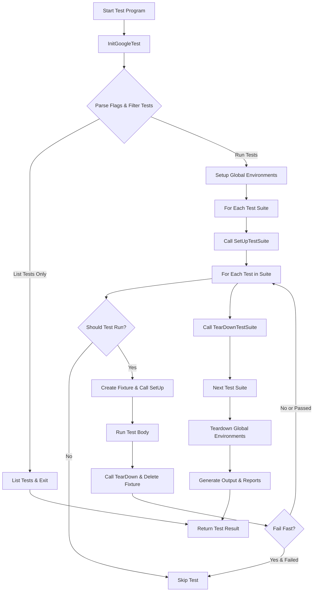

# Test Lifecycle and Execution Flow

Understanding how GoogleTest discovers, initializes, runs, and reports tests is essential for mastering effective test creation and debugging. This guide demystifies the core flow of test execution, revealing how the framework manages tests from registration through to results reporting.

---

## 1. Test Discovery and Registration

### Automatic Test Registration

GoogleTest uses macros like `TEST()`, `TEST_F()`, `TEST_P()`, and others to define tests. When these macros are used, they automatically register the tests with GoogleTest's internal registry before `main()` runs. You do not need to manually list or register your tests.

### Test Suites and Fixtures

- **Test Suite:** A logical grouping of related tests, typically sharing a common name prefix.
- **Test Fixture:** A class derived from `testing::Test` that provides common setup (`SetUp()`) and teardown (`TearDown()`) code and shared data members for tests.

Each test belongs to a test suite; tests using fixtures utilize derived classes of `testing::Test`.

### Ordering and Naming Constraints

- Test suite and test names form a "full name" in the form `TestSuiteName.TestName`.
- Names must be valid C++ identifiers and must not contain underscores (`_`). This avoids template and naming conflicts internally.
- Tests with the same name in different suites are allowed.

---

## 2. Initialization of the Test Program

Before running tests, GoogleTest is initialized via `testing::InitGoogleTest(&argc, argv);`. This prepares the framework by:

- Parsing command-line flags (e.g., `--gtest_filter` for selecting tests to run, `--gtest_color` for output formatting).
- Setting up internal data structures and registries.
- Registering value- and type-parameterized tests when applicable.

> **Note:** Initialization must be done before `RUN_ALL_TESTS()` to ensure proper test filtering and setup.

---

## 3. Running Tests with `RUN_ALL_TESTS()`

The heart of test execution is the `RUN_ALL_TESTS()` function. It orchestrates the following workflow:

### Workflow Overview

1. **Test Filtering:**
   - Applies user-supplied filters to determine which tests to run.
   - Honors flags such as `--gtest_filter`.
   - Skips disabled tests unless overridden by `--gtest_also_run_disabled_tests`.
   - Supports sharding to distribute tests across multiple machines.

2. **Test Repetition:**
   - Repeats all tests multiple times if `--gtest_repeat` is specified.

3. **Shuffling:**
   - Randomizes test execution order if `--gtest_shuffle` is set.

4. **Global Environment Setup:**
   - Calls all registered global `Environment::SetUp()` methods in order.

5. **Test Suites Execution:**
   - For each test suite selected to run:
     - Runs `SetUpTestSuite()` shared setup once.
     - Runs each test:
       - Creates a fresh test fixture object.
       - Invokes `SetUp()` for per-test setup.
       - Runs the test body.
       - Invokes `TearDown()` for per-test cleanup.
       - Deletes the test fixture object.
     - Runs `TearDownTestSuite()` before moving on.

6. **Global Environment Tear-Down:**
   - Calls all `Environment::TearDown()` methods in reverse order.

7. **Result Aggregation:**
   - Collects results, counts successes, failures, skipped and disabled tests.

8. **Output Generation:**
   - Prints human-friendly results to console.
   - Optionally generates XML or JSON reports if specified.

9. **Returns an Exit Code:**
   - `0` if all tests passed, `1` otherwise.

### Example Basic Usage

```cpp
int main(int argc, char** argv) {
  ::testing::InitGoogleTest(&argc, argv);
  return RUN_ALL_TESTS();
}
```

---

## 4. Setup and Teardown Details

### Test Fixture Lifecycle

For each test:

- A new fixture instance is created.
- The fixture constructor runs (should not contain assertions).
- The `SetUp()` method initializes the test context.
- The test body executes.
- The `TearDown()` method cleans up.
- The fixture destructor is called.

Fixtures ensure test independence — no state persists across tests unless static/shared.

### Test Suite Setup and Teardown

Test suites sharing expensive resources or common state may define:

- `static void SetUpTestSuite()` — runs once before the first test in the suite.
- `static void TearDownTestSuite()` — runs once after the last test in the suite.

These provide per-suite setup and teardown, ideal for costly operations.

### Global Environments

GoogleTest supports global test environments via classes derived from `testing::Environment`:

- `SetUp()` and `TearDown()` methods execute before any tests and after all tests.
- Multiple environment objects can be registered.
- Especially useful for expensive or shared setup across suites.

### Test Skipping at Setup

Tests or suites can be skipped during `SetUp()` or `SetUpTestSuite()` by calling `GTEST_SKIP()`. Tests marked skipped are not run but reported accordingly.

---

## 5. Event Notification and Listeners

GoogleTest sends events throughout the test run to listeners implementing `TestEventListener`:

- Events include start/end of test program, test suite, test, test parts (assertions), and environment setup/teardown.
- Users can add custom listeners to augment or replace output (e.g., generate custom reports, GUIs).
- Default listeners print formatted test results to console.

### Listener Event Flow Example

- `OnTestProgramStart` — Before all tests.
- `OnTestSuiteStart` — When a test suite starts.
- `OnTestStart` — Just before a test begins.
- `OnTestPartResult` — After each assertion.
- `OnTestEnd` — After test concludes.
- `OnTestSuiteEnd` — After all tests in suite run.
- `OnTestProgramEnd` — After all tests.

---

## 6. Test Result Reporting

### TestResult Objects

- Each test stores its results in a `TestResult` object.
- This includes counts of failures, successes, and skips, plus elapsed time.
- Failures may be fatal or non-fatal.

### Output Formats

- **Console output:** Summary of all tests, with color coding and detailed info on failures.
- **XML report:** A JUnit-compatible XML report can be generated with `--gtest_output=xml[:file]`.
- **JSON report:** Available with the `--gtest_output=json[:file]` option.

Output files are created in user-specified locations or default filenames (`test_detail.xml`, `test_detail.json`).

---

## 7. Advanced Features and Flags

### Repeat and Shuffle

- `--gtest_repeat=N` repeats tests N times (or infinitely for negative).
- `--gtest_shuffle` randomizes test run order, helping detect test dependencies.

### Test Filtering

- `--gtest_filter=PositivePatterns[-NegativePatterns]` lets you selectively run tests by name matching.
- Wildcards `*` and `?` are supported.

### Fail Fast

- `--gtest_fail_fast` stops test execution on first failure.

### Disabled Tests

- Prefix a test or suite with `DISABLED_` to skip temporarily.
- Use `--gtest_also_run_disabled_tests` to run disabled tests.

---

## 8. Troubleshooting Common Test Execution Issues

- **Test fixture constructor errors:** Make sure fixtures have a default constructor and avoid assertions in constructors.
- **Test ordering issues:** Avoid dependencies between tests as execution order is not guaranteed.
- **Mixing `TEST` and `TEST_F` in same suite:** This causes runtime errors — keep all tests in a suite consistent.
- **Skipped tests unexpectedly:** Confirm any `GTEST_SKIP()` or setup errors causing skip.
- **No tests run:** Verify filters, sharding environment, and test names.

---

## Mermaid Diagram of Test Execution Flow



---

## Practical Tips

- Always use `InitGoogleTest()` before `RUN_ALL_TESTS()`.
- Use test fixtures for shared setup to improve test clarity and maintainability.
- Name your test suites and tests without underscores to avoid internal conflicts.
- Leverage `SetUpTestSuite()` and `TearDownTestSuite()` for costly per-suite setup.
- Use filters and sharding for large and parallelized test suites.
- Handle flaky test runs with repeated and shuffled runs.

---

## Additional Resources

- [GoogleTest Primer](../docs/primer.md) — for basic test writing.
- [Advanced GoogleTest Topics](../docs/advanced.md) — for in-depth features.
- [Test and Fixture Definition](../api-reference/core-testing-api/test-definition.md)
- [Assertions and Expectations Reference](../api-reference/core-testing-api/assertions.md)
- [Event Listener API](../api-reference/core-testing-api/test-runner-control.md#TestEventListener)
- [Value-Parameterized Tests](../docs/advanced.md#value-parameterized-tests)

---

With this foundational understanding of the GoogleTest lifecycle and execution flow, users can write effective, maintainable tests and leverage advanced configuration for optimized workflows.