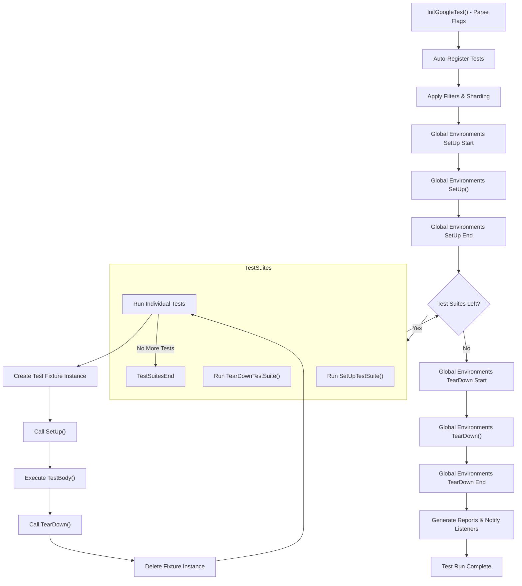

# Test Lifecycle & Execution Flow

Understanding how GoogleTest organizes, discovers, and runs tests is essential for writing effective and maintainable tests. This guide walks you through the entire lifecycle of a test run—from initialization, test discovery, execution, to reporting—so you can leverage GoogleTest’s design for efficient and predictable testing.

---

## Overview of Test Lifecycle

At its core, GoogleTest runs tests organized into test suites and test cases, managing multiple lifecycle phases that ensure tests are isolated, repeatable, and comprehensively reported. The test lifecycle flows from framework initialization, test registration and discovery, filtering, setup and teardown of test environments and fixtures, to the actual execution of test logic and reporting of results.

### Key Phases in the Lifecycle

1. **Initialization**
    - The test framework is initialized by calling `InitGoogleTest()`, which parses command-line arguments for test-specific flags.
    - Registered global environments (`testing::Environment` subclasses) are set up.

2. **Test Registration & Discovery**
    - Each test defined with GoogleTest macros (`TEST()`, `TEST_F()`, `TEST_P()`) registers itself automatically with the framework.
    - Tests belong to `TestSuite`s (formerly known as TestCase), which act as logical groups.

3. **Test Filtering and Sharding**
    - Tests can be filtered by name patterns or disabled state using flags like `--gtest_filter`.
    - Tests can be split across shards for parallel execution using environment variables.

4. **Test Execution Loop**
    - Runs any registered global environment setup (`SetUp()`) before tests begin.
    - For each test suite:
      - Calls static `SetUpTestSuite()` method once before the suite’s tests.
      - For each test:
        - Creates a fresh test fixture instance.
        - Calls the fixture's `SetUp()`.
        - Executes the test's body.
        - Calls the fixture's `TearDown()`.
        - Deletes the test fixture.
      - Calls static `TearDownTestSuite()` after all tests in the suite finish.

5. **Environment Tear Down**
    - After all tests finish, global environments’ `TearDown()` are invoked in reverse registration order.

6. **Reporting**
    - Test listeners notify about lifecycle events and outcomes.
    - Results, including successes, failures, skips, are accumulated and can be output as textual, XML, or JSON reports.

---

## Test Suite and Test Case Structure

GoogleTest groups tests into **TestSuites**, each containing multiple **Tests**. Each Test represents a discrete verification, while the TestSuite allows shared context and grouping.

- **TestSuite**
  - Encapsulates common setup/teardown via static `SetUpTestSuite()` and `TearDownTestSuite()`.
  - Provides overall statistics and timing.

- **Test**
  - Represents a single test function.
  - Has its own fixture object instance.
  - Runs setup, test, and teardown methods sequentially and independently.

Tests can be disabled by prefixing their names with `DISABLED_`, preventing their execution but still compiling them. The flag `--gtest_also_run_disabled_tests` can override this selection.

### Example

```cpp
// Test suite with two tests
TEST(FactorialTest, HandlesZeroInput) {
  EXPECT_EQ(Factorial(0), 1);
}

TEST(FactorialTest, HandlesPositiveInput) {
  EXPECT_EQ(Factorial(5), 120);
}
```


## Initialization to Run

To prepare GoogleTest for executing tests, you must invoke:

```cpp
int main(int argc, char** argv) {
  testing::InitGoogleTest(&argc, argv);
  return RUN_ALL_TESTS();
}
```

- `InitGoogleTest()` parses flag arguments like `--gtest_filter`. It must be called once.
- `RUN_ALL_TESTS()` processes all registered tests according to filtering and executes each in turn.

GoogleTest also offers default main implementations via `gtest_main` or `gmock_main` libraries. Use these unless you need custom behavior pre/post test execution.

> **Tip:** If you write your own main, remember to return the result of `RUN_ALL_TESTS()` for proper CI integration.

---

## How Tests Are Run Internally

For each enabled test, GoogleTest performs these steps:

1. Instantiates a new fixture object.
2. Calls `SetUp()` to prepare the fixture.
3. Runs the test body (`TestBody()`).
4. Calls `TearDown()` to release resources.
5. Deletes the fixture.

If any step results in a fatal failure, the current test is aborted, but the test runner proceeds to the next test.

---

## Global Environment Setup and Teardown

GoogleTest supports **global environments** via classes derived from `testing::Environment`. These allow:

- Initializing shared resources used across all tests.
- Cleanup after testing completes.

Environments are registered using:

```cpp
  testing::AddGlobalTestEnvironment(new MyEnvironment);
```

`SetUp()` and `TearDown()` methods for individual environments are called before and after all tests respectively. Multiple environments are run sequentially in registration and reverse order.

> **Best Practice:** Use global environments sparingly—prefer sharing resources using `SetUpTestSuite` and fixtures.

---

## Test Execution Flow Diagram



This flow highlights the separation of setup and teardown at multiple levels, ensuring isolation and clear lifecycle management.

---

## Test Filtering and Sharding

GoogleTest lets users control the subset of tests that run through several mechanisms:

- **Filtering** by test suite and test names with wildcards using `--gtest_filter` flag.
- **Sharding** by partitioning test runs across multiple machines or processes using `GTEST_TOTAL_SHARDS` and `GTEST_SHARD_INDEX` environment variables.

Filtering and sharding happen early in the lifecycle after registration and before execution, determining the exact tests that run.

### Filtering Example

```bash
./my_test --gtest_filter=MySuite*.-MySuite.FlakyTest
```

Runs all tests in `MySuite` except the disabled or flaky test named `FlakyTest`.

### Best Practices

- Use filtering to speed up debugging.
- Use sharding to scale tests horizontally.
- Remember that disabled tests do not run unless `--gtest_also_run_disabled_tests` is set.

---

## Test Result Reporting

GoogleTest accumulates detailed results at multiple levels:

- Each test generates a `TestResult` with timing, passes, failures, and skips.
- Test suites aggregate results of contained tests.
- Overall `UnitTest` object collects results for the entire test run.

Results are exposed to listeners via an event-listener system. By default, GoogleTest reports to console and optionally to XML or JSON files.

You may customize or extend reporting by implementing your own [`TestEventListener`](../reference/testing.md#TestEventListener).

---

## Tips and Best Practices

- Always call `InitGoogleTest()` before `RUN_ALL_TESTS()`.
- Use test fixtures for shared setup within a test suite; use global environments sparingly.
- Write independently executable tests; avoid mutual dependencies.
- Use filtering and sharding flags to control test scope and run distribution.
- Use `SetUpTestSuite()` and `TearDownTestSuite()` to manage costly shared resources.
- Handle failures gracefully: a fatal failure stops the current test, but the runner continues.

---

## Troubleshooting Common Issues

- **Tests not running:** Ensure tests are not filtered out or disabled.
- **Setup/teardown not called:** Verify correct override spelling for methods (`SetUp`, not `Setup`).
- **Global environment not working:** Register environments before `RUN_ALL_TESTS()`.
- **Test fixture reuse confusion:** GoogleTest creates a new fixture instance per test.

Refer to the [Troubleshooting Installation and Configuration guide](../../getting-started/troubleshooting-validation/common-setup-issues.md). 

---

## Related Topics

- [Core Features and Value Proposition](../../overview/intro-product-core/core-features-value.md)
- [Configuring Your Project for GoogleTest](../../getting-started/configuration-first-test/project-setup.md)
- [Writing and Running Your First Test](../../getting-started/configuration-first-test/first-successful-run.md)
- [The Mocking Model](../core-architecture/mocking-mechanism.md)
- [Event Listener Interface](../api-reference/core-apis/test-case-definition.md#TestEventListener)

---

With a clear understanding of the test lifecycle, you can architect your tests for reliability and efficiency, harnessing GoogleTest’s full power.

---