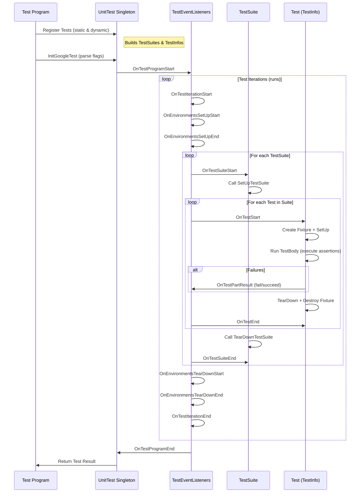

# Test Lifecycle and Execution Flow

GoogleTest orchestrates the journey of a test from its definition through execution to result reporting with a carefully structured lifecycle. Understanding this flow helps users grasp how tests are set up, executed, and torn down, and how outcomes propagate through the framework's event-based notification system.

---

## Overview of Test Execution Journey

Every test in GoogleTest follows a consistent lifecycle that ensures isolation, reliability, and extensibility. This lifecycle encompasses:

- **Test Definition and Registration:** Declaring tests informs the framework about what will run.
- **Test Setup:** Preparing the environment before executing test logic.
- **Test Execution:** Running the assertions and test code.
- **Test Teardown:** Cleaning up resources post-test.
- **Result Reporting:** Collecting and broadcasting the outcome.

This sequence is carefully managed to provide fine-grained control, accurate reporting, and hooks for custom behaviors via event listeners.

---

## 1. Test Registration and Discovery

### What Happens When You Define a Test

When you write a test with macros like `TEST()`, `TEST_F()`, or register tests dynamically with `RegisterTest()`, GoogleTest internally creates metadata objects:

- A `TestInfo` instance representing the individual test.
- A corresponding test fixture and test suite association.

The framework collects these in a registry before execution begins, enabling automatic test discovery without manual enumeration.

### Dynamic Registration

Tests can be registered programmatically using the `RegisterTest()` API, supporting dynamic creation based on runtime data. This allows constructing parameterized test suites or adapting to external configurations.

<code-group>
```cpp
void RegisterMyTests(const std::vector<int>& values) {
  for (int v : values) {
    testing::RegisterTest(
        "MyFixture", ("Test" + std::to_string(v)).c_str(), nullptr,
        std::to_string(v).c_str(), __FILE__, __LINE__,
        [=]() -> MyFixture* { return new MyTest(v); });
  }
}
```
</code-group>

<Note>
Programmatic test registration must occur before `RUN_ALL_TESTS()` is called to avoid undefined behavior.
</Note>

---

## 2. Setup Phase

Before the individual test body runs, GoogleTest prepares the environment at multiple levels to ensure consistent initial conditions:

- **Global Environment Setup:** Runs any global environment objects' `SetUp()` methods.
- **Test Suite Setup:** Calls the static method `SetUpTestSuite()` for shared setup across tests in the suite.
- **Test Fixture Setup:** Constructs test fixture objects and invokes `SetUp()` for per-test setup.

For each test:

<Steps>
<Step title="Test Fixture Object Creation">
A fresh test fixture object is created to guarantee test independence.
</Step>
<Step title="TestSuite SetUpTestSuite() Call">
Runs once before any tests in the suite, setting up shared resources.
</Step>
<Step title="Test Fixture SetUp() Call">
Prepares the fixture object for the individual test.
</Step>
</Steps>

<Tip>
Test fixture objects are recreated for each test to prevent state leakage, promoting reliable and repeatable tests.
</Tip>

---

## 3. Execution Phase

During execution, GoogleTest runs the `TestBody()` method which contains the test logic, typically consisting of assertions:

- **Assertion Evaluation:** Assertions (`EXPECT_*`, `ASSERT_*`) check conditions and record failures.
- **Control Flow on Fatal Failures:** `ASSERT_*` macros abort the current function but not the entire test process.
- **Trace and Logs:** Trace points and logging information can be included for debugging.

Failures are recorded but do not immediately stop execution unless fatal and uncaught.

<Tip>
Use `EXPECT_*` assertions to allow continued testing after failures, and `ASSERT_*` when further execution makes no sense (e.g., dereferencing null pointers).
</Tip>

<Warning>
Fatal assertions inside helper functions abort *only* those functions, not the test overall. To propagate fatal failures, check `HasFatalFailure()` after subroutine calls or use exception-based mechanisms.
</Warning>

---

## 4. Teardown Phase

After the test body completes, cleanup occurs to maintain isolation:

- The fixture's `TearDown()` method runs to release per-test resources.
- A per-suite `TearDownTestSuite()` static method can clean up shared resources.
- Global environment objects execute their `TearDown()` methods.
- The fixture object is destructed.

This guarantees resetting of state and resource management regardless of test success or failure.

<Note>
`TearDown()` is preferred over destructors when it might throw exceptions or invoke assertions, which are unsafe in destructors.
</Note>

---

## 5. Result Reporting and Event Propagation

GoogleTest maintains and broadcasts detailed information about test outcomes using an event-driven model:

### Result Aggregation

- **Per-Test Results:** Stored in `TestResult` objects, including pass/fail status, failure causes, and timing.
- **Per-Suite and Global Aggregates:** Summaries accumulated for suites and the entire run.

### Event Listeners

GoogleTest exposes a `TestEventListener` interface with callbacks at key milestones:

- Start and end of tests, test suites, and the entire program.
- Failed assertions and successes.
- Setup and teardown phases.

Users can implement custom listeners to integrate with external systems (e.g., GUI dashboards, logging frameworks) or augment output.

<Steps>
<Step title="Event Trigger Sequence">
`OnTestProgramStart` → `OnTestIterationStart` → `OnEnvironmentsSetUpStart` → ...
</Step>
<Step title="Test Suite and Test Events">
`OnTestSuiteStart` → `OnTestStart` → `OnTestPartResult` (fail/succeed) → `OnTestEnd` → `OnTestSuiteEnd`
</Step>
<Step title="Program Completion">
`OnEnvironmentsTearDownStart` → `OnEnvironmentsTearDownEnd` → `OnTestIterationEnd` → `OnTestProgramEnd`
</Step>
</Steps>

<Tip>
Listeners receive events in order, allowing layered handling such as collecting results first, then customizing output.
</Tip>

---

## Practical User Flow

1. **Write Test Code** using `TEST()`, `TEST_F()`, or register tests programmatically.
2. **Initialize GoogleTest** with `InitGoogleTest(argc, argv);` to process flags.
3. **Run Tests** by calling `RUN_ALL_TESTS()`. The framework then:
   - Sets up global environments.
   - Sets up test suites.
   - Runs each test fixture's setup, executes the test logic, tears down.
   - Cleans up test suites and environments.
   - Aggregates and reports results.
4. **Inspect Results** from console, XML or JSON reports, or via custom listeners.

<Note>
Always return or use the return value of `RUN_ALL_TESTS()` to correctly report test outcomes to external systems.
</Note>

---

## Common Pitfalls and Best Practices

- **Do Not Assume Test Order:** Tests run in an undefined order; design fixtures and state accordingly.
- **Avoid Shared Mutable State Between Tests:** Use static members only with care and clean them appropriately.
- **SetUp and TearDown Are Safer Than Constructors/Destructors for Fixtures:** Because assertions and exceptions behave oddly in constructors and destructors.
- **Use Event Listeners to Extend Behavior:** For custom reporting or integration, do not modify the internals.
- **Handle Fatal Failures Properly in Subroutines:** Use `HasFatalFailure()` or exceptions with listeners for early abort.

---

## Summary Diagram of Test Lifecycle



---

## Troubleshooting

### Common Issues

- **Skipping Tests:** Using `GTEST_SKIP()` halts a test or suite gracefully.
- **Unhandled Fatal Failures:** May continue unexpectedly if `HasFatalFailure()` not checked after subroutines.
- **Test Fixture Misuse:** Using underscores in test suite or test names can cause naming conflicts—avoid them.
- **Failure to Register Tests:** Programmatic registration after `RUN_ALL_TESTS()` leads to tests never executing.

### Tips

- Print current test info via `UnitTest::GetInstance()->current_test_info()` inside `SetUp()` to trace running tests.
- Use event listeners for advanced debugging and monitoring.

<Info>
Refer to [GoogleTest FAQ](faq.md#why-should-test-suite-names-and-test-names-not-contain-underscore) for naming conventions.
</Info>

---

## Additional Resources

- GoogleTest Primer for fundamental test writing [primer.md].
- Testing Reference for API details [reference/testing.md].
- Advanced GoogleTest Topics for deep dive on lifecycle & assertions [advanced.md].
- Event Listener API for custom reporting integration [reference/testing.md#TestEventListener].
- Sample Test Cases showcasing test definitions and lifecycle [samples.md].

---

This page focuses exclusively on the concepts around the test lifecycle and execution flow within GoogleTest and complements related pages about assertions, parameterized tests, mocking, and API references.

---

<footer>© GoogleTest Documentation</footer>