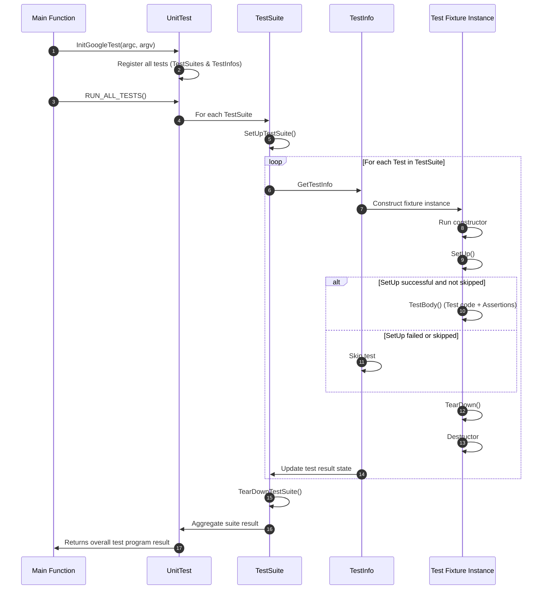

# Test Case Lifecycle & Execution Flow

Dive into the lifecycle of a test case in GoogleTest—from how tests are automatically discovered and registered, through setup and teardown phases, to execution isolation, result aggregation, and reporting. Understanding this flow ensures your tests run deterministically and reliably.

---

## Overview of a Test Case Lifecycle

When you write tests using GoogleTest macros like `TEST()` or `TEST_F()`, the framework handles a sophisticated lifecycle behind the scenes to keep your test execution predictable and isolated. This lifecycle can be summarized in the following phases:

1. **Test Registration and Discovery**
2. **Test Fixture Construction and Setup**
3. **Test Execution**
4. **Test Teardown and Destruction**
5. **Result Reporting and Aggregation**

Let's explore each phase to understand how GoogleTest manages your tests.

---

## 1. Test Registration and Discovery

GoogleTest automatically registers all test cases defined with `TEST()`, `TEST_F()`, `TEST_P()`, and related macros at static initialization time. This means:

- Each test is given a *test suite* name (the first macro argument) and a *test name* (the second argument).
- Test suite and test names must be valid C++ identifiers without underscores (`_`) to avoid naming collisions and undefined behavior.
- Internally, GoogleTest creates a factory for each test that knows how to construct the test fixture.
- All registered tests are collected centrally into the singleton `UnitTest` object, which maintains an ordered list of test suites and their tests.

This automatic discovery eliminates the need for you to manually list or register your tests.

### Important Notes

- Tests in the same test suite **must** use the same test fixture class. Mixing fixtures causes errors and is detected during registration.
- Disabled tests are excluded from execution unless the `--gtest_also_run_disabled_tests` flag or environment variable is set.

---

## 2. Test Fixture Construction and Setup

For tests defined with `TEST_F()` and parameterized tests, GoogleTest follows a strict controlled process:

- **A new fixture object is created for each test.**
- The fixture's constructor runs first, which should be lightweight as fatal assertions cannot be used here.
- GoogleTest calls the fixture's `SetUp()` method, where resource allocation and initialization should occur.

> ⚠️ **Fatal Assertions Limitation:** Fatal assertions (like `ASSERT_*`) should not be used in constructors or destructors because they cannot abort the current test in these contexts. Use `SetUp()` and `TearDown()` for setup/cleanup that may fail.

- If the suite defines `static void SetUpTestSuite()` (formerly `SetUpTestCase()`), it is invoked once *before* the first test in the suite runs to create shared resources.

---

## 3. Test Execution

After setup completes without fatal failure or skip, GoogleTest invokes the test body:

- The virtual method `TestBody()` runs the code you wrote inside your test.
- Assertions (EXPECT_*, ASSERT_*, etc.) determine whether the test passes or fails:
  - **Fatal failures (ASSERT_*) abort the current test method early.**
  - **Nonfatal failures (EXPECT_*) record a failure but continue execution.**
- GoogleTest supports nested assertions, custom predicates, and scoped traces (`SCOPED_TRACE`) for enhanced debugging.

Parallelism is not managed by GoogleTest natively; tests run sequentially in order unless you take special measures externally.

---

## 4. Test Teardown and Destruction

Once the test body completes:

- GoogleTest calls the fixture's `TearDown()` method, allowing cleanup.
- Then it destroys the fixture object, running its destructor.
- After the last test in a test suite is finished, `static void TearDownTestSuite()` is invoked for shared cleanup.

Again, avoid fatal assertions in `TearDown()` and destructors.

### Skipped Tests

- You can call `GTEST_SKIP()` in either `SetUp()`, the test body, or `TearDown()` to skip tests cleanly.
- Skipped tests are reported separately and do not count as passed or failed.

---

## 5. Result Reporting and Aggregation

GoogleTest collects results at multiple levels:

- **Test Level:** Each test produces a `TestResult` containing assertion outcomes, elapsed time, and logs.
- **Test Suite Level:** A `TestSuite` collects results of all its tests, computes counts of successes, failures, disabled tests, and overall duration.
- **Global Level:** The `UnitTest` singleton aggregates all suites for program-wide success/failure determination.

GoogleTest uses event listeners (like the default console printer) to provide real-time feedback during test runs. You can customize this by adding new listeners or replacing the defaults.

Additionally, GoogleTest supports generating XML or JSON reports with structured test results suitable for CI integration.

---

## Execution Flow Diagram

This flow emphasizes how GoogleTest manages isolation by spawning a new fixture instance per test, protects test independence with per-test setup and teardown, and aggregates results with clear scope.

---

## Best Practices

- Use meaningful test and test suite names without underscores to avoid naming conflicts.
- Avoid fatal assertions in constructor and destructor; use `SetUp()` and `TearDown()` instead.
- Use `SetUpTestSuite()` and `TearDownTestSuite()` for heavy shared resources.
- Call `testing::InitGoogleTest()` before `RUN_ALL_TESTS()` to ensure proper flag parsing and initialization.
- Use event listeners and the `--gtest_list_tests` flag to inspect test discovery.
- Use filtering flags (`--gtest_filter=`) and sharding environment variables (`GTEST_TOTAL_SHARDS`, `GTEST_SHARD_INDEX`) to control large test suites.

---

## Troubleshooting Common Issues

<AccordionGroup title="Common Issues in Test Lifecycle and Execution">
<Accordion title="Test Not Recognized or Not Running">
Ensure you have called `testing::InitGoogleTest()` before `RUN_ALL_TESTS()`. Confirm your tests are correctly registered and that filters are not excluding them accidentally.
</Accordion>
<Accordion title="Fatal Assertions in Constructors/Destructors Cause Compile Errors">
Fatal assertions (`ASSERT_*`) cannot be used in constructors or destructors. Move setup code to `SetUp()` and cleanup code to `TearDown()`.
</Accordion>
<Accordion title="Mixing TEST and TEST_F in the Same Suite Causes Runtime Errors">
Use only one type of test fixture for tests within the same test suite to avoid conflicts.
</Accordion>
<Accordion title="Random Test Failures or Order-Dependent Tests">
Use `--gtest_shuffle` to randomize test order and identify interdependencies. Fix shared state issues.
</Accordion>
</AccordionGroup>

---

### Additional Resources

- See [Test Cases & Fixtures](../api-reference/googletest-core-api/test-cases-and-fixtures.md) for detailed API and usage of test fixtures.
- Consult [GoogleTest Primer](../docs/primer.md) for beginner-friendly introduction.
- Explore [Advanced GoogleTest Topics](../docs/advanced.md) for in-depth coverage of test lifecycle, fixtures, and execution nuances.
- For test event customization, see [Extending GoogleTest by Handling Test Events](../docs/advanced.md#extending-google-test-by-handling-test-events).

---

This understanding equips you to write and maintain test suites that run reliably, report meaningful results, and leverage GoogleTest's powerful features for scalable testing.

---

## Glossary

- **Test Case/Test Suite:** A named group of tests, sharing fixtures.
- **Test Fixture:** The class encapsulating common test setup and teardown logic.
- **Assertion:** A statement checking a condition within a test.
- **Fatal Assertion:** Causes immediate abortion of the current test function.
- **Nonfatal Assertion:** Records failure but continues execution.
- **Event Listener:** A component that monitors test progress events and results.

---

If you want the exact internal control flow and code-level understanding, refer to the `googletest/src/gtest.cc` `TestInfo::Run()`, `TestSuite::Run()` and `UnitTest::Run()` implementations in the source code.
