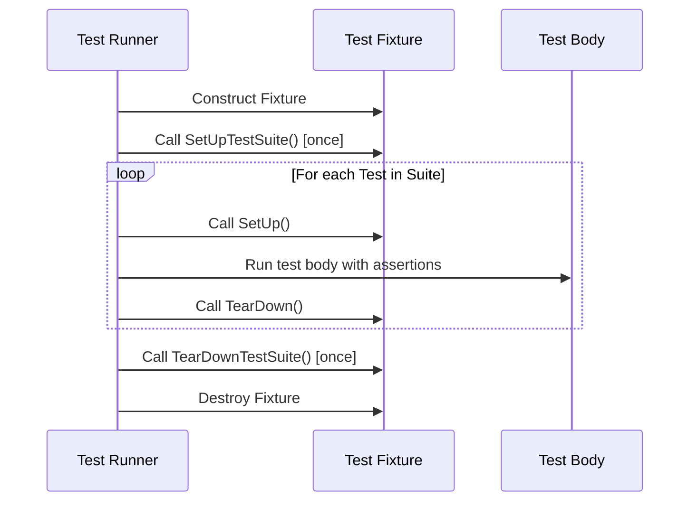

# Test Lifecycle & Assertion Framework

Understanding the lifecycle of a test and the assertion framework in GoogleTest is critical for writing effective, clear, and maintainable tests. This page walks you through the entire flow—from test creation, execution phases, to cleanup—and introduces the assertion mechanisms that drive test success and failure detection.

---

## The Test Lifecycle in GoogleTest

GoogleTest follows a structured lifecycle for each test that ensures isolation, consistency, and accurate outcome reporting. Understanding this lifecycle empowers you to write tests that are robust and easy to debug.

### 1. Test Registration and Discovery

When you define tests using `TEST()` or `TEST_F()`, GoogleTest automatically registers these tests at program startup. There is no manual registration needed; this means all defined tests are discoverable and runnable via `RUN_ALL_TESTS()`.

### 2. Test Initialization

Before a test runs, GoogleTest calls:

- **Test Fixture Constructor** (if any)
- **`SetUpTestSuite()`** (runs once before the first test in a test suite)
- **`SetUp()`** method (runs before each individual test)

These setup phases prepare resources, initialize shared states, or configure preconditions necessary for your test.

### 3. Test Execution

The core test logic lives inside the body of the test function (within a `TEST()` or `TEST_F()` macro). This function contains the calls to your production code and the expectations expressed with GoogleTest assertions.

### 4. Test Teardown

After the test runs (regardless of success or failure), cleanup steps are executed in the following order:

- **The `TearDown()`** method runs to clean up per-test resources.
- **`TearDownTestSuite()`** is called once after all tests in the test suite complete.
- **Test Fixture Destructor** cleans up any remaining test fixture state.

GoogleTest guarantees that teardown happens even if a test fails or throws exceptions.

### 5. Test Result Reporting

GoogleTest collects results from assertions and test status to report pass or failure. It tracks whether a test has:

- Fatal failures (halting execution immediately)
- Nonfatal failures (continues test execution but marks test as failed)
- Skipped status (via `GTEST_SKIP()`)

This enables detailed reporting and precise summaries after all tests.

---

## Test Lifecycle Flow Diagram



---

## Key Concepts of the Assertion Framework

Assertions form the backbone of test validation. GoogleTest offers a rich set of assertion macros and mechanisms to express expected behavior clearly.

### Types of Assertions

- **Nonfatal Assertions (`EXPECT_*`)**: Record failure but allow the test to continue
- **Fatal Assertions (`ASSERT_*`)**: Record failure and immediately abort the current test function

Using nonfatal assertions enables multiple checks per test, while fatal assertions safeguard functions from continuing with invalid data.

### Assertion Results

- **Success**: The condition under test holds true
- **Nonfatal failure**: Condition failed but test continues
- **Fatal failure**: Condition failed and test is aborted

### Common Assertions

- Boolean checks: `EXPECT_TRUE()`, `EXPECT_FALSE()`
- Equality and inequality: `EXPECT_EQ()`, `EXPECT_NE()`
- String comparisons: `EXPECT_STREQ()`, `EXPECT_STRNE()`
- Floating-point comparisons: approximately equal with tolerances
- Exception assertions: `ASSERT_THROW()`, `EXPECT_THROW()`, etc.

### Assertions and Custom Messages

You can augment assertions with custom failure messages for clarity:

```cpp
EXPECT_EQ(foo.Bar(), 42) << "Bar() should return 42 for input X";
```

### Best Practices for Assertions

- Prefer `EXPECT_*` when multiple checks are needed to isolate issues
- Use `ASSERT_*` when subsequent checks depend on the assertion
- Keep assertions specific and expressive
- Avoid side effects inside assertions

---

## Handling Test Failures

GoogleTest reports test failures with detailed diagnostic information:

- Location in the source file
- Failure message and expected vs actual values
- Optionally, stack traces and involved values (with higher verbosity)

This immediate feedback helps you pinpoint issues efficiently.

Failures are recorded but do not stop the entire test process unless fatal.

---

## Writing Effective Setup and Teardown

A crucial part of the test lifecycle is consistent and reliable setup/teardown:

- Use the test fixture constructor for basic setup that cannot fail
- Use the `SetUp()` method for preparations that may raise expectations
- Use the `TearDown()` method to undo setup actions and free resources
- Use `SetUpTestSuite()` and `TearDownTestSuite()` for expensive shared initialization and cleanup across all tests in a suite

Avoid side effects in setup that can cause flaky tests.

---

## Integrating Assertions and Test Lifecycle into Your Workflow

When you write tests, keep this flow in mind:

1. Design the test fixture and implement setup/teardown properly
2. Write test methods using `TEST()` or `TEST_F()` macros
3. Use assertions to verify each behavior step clearly
4. Run tests with `RUN_ALL_TESTS()` which handles discovery and iteration

This ensures your tests are isolated, self-contained, and reliably report results.

---

## Troubleshooting Common Lifecycle and Assertion Issues

- **Unexecuted test code or setup**: Confirm you're using `TEST_F()` with proper fixtures
- **Assertions not triggering failures**: Check for misuse of nonfatal assertions when fatal are needed
- **Test resource leaks or crashes**: Ensure `TearDown()` and destructors release all allocated resources
- **Tests that silently pass/fail unexpectedly**: Run with increased verbosity flags (e.g., `--gtest_break_on_failure`, `--gtest_verbose=info`)

---

## Related Documentation

- [Test Case and Suite Structure](/api-reference/core-testing-apis/test-case-structure): In-depth on test organization and lifecycle
- [Assertion Macros and Functions](/api-reference/core-testing-apis/core-assertions): Full reference on assertions
- [Setting Expectations & Behaviors](/api-reference/mocking-framework/setting-expectations): How mock expectations integrate with test lifecycle
- [Writing and Running Your First Test](/getting-started/first-run-validation/writing-first-test): Practical introduction with example

---

## Summary
GoogleTest’s test lifecycle ensures tests are run in a strict, isolated order with deterministic setup and teardown steps. Its assertion framework provides expressive macros that report failures clearly and precisely. Mastering these concepts helps you write tests that are maintainable, debuggable, and trustworthy.

---

_For an overview of how mocks fit into the full test lifecycle, see the [Mocking Overview](concepts/mocking-abstractions/mock-object-basics)._

---

## Additional References

- [GoogleTest Primer](docs/primer.md): Getting started with tests
- [gMock for Dummies](docs/gmock_for_dummies.md): Introduction to mocking
- [Mocking Reference](docs/reference/mocking.md): Mocking details
- [Test Discovery and Execution Model](/concepts/core-architecture/test-discovery-execution): How tests run behind the scenes

---

## Practical Tips

<Tip>
Always pair `SetUp()` with `TearDown()` to avoid resource leaks.
</Tip>
<Tip>
Use `ASSERT_*` when failure should abort further test statements to prevent cascading errors.
</Tip>
<Tip>
Run failing tests with `--gtest_break_on_failure` or `--gmock_verbose=info` for detailed diagnostics.
</Tip>


---

## Example: Writing a Test With Setup and Assertions

```cpp
#include <gtest/gtest.h>

class QueueTest : public ::testing::Test {
 protected:
  void SetUp() override {
    q.Enqueue(1);
    q.Enqueue(2);
  }

  void TearDown() override {
    // Clear the queue
    while (q.Dequeue() != nullptr) {}
  }

  Queue<int> q;
};

TEST_F(QueueTest, SizeIsCorrect) {
  EXPECT_EQ(q.size(), 2);
}

TEST_F(QueueTest, DequeueWorks) {
  int* val = q.Dequeue();
  ASSERT_NE(val, nullptr);
  EXPECT_EQ(*val, 1);
  delete val;
}
```

This illustrates setup in `SetUp()`, assertions in `TEST_F()`, and cleanup in `TearDown()`.

---

## Summary Table: Test Lifecycle Methods

| Phase               | Method                   | Purpose                          |
|---------------------|--------------------------|---------------------------------|
| Suite Setup         | `SetUpTestSuite()`       | One-time setup before all tests |
| Test Fixture Setup  | Constructor + `SetUp()`  | Setup before each test           |
| Test Execution      | Test body inside `TEST()`| Run test logic and assertions   |
| Test Fixture Teardown | `TearDown()` + Destructor | Cleanup after each test          |
| Suite Teardown      | `TearDownTestSuite()`    | One-time cleanup after suite    |

---

This page equips you with a clear understanding of how GoogleTest orchestrates test execution and verifies correctness through assertions — critical knowledge for writing high-quality C++ tests.
