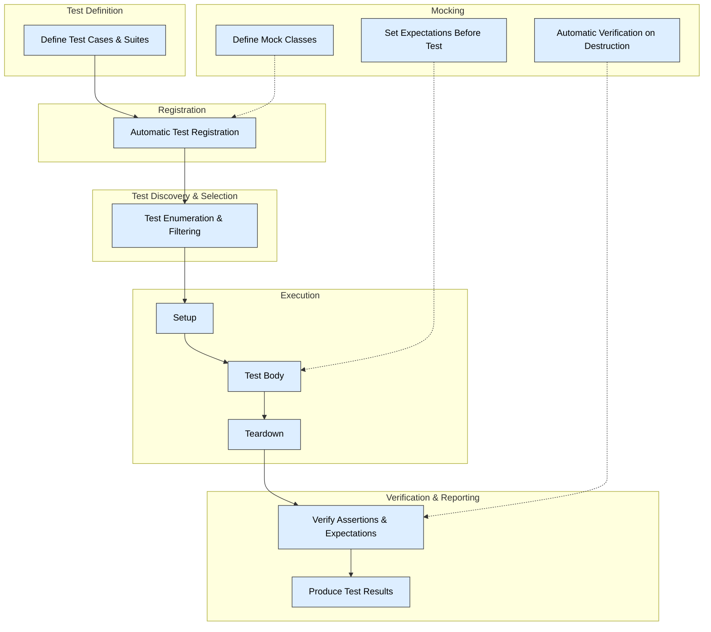

# Testing Architecture Overview

GoogleTest and GoogleMock are built on a robust yet intuitive architecture inspired by the classic xUnit testing framework. This architecture orchestrates how tests are defined, discovered, run, and verified, providing a seamless and automated testing experience for C++ developers.

---

## Core Concepts of the Testing Architecture

### Test Lifecycle

Every test follows a well-defined lifecycle, guiding users from setup through execution to result verification:

1. **Test Definition:** Users write individual test cases grouped logically into test suites.
2. **Test Registration:** Tests register themselves automatically upon definition, enabling the framework to locate all tests without user intervention.
3. **Test Discovery:** The test runner enumerates all registered tests for selection and execution.
4. **Test Execution:** Each test runs in an isolated context, executing setup, the test body, and teardown phases.
5. **Result Reporting:** Outcomes such as success, failure, or skips are reported with detailed information.

This lifecycle ensures tests run predictably and are easy to maintain.

### Test Cases and Suites

- **Test Cases (Tests):** The atomic units of verification. Each test exercises a discrete piece of functionality.
- **Test Suites (Fixtures):** Logical groupings of tests sharing setup and teardown code for consistency and reuse.

GoogleTest uses macros like `TEST()` and `TEST_F()` to define individual tests and test fixtures, respectively.

### Automatic Test Registration

Under the hood, GoogleTest uses static object initialization to add each test to a global registry as the program starts. This eliminates the need for manual test enumeration or configuration, empowering users to discover tests easily and execute subsets selectively.

### Execution Flow

When executing tests, the framework runs each test in isolation to avoid interdependencies. The flow for each test is:

- **Setup:** Initialize test fixture or environment.
- **Run Test Body:** Execute the actual test code.
- **Teardown:** Clean up resources and state.

Exceptions or assertions during the test cause immediate failure and halt the test’s execution gracefully.

### Test Runner

The test runner is the executable or harness that invokes the suite of registered tests. It supports command-line arguments to:

- Run all or selected tests
- Filter tests by name or patterns
- Control output verbosity and format

The runner manages test execution and aggregates results, providing comprehensive summaries.

---

## Integration with GoogleMock

GoogleMock integrates seamlessly with GoogleTest’s architecture, enhancing it with powerful mocking capabilities:

- Mock objects are defined and registered similarly to tests.
- Expectations on mock methods are set before exercising code.
- GoogleMock automatically verifies that all expectations are fulfilled when mocks are destroyed.
- Supports complex call ordering and argument matching rules within the test lifecycle.

This deep integration supports behavior-driven testing and precise interaction verification.

---

## Benefits of the Architecture

- **Simplicity:** xUnit-inspired design makes it familiar to many developers.
- **Automation:** Tests self-register; no manual wiring required.
- **Isolation:** Each test is isolated to guarantee reliable and repeatable results.
- **Extensibility:** Supports powerful mocking, matchers, and actions.
- **Flexibility:** Command-line options allow targeted and configurable test runs.

---

## How This Fits in the GoogleTest Ecosystem

This foundational architecture document connects to key user journeys and guides:

- For **Getting Started**, see [Writing Your First Test](https://google.github.io/googletest/guides/getting-started/writing-your-first-tests).
- For **Defining and Using Mocks**, explore the [gMock for Dummies](https://google.github.io/googletest/gmock_for_dummies.html) and [gMock Cookbook](https://google.github.io/googletest/gmock_cook_book.html).
- For **Advanced Workflows**, check [Writing and Using Mocks Effectively](https://google.github.io/googletest/guides/core-workflows/mocking-techniques).

---

## Troubleshooting and Best Practices

- Ensure you set expectations **before** exercising mocks to avoid undefined behavior.
- Use test fixtures to share setup and teardown code efficiently.
- Isolate tests to prevent side effects.
- Use command-line filters for running specific tests.

---

## Visual Overview

---

This diagram displays the key phases and flow of the GoogleTest testing architecture alongside GoogleMock’s integration points.

---

## Summary

The testing architecture underlying GoogleTest and GoogleMock is designed for automatic discovery, easy execution, and robust verification of C++ tests and mocks. Inspired by xUnit, it supports isolated test executions with lifecycle control, empowering developers to write expressive, maintainable, and automated tests.

---

## Next Steps

To take full advantage of this architecture, review these guides:

- [Writing Your First Test](https://google.github.io/googletest/guides/getting-started/writing-your-first-tests) — Kickstart your testing journey.
- [gMock for Dummies](https://google.github.io/googletest/gmock_for_dummies.html) — Master mock creation and usage.
- [Writing and Using Mocks Effectively](https://google.github.io/googletest/guides/core-workflows/mocking-techniques) — Explore advanced mocking patterns.

Understanding this overview enables you to build reliable, maintainable tests with GoogleTest and GoogleMock, fully leveraging their capabilities within your development process.
