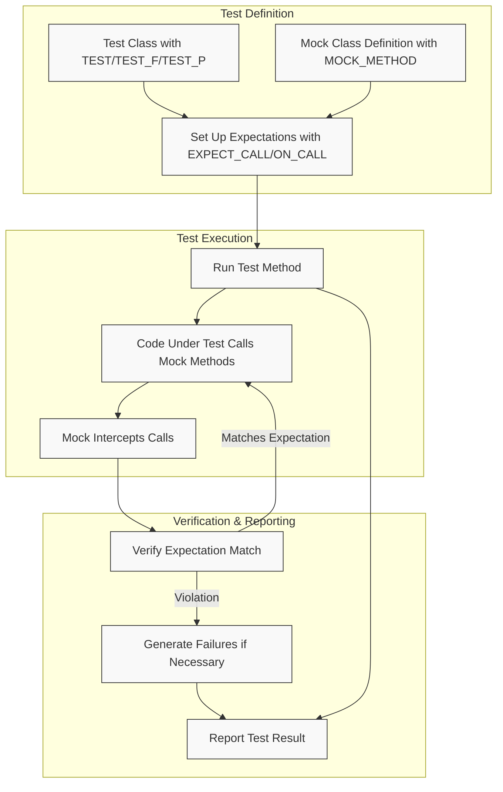

# Testing Architecture Overview

An introduction to GoogleTest and GoogleMock's overall architecture, illustrating how tests are structured, executed, and reported. This guide helps you understand the key components and their interactions that facilitate effective unit testing and behavior verification in C++ projects.

---

## 1. Testing Workflow: From Test Definition to Execution

Imagine you want to verify that your C++ code behaves correctly. GoogleTest and GoogleMock let you define tests, set expectations on mock objects, run tests, and get rich reports—all in an integrated workflow.

### 1.1 Test Definition
You start by writing test cases using GoogleTest macros such as `TEST`, `TEST_F`, and `TEST_P`. These define individual tests or test suites where each test verifies specific behavior.

### 1.2 Mock Object Creation and Setup
Within tests, you create mock objects derived from your interfaces using GoogleMock’s `MOCK_METHOD` macros. These mocks allow you to specify:
- **Expectations:** What methods should be called, with what arguments, how many times.
- **Default behaviors:** How mocks behave when methods without explicit expectations are invoked.

### 1.3 Setting Expectations and Behaviors
Using `EXPECT_CALL` and `ON_CALL`, you declare:
- Precise call counts and argument matchers.
- Order and sequence of calls.
- Custom actions or return values.

This setup allows the mock to act as both a verifiable stub and a behavior enforcer.

### 1.4 Test Execution
When tests run, GoogleTest invokes the test body, exercises your code under test, which internally calls the mocks as needed. GoogleMock intercepts these calls to:
- Match them against expectations.
- Execute specified actions or default behaviors.

### 1.5 Verification and Reporting
At runtime or upon destruction of mocks, all expectations are automatically verified. Failures produce detailed error messages, including call counts, argument mismatches, and call order violations.

---

## 2. Core Components and Their Roles

### 2.1 Test Cases and Fixtures
- **`TEST()`:** Defines a simple test.
- **`TEST_F()`:** Uses a test fixture class to share setup/teardown among tests.
- **`TEST_P()`:** Supports parameterized tests.

Each test case is isolated and run independently, ensuring repeatability.

### 2.2 Mock Classes and Methods
- Defined with `MOCK_METHOD` macros that generate mocked methods closely mirroring the interfaces you want to test.
- Support qualifiers like `const`, `override`, `noexcept`, and calling conventions.

### 2.3 Expectations
- Created with `EXPECT_CALL`.
- Specify **matchers** to validate arguments precisely.
- Chain modifiers to control call counts (`Times()`), order (`InSequence()`, `After()`), and actions (`WillOnce()`, `WillRepeatedly()`).
- The system reports mismatched calls, missing calls, excessive calls, and order violations.

### 2.4 Default Actions
- Defined using `ON_CALL` to specify fallback behaviors.
- Allow mocks to respond meaningfully to calls without explicit expectations.

### 2.5 Sequences and Order Control
- Use `Sequence` objects and the `InSequence` clause to enforce call order.
- `After` clause lets you specify partial ordering, representing more complex call dependencies.
- `RetiresOnSaturation` can retire expectations to prevent stale matches.

### 2.6 Action Generators
- Actions can be built-in (`Return`, `SetArgPointee`, `Invoke`, etc.) or user-defined (lambdas, function pointers, custom classes).
- They define the behavior when a mock method is called.

### 2.7 Verbosity and Logging
- GoogleMock controls output detail with the `--gmock_verbose` flag (levels: `info`, `warning`, `error`).
- In informational mode, detailed match and call traces are printed, aiding debugging.

---

## 3. Data and Control Flow in Mocked Tests

This diagram shows the user journey from defining tests and mocks, through running the tests, to reporting results. Mocks act as gatekeepers—ensuring calls match expectations, performing actions, and detecting discrepancies immediately.

---

## 4. User-Centric Insights & Best Practices

### 4.1 Think in Terms of Behavior
Construct your tests to verify *what* your code should do, not *how* it does it internally. Use mocks to specify and verify key interactions and side effects.

### 4.2 Use ON_CALL Wisely
Set default mock behaviors that apply universally within a test fixture to avoid brittle and over-specified tests. Use `EXPECT_CALL` only for critical interactions you want verified.

### 4.3 Order Calls with Purpose
Only enforce strict ordering with `InSequence` or `After` when necessary. Prefer partial ordering to avoid brittle tests.

### 4.4 Exploit Verbose Mode
Running tests with `--gmock_verbose=info` provides valuable call tracing and expectation matching insights, clarifying failures and mismatches.

### 4.5 Clean and Isolate Tests
Each test gets a fresh fixture and new mock instances, avoiding inter-test dependencies and improving reliability.

### 4.6 Verify Expectation Lifecycle
Mocks automatically verify expectations on destruction. For early verification, use `Mock::VerifyAndClearExpectations(&mock)`.

### 4.7 Handle Move-Only Types
GoogleMock supports mocking methods with move-only types such as `std::unique_ptr`. Use lambdas or callable objects for custom actions.

### 4.8 Mocking Tips
- Always define mock methods in the `public:` section.
- Use `NiceMock<T>` to suppress warnings on uninteresting calls.
- Use `StrictMock<T>` to treat uninteresting calls as errors.

---

## 5. Troubleshooting and Common Failure Scenarios

### 5.1 Missing Calls
If a required mock call is not made, expect detailed `Actual function call count doesn't match` messages with stack traces.

### 5.2 Unexpected Calls
Calls that don't match any expectation are flagged, with messages showing expected argument matchers compared to actual values.

### 5.3 Excessive Calls
Calls beyond the allowed count trigger errors that include call arguments and saturation state.

### 5.4 Incorrect Call Order
When sequences or `After` clauses are defined, out-of-order calls lead to failures citing the sequence expectations.

### 5.5 Uninteresting Calls
Calls without any `EXPECT_CALL` will generate warnings unless using `NiceMock`. Treat these warnings as indicators of potential missing expectations.

### 5.6 Compiler Errors on Mock Definitions
Improper use of `MOCK_METHOD` (such as unprotected commas or misqualified methods) produces compile errors. Use type aliases or parentheses to resolve.

---

## 6. Additional Resources and Next Steps

- [Defining and Using Mock Classes](../guides/mocking-in-action/defining-mocks)
- [Setting Expectations and Verifying Interactions](../guides/mocking-in-action/setting-expectations)
- [Matchers and Actions Reference](../api-reference/mocking-api/matchers-actions)
- [Core GoogleTest Test Macros and Execution Models](../api-reference/core-testing-api/test-macros)
- [Debugging and Output Customization](../guides/integration-and-best-practices/debugging-and-output)

These guides deepen your understanding of test architecture and best practices to write stable and expressive C++ tests with GoogleTest and GoogleMock.

---

## 7. Summary

This overview has walked you through the high-level architecture of GoogleTest and GoogleMock, focusing on how tests are structured, how mocks are defined and behave, and how expectations are verified. Understanding this framework architecture empowers you to write robust, maintainable tests, set realistic expectations on mocks, and leverage the full power of expressive interaction verification.

