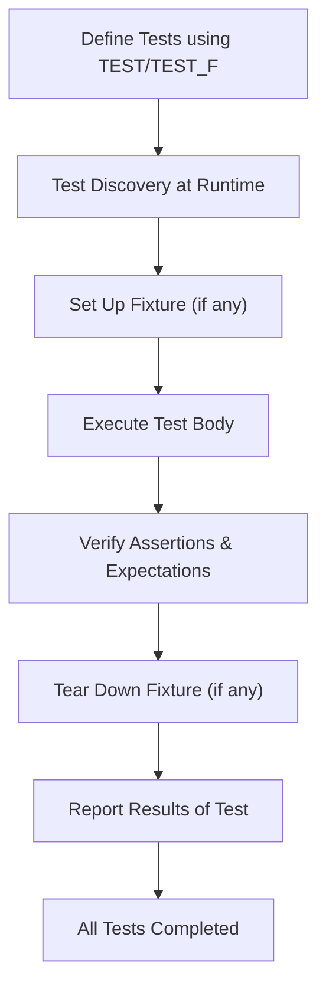

# Testing Foundations: The xUnit Model

## Introduction

GoogleTest employs the established xUnit testing architecture to provide a structured, scalable, and reliable way to write and run tests for C++ code. This architecture underpins how tests are defined, organized, and executed, helping users systematically verify the correctness of their code.

Understanding the xUnit model is essential for leveraging GoogleTest effectively, as it organizes testing workflows and supports powerful features like test isolation, fixtures, and automatic test discovery.

---

## The xUnit Architecture in GoogleTest

At its core, the xUnit model emphasizes four key concepts that enable efficient testing:

- **Tests:** Individual checks that verify specific behaviors or outcomes in code.
- **Test Suites:** Collections of related tests grouped logically, often by the component or functionality under test.
- **Test Fixtures:** Shared setup and teardown context for tests within a suite, allowing reuse of common objects and consistent test environments.
- **Test Runner:** The engine that discovers, executes, and reports on tests.

GoogleTest implements these concepts in ways that optimize both user experience and test reliability.

---

## Defining and Grouping Tests

### Individual Tests

Each test in GoogleTest is implemented as a function designed to exercise a particular path or feature of the code. Tests are written using the `TEST` or `TEST_F` macros:

- **`TEST(TestSuiteName, TestName)`**: Defines a standalone test belonging to a named suite.
- **`TEST_F(TestFixtureClass, TestName)`**: Defines a test that shares common setup and teardown via a fixture class.

The test body contains assertions that verify conditions; a failure in any assertion marks the test as failed.

### Test Suites

Tests are logically grouped into test suites, which usually correspond to individual classes, modules, or features. This grouping helps organize tests, making it easier to run specific subsets and understand test coverage.

### Naming Conventions

- Test suites and tests should be named clearly and consistently, using valid C++ identifiers without underscores.
- The combination of suite and test names uniquely identifies a test.

### Example

```cpp
TEST(MathTests, FactorialZero) {
  EXPECT_EQ(Factorial(0), 1);
}

TEST(MathTests, FactorialPositive) {
  EXPECT_EQ(Factorial(5), 120);
}
```

Here, both tests belong to the `MathTests` suite.

---

## Using Test Fixtures to Share Common Context

When multiple tests require the same preparation or cleanup, GoogleTest lets you define a *test fixture* — a class derived from `testing::Test` that sets up shared data or state.

### Creating a Test Fixture

1. Derive a class from `testing::Test`.
2. Declare shared members and override `SetUp()` and `TearDown()` methods for initialization and cleanup.
3. Use `TEST_F` instead of `TEST` to write tests that use the fixture.

### Benefits

- Avoids redundant code in tests.
- Ensures consistent setup and teardown for all tests in the suite.
- Helps test complex interactions by preparing a controlled environment.

### Example

```cpp
class QueueTest : public testing::Test {
 protected:
  Queue<int> q;

  void SetUp() override {
    q.Enqueue(1);
    q.Enqueue(2);
  }
};

TEST_F(QueueTest, SizeIsTwoInitially) {
  EXPECT_EQ(q.size(), 2);
}

TEST_F(QueueTest, DequeueWorks) {
  auto item = q.Dequeue();
  ASSERT_NE(item, nullptr);
  EXPECT_EQ(*item, 1);
}
```

Each test in `QueueTest` runs with a fresh fixture setup.

---

## Test Runner and Discovery

GoogleTest automatically discovers tests defined with `TEST` or `TEST_F` macros. When executed, the test runner:

1. Parses command-line arguments to select which tests to run or configure behaviors.
2. Runs tests one by one, isolating each test case in a fresh environment.
3. Reports results with detailed information on failures including file names, line numbers, and failure messages.

### Isolated Execution

Tests run in isolation to avoid dependencies or side effects between tests, ensuring repeatability and easier debugging.

### Assertions and Failures

- Assertions come in two types: `EXPECT_*` which continue execution after failure, and `ASSERT_*` which abort the current test function on failure.
- GoogleTest accumulates failures, reporting all in a test run to aid quick diagnosis.

### Simple Test Example

```cpp
TEST(SampleTest, SimpleAssertion) {
  int x = 5;
  int y = 5;
  EXPECT_EQ(x, y);
}
```

---

## Test Execution Workflow

The following flow illustrates a typical test execution lifecycle:

<Steps>
<Step title="Test Definition">
Define test cases and suites using `TEST` or `TEST_F` macros.
</Step>
<Step title="Test Discovery">
GoogleTest discovers all tests at runtime, listing them for execution.
</Step>
<Step title="Test Setup">
For tests with fixtures, `SetUp()` is called to prepare the test environment.
</Step>
<Step title="Test Execution">
The test body runs, executing assertions.
</Step>
<Step title="Verification">
Failures are recorded. For mock tests, expectations are automatically verified.
</Step>
<Step title="Test Teardown">
`TearDown()` is called to clean up resources.
</Step>
<Step title="Result Reporting">
GoogleTest outputs detailed results after each test and summarizes at the end.
</Step>
</Steps>

---

## Value of the xUnit Model in GoogleTest

By adhering to the xUnit model, GoogleTest offers users:

- Clear, consistent organization of tests.
- Reliably isolated tests for easier debugging and maintenance.
- Support for shared context without sacrificing independence via test fixtures.
- Support for automated test discovery and execution.
- A foundation compatible with continuous integration environments.

Together, these features ensure developers can write and maintain robust C++ tests with confidence and efficiency.

---

## Practical Tips and Best Practices

- **Define small, focused tests:** Each test should verify a single behavior or case.
- **Use test fixtures to minimize duplication:** Share initialization safely without introducing dependencies between tests.
- **Name suites and tests clearly:** Use meaningful names that reflect the purpose.
- **Leverage assertions appropriately:** Use `EXPECT_*` when you want to continue checking after failure; use `ASSERT_*` when subsequent code depends on a critical condition.
- **Run tests frequently and in isolation:** This helps catch regressions early and ensures test reliability.

---

## Troubleshooting Common Issues

### Tests Not Running

- Ensure tests are defined with the appropriate macros (`TEST` or `TEST_F`).
- Confirm that the test executable links with GoogleTest and test registration is not stripped.

### Tests Failing Unexpectedly

- Check assertions for correctness.
- Review fixture setup to ensure it creates the intended environment.

### Tests Dependent on Each Other

- Avoid shared state across tests.
- Use fixture setup/teardown to reset states.

### Test Executable Returns Unexpected Exit Codes

- Always return the result of `RUN_ALL_TESTS()` from the `main` function to reflect test results correctly.

---

## Additional Resources

To deepen your understanding and make the most of GoogleTest:

- [GoogleTest Primer](primer.md) — Step-by-step tutorial for writing tests.
- [GoogleTest Advanced](advanced.md) — For mastering advanced features.
- [Writing and Running Your First Test](guides/getting-started-workflows/writing-your-first-test) — Practical guide to begin writing tests.
- [Integration & Ecosystem](overview/system-architecture-feature-overview/integration-overview) — Understanding how GoogleTest fits in the larger ecosystem.

---

## Diagram: Overview of xUnit Test Flow in GoogleTest



---

For detailed usage and best practices, refer to related sections on test writing, fixtures, and running tests.


---

*Last updated in the GoogleTest User's Guide*