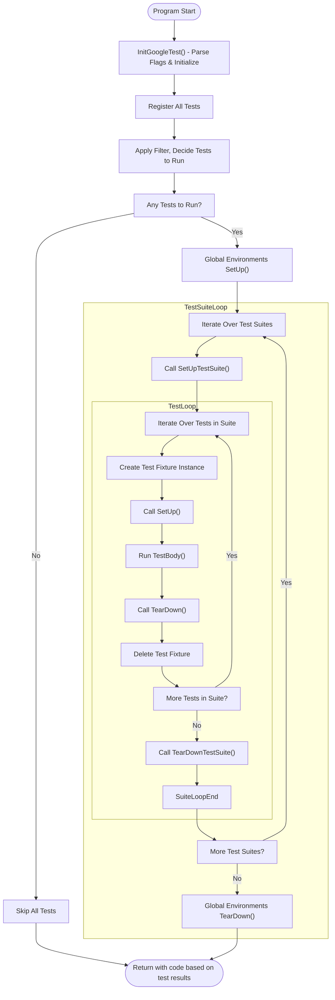

# Testing Lifecycle and Execution Flow

Explore how GoogleTest discovers, initializes, runs, and reports on tests, including the main entry points, the registration of tests, and result propagation. This guide provides clarity on the test runner structure and what happens from process start to test completion.

---

## Introduction

Understanding the lifecycle and execution flow of tests in GoogleTest is essential for mastering test organization, debugging, and extending the framework. This document walks you through the sequence of events from program start, test discovery and registration, test execution, to result reporting.

Whether you are writing simple `TEST()` cases or deploying complex parameterized, typed, or dynamically registered tests, this lifecycle guides how GoogleTest manages your tests behind the scenes.

---

## High-Level Execution Flow

GoogleTest orchestrates your tests through a clearly defined set of steps that occur when you run your test program. The typical flow is:

1. **Initialization**: The test program starts, and `testing::InitGoogleTest()` parses command-line flags and sets up internal data structures.

2. **Test Registration**: All tests declared with macros (`TEST()`, `TEST_F()`, `TEST_P()`, etc.) or registered dynamically (`RegisterTest`) are registered with the framework.

3. **Filtering and Sharding**: The test registry applies user filters (e.g., `--gtest_filter`), decides which tests should run, and optionally shards tests across parallel execution.

4. **Global Environment Setup**: Registered global environments (`Environment` subclasses) have their `SetUp()` called before any tests.

5. **Test Suites Setup and Execution**:
   - For each test suite:
     - `SetUpTestSuite()` is called once before the first test in that suite.
     - Each test in the suite creates a fresh test fixture instance.
     - The fixture's `SetUp()` is called.
     - The test body (`TestBody()`) is executed.
     - The fixture's `TearDown()` is called.
     - The fixture object is destroyed.
   - After all tests in the suite, `TearDownTestSuite()` is called once.

6. **Global Environment Tear-down**: Each global environment has its `TearDown()` called in reverse order.

7. **Result Reporting and Exit**: Test results are collected, reported in your chosen format (console text, XML, JSON, streaming), and `RUN_ALL_TESTS()` returns an exit status indicating success or failure.

---

## Test Registration

### Static Registration

Tests declared with `TEST()`, `TEST_F()`, and related macros automatically register themselves at program initialization. This is achieved via static objects that invoke `::testing::RegisterTest`, which records test metadata:

- Test suite name
- Test name
- Fixture class
- Source location
- Test factory method

This mechanism eliminates the need for manual test enumeration. When `RUN_ALL_TESTS()` is called, GoogleTest iterates over this registry.

### Dynamic Registration

GoogleTest also supports dynamic test registration via the `RegisterTest()` API. This is useful when creating tests programmatically, such as generating tests based on runtime data or configurations.

Each dynamically registered test must provide a factory callable creating an instance of the test fixture.

**Best Practice**: Ensure all tests sharing a test suite use the same fixture class for consistent lifecycle management.

---

## Filtering and Sharding

Before execution, GoogleTest applies the user-specified filter expressions (via `--gtest_filter` flag or `GTEST_FILTER` env variable). Only tests whose full names match the positive patterns and do not match any negative patterns run.

Sharding support enables partitioning tests across multiple machines or processes by setting the environment variables:

- `GTEST_TOTAL_SHARDS`: Total number of shards
- `GTEST_SHARD_INDEX`: Index of the current shard

Tests are assigned shard indices deterministically, ensuring unique and complete coverage.

Tests excluded by filtering or sharding are skipped and not executed.

---

## Environments and Setup/TearDown

GoogleTest provides multiple levels of setup and teardown hooks

- **Global Test Environments (`Environment` subclasses)**:
  - `SetUp()` before any tests
  - `TearDown()` after all tests

- **Test Suite Level (`Test` fixture static methods)**:
  - `SetUpTestSuite()` called once before the first test in the suite
  - `TearDownTestSuite()` called once after the last test in the suite

- **Per-Test Fixture Level**:
  - `SetUp()` called before each test
  - `TearDown()` called after each test

This layered lifecycle enables efficient resource sharing and isolation:

- Expensive global resources can be created once globally.
- Common test data per suite can be set up once per suite.
- Individual tests get fresh, isolated fixture objects.

### Handling Failures in Setup

A fatal failure during any setup (global, test suite, or fixture) causes subsequent tests within that context to be skipped.

---

## Test Execution

### Running Tests

`RUN_ALL_TESTS()` triggers test execution according to the registration and filtering state:

- For each selected test in each test suite:
  - The test framework creates a new instance of the test fixture class.
  - Calls the fixture's `SetUp()` method.
  - Calls the `TestBody()` implementation, which corresponds to the code inside your `TEST()` or `TEST_F()`.
  - Calls the fixture's `TearDown()` method.
  - Deletes the fixture instance.
  
- Failure handling:
  - If a fatal failure (`ASSERT_*`) occurs, the current test is aborted immediately.
  - Non-fatal failures (`EXPECT_*`) allow the test to continue and report all failures.

### Order of Execution

- Test suites named with the `*DeathTest` suffix are executed before others to avoid threading issues.
- User requests like `--gtest_shuffle` randomize the test and test suite order.
- The framework tracks execution times and statuses.

### Test Fixture Independence

Each test runs in a fresh fixture instance. State is not shared between tests unless explicitly managed via static members or global fixtures.

This design eliminates test inter-dependencies and promotes repeatability.

---

## Result Collection and Reporting

GoogleTest collects detailed test results for each test case, including:

- Pass/fail status
- Skipped state
- Execution time
- All assertion results (failures/successes)
- Custom test properties recorded via `RecordProperty()`

### Event Listener API

GoogleTest provides an event listener API to notify about test progress and results:

- `OnTestProgramStart` / `OnTestProgramEnd`
- `OnTestSuiteStart` / `OnTestSuiteEnd`
- `OnTestStart` / `OnTestEnd`
- `OnTestPartResult` (per failing or successful assertion)
- Setup/TearDown environment notifications

Users may attach custom listeners to implement custom reporting or integrations.

### Output Formats

- By default, GoogleTest emits colored textual output in the console.
- XML report generation via `--gtest_output=xml[:file]` for CI integration.
- JSON report generation via `--gtest_output=json[:file]`.
- Support for streaming output to external servers.

### Exit Codes

`RUN_ALL_TESTS()` returns `0` if all tests succeed; non-zero otherwise, enabling integration with CI systems.

---

## Diagram: Test Execution Flow

---

## Practical Tips & Best Practices

- **Always call `testing::InitGoogleTest()` before running tests** to ensure flags and test registry are properly initialized.
- **Do not call `RUN_ALL_TESTS()` more than once**; it assumes a single invocation.
- Use **new test registration APIs (`TEST()`, `TEST_F()`) over deprecated ones**.
- Use **`SetUpTestSuite()` and `TearDownTestSuite()` for expensive shared resources** to reduce test overhead.
- Use **test filtering and sharding** to speed up large test sets.
- Utilize **event listeners** if you need custom test reporting or integration with non-standard tools.

---

## Troubleshooting Common Issues

| Problem                                              | Cause                                              | Solution                                                              |
|------------------------------------------------------|----------------------------------------------------|----------------------------------------------------------------------|
| Tests not discovered or run                           | Missing test registration or calling `RUN_ALL_TESTS()` | Ensure tests are defined properly and `RUN_ALL_TESTS()` is called     |
| Fatal failures do not abort entire test              | Misunderstanding of `ASSERT_*` scope                | Use `HasFatalFailure()` or `ASSERT_NO_FATAL_FAILURE()` to propagate  |
| Test output missing or incomplete                     | Misconfigured output flags or environment variables| Verify `--gtest_output` and related flags are correct                |
| Global setup/teardown not executed                    | No tests selected or filtering excludes all tests  | Check filters and ensure tests run to trigger env setup/teardown    |

---

## Summary

This guide detailed the complete test lifecycle in GoogleTest from initialization, through registration, filtration, execution, and result reporting, providing a comprehensive picture on how GoogleTest manages test execution internally and externally.

For deeper learning, consult the following:

- [GoogleTest Primer](docs/primer.md) for test writing basics
- [Testing Reference](docs/reference/testing.md) for API specifics
- [Advanced GoogleTest Topics](docs/advanced.md) for advanced setup and custom assertions
- [Event Listener API](docs/reference/testing.md#TestEventListener) for custom test reporting

Mastering the lifecycle empowers you to write more efficient, maintainable test suites and customize behavior as needed.

---

## See Also

- [GoogleTest Primer](./primer.md)
- [Testing Reference - Test Macros & Assertions](./reference/testing.md#TEST)
- [Advanced GoogleTest Topics](./advanced.md)
- [Running and Filtering Tests](./guides/getting-started-workflows/building-and-running-tests.md)
- [Event Listener API](./reference/testing.md#TestEventListener)

---

*End of Document*