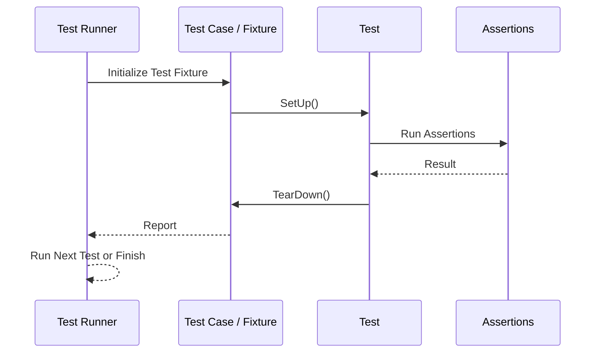

# Testing Model Overview

This page explores the fundamental principles of the testing model used by GoogleTest and GoogleMock. Understanding these concepts empowers you to write effective, maintainable, and reliable unit tests by leveraging the core xUnit testing framework patterns.

---

## The xUnit Testing Framework Foundation

GoogleTest is built on the xUnit testing framework architecture, a widely adopted pattern for organizing and running tests. It provides a structured approach to writing tests, enabling clear test discovery, execution control, and systematic validation.

### Key Principles of xUnit

- **Test Discovery:** Tests are automatically discovered based on naming conventions and registration macros, removing manual test enumeration.
- **Test Fixtures:** Group related tests together, share common setup and teardown code, and eliminate duplication.
- **Test Lifecycle:** Clearly defined phases for initializing, running, and cleaning up tests ensure consistent environments.
- **Isolated Tests:** Each test runs independently to prevent side effects, enhancing reliability.

Understanding these principles helps you design tests that are clear, focused, and maintainable.

## Components of the Testing Model

### Test Cases and Test Suites

A **test case** groups tests that focus on a particular unit or feature. GoogleTest's `TEST` and `TEST_F` macros let you declare test functions organized under a test case name.

- `TEST(TestCaseName, TestName)` declares a basic, standalone test.
- `TEST_F(TestFixture, TestName)` declares a test that uses a test fixture, allowing complex setup.

### Test Fixtures

Fixtures prepare a consistent environment for your tests. They allow sharing setup (`SetUp()`) and teardown (`TearDown()`) logic across multiple tests, reducing code duplication and improving clarity.

Example:

```cpp
class MyTestFixture : public ::testing::Test {
 protected:
  void SetUp() override {
    // Common initialization code
  }

  void TearDown() override {
    // Cleanup code
  }

  int shared_resource;
};

TEST_F(MyTestFixture, TestOne) {
  // Use shared_resource
}

TEST_F(MyTestFixture, TestTwo) {
  // Another test using shared_resource
}
```

### Test Discovery and Registration

GoogleTest discovers tests at runtime through macros such as `TEST` and `TEST_F`. When you compile your test binary, these macros register the test functions in a central registry.

At test execution time, this enables:

- Automated running of all registered tests or selected ones using filtering options.
- Aggregation and reporting of test results.

### Test Execution Lifecycle

Each test undergoes a well-defined lifecycle that ensures isolation and consistency:

1. **Setup:** Test fixtures run `SetUpTestSuite()` (static) once per test suite, and `SetUp()` for each test.
2. **Execution:** The individual test body runs.
3. **Teardown:** `TearDown()` runs after a test, followed eventually by `TearDownTestSuite()`.

GoogleTest manages this lifecycle automatically, so you can focus on test logic.

## Influence on Test Writing and Organization

### Writing Robust and Maintainable Tests

Leveraging the testing model means:

- Encapsulating common code within fixtures to avoid duplication.
- Keeping tests independent and focused to simplify diagnosis.
- Relying on the framework's lifecycle guarantees for consistent and reproducible results.

### Organizing Your Test Code

Structure tests using test cases and fixtures to mirror your application modules or units. This mirrors the domain structure and makes tests easier to understand and maintain.

### Naming Conventions

Use descriptive test case and test names following GoogleTest naming rules. Consistent naming aids discovery, filtering, and clarity in test reports.

## Typical User Workflow

1. Define test fixture classes if needed.
2. Register tests with `TEST` or `TEST_F` macros.
3. Write tests focusing on verification logic.
4. Use assertions to check expected behavior.
5. Run tests via provided executables; select tests using filters.
6. Analyze output reports for failures or errors.

## Common Pitfalls and Best Practices

- **Avoid shared state across tests:** Use fixtures to isolate mutable state.
- **Register expectations before exercising mocks:** gMock expects your `EXPECT_CALL` before calls occur.
- **Use `SetUp()` and `TearDown()` appropriately:** They are called for every test, unlike static suite setup.
- **Keep tests atomic:** Data from one test should not influence another.

## Summary Diagram of Test Execution Flow



## Conclusion

Understanding the xUnit testing model underlying GoogleTest equips you to write clean, reliable, and easily maintainable tests. Mastering test cases, fixtures, lifecycle management, and test discovery will improve your development workflow and enable robust automated testing.

---

## See Also & Next Steps

- [Writing Your First Unit Test](../guides/getting-started/writing-your-first-tests)
- [Test Case and Fixture APIs](../api-reference/core-testing-apis/test-case-api)
- [Mocking Overview and Core Concepts](../guides/mocking-with-googlemock/introduction-to-mocking)
- [Test Execution APIs and Filtering](../api-reference/core-testing-apis/test-execution-apis)


---

*This page serves as a conceptual guide to the test model architecture and does not provide API or implementation details.*
