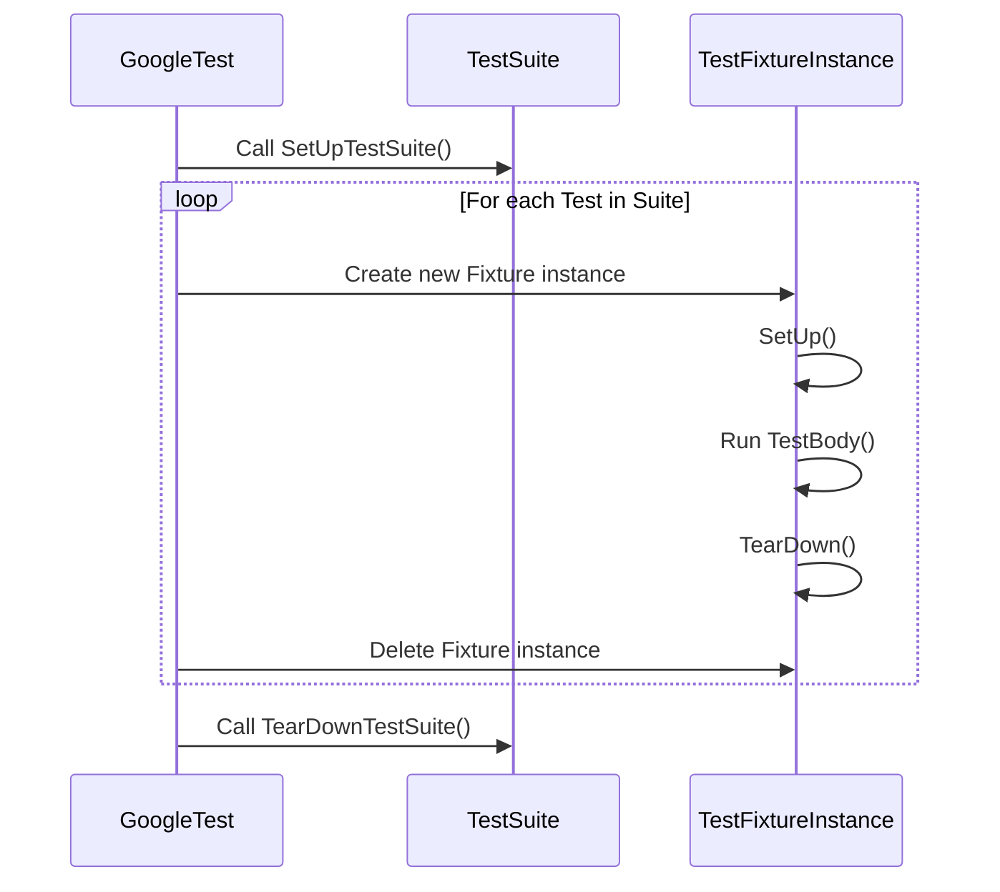
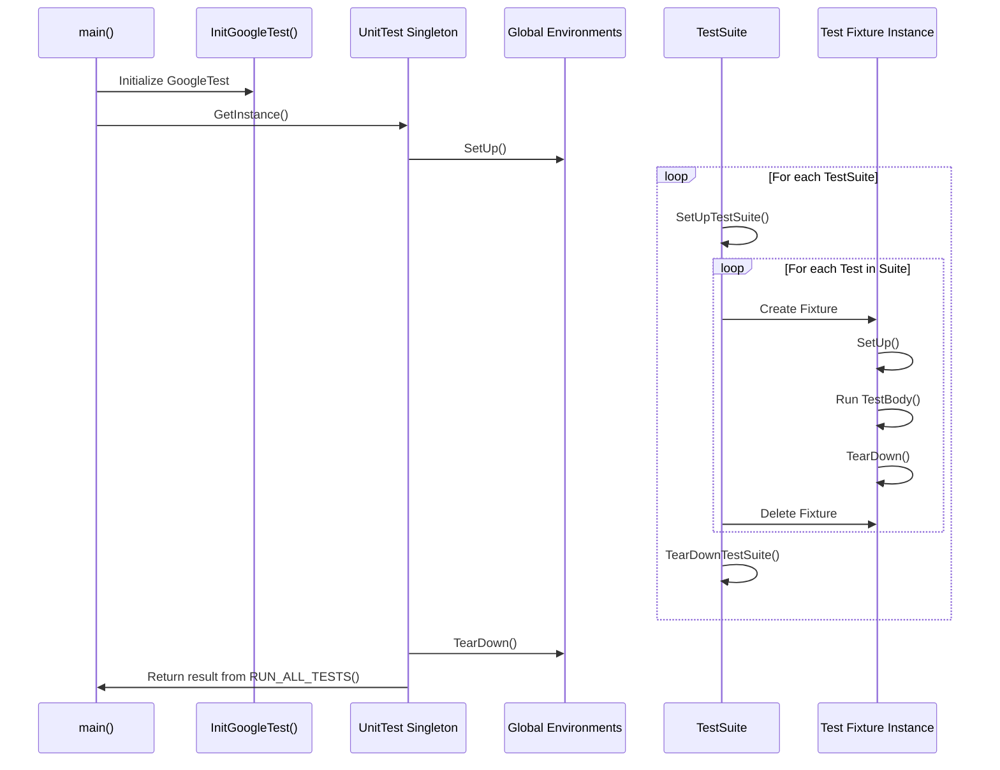

# Test Life Cycle & Execution Model

GoogleTest orchestrates the entire journey of your tests — from discovery and initialization, through execution and fixture management, to cleanup and result aggregation. This flow is inspired by the classic xUnit architecture and is designed to ensure tests run reliably and independently, providing accurate, repeatable results. Understanding this life cycle empowers you to write effective tests, leverage fixtures optimally, and troubleshoot with confidence.

---

## Overview of the Test Execution Flow

At a high level, the GoogleTest framework sequences your tests in a defined order that guarantees: 

- Proper initialization of global test environments
- Per-suite setup and teardown for grouping related tests
- Creation and destruction of fresh test fixtures for each individual test
- Collection and aggregation of test results

This lifecycle is repeated for each test suite and their contained tests, optionally with support for parameterized, typed, and value-parameterized tests.

### High-Level Steps:

1. **Test Discovery and Registration**
2. **Global Environment Setup**
3. **Test Suite Initialization**
4. **Per-Test Setup, Execution, and Teardown**
5. **Test Suite Cleanup**
6. **Global Environment Teardown**
7. **Final Result Reporting**

Each of these steps plays a crucial role, detailed next.

---

## 1. Test Discovery and Registration

GoogleTest automatically registers all tests and test suites at program startup, before main() is entered. This means:

- Every `TEST()`, `TEST_F()`, `TEST_P()`, `TYPED_TEST()`, and `TYPED_TEST_P()` macro usage contributes to a global test registry.
- Registration embeds metadata like test names, fixture types, source location, parameters, and factory methods.
- This enables seamless enumeration, filtering, and execution without manual test lists.

Example:

```cpp
TEST(FactorialTest, HandlesZeroInput) {
  EXPECT_EQ(Factorial(0), 1);
}

class QueueTest : public ::testing::Test {
  // Test fixture...
};

TEST_F(QueueTest, IsEmptyInitially) {
  EXPECT_TRUE(q.empty());
}
```

Behind the scenes, these translate into calls to internal registration functions that record the tests.

---

## 2. Global Environment Setup

Before any tests run, GoogleTest sets up registered global test environments.

- You can add global environments by subclassing `testing::Environment` and registering them with `AddGlobalTestEnvironment()`.
- Environment setup runs once and can initialize shared resources used across tests (e.g., DB connections, logging).

Example:

```cpp
class MyEnvironment : public testing::Environment {
 public:
  void SetUp() override {
    // Initialize shared resources
  }
  void TearDown() override {
    // Cleanup resources
  }
};

int main(int argc, char** argv) {
  testing::InitGoogleTest(&argc, argv);
  testing::AddGlobalTestEnvironment(new MyEnvironment);
  return RUN_ALL_TESTS();
}
```

---

## 3. Test Suite Initialization

A test suite is a logical grouping of tests, often sharing a common fixture.

- Before any tests in a test suite run, GoogleTest calls `SetUpTestSuite()` on the fixture class.
- This static method allows expensive shared setup (e.g., loading configuration, creating shared mock objects) that applies to all tests in the suite.

Similarly, after all tests complete, `TearDownTestSuite()` cleans up the shared resources.

Make sure to declare these methods as `static`. If they are not defined, GoogleTest treats them as no-op.

Example:

```cpp
class DatabaseTest : public testing::Test {
 public:
  static void SetUpTestSuite() {
    // Open a connection once for all tests
  }
  static void TearDownTestSuite() {
    // Close connection after all tests
  }
};
```

---

## 4. Per-Test Setup, Execution, and Teardown

For each individual test case:

1. GoogleTest creates a **new instance** of the test fixture.
   - This guarantees test isolation and prevents side effects between tests.

2. Calls the fixture's `SetUp()` method.
   - Prepare the individual test environment here, such as resetting states or initializing test data.

3. Runs the test method `TestBody()`.
   - This is where your `TEST_F` or `TEST_P` body's logic executes.

4. Calls the fixture's `TearDown()` method.
   - Clean up resources, such as closing files, resetting mocks.

5. Deletes the fixture instance.

This sequence is essential to ensure each test runs independently, which simplifies debugging and improves reliability.

Example:

```cpp
class QueueTest : public testing::Test {
 protected:
  void SetUp() override {
    queue_.Clear();
  }
  void TearDown() override {
    queue_.Clear();
  }
  Queue<int> queue_;
};

TEST_F(QueueTest, EnqueueAddsElement) {
  queue_.Enqueue(1);
  EXPECT_EQ(queue_.size(), 1);
}
```

---

## 5. Test Suite Cleanup

After all tests in a suite complete:

- GoogleTest calls the static `TearDownTestSuite()` method to release shared resources.
- Final statistics for the test suite (successes, failures, skips, elapsed time) are aggregated.

This step completes the lifecycle for that suite before moving on to the next.

---

## 6. Global Environment Teardown

Once all test suites and tests finish:

- GoogleTest calls `TearDown()` on all registered global `Environment` objects in reverse order of registration.
- This step cleans up shared dependencies and global states.

---

## 7. Final Result Reporting

- GoogleTest aggregates results from all tests.
- It produces a summary of tests passed, failed, skipped, disabled, and total elapsed times.
- Results are output to the console and optionally to XML or JSON depending on flags.

This gives you clear insight into the health and coverage of your tests.

---

## Handling Test Fixtures

### What Is a Test Fixture?

A fixture is a set of objects and states shared by the tests in a test suite. It encapsulates common setup and teardown logic.

- Declared by deriving a class from `testing::Test` (or related classes like `TestWithParam`).
- Use `SetUp()` and `TearDown()` for preparation and cleanup per test.
- Use `SetUpTestSuite()` and `TearDownTestSuite()` for setup and teardown shared across all tests in the suite.

### Test Fixture Life Cycle Flow



### Value-Parameterized and Typed Test Fixtures

GoogleTest also supports parameterized fixtures, allowing tests to run repeatedly with different parameters:

- `TestWithParam<T>`: Fixture base for **value-parameterized tests**
- `TYPED_TEST_SUITE` and related macros: For **typed tests** and **type-parameterized tests**

In these cases, GoogleTest manages instantiation and repetitive execution, but the fundamental life cycle remains the same for each individual test.

---

## Practical Tips and Best Practices

- **Always use fresh fixture instances per test** to avoid shared state bugs.
- Prefer `SetUpTestSuite`/`TearDownTestSuite` for expensive resources you want to reuse across many tests.
- Ensure `SetUp` and `TearDown` clean up all test state to keep tests independent.
- When using value-parameterized tests, instantiate them properly via `INSTANTIATE_TEST_SUITE_P` so the runtime test count matches expectations.
- Use global test `Environment` sparingly and only for truly global setup.
- Return the value of `RUN_ALL_TESTS()` from `main()` to correctly signal test success or failure.

---

## Troubleshooting Common Lifecycle Issues

<AccordionGroup title="Common Issues and Solutions">
<Accordion title="Test Fixture State Contamination">
If tests influence each other unexpectedly, verify that:
- Each test gets a new fixture instance.
- `SetUp()` properly resets the state.
- No static or global mutable state leaks between tests.
</Accordion>
<Accordion title="Tests Not Running or Being Skipped">
Check:
- Your test filter settings (e.g., `--gtest_filter=`).
- Whether tests are disabled with `DISABLED_` prefix.
- Whether you initialized GoogleTest by calling `InitGoogleTest()` before `RUN_ALL_TESTS()`.
</Accordion>
<Accordion title="Global Environment Setup Failures">
If `SetUp()` or `TearDown()` in environments fail, GoogleTest will report errors and may abort tests. Ensure these routines do not throw exceptions or handle failure gracefully.
</Accordion>
</AccordionGroup>

---

## Summary

Understanding the test life cycle in GoogleTest demystifies how your tests run under the hood and equips you to write reliable, maintainable tests that integrate smoothly with the framework's powerful features. Mastery of this flow also enables more effective debugging and advanced test architecture design.

For deeper mastery, review how parameterized and typed tests fit into this life cycle, and explore test registration and execution APIs.

---

## References

- [Test Registration and Execution](../../api-reference/core-testing-framework/test-registration-and-execution.md): Covers APIs for defining, registering, and running tests.
- [Test Fixtures and Reusable Setups](../../guides/advanced-usage/test-fixtures-best-practices.md): Best practices on using fixtures.
- [Parameterized and Typed Tests](../../guides/advanced-usage/parameterized-tests.md): Details parameterized and typed test workflow.
- [GoogleTest Primer](../../docs/primer.md): Introductory concepts including test life cycle basics.

---

## Visual Diagram of Test Life Cycle



---