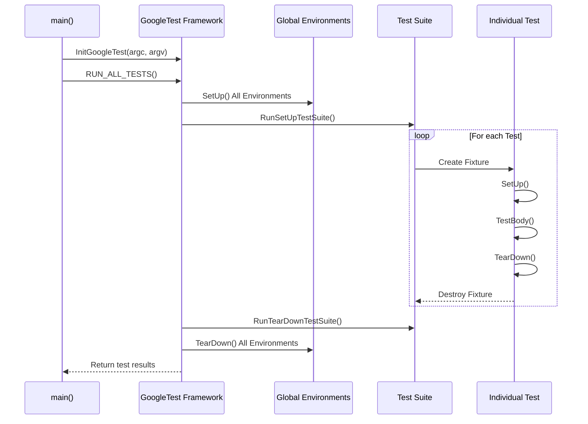

# xUnit Testing and the Test Lifecycle

GoogleTest is built around the xUnit architecture, a widely adopted model in unit testing frameworks. Understanding how GoogleTest implements this model provides crucial insight into how your tests are organized, executed, and reported. This page guides you through the core lifecycle of tests in GoogleTest, clarifying user-facing concepts and workflows that enable effective test development and execution.

---

## Understanding the xUnit Model in GoogleTest

At its core, the xUnit model revolves around the idea of structuring testing code into **tests, test fixtures, test suites**, and a **test program**. GoogleTest closely follows this framework to provide a familiar, consistent, and powerful testing experience.

- **Test**: A discrete unit of verification, typically a function that exercises some specific aspect of your code.
- **Test Fixture**: A class that sets up a common testing context shared by multiple tests. It allows sharing configuration, state, and helper functions.
- **Test Suite**: A collection of related tests, typically grouped by the same fixture or subject area.
- **Test Program**: The executable that runs your tests, orchestrating setup, execution, and teardown at multiple levels.

This structure promotes test **independence**, **organization**, and **maintainability**.

## Test Discovery and Registration

GoogleTest automatically discovers tests defined with macros like `TEST()` and `TEST_F()` through static registration mechanisms.

### How Tests Are Registered

- Each `TEST()` or `TEST_F()` macro registers a test case with the GoogleTest framework before `main()` runs.
- These registrations include metadata such as test suite name, test name, source file, and line number.

This ensures **all tests known at compile time are available** to be run without requiring manual enumeration.

## The Test Lifecycle: Setup, Execution, Teardown

GoogleTest manages the test lifecycle in a hierarchical manner:

### Global Environment Setup and Teardown

You can define global environments by subclassing `testing::Environment`. These are set up once before any tests run and torn down after all tests complete.

**Use cases:** Initialize shared resources like database connections or global configuration needed by all tests.

```cpp
class MyGlobalEnvironment : public testing::Environment {
 public:
  void SetUp() override {
    // Global setup logic
  }

  void TearDown() override {
    // Global cleanup logic
  }
};

int main(int argc, char** argv) {
  testing::InitGoogleTest(&argc, argv);
  testing::AddGlobalTestEnvironment(new MyGlobalEnvironment);
  return RUN_ALL_TESTS();
}
```

<Check>
Always register global environments before calling `RUN_ALL_TESTS()`.
</Check>

### Test Suite Initialization and Cleanup

GoogleTest supports per-test-suite setup and teardown via static methods in your test fixture:

- `static void SetUpTestSuite()` is called once **before the first test** in the suite runs.
- `static void TearDownTestSuite()` is called once **after the last test** in the suite runs.

This enables sharing expensive or persistent resources within the test suite.

### Individual Test Setup and Teardown

For each test,

- A fresh fixture object is constructed.
- The fixture's `SetUp()` method runs to prepare test state.
- The test body runs.
- Then `TearDown()` cleans up.
- The fixture object is destroyed.

This guarantees **test isolation** and prevents inter-test dependencies.

### Test Execution Flow Example

```cpp
class MyFixture : public testing::Test {
 protected:
  static void SetUpTestSuite() { /* Called once before suite */ }
  static void TearDownTestSuite() { /* Called once after suite */ }

  void SetUp() override { /* Called before each test */ }
  void TearDown() override { /* Called after each test */ }
};

TEST_F(MyFixture, Test1) {
  // Test code for Test1
}

TEST_F(MyFixture, Test2) {
  // Test code for Test2
}
```

Order:

1. `SetUpTestSuite()`
2. For `Test1`:
   - Construct fixture, `SetUp()`, test body, `TearDown()`, destroy fixture
3. For `Test2`:
   - Same as above for `Test2`
4. `TearDownTestSuite()`

## Handling Test Failures

GoogleTest distinguishes between **fatal** and **non-fatal** failures:

- **Fatal failures (e.g., from `ASSERT_*`)**: Abort the current function immediately. They prevent further statements inside the test.
- **Non-fatal failures (e.g., from `EXPECT_*`)**: Register a failure but continue execution.

GoogleTest reports all failures with detailed source information.

### Failure Propagation in Subroutines

Assertions in helper functions or subroutines only abort the function where they are executed, but not necessarily the entire test.

To handle this:

- Use macros like `ASSERT_NO_FATAL_FAILURE()` to ensure that a statement doesn’t generate fatal failures.
- Check `testing::Test::HasFatalFailure()` to detect if a fatal failure has happened and return early.

Example:

```cpp
void Helper() {
  ASSERT_EQ(1, Foo());  // Will abort Helper() if fails
}

TEST(MyTestSuite, TestName) {
  Helper();
  if (testing::Test::HasFatalFailure()) return;  // Stop test if Helper failed
  // Continue test...
}
```

<Tip>
Use `SCOPED_TRACE()` to add contextual trace messages for failures inside nested functions.
</Tip>

## Parameterized and Typed Tests

GoogleTest supports advanced test patterns including:

- **Value-Parameterized Tests (`TEST_P` and `INSTANTIATE_TEST_SUITE_P`)**: Run a single test logic against multiple input values.
- **Typed Tests (`TYPED_TEST_SUITE` and `TYPED_TEST`)**: Run the same test logic over a list of types.
- **Type-Parameterized Tests (`TYPED_TEST_SUITE_P` and `REGISTER_TYPED_TEST_SUITE_P`)**: Define generic tests to be instantiated with varying types later.

These fit naturally into the xUnit lifecycle, running each instantiation as a distinct test.

## Test Execution and Reporting

### `RUN_ALL_TESTS()`:

- Invokes all registered tests defined in the test program.
- Runs setup, test bodies, teardown in the defined order.
- Stops execution if the `--gtest_fail_fast` flag is set and a test fails.
- Returns 0 if all tests passed, or 1 otherwise.

### Event Listeners and Output

GoogleTest fires test lifecycle events such as `OnTestStart()`, `OnTestEnd()`, and `OnTestPartResult()`, which can be captured by custom listeners for specialized reporting or actions.

### Filtering and Sharding

Users can filter which tests run using the `--gtest_filter` flag and can shard tests to run distributed across multiple machines using `GTEST_TOTAL_SHARDS` and `GTEST_SHARD_INDEX` environment variables.

## Visualizing the Test Lifecycle



## Best Practices

- Define **test fixtures** to share setup between related tests.
- Use **ASSERT_** for checks that should stop test execution immediately.
- Use **EXPECT_** to gather multiple failures in a single test.
- Use **SetUpTestSuite()** and **TearDownTestSuite()** for expensive shared resources.
- Make sure to call **InitGoogleTest()** before **RUN_ALL_TESTS()**.
- Use **SCOPED_TRACE()** to add contextual information to assertion failures in nested calls.
- Keep tests independent and side-effect free.

## Troubleshooting Common Pitfalls

- Mixing **TEST()** and **TEST_F()** in the same test suite is illegal; GoogleTest will warn.
- Fatal failures only abort the current function, so subroutine failures may not terminate tests unless explicitly handled.
- Skipping test execution (`GTEST_SKIP()`) can be done in test or fixture setup.
- Ensure global environments are registered before running tests.

## Related Concepts and Further Reading

- [Test Declaration & Lifecycle](https://github.com/google/googletest/blob/main/api_reference/core_test_apis/test_declaration_lifecycle.md) for detailed API reference.
- [Assertions and Failure Modes](https://github.com/google/googletest/blob/main/concepts/core-architecture/assertions-and-failure-modes.md) to understand testing macros.
- [Parameterized Tests](https://github.com/google/googletest/blob/main/concepts/component-models/parameterized-tests.md) for advanced input variation patterns.
- [Event Listeners](https://github.com/google/googletest/blob/main/guides/core-testing-patterns/organizing-tests.md#event-listeners) for custom reporting.

---

By mastering the xUnit test lifecycle and how GoogleTest orchestrates it, you can write robust, maintainable, and scalable tests that fit seamlessly in your development workflows.

<Callout>
Remember: The core to effective use of GoogleTest is understanding that **each test runs independently** with a fresh fixture, enabling reproducible and isolated checks.
</Callout>
