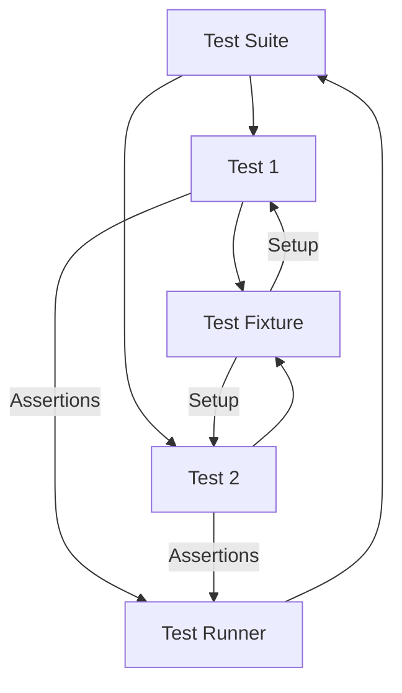

# xUnit Architecture Overview

## Understanding the Foundations of GoogleTest

GoogleTest is built upon the proven principles of the xUnit test framework architecture, a standard in software testing worldwide. This page unpacks the core concepts and structures of xUnit and illustrates how GoogleTest embraces and extends these concepts for C++ testing. If you are familiar with other xUnit frameworks like JUnit for Java or NUnit for .NET, this overview will help you quickly grasp the testing workflow in GoogleTest.

---

## Key Components of the xUnit Architecture

### 1. Test Cases and Test Suites

- **Test Case / Test Suite:** Collections of related tests that verify the behavior of a specific functionality or component. Although historical xUnit terminology uses *Test Case*, GoogleTest uses *Test Suite* to group tests logically reflecting the tested code's structure.
- Each *test suite* contains one or more *tests* performing evaluations against the expected behavior.

### 2. Tests

- The fundamental unit of testing is a single **test**, representing the verification of a particular behavior or condition.
- Tests run independently to ensure isolation and repeatability, avoiding dependencies on other tests.

### 3. Test Fixtures

- A **test fixture** is a reusable environment setup for multiple tests within a test suite.
- It enables sharing common objects, configuration, and subroutines, avoiding redundancy.
- Fixtures in GoogleTest are implemented by deriving a class from `testing::Test`, where setup and teardown are managed via `SetUp()` and `TearDown()` methods or constructors and destructors.

### 4. Test Runner

- The **test runner** component is responsible for automatically discovering, initializing, executing, and summarizing tests.
- GoogleTest’s runner orchestrates execution by creating fresh fixture instances per test to maintain test independence.
- It tracks assertion outcomes to determine test success or failure and generates detailed reports.

---

## The xUnit Testing Workflow in GoogleTest

1. **Test Definition:** You define tests using the `TEST()` macro for simple tests or `TEST_F()` for tests that use a fixture.

2. **Test Discovery:** GoogleTest automatically registers these tests with the framework. Unlike some frameworks requiring manual enumeration, GoogleTest discovers tests at runtime.

3. **Test Execution:** When the test program runs, the runner executes all registered tests:
   - For each test, a new fixture instance is created.
   - The fixture's setup occurs via `SetUp()`.
   - The test body runs, invoking assertions.
   - The fixture is torn down via `TearDown()`.

4. **Result Collection:** Assertion results and test executions are recorded.

5. **Reporting:** The runner outputs a summary of passed, failed, and skipped tests.

---

## Test Isolation and Repeatability

A fundamental tenet of xUnit architecture is that tests should be independent and repeatable:

- Each test runs in a clean fixture instance to prevent side effects from other tests.
- Failures in one test do not compromise others; GoogleTest continues executing other tests.
- This ensures that bugs are easier to pinpoint and fixes do not cause unintended regressions.

---

## Mapping xUnit Concepts into GoogleTest Terminology

| xUnit Term             | GoogleTest Term            | Description                                    |
|------------------------|---------------------------|------------------------------------------------|
| Test Case              | Test Suite                | Group of logically related tests                |
| Test                   | Test                      | Unit of verification of specific behavior      |
| Test Fixture           | Test Fixture (`testing::Test` subclass) | Setup/teardown context for sharing objects across tests |
| Test Runner            | GoogleTest Runner         | Executes test suites/tests and produces reports |

**Note:** GoogleTest has recently shifted from the term *Test Case* to *Test Suite* for clarity and alignment with broader testing terminology standards.

---

## Visualizing the Components and Flow

This diagram illustrates how the test runner manages test suites and their tests. Each test runs with its own fixture instance, ensuring isolation.

---

## Best Practices Implicit in xUnit Architecture

- **Modular Test Design:** Group related tests into suites and share setup through fixtures.
- **Independent Tests:** Avoid dependencies across tests. Each test should be free-standing.
- **Clear Assertion Intent:** Use clear, expressive assertions that provide informative failure messages.
- **Reuse Test Setup Wisely:** Use fixtures to minimize redundant code but avoid shared mutable state that leads to flaky tests.
- **Automated Test Discovery:** Benefit from automatic test registration to streamline testing for large projects.

---

## Why GoogleTest Embraces xUnit

GoogleTest’s design mirrors the xUnit framework architecture because:
- Community familiarity makes onboarding easier.
- Its patterns encourage healthy, maintainable test suites.
- It supports extensibility such as parameterized and typed tests built on this foundation.
- The architecture paths are well-tested and reliable for diverse testing needs.

---

## Summary

This overview has covered:
- The core xUnit architecture components.
- How GoogleTest fits into and extends xUnit principles.
- The test lifecycle including independent test execution with fixtures.
- Key terminology distinctions and mapping.
- A visual and narrative of the test running process.

This foundational understanding is critical for effectively writing, organizing, and running tests with GoogleTest, ensuring your C++ code is robust and reliable.

---

## Next Steps

- Explore the detailed [GoogleTest Primer](primer.md) to start writing simple tests.
- Learn about the [Test Discovery & Lifecycle](test-discovery-lifecycle.md) for deeper understanding of execution.
- Dive into the [Assertion Mechanisms](assertion-mechanisms.md) to master test validations.
- Check out sample tests in [Googletest Samples](samples.md) for practical examples.

---

## Additional Resources

- [GoogleTest User's Guide](index.md)
- [Assertions Reference](reference/assertions.md)
- [Advanced GoogleTest Topics](advanced.md)
- [Testing Reference](reference/testing.md)

