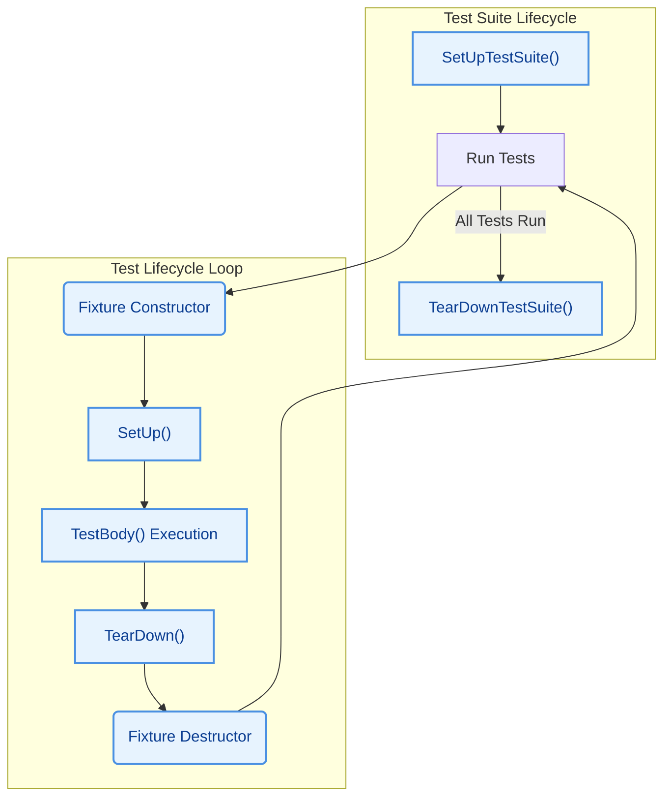

# xUnit Test Architecture

GoogleTest implements the widely adopted xUnit testing architecture, providing a consistent, scalable, and extensible framework for organizing and running tests in C++ projects. This model structures tests into suites and cases, supports reusable fixtures, and manages the lifecycle of test execution from setup through teardown and reporting.

---

## Core Structure of Tests

At its heart, GoogleTest uses three main building blocks:

- **Test Suites (formerly Test Cases):** Logical groups of related tests. They represent a set of tests that share a common context or purpose.
- **Tests:** Individual test functions that execute specific verification logic.
- **Test Fixtures:** Classes that provide a shared environment for multiple tests within the same suite, including setup and teardown routines and shared data.

This architecture promotes test isolation, reusability of setup code, and easier maintenance.

### Test Suite and Test Hierarchy

Each test belongs to exactly one test suite. GoogleTest expects developers to organize tests into suites that mirror the structure or design of the code under test. This organization helps in understanding test reports and debugging failures.

Tests are named individually within a suite, and their fully qualified name is formed by `<TestSuiteName>.<TestName>`.

Example:
```cpp
TEST(MathUtilsTest, FactorialHandlesZeroInput) {
  EXPECT_EQ(Factorial(0), 1);
}

TEST(MathUtilsTest, FactorialHandlesPositiveInput) {
  EXPECT_EQ(Factorial(5), 120);
}
```

Here, `MathUtilsTest` is the test suite containing two tests.

### Test Fixtures: Sharing Setup and Teardown

When several tests need common data or setup, you define a test fixture by subclassing `testing::Test`. This fixture class:

- Contains member variables and subroutines shared across multiple tests.
- Provides `SetUp()` and `TearDown()` methods invoked before and after each test respectively.
- Supports static methods `SetUpTestSuite()` and `TearDownTestSuite()` for shared one-time setup and cleanup.

Example:
```cpp
class DatabaseTest : public testing::Test {
 protected:
  void SetUp() override {
    db.Connect();
  }

  void TearDown() override {
    db.Disconnect();
  }

  static void SetUpTestSuite() {
    InitializeConnectionPool();
  }

  static void TearDownTestSuite() {
    CleanupConnectionPool();
  }

  Database db;
};

TEST_F(DatabaseTest, InsertWorks) {
  EXPECT_TRUE(db.Insert("record1"));
}

TEST_F(DatabaseTest, DeleteWorks) {
  EXPECT_TRUE(db.Delete("record1"));
}
```

Each test (`InsertWorks`, `DeleteWorks`) runs in a fresh `DatabaseTest` instance with proper setup and teardown.

## Test Lifecycle Overview

GoogleTest manages a clear lifecycle for each test, ensuring test isolation and consistent results.

1. **Test Suite Setup**: Once before any tests in the suite run, `SetUpTestSuite()` is called for costly shared initialization.
2. **Test Fixture Construction**: Before each test, a new instance of the fixture class is created.
3. **Per-Test Setup**: `SetUp()` runs to prepare the test-specific environment.
4. **Test Execution**: The actual test body code runs, verifying behavior with assertions.
5. **Per-Test Teardown**: `TearDown()` cleans up after the test.
6. **Fixture Destruction**: The test fixture instance is deleted.
7. **Test Suite Teardown**: After all tests in the suite finish, `TearDownTestSuite()` runs to perform final cleanup.

This lifecycle ensures each test runs independently, preventing side effects and enabling reliable, repeatable testing.

## Extending the Model: Parameterized and Typed Tests

To promote reusability and scalability, GoogleTest supports variations on the xUnit architecture.

- **Value-Parameterized Tests (`TEST_P`)** allow writing one test template that runs multiple times with different input values.
- **Typed Tests (`TYPED_TEST`)** run the same tests across different types, useful for template-based class testing.
- **Type-Parameterized Tests (`TYPED_TEST_P`)** provide an abstract test pattern reusable across translation units and instantiations.

These advanced patterns are built on the xUnit model, reusing the fixture lifecycle but expanding test coverage efficiently.

## Execution Flow

During execution, GoogleTest:

- Discovers all test suites and tests registered through macros or API.
- Optionally filters tests to run based on user input.
- Sequentially runs each test following the lifecycle.
- Captures test results including successes, failures, skips, and timing.
- Aggregates results for overall reporting.

Failures within a test are tracked as fatal or nonfatal, influencing whether the test stops or continues execution. Fatal failures abort the current test, nonfatal failures allow continued checks.

## Reporting and Results

Each test produces a `TestResult` object with detailed information:

- Status: passed, failed, skipped
- Execution time
- Failure messages
- Properties recorded during the test

Test suites aggregate results of contained tests, and the top-level `UnitTest` object aggregates overall run results.

This hierarchical reporting aligns with the xUnit tradition, facilitating integration with CI and test dashboards.

---

## Visual Diagram: xUnit Test Lifecycle in GoogleTest



---

## Best Practices

- **Use Clear Test Suites**: Group tests logically to reflect code structure.
- **Leverage Fixtures for Shared Setup**: Avoid code duplication and inconsistencies.
- **Isolate Tests**: Tests run on fresh fixture instances to avoid unintended dependencies.
- **Prefer `EXPECT_` over `ASSERT_`**: To uncover multiple failures in one run, unless test continuation doesn't make sense.
- **Use Typed and Parameterized Tests for Scaling**: Cover many inputs and types without repeating code.
- **Name Tests Clearly**: Follow naming conventions for suite and test names for better maintainability and filtering.

---

## Troubleshooting

- Ensure `SetUp()` and `TearDown()` methods are correctly spelled and marked `override` to guarantee they run.
- Avoid shared mutable static state in fixtures that might cause test interference.
- For parameterized and typed tests, confirm registration macros are used correctly to prevent silent test omissions or runtime errors.
- Check the test order if tests depend inadvertently on each other; GoogleTest runs tests in declaration order unless shuffled.

---

## Additional Resources

To deepen your understanding and effectively apply the xUnit model in GoogleTest, consult these pages:

- [Core Concepts & Terminology](/overview/intro-core-concepts/core-concepts-terminology)
- [Feature Overview](/overview/architecture-features-integration/feature-overview)
- [Test Discovery and Execution Lifecycle](/concepts/core-architecture/test-discovery-lifecycle)
- [Typed and Parameterized Tests Guide](/concepts/advanced-testing-patterns/parameterized-tests)
- [GoogleTest Primer](/guides/getting-started/gtest-primer)

Leveraging this foundational architecture will enable you to build robust, maintainable, and scalable test suites that truly improve your code quality.
