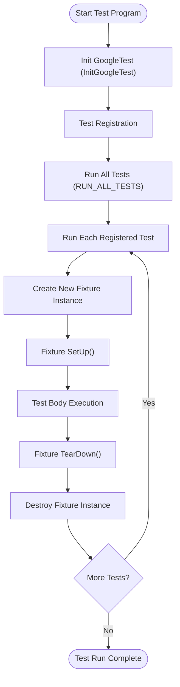

# xUnit Architecture and Test Discovery

GoogleTest is built upon the widely recognized xUnit architecture, providing a robust framework for organizing and executing tests in a structured, maintainable manner. Understanding this architecture will illuminate how GoogleTest arranges test cases, fixtures, and manages automatic test discovery, enabling you to build scalable and well-structured test suites.

---

## Overview of xUnit Architecture

The xUnit architecture is a family of testing frameworks that share a common design philosophy focused on modular, repeatable, and isolated tests. GoogleTest implements these principles with C++ specifics in mind, offering a familiar and powerful environment if you've used other xUnit-based tools like JUnit or NUnit.

### Core Components

- **Tests:** Individual test functions verifying single aspects of code behavior.

- **Test Suites (formerly Test Cases):** Logical groups of tests that often share setup and teardown code via fixtures.

- **Test Fixtures:** Classes providing common context for multiple related tests, encapsulating shared setup and teardown to avoid duplication.

This modular structure promotes clarity, maintainability, and isolation of test logic.

---

## Organizing Test Cases and Fixtures

### Tests and Test Suites

Each test is defined using macros such as `TEST()` or `TEST_F()`. A test suite contains multiple tests sharing the same suite name. Using `TEST_F()`, you associate tests with a test fixture class, allowing all tests in the suite to share the same setup and teardown sequences.

#### Example: Basic Test Suite with Fixture

```cpp
class QueueTest : public testing::Test {
 protected:
  Queue<int> q;

  void SetUp() override {
    // Common setup code for all tests
  }

  void TearDown() override {
    // Cleanup code
  }
};

TEST_F(QueueTest, IsEmptyInitially) {
  EXPECT_EQ(q.size(), 0);
}

TEST_F(QueueTest, EnqueueIncreasesSize) {
  q.Enqueue(1);
  EXPECT_EQ(q.size(), 1);
}
```

### Fixtures Simplify Reusable Setup

Fixtures not only reduce duplicated code but also promote cleaner, easy-to-read tests by centralizing commonly used objects and data. GoogleTest creates a new fixture instance per test, ensuring test independence.

---

## Automatic Test Discovery

One of GoogleTest's hallmark features is **automatic test discovery**. There is no need to manually register tests; the framework automatically discovers and runs all tests defined with the `TEST` macros.

### How It Works

- When you compile your test program, GoogleTest builds an internal registry of all declared tests.
- Upon calling `RUN_ALL_TESTS()`, the framework enumerates this registry and executes each test sequentially.
- This implicit registration promotes ease of use and simplifies test maintenance—just add new `TEST()` or `TEST_F()` cases, and they become part of the test run immediately.

### Support for Parameterized and Typed Tests

GoogleTest extends basic test discovery to parameterized (`TEST_P`) and typed tests (`TYPED_TEST`), enabling expansive, data-driven testing without manual enumeration.

---

## Advantages of the xUnit Model in GoogleTest

### Structured and Scalable Tests

By organizing tests into suites with shared context via fixtures, GoogleTest encourages clean test design that scales from small units to large projects.

### Isolation and Repeatability

Creating fresh fixture instances per test ensures tests do not share mutable state, making tests independent and reliable.

### Integration with Mocking and Matchers

The xUnit backbone supports GoogleMock seamlessly, letting you use fixtures and expectations together for expressive and interaction-based testing.

### Consistency Across Platforms

GoogleTest's architecture and discovery mechanism are platform-neutral, supporting Linux, Windows, macOS, and embedded systems uniformly.

---

## Practical User Flow: From Writing to Running Tests

1. Define tests using `TEST()` or `TEST_F()` macros; optionally create fixtures to share setup.
2. Compile your test binary, which registers tests automatically.
3. Run the test executable; GoogleTest auto-discovers and runs all tests.
4. Observe detailed test results, including passes, failures, and skipped tests.

---

## Common Pitfalls and Best Practices

- **Use fixtures for shared setup:** Avoid repeating state setup in multiple tests.
- **Test independence:** Each test runs in isolation; don't rely on shared static data unless controlled.
- **Avoid underscores in test names:** GoogleTest discourages underscores in tests for naming consistency.
- **Initialize GoogleTest before running tests:** Always call `testing::InitGoogleTest()` before invoking `RUN_ALL_TESTS()`.

---

## Summary Diagram of Test Discovery Flow (Mermaid Diagram)



This diagram captures the test discovery and execution cycle ensuring isolation and consistency.

---

## Troubleshooting Test Discovery

- **Tests not running?** Confirm `InitGoogleTest` is called with correct arguments.
- **Test name conflicts?** Avoid duplicate test suite and test names.
- **Fixtures not set up?** Ensure `SetUp()` and `TearDown()` override correctly and use `override` specifier.

Consult the [GoogleTest Primer](../guides/getting-started/primer.md) for foundational concepts and setup.

---

## Related Documentation

- [GoogleTest Primer](../guides/getting-started/primer.md) for foundational concepts.
- [Mocking Basics](../guides/core-testing-workflows/mocking-basics.md) to integrate GoogleMock with tests.
- [Writing and Running Your First Test](../getting-started/initial-setup-usage/writing-your-first-test.md).
- [Test Definition and Execution Reference](../api-reference/core-testing-api/test-definition-execution.md).

For code examples and practical usage, see the [gMock for Dummies](docs/gmock_for_dummies.md) and [Mocking Reference](docs/reference/mocking.md).

---