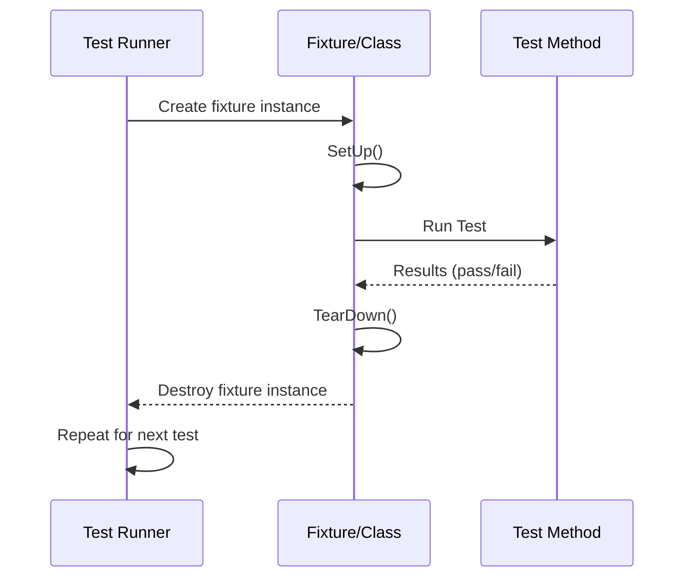

# xUnit Architecture and Test Lifecycle

GoogleTest adapts the well-known xUnit test framework architecture to C++ testing, providing a structured and reliable way to write, organize, and run unit tests. This guide explores how test cases are defined and orchestrated in GoogleTest, focusing on the lifecycle of tests, the roles of setup and teardown, test discovery mechanisms, and how test ordering is managed. You'll understand how GoogleTest ensures each test is independent, repeatable, and robust for large-scale C++ projects.

---

## Understanding the xUnit Model in GoogleTest

GoogleTest adopts the **xUnit** testing architecture, which organizes tests into hierarchical units to provide clarity, maintainability, and scalability.

- **Tests:** The atomic executable verification units.
- **Test Suites:** Collections of related tests grouped by functionality or purpose.
- **Test Fixture Classes:** Classes that allow multiple tests to share the same setup and teardown environment.

This model promotes encapsulation and clear test boundaries, empowering developers to express a variety of test scenarios cleanly.

### Test Definition Patterns

- **Simple Tests** use the `TEST()` macro:

  ```cpp
  TEST(TestSuiteName, TestName) {
    // test logic and assertions
  }
  ```

  Each test defined this way is independent and runs in isolation.

- **Tests with Fixtures** use the `TEST_F()` macro, enabling shared setup:

  ```cpp
  class FooTest : public testing::Test {
   protected:
    void SetUp() override {
      // shared setup logic
    }

    void TearDown() override {
      // shared cleanup logic
    }

    // shared test data and helpers
    int shared_value_;
  };

  TEST_F(FooTest, TestExample) {
    EXPECT_EQ(shared_value_, 42);
  }
  ```

  GoogleTest will create fresh fixture objects for each test to ensure isolation.

---

## Test Lifecycle Explained

### Initialization

1. **Test Registration:** At program startup, all tests defined via `TEST()` or `TEST_F()` macros are automatically registered.
2. **Test Runner Setup:** GoogleTest initializes its internal structures, such as the test registry and filtering criteria.

### Test Execution Flow

For each test:

1. **Construction:** GoogleTest creates a fresh instance of the test fixture class (or a dummy object for `TEST()`).
2. **Setup:** `SetUp()` is called to prepare the environment.
3. **Test Body:** The test function runs, performing assertions and test logic.
4. **TearDown:** The fixture's `TearDown()` method cleans resources.
5. **Destruction:** The fixture object is deleted.

This ensures **complete isolation** between tests, eliminating cross-test state leakage.

### Outcomes and Reporting

- A test passes if all assertions succeed and no fatal failures occur.
- Tests can have multiple nonfatal failures (`EXPECT_*`) without aborting immediately.
- On failure, GoogleTest provides detailed diagnostic messages including file, line, and failure context.

---

## Test Discovery and Registration

GoogleTest automatically discovers and registers tests at compile time by virtue of the macros `TEST()` and `TEST_F()`. This means:

- No manual listing of tests is needed.
- Tests in different source files are seamlessly aggregated at runtime.
- Registered tests are accessible for filtering and selective execution.

### Filtering Tests

Users can run all tests or a subset defined by name patterns using command-line flags:

```shell
--gtest_filter=TestSuiteName.TestName
```

This facilitates targeted test runs.

---

## Setup and Teardown in Detail

### Purpose

- **`SetUp()`** prepares the environment common to tests within the fixture.
- **`TearDown()`** cleans up resources to prevent side effects.

These are called before and after each test method within the fixture, respectively.

### Best Practices

- Prefer `SetUp()`/`TearDown()` over constructors and destructors for returns/throwing exceptions clarity.
- Keep setup lightweight to maintain fast test runs.
- Use these hooks for resource management (memory, files, connections).

### Example

```cpp
class DatabaseTest : public testing::Test {
 protected:
  void SetUp() override {
    db.Connect();
    db.Clear();
  }

  void TearDown() override {
    db.Disconnect();
  }

  Database db;
};
```

---

## Test Ordering and Isolation

GoogleTest exercises tests in an **unspecified order by default** to encourage independence.

- Tests must not depend on execution order.
- Tests cannot depend on side effects of other tests.

Users can manually enforce order if needed through custom runners or ordering strategies, but this is discouraged.

---

## Test Suite and Fixture Relationships

A test suite groups tests that share common code or purpose.

- Using fixtures enables sharing setup and cleanup code, as well as test utilities.
- Each test in a fixture runs independently on a new fixture instance.

This balance provides modularity without compromising test isolation.

---

## Practical Tips for Using the xUnit Model in GoogleTest

- Always start from `TEST()` macros for simple cases.
- Introduce `TEST_F()` fixtures when sharing test environment or data structures.
- Keep fixtures focused; don't share too many responsibilities.
- Use `SetUp()` and `TearDown()` for repeated environment preparation.
- Verify that tests are truly isolated by running them individually and in different orders.
- Use test filtering to isolate failing tests quickly.

---

## Troubleshooting Common Lifecycle Issues

### Issue: Tests Affect Each Other (Lack Independence)

- Ensure no shared mutable static/global state.
- Avoid static variables within fixtures or tests.
- Use fresh fixtures per test.

### Issue: Setup Fails or Crashes

- Confirm `SetUp()` doesn't throw exceptions or cause resource leaks.
- Use assertions inside `SetUp()` to validate environment readiness.

### Issue: Teardown Not Running

- Ensure `TearDown()` does not trigger fatal failures that abort the test.
- Validate resources cleaned properly.

---

## Summary Diagram of the xUnit Testing Flow



---

## See Also

- [GoogleTest Primer](https://github.com/google/googletest/tree/main/docs/primer.md) for starting with simple tests
- [Writing Your First Test](https://github.com/google/googletest/tree/main/guides/getting-started/writing-your-first-test.mdx)
- [Core Concepts & Terminology](https://github.com/google/googletest/tree/main/overview/essentials-and-concepts/core-concepts-and-terminology.mdx) to grasp important testing vocabulary
- [Test Discovery and Execution](https://github.com/google/googletest/tree/main/guides/essential-workflows/test-discovery-execution.mdx) for how tests are found and run
- [Basic Mocking with GoogleMock](https://github.com/google/googletest/tree/main/guides/getting-started/basic-mocking.mdx) to integrate mocks into your test flow

---

This guide focuses specifically on the xUnit architecture and lifecycle support within GoogleTest, helping you write reliable, isolated, and maintainable unit tests effectively.
