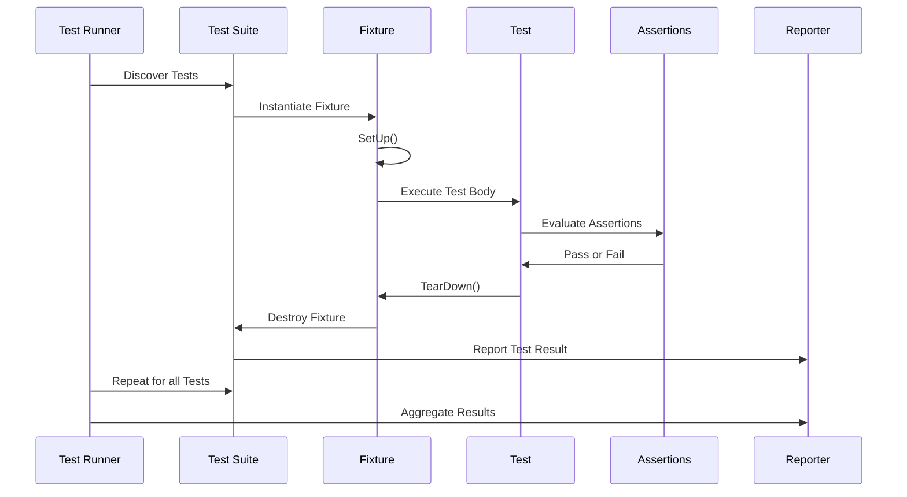

# xUnit Foundations and Test Dataflow

GoogleTest is built on the widely adopted xUnit architecture, designed to facilitate robust, maintainable testing for C++ projects. Understanding the foundational concepts behind xUnit and how test data flows through the framework will help you write effective tests and interpret their outcomes with clarity.

---

## 1. The Structure of Test Code

At the core of GoogleTest's xUnit implementation are several building blocks users engage with:

- **Test Cases (Test Suites)**: Logical groupings of related tests that share context.
- **Tests**: Individual functions that verify specific behaviors or properties.
- **Fixtures**: Classes that provide shared setup and teardown functionality across tests within the same suite.
- **Assertions**: Statements within tests that verify conditions and determine test pass/failure.

Together, these enable a structured workflow where tests are easily organized, maintained, and reasoned about.

### 1.1 Test Cases and Test Suites

GoogleTest historically used the term "Test Case" for groups of tests, but now prefers "Test Suite" to align with broader testing terminology. Regardless of terminology, a test suite represents a collection of related tests:

```cpp
TEST(TestSuiteName, TestName) {
  ... test body ...
}
```

- `TestSuiteName` groups logically related tests.
- `TestName` identifies a single test.

### 1.2 Test Fixtures

When multiple tests share common setup or resources, a *test fixture* provides this, encapsulated in a class that inherits from `testing::Test`:

```cpp
class MyFixture : public testing::Test {
 protected:
  void SetUp() override {
    // Setup code here
  }

  void TearDown() override {
    // Cleanup code here
  }

  // Shared resources
  SharedType shared_resource;
};

TEST_F(MyFixture, TestName) {
  // Test body using shared_resource
}
```

Every test using a fixture creates a fresh instance, ensuring test isolation and repeatability.

## 2. Lifecycle of a Test Run

Each test undergoes a lifecycle managed by GoogleTest involving discovery, execution, verification, and reporting.

### 2.1 Automatic Test Discovery

GoogleTest macros automatically register tests upon compilation, so you never need to manually list tests to run. When executing tests, GoogleTest locates all registered tests.

### 2.2 Initialization

The entry point typically calls `::testing::InitGoogleTest()` to process command-line flags and initialize internal structures, such as filtering criteria and output configuration.

### 2.3 Execution Flow

For each test registered:

1. Instantiate the test fixture (or instantiate the test function if no fixture).
2. Call the fixture's `SetUp()` method if defined.
3. Run the test body.
4. Call the fixture's `TearDown()` method.
5. Destroy the fixture instance.

If any assertion fails fatally, the current test function aborts immediately, moving to the next test.

### 2.4 Verification

For mocks or expectations, GoogleTest automatically verifies that all expectations were met upon fixture destruction, generating failures if unmet.

### 2.5 Reporting

Test results including success, failure, and skipped tests are logged to the console or XML/JSON reports.

## 3. Test Data and Assertions Flow

Assertions are conditions checked inside test bodies to validate the behavior of the code under test. GoogleTest supports multiple assertion types, each producing detailed diagnostic output upon failure.

### 3.1 Assertions

Common assertion macros:

- `EXPECT_*`: Non-fatal failures; test continues after failure.
- `ASSERT_*`: Fatal failures; test halts immediately upon failure.

Examples:

```cpp
EXPECT_EQ(actual, expected) << "Failure message";
ASSERT_TRUE(condition) << "Must be true";
```

Use `ASSERT_*` when subsequent code depends on the assertion being true, to avoid undefined behavior.

### 3.2 Understanding Assertion Outcomes

- **Success** means the condition held.
- **Non-fatal Failure** logs the failure but continues.
- **Fatal Failure** logs the failure and skips remaining test code.

GoogleTest prints exact source locations and messages, making debugging straightforward.

### 3.3 Flow of Test Data

Each assertion receives data from your test code and evaluates it. Diagnostic messages include:

- Expected vs actual values
- The expression tested
- Custom user-provided messages

Failures are aggregated at the test level to determine the test outcome.

---

## 4. Advanced Concepts

GoogleTest also supports advanced features that still align with the xUnit data flow:

- **Parameterized Tests**: Run the same test logic over multiple inputs.
- **Typed Tests**: Repeat tests for different types.
- **Death Tests**: Verify the program ends as expected in error conditions.
- **Test Fixtures with Shared Resources**: Efficiently share expensive resources using `SetUpTestSuite` / `TearDownTestSuite`.

Each builds upon the core lifecycle, seamlessly integrating test data and assertions.

## 5. Putting It All Together: A Typical User Workflow

1. Write individual test functions using `TEST()` or `TEST_F()`.
2. Include assertions in tests to verify conditions.
3. Compile and run tests via `RUN_ALL_TESTS()`.
4. Analyze output: passed tests show success, failed tests show detailed diagnostics.
5. Use filtering flags to select subsets of tests.
6. Utilize fixtures to manage shared test data.

## 6. Visualizing the Test Execution Flow



## 7. Troubleshooting Common Pitfalls

- Forgetting to use `TEST_F()` when tests require fixtures leads to compile errors.
- Using `ASSERT_*` macros without considering their immediate-return behavior may skip necessary cleanup code.
- Overly complex tests with many `EXPECT_CALL`s (gMock) can over-specify behavior; prefer precise, minimal expectations.
- Not initializing GoogleTest properly (`InitGoogleTest`) may cause tests not to run or flags to be ignored.

## 8. Summary

GoogleTest leverages the xUnit architecture to provide a clean, organized framework for defining and running tests. The lifecycle from test discovery through execution to reporting is seamlessly integrated with a comprehensive assertion system that communicates test outcomes clearly. Test data flows from user code into GoogleTest assertions and back as results, promoting reliable and maintainable test suites.

---

## Related Documentation and Further Learning

- [GoogleTest Primer](../docs/primer.md) — Introduction to testing basics and assertions.
- [Test Discovery & Execution](../api-reference/gtest-core-api/test-discovery-execution.md) — Detailed API operations and filtering.
- [Assertions Reference](../api-reference/gtest-core-api/core-assertions-api.md) — Comprehensive list and details of assertions.
- [gMock for Dummies](https://google.github.io/googletest/gmock_for_dummies.html) — Intro to mocking concepts for C++.
- [Mocking Reference](../docs/reference/mocking.md) — Detailed syntax and semantics for mocks.


---

## Practical Tips

- Always group related tests into suites for clarity and maintainability.
- Use test fixtures to manage shared state and setup/teardown logic.
- Use `ASSERT_*` carefully where test continuation is unsafe if an assertion fails.
- Leverage parameterized tests to reduce redundant code.
- Call `RUN_ALL_TESTS()` once in your main to trigger full test execution.

---