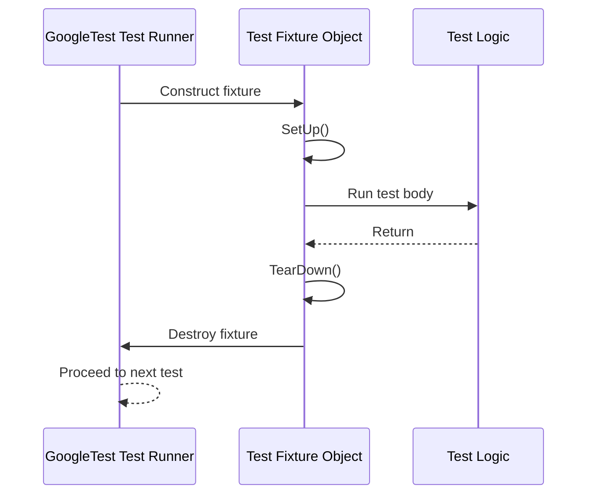

# xUnit Foundations and Test Lifecycle

GoogleTest builds on the well-established xUnit architecture to provide a clean, consistent framework for C++ testing. This page elucidates the foundational concepts of the xUnit design as embraced by GoogleTest and describes the lifecycle of a test — from setup through execution to teardown. Understanding these core concepts empowers you to write structured, maintainable tests and scale them across large codebases reliably.

---

## The xUnit Architecture in GoogleTest

The xUnit architecture organizes tests as isolated units validated by assertions. GoogleTest inherits this architecture, ensuring tests are independent, well-structured, and repeatable. The framework implements key xUnit principles by grouping tests for organization, supporting fixtures to prepare shared environments, and managing execution lifecycle steps automatically.

### Test Suites and Test Cases

- **Test Suites:** Collections of related tests grouped logically, often mapping to a class or functionality under test.
- **Tests (Test Cases):** Individual units of testing, implemented as functions or methods, that execute specific code paths and assertions.

This grouping promotes clarity and maintainability, mirroring the organization of the actual code.

### Test Fixtures — The Backbone of Setup and Teardown

Central to test lifecycle management in xUnit is the concept of *fixtures*. In GoogleTest, test fixtures are classes derived from `testing::Test` that encapsulate shared setup and cleanup code for a group of tests.

A test fixture allows you to:

- Initialize common objects or data needed by multiple tests.
- Centralize resource allocation and release logic to prevent duplication.

Example of a test fixture:

```cpp
class MyFeatureTest : public ::testing::Test {
 protected:
  void SetUp() override {
    // Preparation for each test
  }

  void TearDown() override {
    // Cleanup after each test
  }

  // Shared members usable by all tests in this suite
  MyFeature feature;
};

TEST_F(MyFeatureTest, DoesExpectedWork) {
  EXPECT_TRUE(feature.DoSomething());
}
```

**Key points:** GoogleTest creates a fresh instance of the fixture for every test, ensuring test isolation and independence.

### Lifecycle of a Single Test

Understanding the phases a test goes through in xUnit helps you design your tests properly.

1. **Fixture Construction:** GoogleTest constructs the fixture object.
2. **SetUp Execution:** The `SetUp()` method prepares the test environment.
3. **Test Body Execution:** The actual test code runs (`TEST_F` or `TEST`).
4. **TearDown Execution:** Any cleanup logic runs in `TearDown()`.
5. **Fixture Destruction:** The fixture object is destroyed.

This cycle ensures each test begins with a clean slate and any side effects do not leak.

### Parameterized and Typed Tests

Scalability for broad test coverage is supported through parameterized and typed tests:

- **Parameterized Tests (`TEST_P`):** Run the same test logic with varying input data sets.
- **Typed Tests:** Test generic or template code by running a test suite over multiple types.

This fosters reusability and reduces boilerplate when testing multiple cases with a single logical test.

Example of a parameterized test:

```cpp
class MyParamTest : public ::testing::TestWithParam<int> {};

TEST_P(MyParamTest, DoesSomething) {
  int param = GetParam();
  EXPECT_GT(param, 0);
}

INSTANTIATE_TEST_SUITE_P(PositiveNumbers, MyParamTest,
                         ::testing::Values(1, 2, 3));
```

### Assertions Within the Test

Tests contain *assertions* that verify expected outcomes. Assertions in GoogleTest come in two flavors:

- `ASSERT_*`: Fatal failures that abort the current test immediately when they fail.
- `EXPECT_*`: Non-fatal failures that report errors but allow the test to continue.

Mix both wisely to balance robustness and comprehensiveness.

---

## Test Discovery and Execution Flow

GoogleTest automates the collection, registration, and execution of tests, allowing you to focus on defining the test logic.

Steps in the workflow:

1. **Test Registration:** Macros like `TEST()`, `TEST_F()`, and `TEST_P()` register tests with the framework at program startup.
2. **Initialization:** Before tests run, GoogleTest performs global setup including flag processing.
3. **Test Execution:** Sequential or filtered execution of registered tests, managing fixtures and lifecycle.
4. **Result Collection:** Outcomes, logs, and diagnostics are reported and collected.

This automated lifecycle helps keep tests reliable, independent, and fast.

---

## Benefits of xUnit Principles in Your Testing Practice

- **Consistency:** Tests share a uniform structure simplifying understanding and maintenance.
- **Isolation:** By recreating fixtures for each test, side effects are eliminated, reducing flaky tests.
- **Scalability:** Parameterization and typed tests extend coverage efficiently.
- **Ease of Debugging:** Clear lifecycle stages and rich assertion diagnostics make finding issues straightforward.

---

## Practical Tips for Working with Test Fixtures and Lifecycle

- Use the fixture constructor/destructor only for lightweight setup/teardown. Use `SetUp()`/`TearDown()` for complex initialization and cleanup that could fail.
- Always check return codes or validity in setup before proceeding with test logic.
- Avoid sharing state between tests outside fixtures as GoogleTest creates fresh fixture instances per test.
- Prefer `EXPECT_*` assertions when you want multiple conditions verified in a test; use `ASSERT_*` when further test execution depends on the condition.
- When using parameterized tests, validate your input ranges carefully to prevent false negatives.

---

## Troubleshooting Common Lifecycle Issues

- **Resource Leak Errors:** Ensure your fixture's destructor is virtual if used as a base class to avoid memory leaks.
- **Tests Affecting One Another:** Confirm tests do not rely on static or global state or clean it properly.
- **Setup or Teardown Failures:** Detailed logs from `SetUp()` or `TearDown()` should pinpoint the issue; adding assertions there aids debugging.
- **Unexpected Test Isolation Breaks:** Check for lingering pointers or references to fixture members passed beyond test scope.

---

## Diagram: xUnit Test Lifecycle in GoogleTest



---

### Resources for Next Steps

- **[Structuring and Organizing Tests](../guides/testing-patterns/structuring-tests)** to explore how test suites and fixtures aggregate for complex projects.
- **[Test Fixtures API Reference](../api-reference/core-testing-api/test-fixtures-api)** for detailed API usage.
- **[Effective Assertions and Matchers](../guides/testing-patterns/effective-assertions)** to write expressive, reliable verification code.

This foundational understanding opens the door to mastering GoogleTest’s powerful testing capabilities.

---

*For a broader architectural view, refer to the [Core Concepts and Architectural Overview](../overview/core-concepts-architecture/architecture-overview) page.*