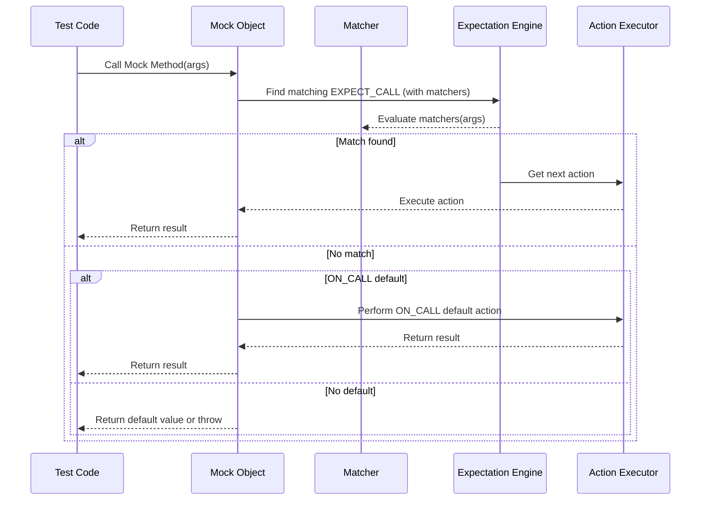

# Matchers and Expectations

This guide explains the core concepts behind **matchers** and **expectations** in GoogleMock (gMock) and their relationship with GoogleTest assertions. It helps you understand how to express what behavior your tests require from mocked methods, how to structure these expectations, and how to create custom matchers tailored to your domain.

---

## Introduction to Matchers

Matchers are the fundamental tools gMock provides to specify **what arguments** you expect a mock method to be called with. Rather than testing exact values only, matchers allow flexible, expressive conditions on the arguments, enabling clear and robust tests.

### What Are Matchers?

- **Matchers** are predicates evaluating whether a given argument satisfies a condition.
- They can be basic (e.g., `Eq(5)`, `_` which matches anything) or compound (e.g., `AllOf()`, `AnyOf()`, `Not()`).
- Matchers work with complex types, STL containers, pointers, and user-defined types.

```cpp
EXPECT_CALL(mock_obj, Foo(Ge(10), NotNull()));
```
This expects the method `Foo` to be called with first argument >= 10 and a non-null second argument.

### Using Matchers with Multi-argument Functions

- gMock also supports combining argument matchers into a single multi-argument matcher to apply to the entire argument tuple via the `.With()` clause.
- This is useful when validation depends on the combined tuple of arguments (e.g., first argument < second argument).

```cpp
EXPECT_CALL(mock_obj, SetPosition(_, _))
    .With(Lt());  // Expects first arg < second arg
```

### Built-in Matchers

- `_`: Matches anything (wildcard matcher).
- `Eq(value)`: Matches if argument equals `value`.
- `Ge(value)`, `Gt(value)`, `Le(value)`, `Lt(value)`: Comparison matchers.
- `Not(matcher)`: Negates the matcher.
- `Pointee(matcher)`: Matches a pointer (raw or smart) whose pointee matches `matcher`.
- `Field(&Class::member, matcher)`: Matches object whose member satisfies `matcher`.
- `Property(&Class::Method, matcher)`: Matches object whose method result satisfies `matcher`.

Extensive collections of matchers exist, and you can combine or customize them extensively.

### Creating Custom Matchers

For specific verification needs, you can define custom matchers easily using macros like `MATCHER` and `MATCHER_P`:

```cpp
MATCHER(IsEven, "") { return (arg % 2) == 0; }

EXPECT_CALL(mock, Process(IsEven()));
```

Custom matchers allow embedding domain-specific logic with expressive failure output.

---

## Expectations with EXPECT_CALL and ON_CALL

Expectations define **how you expect mock methods to be called in your test and what behavior they should perform**.

### Setting Expectations: EXPECT_CALL

- `EXPECT_CALL(mock_object, method(matchers...))` declares that the method will be called with arguments matching the given matchers.
- This is a verification point: if the expectation is violated, gMock reports a test failure.

```cpp
EXPECT_CALL(foo, Bar(Ge(5)))
    .Times(3)
    .WillOnce(Return('a'))
    .WillOnce(Return('b'))
    .WillRepeatedly(Return('c'));
```

Here `Bar` is expected to be called exactly 3 times, returning `'a'`, `'b'` on the first two calls, and then `'c'` on any subsequent calls.

### Setting Default Behavior: ON_CALL

- `ON_CALL` specifies the **default behavior** for calls matching given arguments but does **not** impose any expectation that the call *must* happen.
- It is often used to specify default responses for uninteresting calls.

```cpp
ON_CALL(foo, Bar(_))
    .WillByDefault(Return('z'));
```

If no `EXPECT_CALL` supersedes this, `Bar()` returns `'z'` when called with any argument.

### Chaining Clauses with EXPECT_CALL

You can chain modifiers with `EXPECT_CALL` to precisely define how the mock will behave:

- `.With(matcher)`: Additional multi-argument matcher applied against tuple args.
- `.Times(cardinality)`: Specifies how many times the call is expected.
- `.InSequence(seq1, seq2, ...)`: Requires calls to occur in specified sequences.
- `.After(exp1, exp2, ...)`: Requires the call happen after other expectations.
- `.WillOnce(action)`: Specific behavior for a single call.
- `.WillRepeatedly(action)`: Behavior for all subsequent calls after `WillOnce`s.
- `.RetiresOnSaturation()`: Retires expectation after it has been saturated.

Each clause has constraints on ordering, frequency, and mutual exclusivity, ensuring clear semantics and preventing misuse.

### Cardinalities: Specifying Call Frequency

- `Times(AnyNumber())`: The method can be called any number of times.
- `Times(Exactly(n))` or `Times(n)`: Must be called exactly `n` times.
- `Times(AtLeast(n))`: At least `n` times.
- `Times(AtMost(n))`: At most `n` times.
- `Times(Between(m, n))`: Between `m` and `n` (inclusive).

If `Times` is omitted, gMock tries to infer it based on the presence of `WillOnce` and `WillRepeatedly` clauses.

### Call Order Control

Two main mechanisms:

- **Sequences** via `InSequence`: groups of expectations executed strictly sequentially.
- **Partial ordering** via `After`: more flexible, specifying that certain calls occur after others.

```cpp
Sequence s1, s2;
EXPECT_CALL(foo, Init()).InSequence(s1);
EXPECT_CALL(foo, Process()).InSequence(s1, s2);
EXPECT_CALL(foo, Cleanup()).InSequence(s2);
```

This enforces `Init()` then `Process()` then `Cleanup()`, with `Process()` part of two overlapping sequences.

---

## Practical Usage Highlights

- Always set expectations **before** exercising the code under test.
- Use `ON_CALL` to specify default behavior for uninteresting calls (calls without `EXPECT_CALL`).
- Use `.RetiresOnSaturation()` to automatically deactivate expectations once they reach their expected call count.
- For methods expected to be called multiple times with different actions, use multiple `.WillOnce()` clauses followed optionally by `.WillRepeatedly()`.
- Use sequences and `.After()` to express call ordering where necessary.
- Avoid over-specifying to keep tests maintainable and resilient.

### Nice, Naggy, and Strict Mocks

- **NiceMock**: Ignores uninteresting calls (silences warnings).
- **NaggyMock** (default): Warns on uninteresting calls.
- **StrictMock**: Fails on uninteresting calls.

Choose the wrapper appropriate to the level of strictness you want on your mock objects.

---

## Defining Custom Matchers

Sometimes existing matchers are insufficient. You can create custom matchers easily:

### Using the `MATCHER` Macro

Define simple named matchers with:

```cpp
MATCHER(IsEven, "checks if a number is even") {
  return (arg % 2) == 0;
}

EXPECT_CALL(foo, Bar(IsEven()));
```

Inside the matcher definition:

- `arg` is the value being matched.
- `result_listener` can be used to output descriptive messages on failures.

### Parameterized Matchers

For matchers with parameters, use `MATCHER_P`:

```cpp
MATCHER_P(IsDivisibleBy, n, "") {
  return arg % n == 0;
}

EXPECT_CALL(foo, Bar(IsDivisibleBy(7)));
```

You can create more complex multi-parameter matchers using `MATCHER_P2`, etc.

### Advanced: Implementing MatcherInterface

For fine control, implement a matcher class that:

- Implements `MatchAndExplain`.
- Implements `DescribeTo` and `DescribeNegationTo`.

This approach allows polymorphic matchers and careful control over descriptions.

---

## Troubleshooting Common Matcher Problems

- Ensure the matcher types match the function argument types or use `SafeMatcherCast`.
- Avoid side effects in matcher evaluations; matchers must be pure functions.
- When mocking overloaded functions, disambiguate using wrappers like `Const()`.
- Use `_` to ignore unimportant arguments rather than over-constraining.

---

## Diagram: How Matchers & Expectations Fit in Test Execution Flow



This flow illustrates the role of matchers during invocation and how expectations guide behavior.

---

## Summary

Matchers in gMock are your power tools for specifying *what* calls are expected and *how* argument values are validated, while expectations define *how often* and *in what order* these calls should occur, along with the *behavior* mocking functions will perform. Leveraging built-in matchers, chaining expectation clauses, and creating custom matchers allow you to express precise, readable, and maintainable tests suited to your domain.

---

## Additional Resources

- [gMock Cookbook](https://google.github.io/googletest/gmock_cook_book.html)
- [Matchers Reference](https://google.github.io/googletest/reference/matchers.html)
- [Mocking Reference](https://google.github.io/googletest/reference/mocking.html)
- [gMock for Dummies](https://google.github.io/googletest/gmock_for_dummies.html)
- [`EXPECT_CALL` Documentation](https://google.github.io/googletest/reference/mocking.html#EXPECT_CALL)
- [`ON_CALL` Documentation](https://google.github.io/googletest/reference/mocking.html#ON_CALL)
- [Custom Matchers](https://google.github.io/googletest/gmock_cook_book.html#NewMatchers)

Use these references for deeper dives, practical examples, recipes, and troubleshooting tips.

---

<Callouts>
  <Tip>
    To effectively use expectations, always specify how many times and in which order mock methods are expected to be called, making your tests clear and reliable.
  </Tip>
  <Note>
    Matchers must be free of side effects because gMock may invoke them multiple times per call to determine the best match.
  </Note>
  <Warning>
    Setting expectations after exercising the code or mixing `EXPECT_CALL()` and invocation order can lead to undefined behavior.
  </Warning>
  <Check>
    When mocking overloaded methods, disambiguate overloads using wrappers like `Const()` or precise argument matchers.
  </Check>
</Callouts>
