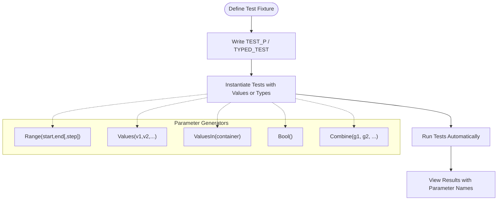

# Parameterized and Type-Parameterized Tests

GoogleTest empowers you to write reusable test code by supporting **value-parameterized** and **type-parameterized tests**. These tests allow the same logical test code to run multiple times with different input values or types, maximizing your test coverage without duplicating code.

---

## Value-Parameterized Tests

### What They Are

Value-parameterized tests enable running the same test logic repeatedly with different input values. This helps verify your code behaves correctly across a range of inputs without writing separate tests for each one.

### How It Works

- Define a test fixture class inheriting from `::testing::TestWithParam<T>`, where `T` is the type of parameter.
- Write tests with the `TEST_P` macro, accessing the parameter via `GetParam()`.
- Instantiate the test suite with specific parameter values using `INSTANTIATE_TEST_SUITE_P`.

### Example

```cpp
class FooTest : public ::testing::TestWithParam<int> {};

TEST_P(FooTest, IsEven) {
  int value = GetParam();
  EXPECT_EQ(0, value % 2);
}

INSTANTIATE_TEST_SUITE_P(EvenNumbers, FooTest, ::testing::Values(2, 4, 6, 8));
```

This creates four tests running `IsEven` with 2, 4, 6, and 8.

### Parameter Generators

GoogleTest provides generator functions for specifying the parameters:

| Generator       | Description                                                                                           |
|-----------------|---------------------------------------------------------------------------------------------------|
| `Range(start,end[,step])` | Generates values from `start` up to but not including `end`, stepping by `step` (default 1).         |
| `Values(v1,v2,...)`        | Enumerates explicit values.                                                                |
| `ValuesIn(container)`      | Uses values from a container or iterator range.                                            |
| `Bool()`                  | Generates boolean values `{false, true}`.                                                  |
| `Combine(g1, g2, ...)`     | Produces the Cartesian product (all combinations) of values from multiple generators.       |
| `ConvertGenerator<T>(gen)` | Converts generated values to a different type explicitly.                                   |

### Custom Parameter Names

You can define custom test names for parameters by providing a function or functor to generate name suffixes in `INSTANTIATE_TEST_SUITE_P`:

```cpp
INSTANTIATE_TEST_SUITE_P(
    MyInstantiation, FooTest, ::testing::Values(1, 2, 3),
    [](const ::testing::TestParamInfo<int>& info) {
      return "Value" + std::to_string(info.param);
    });
```

Test names must be alphanumeric or underscores only.

### Best Practices & Pitfalls

- Use parameterized tests to cover a range of related inputs systematically.
- Avoid overly large parameter sets which can slow down test runs.
- Ensure parameters are immutable or safely copied.
- Use `GTEST_ALLOW_UNINSTANTIATED_PARAMETERIZED_TEST` to suppress warnings if you define parameterized tests without instantiations.

---

## Typed (Type-Parameterized) Tests

### What They Are

Typed tests run the same test logic over multiple C++ types, allowing you to verify generic code or template classes behave correctly regardless of the actual type.

### Two Flavors

1. **Typed Tests** — You specify the list of types upfront when defining the test suite.
2. **Type-Parameterized Tests** — You define abstract test patterns that can be instantiated with type lists multiple times in different translation units, improving reuse.

### Usage Overview

- Write a class template fixture derived from `::testing::Test`, templated on a type `T`.
- For typed tests, associate a type list using `TYPED_TEST_SUITE()`.
- Write tests with `TYPED_TEST()`.
- For type-parameterized tests, define the test suite with `TYPED_TEST_SUITE_P()`, write tests with `TYPED_TEST_P()`, register tests with `REGISTER_TYPED_TEST_SUITE_P()`, and instantiate with `INSTANTIATE_TYPED_TEST_SUITE_P()`.

### Typed Tests Example

```cpp
template <typename T>
class FooTest : public ::testing::Test {
 public:
  T value_{};
};

using MyTypes = ::testing::Types<int, double, char>;
TYPED_TEST_SUITE(FooTest, MyTypes);

TYPED_TEST(FooTest, IsDefaultInitialized) {
  TypeParam val = this->value_;
  EXPECT_EQ(val, TypeParam{});
}
```

This runs the `IsDefaultInitialized` test for `int`, `double`, and `char`.

### Type-Parameterized Tests Example

```cpp
template <typename T>
class FooTest : public ::testing::Test {};

TYPED_TEST_SUITE_P(FooTest);

TYPED_TEST_P(FooTest, DoesBlah) {
  TypeParam val = 0;
  EXPECT_EQ(val, 0);
}

REGISTER_TYPED_TEST_SUITE_P(FooTest, DoesBlah);

using MyTypes = ::testing::Types<int, double>;
INSTANTIATE_TYPED_TEST_SUITE_P(My, FooTest, MyTypes);
```

### Custom Type Name Generators

Similar to value-parameterized tests, you can define a custom naming class to generate descriptive test suite names incorporating the type names.

### Advantages

- Validate templates and generic code with minimal duplication.
- Separate type-agnostic test logic from specific type lists.
- Support multiple instantiations in different translation units.

---

## User Workflow: Writing Parameterized Tests

<Steps>
<Step title="Define a Parameterized Fixture">
Create a test fixture inheriting from `::testing::TestWithParam<T>` for value-parameterized tests or from `::testing::Test` templated by type `T` for typed tests.
</Step>
<Step title="Write the Test Logic">
Use `TEST_P` for value-parameterized tests or `TYPED_TEST` / `TYPED_TEST_P` for typed tests, accessing parameters via `GetParam()` or `TypeParam` respectively.
</Step>
<Step title="Instantiate Tests with Parameters or Types">
For value-parameterized tests, instantiate with `INSTANTIATE_TEST_SUITE_P` passing a parameter generator. For typed tests, define type lists and associate using `TYPED_TEST_SUITE` or instantiate type-parameterized tests with `INSTANTIATE_TYPED_TEST_SUITE_P`.
</Step>
<Step title="Run and Interpret Results">
Use normal test runners. Tests will be named reflecting parameter values or types, showing clear coverage.
</Step>
</Steps>

---

## Practical Tips

- Use `Combine()` to test multiple parameter dimensions as tuples.
- Prefer `ValuesIn()` to reuse existing containers or arrays easily.
- When test parameter types are complex and implicit conversions fail, use `ConvertGenerator`.
- Provide meaningful names for test instances with custom name generators to simplify test logs and filtering.
- Avoid mixing `TEST` and `TEST_F` or parameterized and non-parameterized tests in the same test suite.

---

## Troubleshooting Common Issues

<AccordionGroup title="Troubleshooting Parameterized and Typed Tests">
<Accordion title="Tests Not Running or Recognized">
Ensure your parameterized test is instantiated using `INSTANTIATE_TEST_SUITE_P`. Without instantiation, tests will not run and GoogleTest will emit warnings.
</Accordion>
<Accordion title="Invalid Test Names">
Custom parameter or type name generators must produce names containing only alphanumeric characters or underscores. Spaces, dashes, or other characters will fail.
</Accordion>
<Accordion title="Compilation Errors with Complex Parameters">
If implicit conversion of generated parameters to your fixture's parameter type fails, use `ConvertGenerator` with an explicit conversion lambda or constructor.
</Accordion>
<Accordion title="Confusion Between Typed and Type-Parameterized Tests">
Typed tests specify all types at test suite definition time. Type-parameterized tests support defining abstract test patterns and instantiating multiple times. Use the appropriate pattern per your test reuse needs.
</Accordion>
</AccordionGroup>

---

## Further Reading and Related Documentation

- [Value-Parameterized Tests](../advanced.md#value-parameterized-tests) for an in-depth guide
- [Typed Tests](../advanced.md#typed-tests) and [Type-Parameterized Tests](../advanced.md#type-parameterized-tests) for generic type testing
- [TEST_P and INSTANTIATE_TEST_SUITE_P](../reference/testing.md#TEST_P) API reference
- [TYPED_TEST_SUITE and TYPED_TEST](../reference/testing.md#TYPED_TEST_SUITE) API details
- [Matchers](../reference/matchers.md) for asserting test conditions
- [GoogleTest Primer](guides/getting-started/writing-first-test) for introductory material

---

## Diagram: Overview of Parameterized Test Flow



---