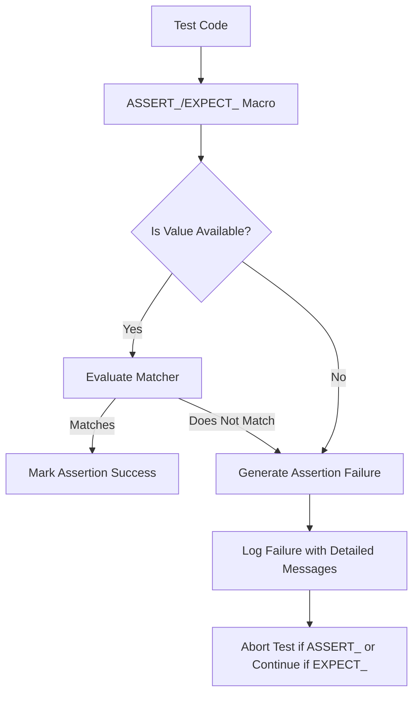

# Assertions, Matchers, and Validations

GoogleTest's assertion and matcher system is the foundation for verifying code correctness and behavior in your tests. This guide explains how expressive assertions combined with flexible matchers empower you to write precise validations that clearly communicate expected outcomes and reveal detailed failure information.

---

## Why Assertions Matter

Assertions are statements that verify whether a program state or expression holds true at runtime during test execution. They reveal bugs by failing tests when code does not behave as expected. GoogleTest provides a rich hierarchy of assertion macros tuned to different verification needs, from simple boolean checks to complex value matching.

Clear, expressive assertions are crucial because they:

- **Detect errors effectively.** They stop test execution or log failures when unexpected conditions occur.
- **Communicate intent clearly.** Good assertions explain what is expected, helping maintainers understand tests.
- **Surface actionable information.** Detailed failure messages assist in diagnosing issues quickly.

## The Assertion Macros

GoogleTest organizes assertions primarily into pairs differing in severity:

- **EXPECT_***: Nonfatal assertions that log failures but allow the test to continue running.
- **ASSERT_***: Fatal assertions that abort the current test function immediately on failure.

This separation lets you decide whether it's worthwhile to continue after a failure or to abort early.

### Examples of Basic Assertions

```cpp
EXPECT_TRUE(flag) << "Flag was expected to be true.";
ASSERT_EQ(value, 42) << "Value must be 42";
```

These macros support streaming additional custom messages via the `<<` operator, which enrich failure details.

## Explicit Success and Failure

Sometimes you want to mark points in your test as successes or failures explicitly without comparing values. GoogleTest offers:

- `SUCCEED()` — Marks a success (purely documentary).
- `FAIL()` — Generates a fatal failure and aborts the function.
- `ADD_FAILURE()` — Generates a nonfatal failure.

Useful for control flows that don't naturally produce boolean results.

## Leveraging Matchers for Flexible Validations

Matchers provide a powerful mechanism to verify that values, or function arguments, satisfy specified conditions. Instead of hardcoding values, matchers let you express constraints declaratively and readably.

Matchers are typically used with the `EXPECT_THAT` assertion:

```cpp
EXPECT_THAT(actual_value, matcher);
ASSERT_THAT(actual_value, matcher);
```

### Benefits of Matchers

- **Readability:** Assertions read like natural language.
- **Extensibility:** You can use built-in matchers or create custom ones.
- **Informative failures:** Detailed descriptions of match failures.

### Built-in Matcher Examples

- Wildcards: `_` matches any value.
- Comparisons: `Eq()`, `Ne()`, `Gt()`, `Lt()`, `Ge()`, `Le()`
- Logical combinators: `AllOf()`, `AnyOf()`, `Not()`
- String and container matchers: `StartsWith()`, `Contains()`, `ElementsAre()`

Example:

```cpp
EXPECT_THAT(username, StartsWith("admin"));
EXPECT_THAT(numbers, ElementsAre(1, 2, 3));
EXPECT_THAT(rate, AllOf(Ge(0.0), Le(1.0)));
```

### Matchers and Mocking

Matchers also play a vital role in the mocking framework, allowing you to specify what arguments to expect in mocked function calls (see the [Mocking Reference](reference/mocking.md#EXPECT_CALL)). For example,

```cpp
EXPECT_CALL(mock_obj, DoSomething(Eq(5), _));
```

expresses an expectation that the method `DoSomething` will be called with the first argument equal to 5 and the second argument arbitrary.

## Interplay Between Assertions and Matchers

Matchers turn assertions into expressive validations. `EXPECT_THAT(value, matcher)` combines the assertion that `value` should satisfy `matcher` with detailed messages explaining exactly how the actual value does or does not meet expectations.

Under the hood, GoogleTest prints:

- The actual value.
- The expected matcher description.
- Additional reason or context from the matcher.

If the expectation fails, this richness helps you quickly locate why.

## Writing Effective Assertions

Consider the test author's intent and apply these best practices:

- **Be precise yet flexible.** Use matchers to avoid brittle tests that break due to irrelevant changes.
- **Use `EXPECT_` for non-critical checks** where continuing the test is valuable.
- **Use `ASSERT_` when failure makes further checks meaningless or unsafe.**
- **Add helpful messages** to assertions to clarify failure reasons.
- **Leverage `EXPECT_THAT` with matchers** for clear, descriptive validations, especially on complex types.
- **Prefer specific matchers over generic `EXPECT_EQ`.**

### Example: Comparing a Container

```cpp
std::vector<int> actual = GetData();
EXPECT_THAT(actual, ElementsAre(1, 2, 3));
```

This is clearer and more robust compared to iterating and asserting element-wise.

## Common Pitfalls

- Mixing `EXPECT_` and `ASSERT_` unintentionally can hide failures.
- Overly rigid assertions cause flaky tests when implementation changes but contract remains.
- Forgetting to add meaningful failure messages makes debugging harder.
- Using `EXPECT_EQ` for floating-point can cause unexpected failures; prefer `EXPECT_FLOAT_EQ` or matcher-based comparisons.

## Extending Assertions with Custom Matchers

GoogleTest supports creating your own matchers when the built-in suite is insufficient. Custom matchers encapsulate complex logic with automatic descriptions.

Quick example:

```cpp
MATCHER(IsEven, "is an even number") {
  return (arg % 2) == 0;
}

EXPECT_THAT(number, IsEven());
```

For more details, see [Custom Matchers and Actions](api-reference/matchers-and-advanced-tooling/custom-matchers-and-actions.mdx).

## Troubleshooting Assertions and Matchers

When assertions fail unexpectedly:

- Check the types to ensure matchers are compatible with actual values.
- Use verbose GoogleTest output to see detailed failure messages.
- Confirm that comparison semantics match your expectations (e.g., pointer vs value equality).
- Validate that argument matchers in mocks correspond exactly to expected calls.

Consider enabling `--gmock_verbose=info` when diagnosing matcher and expectation issues.

---

### Summary
- Assertions verify expected states and behaviors during tests.
- Matchers enable expressive, composable, and flexible validations.
- Use `EXPECT_THAT` to combine assertions with matchers and get detailed failure insights.
- GoogleTest provides a broad set of built-in assertion macros and matchers.
- Custom matchers extend verification capabilities with domain-specific logic.
- Proper use of assertions and matchers leads to clearer, maintainable, and robust tests.

---

## Additional Resources

- [Assertions Reference](reference/assertions.md)
- [Matchers Reference](reference/matchers.md)
- [Mocking Reference](reference/mocking.md)
- [gMock for Dummies](docs/gmock_for_dummies.md)
- [gMock Cookbook](docs/gmock_cook_book.md)
- [Custom Matchers and Actions](api-reference/matchers-and-advanced-tooling/custom-matchers-and-actions.mdx)

---

## Visual Summary: How Assertions and Matchers Work Together



This flow shows how test code invokes assertions that use matchers to evaluate actual values and decide pass/fail results with informative messages.

---