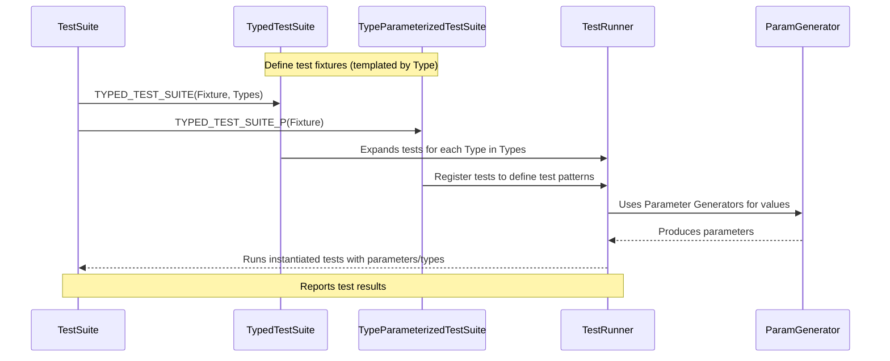

# Parameterized and Type-Parameterized Tests

GoogleTest empowers you to write flexible and powerful tests by enabling two key patterns: *value-parameterized tests* and *type-parameterized tests*. These patterns allow the same test logic to be run across different data sets or type variations, respectively. This guide delves into the concepts behind these testing patterns and shows how to leverage them to systematically cover your code's behavior under diverse scenarios.

---

## Value-Parameterized Tests (Value-Parameterized Test Suites)

### What Are They?
Value-parameterized tests allow you to write tests that are executed multiple times with different input values or parameters. Instead of duplicating test code for each input, you write a single test and supply a set of values to test against.

### How Do They Work?
- You define a test fixture class derived from `::testing::TestWithParam<T>`, where `T` is the type of the parameter.
- Declare tests using `TEST_P()` macro instead of `TEST_F()`. Inside these tests, you access the parameter via `GetParam()`.
- Use the `INSTANTIATE_TEST_SUITE_P()` macro to generate multiple instances of the test suite with different parameter values by providing a *parameter generator*.

### Parameter Generators
GoogleTest provides several built-in generators to produce parameter values for your tests:

- `Range(start, end [, step])`: Produces a sequence of values from start to end, excluding end.
- `Values(v1, v2, ..., vN)`: Yields explicit values.
- `ValuesIn(container)` or `ValuesIn(begin, end)`: Produces values from existing containers or iterator ranges.
- `Bool()`: Yields `false` and `true`.
- `Combine(g1, g2, ..., gN)`: Produces Cartesian products of multiple generators, useful for multi-parameter tests.
- `ConvertGenerator<T>(generator)` and its overloads: Converts generated values to a desired type using casting or a conversion function.

### Usage Example
```cpp
class FooTest : public ::testing::TestWithParam<int> { ... };

TEST_P(FooTest, HandlesIntParameters) {
  int param = GetParam();
  EXPECT_GT(param, 0);
}

INSTANTIATE_TEST_SUITE_P(PositiveNumbers, FooTest, testing::Values(1, 2, 3));
```

### Key Notes
- The test suite will be instantiated once per parameter value.
- You can instantiate the same test suite multiple times with different parameters.
- Use a name generator (optional last argument to `INSTANTIATE_TEST_SUITE_P`) to customize test names based on parameters.
- Parameters are evaluated during `InitGoogleTest()`, allowing dynamic generation based on runtime state.
- Incomplete instantiations (i.e., tests defined but not instantiated) cause a warning unless marked with `GTEST_ALLOW_UNINSTANTIATED_PARAMETERIZED_TEST()`.

---

## Typed Tests

### What Are Typed Tests?
Typed tests allow you to run the same test logic over multiple types, making them perfect for verifying template classes or different implementations of an interface. Unlike value-parameterized tests, typed tests are parameterized by types rather than values.

### How Do They Work?
- Define a test fixture class template parameterized by a type `T` derived from `testing::Test`.
- Associate a list of types using `TYPED_TEST_SUITE(FixtureName, TypesList)`.
- Write tests using `TYPED_TEST(FixtureName, TestName)` where you can refer to the current type as `TypeParam`.

### Usage Example
```cpp
template <typename T>
class MyContainerTest : public testing::Test {
 public:
  T value_;
};

using MyTypes = ::testing::Types<int, double, std::string>;
TYPED_TEST_SUITE(MyContainerTest, MyTypes);

TYPED_TEST(MyContainerTest, CanDefaultConstruct) {
  TypeParam value = this->value_;
  EXPECT_TRUE(true);  // Your test here
}
```

### Benefits
- Write once, test many types.
- Useful for verifying conformance to concepts or interfaces.
- Immediate compiler feedback on type-specific behavior.

---

## Type-Parameterized Tests

### What Are They?
Type-parameterized tests are similar to typed tests but provide more flexibility by allowing you to define the tests abstractly and instantiate them with different type lists later, possibly multiple times across translation units.

### How Do They Work?
- Define a fixture class template.
- Declare the test suite as type-parameterized using `TYPED_TEST_SUITE_P(FixtureName)`.
- Define the tests with `TYPED_TEST_P(FixtureName, TestName)`.
- Register the tests with `REGISTER_TYPED_TEST_SUITE_P(FixtureName, Test1, Test2, ...)`.
- Instantiate the test suite with desired types using `INSTANTIATE_TYPED_TEST_SUITE_P(InstanceName, FixtureName, TypesList)`.

### Usage Example
```cpp
template <typename T>
class MyAbstractTest : public testing::Test {
 // ...
};

TYPED_TEST_SUITE_P(MyAbstractTest);

TYPED_TEST_P(MyAbstractTest, ExampleTest) {
  TypeParam value{};
  EXPECT_GE(value, 0);
}

REGISTER_TYPED_TEST_SUITE_P(MyAbstractTest, ExampleTest);

using TestTypes = ::testing::Types<int, double>;
INSTANTIATE_TYPED_TEST_SUITE_P(MyInstance, MyAbstractTest, TestTypes);
```

### Advantages
- Define the test pattern once, instantiate multiple times with different types.
- Enables interface or concept testing by various implementers.
- Supports instantiations across different translation units.

---

## Distinguishing Between Typed and Type-Parameterized Tests

| Feature                           | Typed Tests                         | Type-Parameterized Tests             |
|----------------------------------|-----------------------------------|------------------------------------|
| Definition time for types         | Types must be known at test writing| Types can be specified later        |
| Instantiation                    | Single instantiation of suite      | Multiple instantiations supported   |
| Macros used                      | `TYPED_TEST_SUITE` and `TYPED_TEST`  | `TYPED_TEST_SUITE_P`, `TYPED_TEST_P`, `REGISTER_TYPED_TEST_SUITE_P`, and `INSTANTIATE_TYPED_TEST_SUITE_P` |

---

## Practical Tips and Best Practices

- Use **value-parameterized tests** when testing the same logic across different input data or configurations.
- Use **typed tests** or **type-parameterized tests** when validating template classes or interfaces across multiple type implementations.
- Use `INSTANTIATE_TEST_SUITE_P` wisely, providing descriptive instantiation names to keep test output clear.
- Use the optional *name generator* parameter to customize test case names based on parameters or types for easier identification.
- Carefully manage the scopes of static shared resources, especially in typed and parameterized tests, to avoid leaks or repeated setups.
- Avoid overlapping test names and ensure no underscores in test and suite names for compatibility with GoogleTest's conventions.
- Prefer `GTEST_ALLOW_UNINSTANTIATED_PARAMETERIZED_TEST` in libraries where parameterized tests might not always be instantiated.

---

## Troubleshooting Parameterized Tests

- If your tests defined with `TEST_P()` don't run, verify that you have corresponding `INSTANTIATE_TEST_SUITE_P()` statements.
- If you see warnings about uninstantiated parameterized tests, consider if you need to add `GTEST_ALLOW_UNINSTANTIATED_PARAMETERIZED_TEST()`.
- If tests fail to compile due to ambiguous overloads when omitting argument matchers, specify matchers explicitly or use simpler mock interfaces.
- Use `testing::PrintToStringParamName` or custom name generators for more readable parameter names in test output.
- Value generators evaluate at `InitGoogleTest()`—avoid generating parameters that depend on uninitialized global state.

---

## Related Diagrams



---

## Further Reading and References

- [Testing Reference - Value-Parameterized Tests](https://github.com/google/googletest/blob/main/docs/reference/testing.md#value-parameterized-tests)
- [Typed Tests and Type-Parameterized Tests - Primer](https://github.com/google/googletest/blob/main/docs/primer.md#typed-tests)
- [Test Structure and Lifecycle](https://github.com/google/googletest/blob/main/api-reference/core-testing-apis/test-structure-and-lifecycle.mdx)
- [Organizing and Running Tests](https://github.com/google/googletest/blob/main/guides/core-workflows/organizing-and-running-tests.mdx)

---

This page is part of the broader GoogleTest Concept documentation to help you systematically and confidently write effective parameterized and typed tests, improving test coverage and maintainability.
