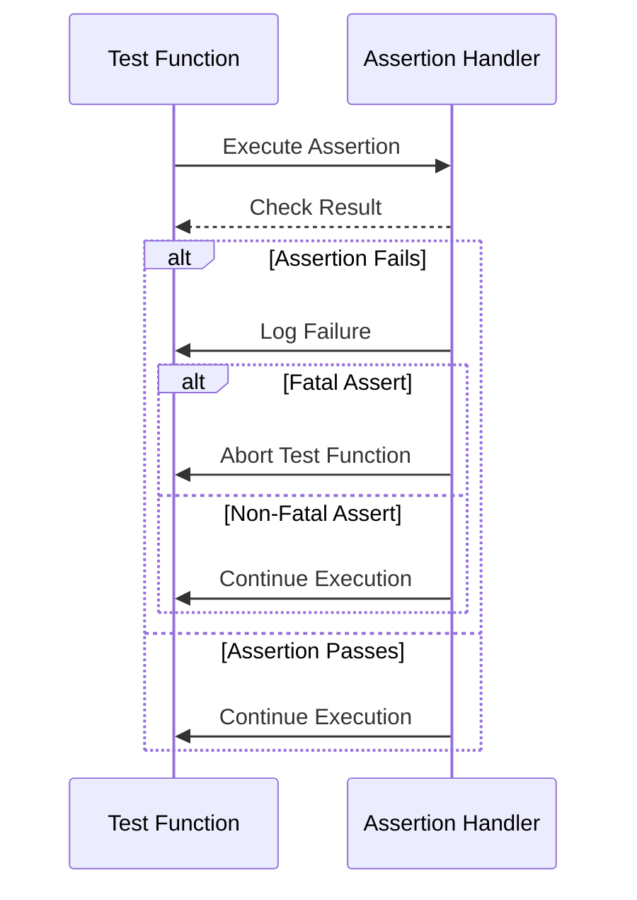

# Assertions, Failures, and Reporting

Delve into the rich assertion system powering GoogleTest. This documentation unpacks how GoogleTest differentiates between fatal and non-fatal assertions, how failures impact test execution flow, and the detailed mechanisms behind its failure reporting and logging.

Mastering these assertion models enables writing tests that provide accurate, trustworthy feedback to developers, facilitating rapid identification and correction of issues.

---

## 1. Understanding Assertions in GoogleTest

Assertions are the fundamental verification mechanism in GoogleTest, used to check conditions at runtime and signal test success or failure depending on the evaluation.

### Types of Assertions

- **Fatal Assertions:** These immediately abort the current test function execution upon failure (e.g., `ASSERT_*` macros). After a fatal failure, the rest of the test is skipped.
- **Non-Fatal Assertions:** These log failures but allow the test function to proceed (e.g., `EXPECT_*` macros). They support multiple checks in one test, gathering all verification results.

Example:

```cpp
TEST(MathTest, Addition) {
  EXPECT_EQ(2 + 2, 4);        // Non-fatal: test continues if fails
  ASSERT_GT(5, 3);            // Fatal: test aborts if fails
  EXPECT_TRUE(true);          // Will run only if ASSERT_GT succeeded
}
```

### Choosing Between Fatal and Non-Fatal

- Use **fatal assertions** when subsequent test steps depend on prior success (e.g., verifying a resource exists before further testing).
- Use **non-fatal assertions** to check multiple independent conditions within a single test.

> Practical Tip: Favor fatal assertions early in a test to catch critical failures quickly.

---

## 2. The Impact of Failures on Test Execution

GoogleTest’s behavior upon assertion failures is designed to balance comprehensive test coverage and clarity:

- **Fatal failures** immediately stop the current test function, preventing cascading errors due to invalid state.
- **Non-fatal failures** report the failure but continue executing, allowing multiple verifications within one run and yielding richer diagnostic output.

This nuanced behavior enables writing tests that both safeguard against invalid states and provide detailed feedback.

### Example: Fatal vs Non-Fatal Behavior

```cpp
TEST(ExampleTest, FatalVsNonFatal) {
  EXPECT_EQ(1, 2);  // Failure logged, test continues
  std::cout << "Still running?" << std::endl;

  ASSERT_EQ(1, 2);  // Failure stops test here
  std::cout << "Won't be reached" << std::endl;
}
```

Output:
```
Expected: 1 == 2
  Actual: 1 vs 2
Still running?
Expected equality of these values:
  1
  2
```

---

## 3. Structure and Patterns of Assertions

### Assertion Macros

Assertions follow intuitive naming patterns:

- `EXPECT_*`: Non-fatal
- `ASSERT_*`: Fatal

Suffixed by the checked condition, for example:

- `EXPECT_TRUE(condition)`
- `ASSERT_EQ(val1, val2)`
- `EXPECT_STREQ(str1, str2)` (for C string equality)

Refer to the [Assertions Reference](../api_reference/core_assertions_matchers/assertions.md) for the full list.

### Streaming Custom Messages

You can stream additional information to assertions for clearer failure explanations:

```cpp
EXPECT_EQ(GetValue(), expected_value) << "Value mismatch in ModuleX";
```

This message is printed on failure alongside the default assertion output.

---

## 4. Rich Failure Logging and Reporting

GoogleTest provides detailed failure diagnostics that help quickly pinpoint issues:

- **Source Locations:** Assertion failures include file names and line numbers.
- **Failure Messages:** Descriptions of expected vs actual values highlight discrepancies.
- **Stack Traces (Conditional):** When configured, stack traces of failing assertions provide call context.

### Verbose Logging

Using the `--gtest_verbose` flag, users can adjust verbosity of failure reports:

- `info`: Most verbose, includes detailed call and matching info.
- `warning`: Default level, includes warnings and errors.
- `error`: Minimal output, error messages only.

Example:

```shell
--gtest_verbose=info
```

Augments error messages with detailed call sites and context.

### Jump to Source in Editors

IDE integration (e.g., Emacs, VSCode) allows clicking or navigating to failure locations directly for efficient debugging.

---

## 5. Handling Multiple Assertions and Failures

Tests often include many assertions; GoogleTest tracks each and reports:

- Number of checks passed/failed.
- Detailed messages for each failing assertion.

This comprehensive view supports better diagnostics over a single failure.

### Accumulating Failures in a Single Test

Non-fatal `EXPECT_*` assertions facilitate gathering multiple failures in a test, improving coverage of related behaviors without abrupt interruption.

---

## 6. Common Patterns and Best Practices

- **Fail Fast on Critical Preconditions:** Use fatal assertions at the start to validate critical test preconditions.
- **Assert Equivalence or Ordering Clearly:** Use specialized macros (`EXPECT_EQ`, `EXPECT_LT`, etc.) for concise and descriptive checks.
- **Customize Messages for Clarity:** Add contextual information in failure messages to ease troubleshooting.
- **Combine with Matchers for Expressiveness:** Use GoogleMock-style matchers for rich expressive assertions.

---

## 7. Troubleshooting Assertion Failures

If a test fails unexpectedly:

- Run tests with `--gtest_break_on_failure` to halt execution on the first failure.
- Use `--gmock_verbose=info` to print detailed mock call traces.
- Check associated failure messages and stack traces carefully.
- Validate that your matchers and expectations match intended behavior.

Refer to [Common Setup Issues](../getting-started/troubleshooting-support/common-setup-issues.md) for more guidance.

---

## 8. Advanced Topics and Extensibility

Explore custom assertions and predicate-format assertions for more precise validation:

- Define [User-Defined Assertions](../api_reference/core_assertions_matchers/user_defined_assertions.md) for bespoke validation needs.
- Leverage predicate assertions (`EXPECT_PRED*`) for complex multi-value checks.

---

## Summary of Assertion Workflow

1. Write `EXPECT_` or `ASSERT_` macros to verify conditions and expected values.
2. Add clear custom messages as needed.
3. When a failure occurs, GoogleTest logs detailed info including file, line, and values.
4. Fatal assertions abort the current test; non-fatal assertions allow continued verification.
5. Use test runner flags to customize verbosity and debugging output.

---

## Visualizing Assertion Impact



---

## Additional Resources

- [Assertions Reference](../api_reference/core_assertions_matchers/assertions.md) — full API documentation of assertion macros
- [Matchers Reference](../api_reference/core_assertions_matchers/matchers_reference.md) — for expressive matching in assertions
- [Using Assertions Effectively Guide](../guides/core-workflows/using-assertions.md) — best practices and usage scenarios
- [Writing User-Defined Assertions](../api_reference/core_assertions_matchers/user_defined_assertions.md) — for custom validation logic

Consider exploring [Mocking Reference](../api_reference/mocking_framework/defining_mocks.md) next to integrate assertion techniques with mocks.

---

For detailed test setup and execution flows, see the [Test Runner Entry Points](../api_reference/configuration_and_main_api/runner_entry_points.md).

---