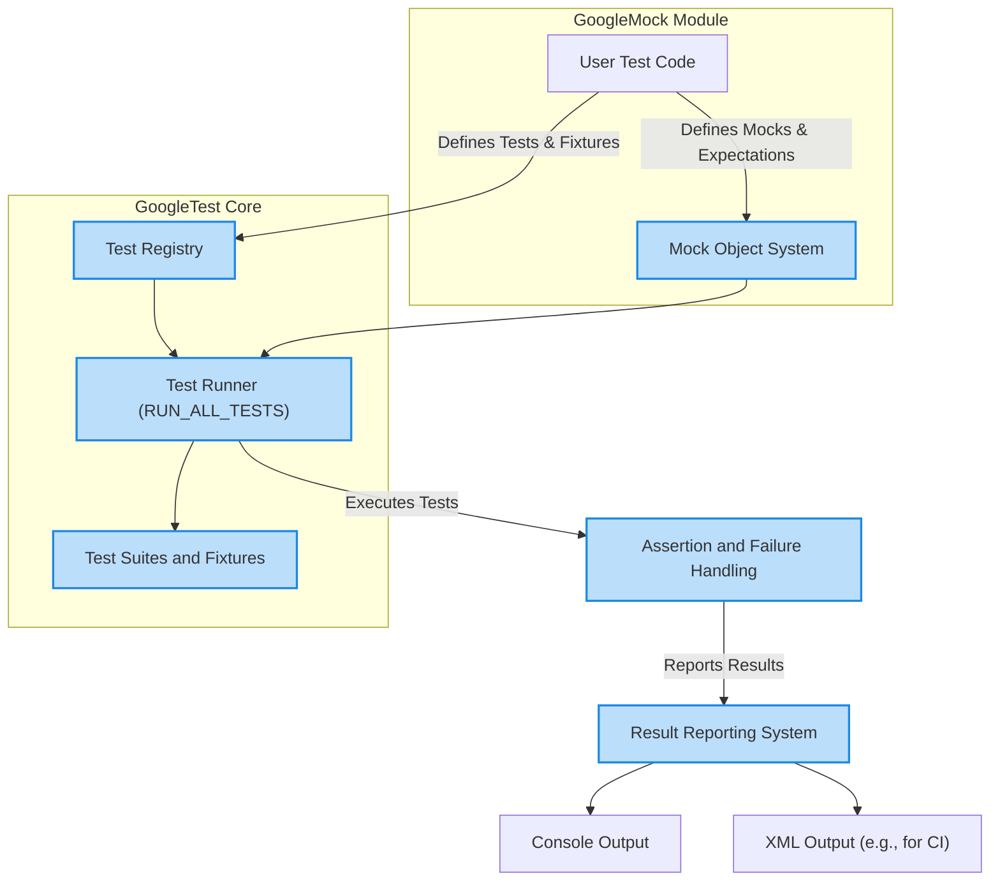

# GoogleTest and GoogleMock Architecture Overview

Explore the foundational architecture that powers GoogleTest and its tightly integrated companion, GoogleMock. This guide presents how core testing components—test cases, test suites, and mock objects—collaborate within the test runner environment to deliver seamless, automated testing for C++ projects.

---

## Introduction

GoogleTest is a powerful C++ testing framework, designed around the xUnit architecture, enabling robust test discovery, execution, and reporting. GoogleMock, integrated at the framework level, extends GoogleTest with sophisticated mocking capabilities.

Understanding the architectural patterns behind these tools empowers you to write effective tests, properly organize them, and leverage mocks to simulate complex behaviors.

This overview focuses on:

- The core concepts of test discovery and execution lifecycle
- The role and interaction of key components like test suites, test cases, and fixtures
- How GoogleMock integrates to provide mock object support
- The orchestration of components by the test runner

## 1. Core Architectural Components

### 1.1 Test Suites and Test Cases

At the heart of GoogleTest lies a hierarchical structure:

- **Test Suites:** Logical groupings of related tests that often map to the component or class under test.
- **Test Cases (Tests):** Individual tests validating a specific behavior or condition within the suite.

GoogleTest uses this grouping to help maintain, organize, and selectively run tests efficiently.

**Key Concepts:**

- Tests are defined via the `TEST()` macro for simple tests or `TEST_F()` for tests using fixtures.
- A test suite name is provided as the first argument; tests within a suite share this.
- Each test function comprises assertions that determine pass/fail results.

### 1.2 Test Fixtures

Fixtures allow reusing test setup and teardown code across multiple tests within a suite.

- A fixture is a class derived from `testing::Test`.
- Setup (`SetUp()`) and teardown (`TearDown()`) prepare and clean shared context.
- Tests using fixtures are declared with `TEST_F()`, gaining access to the fixture’s members.

This design promotes DRY (Don't Repeat Yourself) principles by centralizing common test data and states.

### 1.3 Test Runner & Test Discovery

GoogleTest automatically discovers all tests at runtime through implicit registration triggered by `TEST()` and `TEST_F()` definitions.

- The test runner invokes `RUN_ALL_TESTS()` to execute all discovered tests in an isolated manner.
- Each test runs as a fresh instance of its fixture class, ensuring isolation and repeatability.
- Test failures are reported with detailed location and message information.

This mechanism liberates developers from manual test registrations, enabling focus on test content.

### 1.4 Mock Objects & GoogleMock Integration

GoogleMock extends GoogleTest by introducing **mock objects** to simulate dependencies:

- Mocks are classes where behavior of methods is defined at runtime.
- Using the `MOCK_METHOD` macro, you specify mocked methods.
- Expectations (`EXPECT_CALL`) set how mocks should behave and verify interactions.

GoogleMock integrates seamlessly allowing tests to:

- Inject mock dependencies into code during test execution
- Verify call counts, parameters, and call order
- Define default and custom behaviors

This integration allows tests to isolate units even further, enabling precise behavior simulation.

## 2. Workflow: How Components Collaborate

Consider the following user journey from writing to running a test:

<Steps>
<Step title="Define Tests and Fixtures">
You write your test suites and tests using `TEST()` and `TEST_F()`. Fixtures, if needed, encapsulate reusable setup/teardown logic.
</Step>
<Step title="Mock Dependencies Where Needed">
Use GoogleMock macros to define your mock classes and set expectations for interactions.
</Step>
<Step title="Compile and Link">
Your code and tests link against the GoogleTest and GoogleMock libraries, which expose the testing API.
</Step>
<Step title="Run Tests via Runner">
At runtime, `RUN_ALL_TESTS()` triggers:
- Discovery of all registered tests
- Execution of tests one by one, each running in a fresh fixture instance
- Verification of assertions and mock expectations
- Aggregation of results
</Step>
<Step title="View Results">
Results display on the console or as XML, highlighting successes, failures, and skips with detailed diagnostics.
</Step>
</Steps>

This smooth lifecycle encourages rapid validation cycles and easy integration into CI environments.

## 3. High-Level Architecture Diagram

This flow highlights:

- The user writes test and mock definitions.
- GoogleTest maintains a registry of tests.
- The runner orchestrates execution, invoking fixtures and mocks as needed.
- Assertions validate the test conditions.
- Results are captured and reported to the user or external systems.

## 4. Deep Dive: What Users Need to Know

### Isolation

Every test runs independently with its own fresh fixture instance. Side effects or shared state changes in one test do not affect others.

**Best Practice:** Avoid relying on shared global state outside fixtures; instantiate resources within fixtures to ensure repeatability.

### Assertions & Failure Handling

- `ASSERT_*` macros abort the current test immediately on failure.
- `EXPECT_*` macros record non-fatal failures but continue running the test.

This lets you decide how strict your test flow is, enabling multiple verifications per test if desired.

### Mocking Behavior

Mocks can be tailored with expectations to:

- Require specific method calls with particular arguments
- Allow any number or exact counts of calls
- Return values, invoke side-effects, or delegate to custom functions

### Shared Fixtures

If multiple tests share complex setup, place this logic in fixture classes. GoogleTest ensures: 

- `SetUpTestSuite()` / `TearDownTestSuite()` run once per suite
- `SetUp()` / `TearDown()` run once per test

### Thread-Safety

GoogleTest attempts thread-safety where possible, especially when built with pthread support. Still, assertions are generally expected to run in the main test thread.

## 5. Troubleshooting Common User Scenarios

<AccordionGroup title="Common Challenges in Architecture & Usage">
<Accordion title="Tests Sharing State Unexpectedly">
Ensure your fixture creates fresh instances per test and that no test is mutating shared globals improperly. Prefer fixture members over globals.
</Accordion>
<Accordion title="Mock Expectations Not Met">
Verify that your `EXPECT_CALL` matchers correctly match the invoked calls. Use verbose mock logging (`--gmock_verbose=info`) to help debug mismatches.
</Accordion>
<Accordion title="Test Not Being Run">
Check test filters and whether tests are disabled (names prefixed with DISABLED_). GoogleTest skips tests according to user-provided filters and flags.
</Accordion>
<Accordion title="Parallel Test Execution Issues">
Tests are isolated but not all parts are thread-safe by default. Consider test dependencies and avoid global mutable states.
</Accordion>
<Accordion title="Test Registration Failing or Duplicate Names">
Ensure that each test suite and test within has a unique combination of names. Also, verify test suite names follow C++ identifier rules.
</Accordion>
</AccordionGroup>

## 6. Best Practices for Effective Use

- **Group logically:** Reflect your source project hierarchy in test suite organization.
- **Use fixtures wisely:** Avoid complex setup in each test; use shared setup via fixtures.
- **Leverage mocks:** Use GoogleMock to isolate units and simulate interactions.
- **Handle failures clearly:** Adopt ASSERT/EXPECT macros intelligently to detect critical failures early.
- **Isolate side effects:** Keep tests independent, making debugging faster.
- **Use filters:** Run subsets of tests for quicker feedback during development.

## 7. Additional Resources

For users aiming to deepen architectural understanding and practical skills:

- [GoogleTest Primer](https://google.github.io/googletest/primer.html) — for fundamental concepts
- [Test Discovery and Execution Lifecycle](concepts/core-testing-architecture/test-discovery-lifecycle) — for execution details
- [Defining Mocks](api_reference/mocking_framework/defining_mocks) — for mock creation
- [Using Assertions Effectively](guides/core-workflows/using-assertions) — for test validation
- [Test Runner Entry Points](api_reference/configuration_and_main_api/runner_entry_points) — for customization

---

© Google 2024

---

**Note:** This architecture overview is focused on what you need to succeed as a test implementer and user. It abstracts away internal implementations in favor of clarity on how key components interact to provide a reliable, flexible, and expressive testing framework.