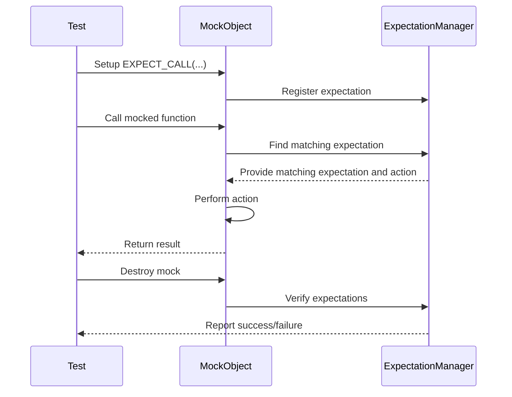

# Mocking Model: Expectations, Actions, Matchers

Unpacking the conceptual model that drives mocking in GoogleMock reveals how expectations, actions, and matchers work together seamlessly to simulate dependencies and validate behavior in unit tests. This guide empowers you to write isolated, precise, and robust tests by understanding these core elements.

---

## 1. Understanding Expectations

### What Are Expectations?
Expectations define **what the test expects a mock object’s method to be called with** and **how many times**. They capture the contract between your test and the code under test, specifying the allowed and required interactions.

By setting expectations, you clearly state:

- Which methods will be invoked
- How often they should be called (cardinality)
- With which arguments (or argument patterns)
- In what order (optionally)

This lets you precisely verify that the code exercises its dependencies correctly, catching interaction bugs early.

### Lifecycle of Expectations
1. **Declaration:** Expectations are created via the `EXPECT_CALL()` macro.
2. **Specification:** Attach clauses to define call count (`Times()`), argument constraints (matchers), call order (`InSequence` or `After`), and behaviors (`WillOnce()`, `WillRepeatedly()`).
3. **Matching:** When the mocked method is called, GoogleMock searches all expectations to find the applicable match based on call arguments and state.
4. **Verification:** Upon destruction of the mock object or explicit verification, GoogleMock checks if expectations were met, reporting failures if calls were missing or out-of-order.


<Check>
You must specify expectations **before** exercising the mock. `EXPECT_CALL` defines *future* calls, not past calls.
</Check>

### Cardinalities: Specifying Call Counts
Expectations use **cardinalities** to declare how many times a method is expected to be called.

Examples include:

- `Times(1)`: Expect exactly one call.
- `Times(AnyNumber())`: Call can happen any number of times.
- `Times(AtLeast(n))`: Called at least n times.
- `Times(0)`: Expected not to be called.

If you omit `Times()`, GoogleMock infers it based on your use of `WillOnce()` and `WillRepeatedly()`.


### Ordering Expectations
By default, calls can occur in any order. To enforce strict call order:

- Use an `InSequence` object to wrap expectations that must occur sequentially.
- Use `After()` clauses to specify dependencies between expectations.

These allow expressing strict or partial orders in call sequences.


### Sticky Expectations
Expectations are **sticky** by default, meaning they stay active even after saturation (reaching max call count), until intervening calls occur or explicit retirement (via `RetiresOnSaturation()`).

This design makes it easier to express common testing scenarios but requires understanding to avoid unexpected failures when calls exceed expected counts.


## 2. Actions: What Happens When a Method Is Called

Expectations can specify what a mocked method should do during invocation via **actions**.

### Default vs Custom Actions
- By default, gMock returns:
  - `void` methods: return immediately.
  - Built-in types: zero or default-constructed value.

- You can customize this behavior using:
  - `ON_CALL()` to set **default** behavior with `.WillByDefault()` clauses.
  - `EXPECT_CALL()` with `.WillOnce()` and/or `.WillRepeatedly()` clauses to specify exact behaviors.

For example:

```cpp
EXPECT_CALL(mock, Foo())
    .WillOnce(Return(10))
    .WillRepeatedly(Return(20));
```

### Common Actions
- `Return(value)`: Return a fixed value.
- `ReturnRef(variable)`: Return by reference.
- `Invoke(function_or_lambda)`: Call a user-defined function/lambda.
- `DoAll(...)`: Sequence multiple actions.
- `SetArgPointee<N>(value)`: Modify output arguments.


### Handling Move-Only Types
gMock supports mocking methods that return or accept move-only types (e.g., `std::unique_ptr`), allowing flexible mock implementations.

### Important Notes
- Action expressions are evaluated once when setting the expectation, not each time the mock method is called.
- To change behavior over multiple calls, chain `.WillOnce()` clauses or combine with `.WillRepeatedly()`.


## 3. Matchers: Matching Method Arguments

Matchers describe **which arguments are acceptable** for a method call. They are predicates evaluated at runtime during mock invocation.

### Basic Usage
- Simple values act as equality matchers (e.g., `EXPECT_CALL(mock, Foo(5))` means expect argument equal to 5).
- Wildcard matcher `_` matches any argument.

```cpp
EXPECT_CALL(mock, Foo(_));  // Accepts any argument.
```

### Built-in and Custom Matchers
- GoogleMock provides many built-in matchers like `Ge()`, `Le()`, `NotNull()`, `HasSubstr()`, etc.
- Users can combine matchers with logical operators `AllOf()`, `AnyOf()`, `Not()`.
- You can define custom matchers for specialized argument validation.

### Advanced Matching
- `With()` clause matches the entire argument tuple.
- `Args<indices>()` and `AllArgs()` can be used to match specific argument subsets.
- `SafeMatcherCast<T>()` helps disambiguate types in overloaded methods.

### Overloaded Methods
For overloaded methods, provide matchers or use the `Const()` helper to indicate which overload you are targeting.


## 4. Uninteresting, Unexpected, and Excessive Calls

Understanding these calls is crucial to writing effective mocks.

- **Uninteresting Call:** A call to a mock method without any expectations set. By default, gMock logs a warning but allows the call.
- **Unexpected Call:** A call that does not match any existing expectations for that method. This is always an error.
- **Excessive Call:** A call that matches an expectation but is called more times than specified by its cardinality.

You can modify how uninteresting calls are handled using `NiceMock` (ignore warnings), `NaggyMock` (the default, warn), or `StrictMock` (fail on uninteresting calls).


## 5. Workflow Example

Consider a mock object `MockTurtle`:

```cpp
TEST(PainterTest, DrawCircleCallsPenDown) {
  MockTurtle turtle;

  // Expect PenDown to be called at least once.
  EXPECT_CALL(turtle, PenDown()).Times(AtLeast(1));

  Painter painter(&turtle);
  painter.DrawCircle(0, 0, 10);

  // Upon test exit, gMock verifies the expectation.
}
```

Here, the expectation clearly states:
- We expect `PenDown()` to be called at least once.
- No explicit default behavior needed here.
- If `PenDown()` is called with incorrect arguments or fewer times, the test fails immediately.


## 6. Troubleshooting Common Pitfalls

- **Expectations after Calls:** Define all expectations before exercising mocks to avoid undefined behavior.
- **Overly Strict Expectations:** Avoid setting too strict argument matchers or call counts which make tests brittle.
- **Order Enforcement:** Use `InSequence` or `After` carefully to avoid deadlocks or overly constrained tests.
- **Uninteresting Call Warnings:** Use `NiceMock` or explicitly add expectations with `.Times(AnyNumber())` to suppress false warnings.
- **Virtual Destructors:** Ensure interfaces have virtual destructors to avoid memory leaks.


## 7. Conceptual Mermaid Diagram: Mocking Flow


```

---

## Additional Best Practices

- Use `ON_CALL` to set up common default behavior shared across many tests.
- Use `EXPECT_CALL` sparingly to verify **only the needed** interactions.
- Use `WillOnce()` for specific one-time behaviors, and `WillRepeatedly()` for persistent behaviors.
- Prefer `NiceMock` for less noisy output unless strict verification is required.

---

## References

- [GoogleMock for Dummies](../docs/gmock_for_dummies.md) — A beginner-friendly introduction to gMock concepts.
- [Mocking Reference](../docs/reference/mocking.md) — Detailed API and usage information.
- [gMock Cookbook](../docs/gmock_cook_book.md) — Recipes and patterns for effective mocking.
- [Expectations API](../api-reference/mocking-matchers-actions/expectations-api.md) — Reference for `EXPECT_CALL` clauses and usage.
- [Actions API](../api-reference/mocking-matchers-actions/actions-api.md) — Details on built-in and custom actions.
- [Matchers API](../api-reference/mocking-matchers-actions/argument-matchers-api.md) — Comprehensive guide to matchers.

---

By mastering the interplay of **expectations**, **actions**, and **matchers**, you gain full control over how mocked dependencies behave and how interactions are verified — turning GoogleMock into a powerful ally for building reliable, maintainable, and precise tests.