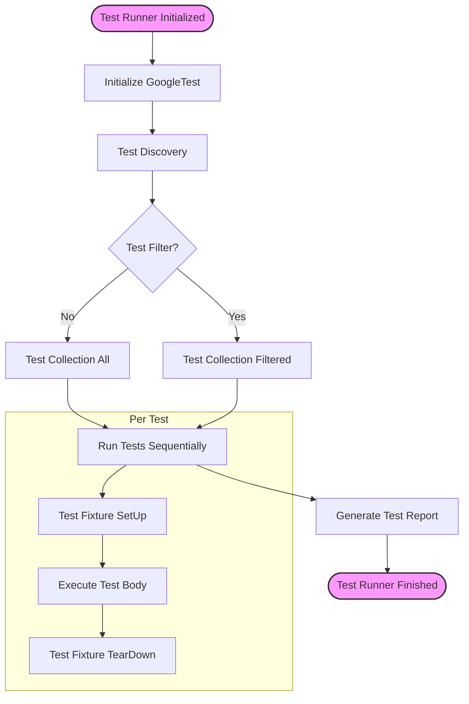

# Test Discovery and Execution Lifecycle

GoogleTest streamlines the process of discovering, executing, and reporting on C++ tests automatically. This page explains how GoogleTest internally manages test lifecycle, from identifying test cases via macros, through automatic registration, running tests with the main test runner, and finally reporting results. Understanding this lifecycle empowers you to write flexible and maintainable test suites that integrate seamlessly with GoogleTest's engine.

---

## Overview of the Test Lifecycle

When you write tests using GoogleTest, you interact primarily with macros such as `TEST` and `TEST_F`. However, behind the scenes, GoogleTest follows a structured sequence:

1. **Test Definition:** Declaring tests with macros triggers automatic registration.
2. **Test Registration:** Tests are registered into internal GoogleTest structures at static initialization phase.
3. **Test Discovery:** GoogleTest collects all registered tests prior to execution.
4. **Test Execution:** The main test runner executes tests, managing order and lifetime.
5. **Test TearDown:** Cleanup happens after each test and test suite.
6. **Result Reporting:** Output summarizing success or failure is generated.

This flow abstracts complexity and offers consistent, repeatable test runs.

---

## Writing Tests with Test Macros

GoogleTest uses convenient macros for defining tests:

- `TEST(TestSuiteName, TestName)` — Defines a simple test.
- `TEST_F(TestFixtureName, TestName)` — Defines a test with shared setup/teardown (test fixture).

These macros expand to create classes and functions that are automatically registered with GoogleTest. This means, just by writing:

```cpp
TEST(CalculatorTest, Addition) {
  EXPECT_EQ(2 + 2, 4);
}
```

GoogleTest knows to include and run this test without further registration.

### How automatic registration works

At static initialization time (before `main()` runs), the test macros expand into special code that adds entries for the tests to GoogleTest's internal registry. This registration ensures that:

- Every declared test is discoverable.
- Tests are uniquely identified by their suite and test names.
- No manual registration is required from you.

This static registration is vital for GoogleTest's ability to enumerate all tests for execution and reporting.

---

## Test Discovery Process

Before running tests, GoogleTest performs discovery — it collects all registered tests into a global list. This step occurs during GoogleTest initialization, typically before your test binary enters the main execution phase.

Discovery ensures:

- GoogleTest has a complete and up-to-date view of all tests.
- Filters and flags can be applied to select which tests to run.
- Test execution order can be managed consistently.

Since registration happens at static initialization, any test defined in the code will be automatically detected.

---

## Test Runner and Execution Order

GoogleTest provides a default `main()` function, or you can write your own custom entry point. The main test runner is responsible for:

- Parsing command line flags (e.g., to filter tests or configure output).
- Invoking global setup routines.
- Executing test cases based on discovery results.
- Managing test fixtures' lifecycle (`SetUp`, `TearDown`).
- Reporting results after each test and after all tests complete.

### Execution order

By default, tests are run in the order they are registered, which corresponds typically to the order they appear in the source code. However, you can influence this by:

- Using `--gtest_shuffle` flag to randomize order.
- Using test filters to include or exclude specific tests.

This flexibility supports both deterministic and exploratory test runs.

---

## Test and Test Suite Lifecycles

### Per-Test Lifecycle

1. **SetUp:** If using a test fixture (`TEST_F`), the `SetUp()` method is called.
2. **Test Body:** The test code runs.
3. **TearDown:** If using a fixture, `TearDown()` is called.

### Per-Test Suite Lifecycle

- If your test fixture class defines `SetUpTestSuite()` and/or `TearDownTestSuite()`, these static methods run before the first test and after the last test in the suite respectively.

This design provides hooks to prepare shared resources for multiple tests or clean them up afterward.

---

## Practical Example

Here's an example test suite demonstrating the lifecycle:

```cpp
class MyFixture : public ::testing::Test {
 protected:
  static void SetUpTestSuite() {
    // Called once before any tests run
    InitDatabase();
  }

  static void TearDownTestSuite() {
    // Called once after all tests run
    CleanupDatabase();
  }

  void SetUp() override {
    // Called before each test
    StartTransaction();
  }

  void TearDown() override {
    // Called after each test
    RollbackTransaction();
  }
};

TEST_F(MyFixture, Test1) {
  ASSERT_TRUE(QueryDatabase("SELECT * FROM users"));
}

TEST_F(MyFixture, Test2) {
  ASSERT_TRUE(AddUser("john"));
}
```

When running, GoogleTest will:

- Call `SetUpTestSuite()` once
- For `Test1`: call `SetUp()`, run test body, call `TearDown()`
- For `Test2`: call `SetUp()`, run test body, call `TearDown()`
- Call `TearDownTestSuite()` once

---

## The Role of the Main Test Runner

GoogleTest comes with a provided `main()` function to reduce boilerplate. It:

- Initializes the framework.
- Performs test discovery.
- Runs all tests.
- Outputs structured results.

If you need to extend or customize test running, you may implement your own `main()`, using GoogleTest APIs, while adhering to the lifecycle steps.

### Platform considerations

Many platform-specific implementations exist to support embedded systems or specialized environments. Make sure to review platform notes if working outside common desktop/server scenarios.

---

## Best Practices and Tips

- Always define tests using the provided macros to enable automatic registration.
- Use fixtures (`TEST_F`) to share expensive setup/teardown across related tests.
- Avoid manual registration; leverage GoogleTest's automatic discovery.
- Use test filters and flags to control execution subsets and order.
- When overriding `main()`, ensure that GoogleTest is properly initialized before running tests.

---

## Troubleshooting

### Test Not Running?
- Ensure your test uses GoogleTest macros for automatic registration.
- Verify that your test file is compiled and linked correctly.
- Check for static initialization order issues preventing registration.

### Tests Running in Unexpected Order?
- Use the `--gtest_shuffle` and `--gtest_random_seed` flags for randomization.
- Otherwise, expect registration order execution.

### Custom `main()` Not Discovering Tests?
- Confirm `::testing::InitGoogleTest(&argc, argv);` is called before `RUN_ALL_TESTS()`.
- Avoid skipping initialization or not registering tests manually.

---

## Conclusion

GoogleTest's test discovery and lifecycle model automates and standardizes your testing workflow. By understanding how tests are registered, discovered, and executed, you can write tests that are scalable, maintainable, and integrate organically into GoogleTest's ecosystem.

---

## Additional Resources

- [GoogleTest Primer](https://github.com/google/googletest/blob/main/docs/primer.md) – for foundational test writing concepts.
- [Writing Mocks and Using Assertions](https://github.com/google/googletest/blob/main/docs/gmock_for_dummies.md) – to enhance tests with mocks.
- [Test Runner Entry Points](api_reference/configuration_and_main_api/runner_entry_points.mdx) – customizing test execution.
- [System Architecture Overview](gtest_overview/architecture_core_concepts/architecture_overview.mdx) – deep dive into system design.


---

## Diagram: GoogleTest Test Execution Flow


