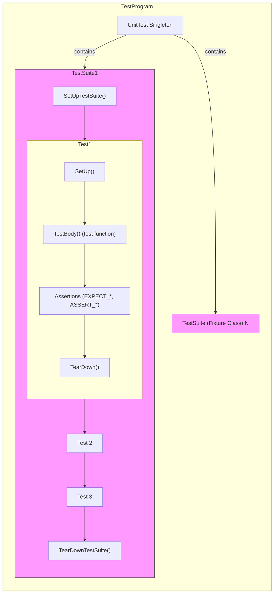

# xUnit Architecture and Test Structure

GoogleTest builds upon the widely adopted xUnit family of testing frameworks, empowering you with a structured and intuitive way to write C++ tests that are systematic, repeatable, and maintainable. This page unpacks the key concepts behind GoogleTest's test architecture—how test cases (test suites), fixtures, and assertions fit together—enabling you to organize your tests effectively across diverse projects.

---

## Understanding the Core Components

GoogleTest is built around a straightforward model inspired by xUnit, organizing tests into hierarchical layers that mirror your production code’s logical structure. Here's the core breakdown:

### 1. Test Suites (Previously Known as Test Cases)

Test suites are the primary containers grouping related tests. Each suite typically corresponds to a class, module, or a logical group within your codebase.

- **Purpose:** To logically group tests that share semantics or test the same component.
- **Behavior:** Tests within one suite may share common setup and teardown routines, improving test consistency and reducing duplication.

> **Note:** GoogleTest has phased out the old terminology _Test Case_ in favor of the clearer term _Test Suite_. This aligns with standard industry nomenclature such as that used by ISTQB.

### 2. Tests

Individual tests exercise specific execution paths or validate particular behaviors within the code under test.

- **Purpose:** To verify one aspect, feature, or scenario.
- **Structure:** Each test is an independent function defined by the `TEST()` macro; it uses assertions to check correctness.

### 3. Test Fixtures

Test fixtures enable sharing common objects and setup code across multiple tests within the same test suite.

- **Definition:** A fixture is a class derived from `testing::Test` that contains shared resources.
- **Lifecycle:** For each test, GoogleTest creates a fresh instance of the fixture, runs `SetUp()`, then the test, followed by `TearDown()`. This keeps tests isolated while avoiding redundant code.

### 4. Assertions

Assertions are boolean predicates that validate expectations about code behavior, expressed via `EXPECT_*` and `ASSERT_*` macros.

- **Nonfatal vs Fatal:** `EXPECT_*` assertions report failure but continue the test, while `ASSERT_*` fail and abort the test immediately.
- **Purpose:** To convey precise pass/fail information that GoogleTest uses to conclude test success.

---

## The Test Flow: From Definition to Execution

Your journey from writing a test to seeing results follows these steps:

1. **Define Tests and Suites**
   - Use `TEST()` for simple cases or `TEST_F()` when using a fixture.
2. **Write Assertions**
   - Integrate assertions like `EXPECT_EQ()`, `ASSERT_TRUE()`, and others to validate behaviors.
3. **Register Tests**
   - GoogleTest automatically registers tests declared via macros.
4. **Run Tests**
   - Tests are executed when you call `RUN_ALL_TESTS()` in `main()`.

During execution, GoogleTest creates a new fixture object per test, runs initialization code, executes assertions, reports results, and cleans up, ensuring total isolation and repeatability.

---

## Test Suite and Test Fixture Lifecycle

Unlike sharing a single test fixture instance among multiple tests, GoogleTest creates and destroys fixture objects **per test** to guarantee test independence. This means:

- Any state modified during a test does not leak to others.
- You can rely on fresh setup for every test case.

When you want to share expensive resources between tests, leverage static members and define:

- `static void SetUpTestSuite()`
- `static void TearDownTestSuite()`

These methods run once before the first test and after the last test in the suite, respectively, letting you manage shared contexts efficiently.

---

## Managing Parameterized and Typed Tests

GoogleTest extends the xUnit structure with powerful constructs for more comprehensive test coverage:

### Parameterized Tests (`TEST_P` and  `INSTANTIATE_TEST_SUITE_P`)

- Allow you to run the same test logic with different data values.
- Define a test fixture derived from `::testing::TestWithParam<T>` where `T` is the parameter type.
- Use `TEST_P` macros to define parameterized tests accessing the parameter with `GetParam()`.
- Instantiate with `INSTANTIATE_TEST_SUITE_P()` using parameter generators like `Values()`, `Range()`, or `Combine()`.

### Typed Tests (`TYPED_TEST_SUITE` and `TYPED_TEST`)

- Repeat the same test logic over multiple types.
- Define a fixture class template parameterized by a type.
- Associate a list of types to the fixture with `TYPED_TEST_SUITE()`.
- Define tests with `TYPED_TEST()`, examining behavior for each type.

### Type-Parameterized Tests (`TYPED_TEST_SUITE_P` and `TYPED_TEST_P`)

- Allow abstract test definitions separated from type lists.
- Register tests individually and instantiate them later with concrete type sets.

These advanced patterns help you target broad functionality without duplicating test code.

---

## Typical User Workflow Example

Here’s a practical illustration of using core elements:

```cpp
// Define a fixture for shared setup
class QueueTest : public testing::Test {
 protected:
  QueueTest() {
    q1_.Enqueue(1);
    q2_.Enqueue(2);
    q2_.Enqueue(3);
  }

  Queue<int> q0_;  // empty
  Queue<int> q1_;  // one element
  Queue<int> q2_;  // two elements
};

// Define tests using the fixture
TEST_F(QueueTest, IsEmptyInitially) {
  EXPECT_EQ(q0_.size(), 0);
}

TEST_F(QueueTest, DequeueWorks) {
  int* n = q0_.Dequeue();
  EXPECT_EQ(n, nullptr);

  n = q1_.Dequeue();
  ASSERT_NE(n, nullptr);
  EXPECT_EQ(*n, 1);
  EXPECT_EQ(q1_.size(), 0);
  delete n;

  n = q2_.Dequeue();
  ASSERT_NE(n, nullptr);
  EXPECT_EQ(*n, 2);
  EXPECT_EQ(q2_.size(), 1);
  delete n;
}
```

- Each `TEST_F` creates a new `QueueTest` object.
- The fixture's constructor initializes queues.
- Tests perform assertions verifying queue behavior.

Success and failure results are collected, ensuring tests are independent and maintainable.

---

## Internals Exposed for User Control

While most users interact only with the API macros, GoogleTest maintains a rich set of classes underpinning tests:

- **`testing::Test`**: Base class for tests and fixtures.
- **`testing::TestSuite`**: Groups tests, handles suite-level setup/teardown.
- **`testing::TestInfo`**: Contains metadata about individual tests.
- **`testing::TestResult`**: Records test pass/fail and timing info.
- **`testing::UnitTest`**: Singleton managing the entire test program execution.

Understanding these concepts helps when you want to extend or customize your testing workflows.

---

## Harnessing GoogleTest Flags & Execution Controls

Flags like `--gtest_filter` let you run subsets of tests. Fixtures with shared setup allow efficient resource management. Assertions split into fatal and non-fatal variants help you control failure behavior.

Execution starts by calling `testing::InitGoogleTest()`, then `RUN_ALL_TESTS()` runs all registered tests, invoking setup/teardown and gathering results.

---

## Common Pitfalls & Best Practices

- **Avoid shared mutable state between tests** unless managed carefully through suite-level fixtures.
- **Distinguish `ASSERT_*` and `EXPECT_*` carefully**: Use ASSERT when continuing is unsafe.
- **Name test suites and tests consistently**, avoiding underscores, to maximize tool compatibility.
- **Always return the result of `RUN_ALL_TESTS()` from `main()`**.

---

## Visualizing the xUnit Structure



This diagram captures the lifecycle:
- The singleton `UnitTest` contains multiple `TestSuite`s (fixtures).
- Each `TestSuite` performs setup once, executes its tests sequentially, then performs teardown.
- Each individual test creates a fresh fixture instance, runs setup, executes `TestBody()`, performs assertions, then teardown.

---

## Additional Resources

- [GoogleTest Primer](primer.md): For getting started and core APIs.
- [Testing Reference](reference/testing.md): Details on test macros, parameters, and classes.
- [Advanced Topics](advanced.md): To master typed tests, parameterized tests, and fixture optimizations.

Explore these to deepen your understanding and write effective tests with GoogleTest.

---

## Summary

This guide laid out how GoogleTest applies the xUnit testing architecture to C++ environments. Understanding test suites, test fixtures, assertions, and test execution flow is crucial to write organized, efficient, and robust tests. Use fixtures to share setup code, assertions to verify expected behaviors, and harness parameterized or typed tests to broaden test coverage without redundancy.

Your adventure with GoogleTest starts here—well-structured tests today lead to confident releases tomorrow.