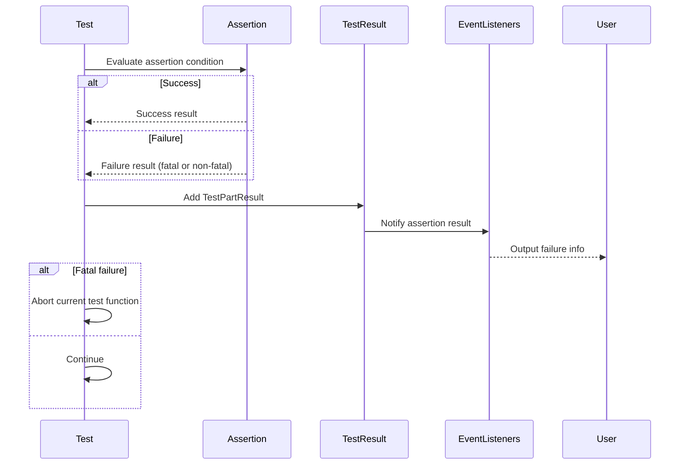

# Assertions and Test Results in GoogleTest

Explore how GoogleTest's assertion framework validates code behavior, distinguishes between fatal and non-fatal failures, and provides detailed feedback. Understand the structure of assertion results and how they are reported back to users during test execution.

---

## Introduction to Assertions and Test Results

At the heart of GoogleTest is a rich assertion framework designed to verify program correctness during tests. Assertions are the building blocks that check specific conditions in test code, determining whether a test has passed, failed, or should be aborted.

GoogleTest assertions provide detailed feedback when a condition fails, including the precise location in the source code, the expected vs. actual values, and contextual messages—empowering developers to quickly diagnose issues.

### Key Assertion Outcomes

- **Success**: The condition is met; the test continues.
- **Non-fatal Failure**: A failed check that allows the test function to continue executing (via `EXPECT_*` macros).
- **Fatal Failure**: A failed check that immediately aborts the current function (via `ASSERT_*` macros or explicit fatal failure macros).
- **Skipped**: A test that is intentionally skipped at runtime via `GTEST_SKIP()`, producing a skip result.

Understanding these outcomes helps developers design test flows that behave predictably and provide maximum diagnostic value.

---

## Assertion Framework Workflow

1. **Assertion Macros Usage**
   - Users write tests using macros like `EXPECT_EQ`, `ASSERT_TRUE`, `EXPECT_DEATH`, and others.
   - These macros evaluate expressions and produce assertion results.

2. **Evaluation and Message Generation**
   - Assertions are evaluated exactly once (ensuring no side-effect surprises).
   - On failure, detailed messages are constructed describing the nature of the failure, including expression text, values, and optionally diffs for strings.

3. **Result Reporting**
   - Failures are reported as `TestPartResult` objects, which contain:
     - Failure type (`kSuccess`, `kNonFatalFailure`, `kFatalFailure`, or `kSkip`)
     - Source file and line number
     - Failure message
     - Optional OS-specific stack trace

4. **Event Notification**
   - GoogleTest's event listeners receive notifications about assertion results to produce output, such as console printing, XML/JSON report generation, or streaming.

5. **Test Result Aggregation**
   - `TestResult` objects collect all assertion results within a test.
   - Determines overall test success/failure based on the presence of fatal or non-fatal failures.

---

## Assertion Types in GoogleTest

### Explicit Success and Failure

- **`SUCCEED()`**: Marks an explicit success; mostly documentary.
- **`FAIL()`**: Generates a fatal failure and aborts the current function.
- **`ADD_FAILURE()`**: Generates a non-fatal failure; test continues.
- **`ADD_FAILURE_AT(file, line)`**: Same as `ADD_FAILURE()` but sets location explicitly.

### Boolean Assertions

- **`EXPECT_TRUE(condition)/ASSERT_TRUE(condition)`**: Verifies `condition` is true.
- **`EXPECT_FALSE(condition)/ASSERT_FALSE(condition)`**: Verifies `condition` is false.

### Comparison Assertions

- **Equality and Inequality**:
  - `EXPECT_EQ(val1, val2)/ASSERT_EQ(val1, val2)`
  - `EXPECT_NE(val1, val2)/ASSERT_NE(val1, val2)`
- **Relational Operators**:
  - `EXPECT_LT/ASSERT_LT`, `EXPECT_LE/ASSERT_LE`, `EXPECT_GT/ASSERT_GT`, `EXPECT_GE/ASSERT_GE`

### String Assertions

- **`EXPECT_STREQ/ASSERT_STREQ`**: Checks C-strings for equality.
- **`EXPECT_STRNE/ASSERT_STRNE`**: Checks C-strings for inequality.
- **Case-insensitive variants**: `EXPECT_STRCASEEQ/ASSERT_STRCASEEQ`, `EXPECT_STRCASENE/ASSERT_STRCASENE`

### Floating-Point Assertions

- **`EXPECT_FLOAT_EQ/ASSERT_FLOAT_EQ`**: Compares floats approximately (within 4 ULPs).
- **`EXPECT_DOUBLE_EQ/ASSERT_DOUBLE_EQ`**: Compares doubles approximately (within 4 ULPs).
- **`EXPECT_NEAR/ASSERT_NEAR`**: Compares with absolute error bounds.

### Exception Assertions

- **`EXPECT_THROW/ASSERT_THROW(statement, exception_type)`**: Verifies `statement` throws specified exception.
- **`EXPECT_ANY_THROW/ASSERT_ANY_THROW(statement)`**: Verifies any exception is thrown.
- **`EXPECT_NO_THROW/ASSERT_NO_THROW(statement)`**: Verifies no exceptions are thrown.

### Predicate Assertions

Predicate assertions extend boolean assertions by providing richer failure messages:

- **`EXPECT_PRED*` and `ASSERT_PRED*`**: Use predicates returning `bool`.
- **`EXPECT_PRED_FORMAT*` and `ASSERT_PRED_FORMAT*`**: Use predicate-formatters returning `AssertionResult` objects for customizable messages.

Example predicate-formatter signature:

```cpp
AssertionResult PredicateFormatter(const char* expr1, ..., T1 val1, ...);
```

---

## Detailed Structure of Assertion Results

GoogleTest represents the outcome of each assertion as an object containing:

- **Type of result**:
  - `kSuccess`: Assertion succeeded.
  - `kNonFatalFailure`: Failed but test continues.
  - `kFatalFailure`: Failed and aborts current function.
  - `kSkip`: Test skipped.

- **File and line**: Source location where the assertion appears (or explicit override).

- **Message**: Composed failure message, including:
  - Expression text causing failure.
  - Actual and expected values, formatted clearly.
  - Diff when applicable, particularly for strings.
  - Additional user-provided streamed messages.
  - Stack trace when enabled.

`TestPartResult` objects hold this data. They are combined into `TestResult` per test, maintaining the list of all failures.

The `TestInfo` class manages tests metadata and lifecycle, including their associated `TestResult`.

---

## Reporting and Output of Test Results

GoogleTest uses an extensible event listener architecture for reporting test results:

- **TestEventListener**: Interface receiving callbacks at various points (test start/end, assertion results, suite start/end).

- **Default Printers**:
  - `PrettyUnitTestResultPrinter`: Default console output with colors and formatting.
  - `BriefUnitTestResultPrinter`: Minimal console output showing only failures.
  - XML and JSON printers: Produce machine-readable result reports.

- **StreamingListener**: Sends test results via network socket, encoding special characters.

During test execution, listeners receive detailed events including `TestPartResult` for each assertion, enabling flexible consumption of test data.

---

## Using Assertion Messages Effectively

GoogleTest assertions support streaming operator (`<<`) to append custom failure messages.

Example:

```cpp
EXPECT_EQ(Count(), expected_count) << "Count mismatch in iteration " << i;
```

Such messages are appended to the auto-generated failure description, helping provide context.

Wide strings streamed in assertions are converted to UTF-8 for readable output.

---

## Skipping Tests at Runtime

Tests can be skipped using the `GTEST_SKIP()` macro, optionally with a message.

Example:

```cpp
TEST(FooTest, Bar) {
  if (!IsPlatformSupported()) {
    GTEST_SKIP() << "Platform not supported";
  }
  ... test body ...
}
```

A skipped test produces a `kSkip` result and reports accordingly, allowing selective execution paths.

---

## Common Pitfalls and Best Practices

- Use `EXPECT_*` macros when you want tests to continue after failures and report multiple errors.
- Use `ASSERT_*` macros when it's unsafe to continue after failure as it aborts the current function.
- Always evaluate expressions in assertions only once to avoid side effects.
- Use predicate-format assertions (`EXPECT_PRED_FORMAT*`) for better failure explanations on complex conditions.
- Append meaningful custom messages to aid failure diagnostics.
- Use `GTEST_SKIP()` to skip dynamically when preconditions are unmet.
- Avoid fatal assertions in destructors or constructors; use `SetUp()`/`TearDown()` instead.

---

## Example: Writing a Simple Assertion

```cpp
TEST(FactorialTest, HandlesZeroInput) {
  EXPECT_EQ(Factorial(0), 1) << "Factorial of zero should be one.";
}
```

If `Factorial(0)` does not return `1`, GoogleTest will print a failure like:

```
Value of: Factorial(0)
  Actual: 0
Expected: 1
Factorial of zero should be one.
```

---

## Internal Utilities for Assertion Messages

GoogleTest uses internal helpers to generate detailed messages:

- **`EqFailure`**: Generates detailed diff-style messages for equality assertions like `EXPECT_EQ()`.
- **`GetBoolAssertionFailureMessage`**: Formats boolean assertion failures like `EXPECT_TRUE()`.
- **Floating-point comparisons**: Implemented as predicate-formatters, comparing with ULP-based tolerances.

These utilities ensure concise, informative messages that aid debugging complex test failures.

---

## Summary Flow of a Test with Assertions


```

## Troubleshooting Common Assertion Issues

- **Misuse of fatal assertions in non-void functions**: Fatal assertions (`ASSERT_*`) can only be used in `void` functions because they abort the current function immediately.
- **Multiple evaluation issues**: Arguments to assertion macros are evaluated exactly once; avoid side effects in the expressions for consistent results.
- **Missing informative failure messages**: Use predicate-format functions or append stream messages for richer diagnostics.

---

## Additional Resources

- [GoogleTest Primer](https://github.com/google/googletest/blob/main/docs/primer.md) for foundational understanding.
- [Assertions Reference](https://github.com/google/googletest/blob/main/docs/reference/assertions.md) for complete list of assertions.
- [Advanced GoogleTest Topics](https://github.com/google/googletest/blob/main/docs/advanced.md) for complex assertion patterns and best practices.
- [Test Lifecycle & Execution Flow](https://github.com/google/googletest/blob/main/docs/concepts/core-testing-model/test-lifecycle.md) for understanding test execution.

---