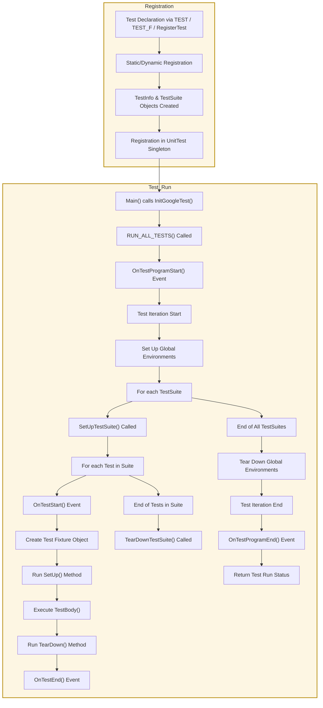

# Test Discovery and Lifecycle

Understanding how your tests come to life — from automatic discovery, registration, to execution — equips you to use GoogleTest more effectively and predictably. This guide unpacks the core flows of test lifecycle, illustrating when and how your test code runs during the execution of your test program.

---

## Overview: The Journey of a Test

GoogleTest automates the orchestration of your tests. You don't have to manually register tests or call them one-by-one — GoogleTest handles this via static registration and a central test runner.

### What Happens Behind the Scenes?

1. **Test Declaration and Registration**: When you write a test using macros like `TEST`, `TEST_F`, or dynamically register with `RegisterTest()`, GoogleTest immediately creates internal objects representing your test and test suite, registering them with a singleton controller.
2. **Test Program Initialization**: Upon running your test executable, you initialize GoogleTest with `InitGoogleTest()`, which parses flags and prepares the test environment.
3. **Test Execution**: Invoking `RUN_ALL_TESTS()` triggers the test runner. It consults the registry of all tests and manages the automated setup, execution, teardown, and reporting of each test in the proper order.


---

## Test Registration: From Code to Catalog

When you write a test, such as

```cpp
TEST(FooTest, DoesBar) {
  // Test code here
}
```

GoogleTest registers this test automatically during static initialization. Registration involves:

- Creating a `TestInfo` instance encapsulating metadata about your test (test suite name, test name, source file location, whether it should run based on filters).
- Associating the test with a `TestSuite` object (previously called test case).
- All registered tests are centralized in the `UnitTest` singleton.

#### Dynamic Registration

GoogleTest also supports dynamic test registration at runtime via the `RegisterTest()` API, useful for generating tests programmatically before execution begins.

---

## Test Lifecycle: How Tests Are Run

Once registered, tests follow a controlled lifecycle orchestrated by the test runner.

1. **Test Program Start**: The test runner receives control and fires an event `OnTestProgramStart`. This is the first hook where custom listeners or observers can prepare for running tests.

2. **Test Iterations**: Controlled by the `--gtest_repeat` flag, tests can run multiple iterations. Each iteration fires `OnTestIterationStart`.

3. **Environment SetUp**:
   - For each iteration, registered global test environments (subclasses of `Environment`) have their `SetUp()` method invoked.
   - Corresponding events are fired before (`OnEnvironmentsSetUpStart`) and after (`OnEnvironmentsSetUpEnd`).

4. **Test Suite SetUp**:
   - Before any test in a suite, the test suite's static `SetUpTestSuite()` method runs.
   - The event `OnTestSuiteStart` is triggered.

5. **Individual Test Execution**:
   - Before running, event `OnTestStart` is called.
   - The fresh test fixture object is created, and `SetUp()` is invoked.
   - The test's actual code runs inside `TestBody()`.
   - Assertions and expectations record results.
   - After completion, `TearDown()` is called.
   - Event `OnTestEnd` signals the test finished.

6. **Test Suite TearDown**:
   - After all tests in a suite finish, static `TearDownTestSuite()` runs.
   - Event `OnTestSuiteEnd` fires.

7. **Environment TearDown**:
   - Global environments execute `TearDown()` accordingly.
   - Events `OnEnvironmentsTearDownStart` and `OnEnvironmentsTearDownEnd` mark this.

8. **Test Iteration End**:
   - Post iteration, `OnTestIterationEnd` fires.

9. **Test Program End**:
   - Finally, `OnTestProgramEnd` is fired.

---

## Event Listeners: Observing Test Activity

You can attach custom `TestEventListener`s to listen to these lifecycle events.

- GoogleTest provides a default result printer and XML generator that do this by default.
- You can append your own listeners for detailed reporting, logging, or to hook custom behaviors.


---

## Filtering and Running Tests

Not all tests may run in every invocation. Tests are filtered prior to running, based on:

- Explicit command-line filters (e.g., `--gtest_filter=FooTest.*`).
- Disabled status — tests prefixed with `DISABLED_` don't run unless explicitly asked.
- Sharding environment variables, which split the test workload for parallel runs.

Each test can be evaluated against the filter to decide if it should run or be skipped.


---

## Understanding Test Results

Each test run produces a `TestResult` object containing:

- Pass or fail status (including fatal and non-fatal failures)
- Skipped status
- Timing information (start time, elapsed milliseconds)
- Details of assertions (`TestPartResult`s) and properties

### Aggregated Results

- `TestSuite` collects results from all its tests and tracks suite-wide success.
- `UnitTest` collects overall run statistics.


---

## Test Discovery and Execution Flow Diagram



This flow visualizes the journey from test definitions in source code to execution and reporting.

---

## Practical Tips for Users

- **Write your tests using the recommended macros** (`TEST`, `TEST_F`, `TEST_P`). This triggers automatic registration.
- **Use `SetUpTestSuite()` and `TearDownTestSuite()` for expensive or shared state initialization that applies for all tests in a suite.**
- **Leverage environment objects** to configure global setup and teardown for your whole test program.
- **Apply filters to run subsets of tests for efficient feedback**.
- **Use event listeners only if you need customized reporting or behavior during test execution.**
- **Always respect the lifecycle callbacks — do not override internal execution mechanics; use provided hooks.**

---

## Troubleshooting Common Lifecycle Issues

- If your `SetUp()` or `TearDown()` functions are not called, double-check the capitalization (`SetUp` not `Setup`).
- Disabled tests prefixed with `DISABLED_` will not run unless the `--gtest_also_run_disabled_tests` flag is set.
- Tests may be skipped if they do not match the filter criteria.
- Confirm that you invoke `InitGoogleTest()` before `RUN_ALL_TESTS()` to ensure registration and flags are properly initialized.


---

By mastering these concepts of test discovery and lifecycle, you'll better understand when your test code runs, and how to control its execution in GoogleTest.

# Additional Resources
- [GoogleTest Primer](../primer.md) — for beginner-focused testing concepts
- [Test Macros and Test Suites Reference](../api-reference/core-testing-apis/test-macros-suites.md)
- [Test Event Listeners Guide](../guides/core-workflows/writing-and-organizing-tests.md#extending-test-execution)
- [Advanced GoogleTest Topics](../advanced.md) — for customization and lifecycle details
- [GoogleTest FAQ on Test Fixtures and Lifecycle](../faq.md#MySetUpfunctionisnotcalledWhy)

---

For practical samples and usage, see the [GoogleTest Samples directory](https://github.com/google/googletest/tree/main/googletest/samples).