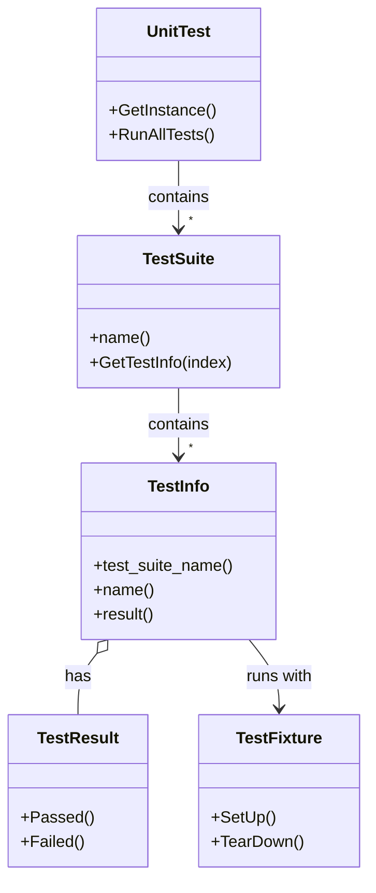

# xUnit Architecture & Test Structure

GoogleTest is built upon the popular xUnit testing architecture, designed to drive clear, maintainable, and reliable C++ tests. This page unpacks how GoogleTest implements core xUnit concepts — separating individual tests, test suites, and test fixtures — enabling modular test design and code reuse.

---

## Understanding the Core Components

### Test

A *test* in GoogleTest corresponds to a single executable unit verifying one particular behavior or case of your code. It contains assertions you write to check expected outcomes.

- **Definition:** Individual tests are defined using macros such as `TEST()` or `TEST_F()`, which automate registration and execution.
- **Characteristics:** Each test is isolated with its own fresh fixture instance, ensuring independence and repeatability.
- **Naming:** Tests are uniquely identified within their *test suite* by name.

Example of a simple test:

```cpp
TEST(MathTest, Addition) {
  EXPECT_EQ(2 + 2, 4);
}
```

### Test Suite

A *test suite* groups logically related tests under one umbrella, typically corresponding to the class, component, or module under test. This grouping improves organization, reporting clarity, and resource sharing.

- **Composition:** Each test suite contains multiple tests.
- **Naming:** Test suites are named explicitly, commonly suffixed with `Test` (e.g., `MathTest`).
- **Scope:** Enables shared setup and teardown at the suite level.

Example:

```cpp
TEST(MathTest, Addition) { ... }
TEST(MathTest, Subtraction) { ... }
```

Both tests belong to the `MathTest` suite.

### Test Fixture

A *test fixture* provides a reusable environment for tests within a test suite by grouping common setup and teardown code, and shared data.

- **Implementation:** Defined by inheriting from `testing::Test`. 
- **Lifecycle:** GoogleTest creates a new fixture object for each test, calls `SetUp()`, runs the test, then calls `TearDown()`.
- **Benefits:** 
  - Eliminates duplicate setup code.
  - Ensures tests are independent despite shared resources.
  - Supports expensive resource management via static methods for suite-level setup and teardown.

Example fixture:

```cpp
class QueueTest : public testing::Test {
 protected:
  void SetUp() override {
    q_.Enqueue(1);
  }
  void TearDown() override {
    // Cleanup if necessary
  }

  Queue<int> q_;  // Shared resource
};

TEST_F(QueueTest, IsEmptyInitially) {
  EXPECT_EQ(q_.size(), 1);
}
```

---

## From Test Definition to Execution Flow

GoogleTest manages registration and execution of tests seamlessly:

1. **Definition:** Using the `TEST` or `TEST_F` macros, tests and fixtures are declared.
2. **Registration:** Each macro registers the test with internal GoogleTest structures before `RUN_ALL_TESTS()`.
3. **Execution:** When `RUN_ALL_TESTS()` is called (typically in `main()`), GoogleTest iterates over all test suites and runs each test sequentially.
4. **Test Isolation:** For each test, a new test fixture instance is created and initialized via `SetUp()`. The test body runs next, followed by `TearDown()`. The fixture is then destroyed.
5. **Reporting:** Results are aggregated per test and test suite, accessible to listeners and reporters.

The fresh fixture instance per test maximizes isolation and avoids unintended test interactions.

---

## Advanced Test Suite Setup: Shared Resources

Expensive resources used across multiple tests should be set up once per suite, rather than per test, for efficiency.

- Define `static` members in your fixture for shared resources.
- Implement `static void SetUpTestSuite()` and `static void TearDownTestSuite()` to setup/cleanup those static members.

Example:

```cpp
class DatabaseTest : public testing::Test {
 protected:
  static void SetUpTestSuite() {
    db_connection_ = new DBConnection("test-db");
  }

  static void TearDownTestSuite() {
    delete db_connection_;
    db_connection_ = nullptr;
  }

  void SetUp() override {
    // Setup for each test
  }

  static DBConnection* db_connection_;
};

DBConnection* DatabaseTest::db_connection_ = nullptr;

TEST_F(DatabaseTest, QueryWorks) {
  auto result = db_connection_->Query("SELECT * FROM users");
  EXPECT_TRUE(result.IsValid());
}
```

Important considerations:

- The test order is undefined; tests cannot rely on sequence.
- Shared state must be constant or restored between tests to maintain isolation.

---

## Relationship Diagram

This diagram visualizes the relationships among the core xUnit components in GoogleTest:



- The `UnitTest` singleton contains multiple `TestSuite` instances.
- Each `TestSuite` manages multiple `TestInfo` objects, representing individual tests.
- Each test is executed with its associated `TestFixture` class.
- Test results (`TestResult`) hold the outcome for each test.

---

## Tips & Best Practices

- **Name test suites and tests clearly:** Use meaningful, consistent naming reflecting your code structure. Avoid underscores for better integration.
- **Use test fixtures wisely:** Encapsulate common setup/teardown in fixtures to avoid duplicated setup code.
- **Use static suite-level setup for expensive resources:** Implement `SetUpTestSuite()` and `TearDownTestSuite()` to improve performance.
- **Keep tests isolated:** Avoid sharing mutable state; reset any changed state to prevent flaky tests.
- **Leverage inheritance:** Fixtures and tests can inherit to share or extend behavior.

---

## Troubleshooting Common Issues

<AccordionGroup title="Troubleshooting xUnit Test Structure Issues">
<Accordion title="Test Compilation Errors: 'virtual outside class declaration'">
This error typically occurs when `TEST_F` is used without first defining the corresponding test fixture class. Define the fixture by inheriting from `testing::Test` before using `TEST_F`.
</Accordion>
<Accordion title="Tests Not Running or Discovered">
Ensure tests are registered before `RUN_ALL_TESTS()` and are not disabled (do not prefix test names or test suite names with `DISABLED_`). Check filter flags like `--gtest_filter` which may limit tests run.
</Accordion>
<Accordion title="Shared Resource Leaks in Tests">
If you use static resources in fixtures with `SetUpTestSuite()`, ensure they are freed in `TearDownTestSuite()`. Otherwise, resources may leak between test runs.
</Accordion>
<Accordion title="Tests Affecting Each Other">
Ensure that test fixtures do not share mutable state across tests, or reset state as needed. Each test runs in a fresh fixture instance; avoid static mutable data unless carefully managed.
</Accordion>
</AccordionGroup>

---

## Further Reading & Next Steps

To deepen your understanding and progress with writing well-structured tests using GoogleTest:

- [GoogleTest Primer](https://google.github.io/googletest/primer.html) — A gentle introduction for beginners.
- [Writing and Organizing Test Suites](../guides/core-workflows/writing-and-organizing-tests.md) — Detailed guidance on organizing tests effectively.
- [Test Macros and Suites Reference](../api-reference/core-testing-apis/test-macros-suites.md) — Comprehensive reference for test definition APIs.
- [Assertions: Expressing Expectations](../concepts/core-testing-models/assertion-model.md) — Learn how to write effective assertions.

Explore these resources to build your test suite infrastructure with confidence and mastery.

---

## Summary

This page described how GoogleTest implements the xUnit architecture, explaining the roles of individual tests, test suites, and fixtures. It detailed how modularization, isolation, and reusable setup allow you to write scalable, reliable tests with shared resources optimized through suite-level setup and teardown. Practical guidance, best practices, and common troubleshooting scenarios were included to help you successfully structure your test code.

---