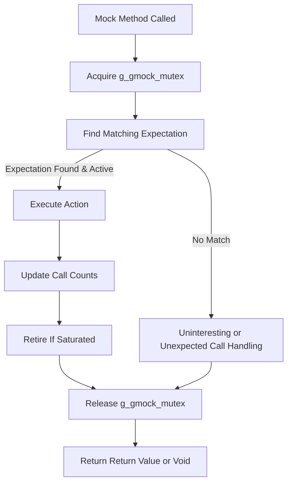

# Mocking and Expectations: Internals & Abstractions

Gain a practical understanding of GoogleMock’s design around mocks, expectations, actions, and matchers. Learn how method interception, call verification, and expectation sequencing are achieved, and how the Cardinality and Matcher abstractions enable powerful, composable tests.

---

## Introduction

At the core of GoogleMock's powerful mocking framework lies a rich design that orchestrates how mocks and expectations work internally. This page unveils the concepts and abstractions enabling GoogleMock to intercept method calls, validate expectations, compose matchers, and sequence calls efficiently and reliably.

Through this understanding, users can better appreciate how gMock delivers expressive testing without compromising speed or robustness.

---

## Core Components

### 1. Mock Objects and Mock Function Mocker

- **Mock Objects:** These are user-defined mock classes inheriting from interfaces or concrete types, where mocked methods are declared via `MOCK_METHOD`.
- **Function Mocker:** Internally represented by `UntypedFunctionMockerBase` (in `gmock-spec-builders.cc`), this class tracks all expectations and default actions attached to a particular mock method.
- **Registration:** Each mock method registers itself with its parent mock object in the global mock object registry, ensuring centralized management and verification.

> **User's Perspective:** When you create a mock class and set expectations (e.g., via `EXPECT_CALL`), under the hood, these calls are recorded and managed by the framework's function mocker objects associated with each mock method.

---

### 2. Expectations

- **ExpectationBase:** Represents an individual expectation on a mock method.
  - Tracks call counts, specified cardinality (e.g., number of expected calls), and whether it has retired.
  - Supports sequences and ordering constraints by maintaining pre-requisites and unsatisfied dependencies.
- **Cardinality:** Encapsulates how many times an expectation should be called, supporting flexible constructs like `Exactly(1)`, `AtLeast(2)`, or ranges.
- **RetiresOnSaturation:** An optional clause to mark an expectation as inactive once fully satisfied, allowing further matching by other expectations.

> **How it works:** Each time the mocked method is called, the framework checks active expectations in reverse order, matching arguments and cardinality. Calls to a fully satisfied expectation can either lead to errors or fallback to other expectations or default actions.

---

### 3. Matchers and Argument Matching

- **Matchers:** Core predicates used to verify if function arguments meet expected criteria.
- **Extra/Compound Matchers:** Alongside argument-wise matchers, `.With()` clauses enable multi-argument matching as a tuple, allowing checks on relationships between arguments.
- **Evaluation:** On each mock method invocation, GoogleMock iterates over expectations checking matchers and multi-argument matchers to find the best fit.

> **Concrete Example:** In `EXPECT_CALL(mock, Foo(_, _)).With(Lt())`, the `With` clause ensures that the first argument is less than the second, modeling complex argument validation beyond per-parameter matching.

---

### 4. Method Interception and Call Dispatch

- Upon call to a mock method, GoogleMock:
  1. Identifies the mock object and specific mocked method.
  2. Acquires global synchronization lock to manage thread safety.
  3. Looks up matching expectations starting from the most recently declared.
  4. Verifies if the expectation is active, matches arguments via matchers, and satisfies sequencing prerequisites.
  5. Executes the associated action: `WillOnce()`, `WillRepeatedly()`, or default.
  6. Updates call counts and retires expectations as needed.
  7. Releases the synchronization lock.

This flow guarantees ordered, consistent, and composable matching of calls and expectations in multithreaded scenarios.

---

### 5. Sequencing and Ordering of Calls

- **Sequences:** A `Sequence` object defines an ordered chain of expectations.
- **InSequence Clause:** Using `.InSequence()` associates expectations with one or more sequences, enforcing call order.
- **Implicit Sequences:** `InSequence` objects create implicit sequences for scoping ordering constraints easily.
- **After Clause:** `.After()` allows declaring expectation dependencies on arbitrary other expectations or sets, directly encoding partial orderings.

The framework manages prerequisite satisfaction and retirement automatically to ensure active expectations reflect the sequencing semantics.

---

### 6. Handling Uninteresting, Unexpected, and Excessive Calls

- **Uninteresting Calls:** Calls to a mock method without any matching `EXPECT_CALL`. By default, these generate warnings (`NaggyMock` behavior) unless suppressed (`NiceMock`) or treated as errors (`StrictMock`).
- **Unexpected Calls:** Calls that don't match any expectation's argument matchers or sequencing. These cause test failures.
- **Excessive Calls:** Calls exceeding the cardinality constraint of matched expectations trigger errors but still perform default or fallback actions to allow continuation.

Users can control reaction to these scenarios per mock object via methods like `Mock::AllowUninterestingCalls()` or wrappers like `NiceMock`, `NaggyMock`, and `StrictMock`.

---

## Progressive Abstraction with Examples

### Creating Expectations and Actions

```cpp
using ::testing::_;
using ::testing::Return;
using ::testing::AtLeast;

class MockFoo {
 public:
  MOCK_METHOD(int, DoSomething, (int x), (override));
};

// Setting an expectation:
MockFoo mock;
EXPECT_CALL(mock, DoSomething(_))
    .Times(AtLeast(1))
    .WillOnce(Return(42));

int result = mock.DoSomething(10);  // Returns 42
```

### Sequencing Example

```cpp
Sequence seq;
EXPECT_CALL(mock, DoSomething(5)).InSequence(seq);
EXPECT_CALL(mock, DoSomething(10)).InSequence(seq);

mock.DoSomething(5);   // Ok
mock.DoSomething(10);  // Ok
```

Calling `DoSomething(10)` before `DoSomething(5)` will cause a failure due to sequence order.

---

## Practical Tips & Common Pitfalls

- Always set your expectations *before* the mock methods are called to avoid undefined behavior.
- Use `RetiresOnSaturation()` to make expectations that should no longer be matched after saturating.
- If you find unexpected uninteresting call warnings, consider using `NiceMock` or explicitly setting expectations with `Times(AnyNumber())`.
- Beware that expectations are "sticky" by default; after they reach their upper limit, they remain active unless retired, often leading to upper-bound violations.
- When tests seem to fail unexpectedly due to order constraints, check whether sequences or `.After()` dependencies are correctly set.

---

## Troubleshooting

### Common Issues

- **Unmatched Calls:** Failures indicating no matching expectation found.
  - Verify argument matchers.
  - Check call order constraints.

- **Too Many Calls:** Error when calls exceed `Times` upper bound.
  - Confirm `RetiresOnSaturation` if you want expectations to retire.
  - Check for leftover calls outside intended test scope.

- **Uninteresting Calls Warnings:** Calls made without `EXPECT_CALL`.
  - Either add broad expectations or use `NiceMock` to suppress.

### Debugging Techniques

- Use `--gmock_verbose=info` flag to see detailed call traces and expectation matching.
- Use explicit sequences or `.After()` to clarify call ordering.
- Leverage `Mock::VerifyAndClearExpectations(mock_obj)` to force verification and identify leaks or unsatisfied expectations.

---

## Visualization: Simplified Call Flow



This simplified diagram shows the key stages for a mock method call: synchronization, expectation matching, action execution, and call verification.

---

## Summary

Understanding these internals lets you harness GoogleMock's full power by strategically writing expectations, using sequences, and managing mock object behavior. This foundation reveals why GoogleMock’s syntax — notably `EXPECT_CALL`, `ON_CALL`, cardinalities, matchers, sequences, and strictness modifiers like `NiceMock` — delivers reliable interaction-based testing with minimal fuss.

---

## Additional Resources

- [Mocking Reference](../reference/mocking.md): Formal API details for mocks, expectations, matchers, and actions.
- [gMock for Dummies](../gmock_for_dummies.md): Beginner-friendly introduction and practical examples.
- [gMock Cookbook](../gmock_cook_book.md): Recipes and best practices.
- [Nice, Strict, and Naggy Mock Classes](../api-reference/mocking-apis/mock-class-behaviors.md): Controlling uninteresting calls behavior.
- [Call Count Expectations (Cardinalities)](../api-reference/matchers-and-actions/call-cardinalities.md)

---

**Source:** Refer to the core implementation in `googlemock/src/gmock-spec-builders.cc` for a detailed technical view of these systems.

---

For practical usage guidance and tips, the [Using Mocks: Patterns and Best Practices](../guides/mocking-and-advanced-techniques/using-mocks.md) guide complements this concepts document with workflows and design insights.