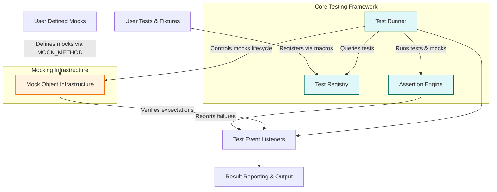

# System Overview

An introduction to the overall architecture of GoogleTest and GoogleMock, highlighting the main components such as the test runner, assertion engines, and mock object infrastructure. This guide helps you understand how your user-written tests are discovered, registered, and executed within the framework, presenting the core workflow that brings your testing code to life.

---

## Understanding the GoogleTest & GoogleMock Architecture

GoogleTest and GoogleMock together form a robust and comprehensive C++ testing framework. At its core, this system facilitates writing, organizing, and running tests and mocks efficiently, providing detailed reporting and diagnostic messages for test results.

The system is designed around key components that interact seamlessly to deliver automated test execution and validation:

- **Test Runner**: Responsible for discovering registered tests and managing their execution lifecycle.
- **Test Registry**: Tracks all defined tests and test suites dynamically, enabling seamless discovery at runtime.
- **Assertion Engine**: Validates conditions specified in tests and reports failures with rich context.
- **Mock Object Infrastructure (GoogleMock)**: Handles creation, behavior control, and verification of mock objects used for interaction and integration testing.

Together, these components support a user-friendly yet powerful testing experience.

---

## How User Tests Are Discovered and Registered

User-written tests in GoogleTest are registered automatically when you use the provided macros such as `TEST()`, `TEST_F()`, `TEST_P()`, or define mocks with gMock macros like `MOCK_METHOD`. The registration process occurs at static initialization time, without requiring any manual listing of tests.

### Test Registration Workflow

1. When your source files containing tests are compiled and linked, each test macro expands into code that registers the test with the internal **Test Registry**.
2. This registry stores information about test suites, test names, source locations, and the factory function to instantiate test objects.
3. At runtime, before test execution starts, the **Test Runner** queries the registry for the full list of tests that exist.

This automatic discovery means your test program is always aware of all defined tests across source files without any additional effort from you.

---

## Execution Flow of Tests

Once the tests are registered and the test program is executed, the system follows a consistent lifecycle for each test:

### Step-by-Step Test Execution Flow

<Steps>
  <Step title="Initialization">
  The framework initializes global test environments, parses command-line flags, and prepares the test context by calling `testing::InitGoogleTest()` or `testing::InitGoogleMock()`.
  </Step>
  <Step title="Test Enumeration">
  The **Test Runner** retrieves all registered tests from the **Test Registry**.
  </Step>
  <Step title="Test Filtering">
  Based on user-specified filters or flags, it selects which tests to run.
  </Step>
  <Step title="Running Tests">
  For each test:
  - A fresh test fixture instance is created (if applicable).
  - `SetUpTestSuite()` static setup is called once per suite before first test.
  - `SetUp()` is invoked to prepare the individual test fixture.
  - The test body is executed, running assertions, mocks, and mocks' expectations.
  - `TearDown()` is called to clean up the fixture.
  - `TearDownTestSuite()` static cleanup runs after all tests in the suite complete.
  </Step>
  <Step title="Result Aggregation">
  Individual test outcomes are collected and aggregated into summaries.
  </Step>
  <Step title="Reporting">
  The test framework outputs results to the console, or optional XML/JSON reports.
  </Step>
  <Step title="Exit">
  The test program returns an exit code indicating overall success or failure.
  </Step>
</Steps>

---

## Core Components Overview

### Test Runner

The test runner orchestrates the entire test execution. It initializes the framework, iterates over registered tests, manages their execution lifecycle including setup and teardown, and controls the running order based on filtering and sequencing.

The runner also coordinates test listeners, which can hook into test lifecycle events to provide custom logging, reporting, or behavior.

### Test Registry

All tests defined via macros are dynamically registered in a central registry. This registry manages test suites and test cases, enabling queries for all tests or subsets. This means there is no need to manually maintain a list of tests; the system discovers them automatically at runtime.

### Assertion Engine

Assertions within tests are evaluated during execution. GoogleTest provides a rich set of assertion macros like `EXPECT_EQ`, `ASSERT_TRUE`, and specialized checks for exceptions, strings, and floating point values.

Failing assertions produce detailed failure messages including file names, line numbers, and optional user messages, empowering rapid diagnosis. Assertions are designed to distinguish between fatal checks, which abort the current test, and non-fatal checks, which log failures but allow the test to continue.

### Mock Object Infrastructure (GoogleMock)

GoogleMock extends GoogleTest by providing a powerful framework for creating mock objects representing dependencies or collaborators.

- **Mock Class Definition**: Users declare mock classes with `MOCK_METHOD` macros, generating mock method implementations.
- **Expectation Setting**: Through `EXPECT_CALL`, users specify expected interactions, argument matchers, call counts, and behaviors.
- **Action Control**: Customize return values and side effects with actions.
- **Verification**: Automatically checks expectations when mocks are destroyed, reporting any mismatches immediately.

GoogleMock supports strictness levels (`NiceMock`, `NaggyMock`, `StrictMock`), sequence ordering, and complex verification logic to cover diverse testing scenarios.

---

## Practical Example: From Test Definition to Execution

Consider the lifecycle of a simple test written using GoogleTest:

```cpp
TEST(FactorialTest, HandlesZeroInput) {
  EXPECT_EQ(Factorial(0), 1);
}
```

- When this code is compiled, the test registers itself with the framework.
- At runtime, the test runner finds `FactorialTest.HandlesZeroInput` in the registry.
- The test runner creates a fixture (none here, so uses default), runs the test body.
- The assertion checks if `Factorial(0) == 1`. If yes, test passes; otherwise, failure with message.
- The runner continues to the next test.

This simple flow is underpinned by a modular, extensible architecture that scales to hundreds or thousands of tests.

---

## Diagram: System Overview of GoogleTest and GoogleMock



---

## Best Practices and Tips

- **Define tests clearly**: Use appropriate macros (`TEST`, `TEST_F`, `TEST_P`) according to whether you need fixtures or parameterization.
- **Organize tests logically**: Group related tests into test suites reflecting your code structure.
- **Set mock expectations before exercising mocks**: Always call `EXPECT_CALL` before mock methods get called to ensure predictable behavior and useful error messages.
- **Use `ASSERT_` vs. `EXPECT_` correctly**: Use `ASSERT_*` for fatal checks that make proceeding pointless; use `EXPECT_*` to continue testing other conditions.
- **Leverage test listeners**: For custom logging or hooking into test progress, implement listeners.

---

## Troubleshooting Common Issues

- **Missing Tests at Runtime**: Verify that tests are linked into your executable and not excluded by linker optimizations.
- **Macro Conflicts**: If GoogleTest macros clash with other libraries, consider using macro renaming flags like `-DGTEST_DONT_DEFINE_TEST=1`.
- **Build Errors**: Ensure C++17 compatibility and correct linking, especially when integrating GoogleTest and GoogleMock.
- **Mock Verification Failures**: Make sure all expected calls are set before exercising the mock methods, and pay attention to call counts and argument matching.

For detailed troubleshooting, refer to the [Troubleshooting Common Setup Issues](https://google.github.io/googletest/overview/getting-started/validation-troubleshooting/common-issues) guide.

---

## Summary

The System Overview of GoogleTest and GoogleMock provides a clear lens into the main architectural building blocks that bring your tests to life. Automatic test discovery through the Test Registry, robust test execution lifecycle via the Test Runner, comprehensive assertion validation, and a powerful mock object framework work in unison to empower C++ developers to write reliable, maintainable tests with ease.

This page bridges user-written tests to the framework internals, making the testing workflow both intuitive and powerful.

---

## Related Documentation and Next Steps

- [Test Lifecycle & Execution Flow](../core_architecture/test_lifecycle) – Delve deeper into the runtime flow of tests
- [Mock Object Design & Behavior](../core_architecture/mock_object_architecture) – Explore the internals of mocking and expectation mechanisms
- [Writing Your First Test](../../guides/getting-started/first-test) – Start quickly writing tests
- [Using Assertions and Matchers Effectively](../../guides/core-workflows/rich-assertions) – Learn how to write strong test validations
- [Introducing Mocking with GoogleMock](../../guides/getting-started/integrate-mocking) – Practical guide for mocks
- [Troubleshooting Common Setup Issues](../../getting-started/validation-troubleshooting/common-issues) – Fix common pitfalls

Explore these to deepen your understanding and master the GoogleTest and GoogleMock frameworks.

---

## Source Code Reference

You can browse the core implementation on GitHub for exact details:

- GoogleTest main repository: [https://github.com/google/googletest](https://github.com/google/googletest)
- Test runner and registration: `googletest/src/gtest.cc`
- Mock infrastructure: `googlemock/src/gmock*.cc`

---

This overview ensures you are equipped with the conceptual foundation needed to use GoogleTest and GoogleMock effectively.
