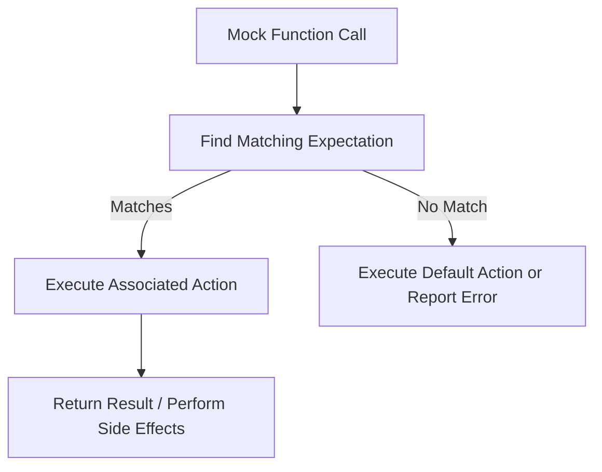

# Matchers, Actions, and Data Matching

GoogleTest and GoogleMock empower you to write expressive and precise expectations on mock calls and assertion values using *matchers* and *actions*. Understanding these core concepts enables you to write tests that clearly specify what calls should occur, under what conditions, and what behavior mocks should exhibit when invoked.

---

## What Are Matchers?

Matchers are predicates that verify whether the arguments passed to mock methods have the expected properties. They provide a type-safe, composable, and expressive way to specify argument constraints for mock method calls and assertions.

### Basic Matcher Usage

- Literal values such as `100` or `'true'` are implicitly converted to equality matchers equivalent to `Eq(100)` or `Eq(true)`.
- The special matcher `_` acts as a wildcard matching any argument value.
- You can combine matchers for precise argument verification. For example:

```cpp
using ::testing::_;
using ::testing::Ge;

EXPECT_CALL(turtle, Forward(Ge(100)));  // Matches calls where the argument is >= 100
EXPECT_CALL(turtle, GoTo(50, _));       // First argument is 50; second is anything
```

### Multiple Arguments Matching

Matchers can be applied per argument in the mock method. If all matchers succeed, the expectation matches. You can also omit the parameter list in `EXPECT_CALL` to indicate "any arguments" but only for non-overloaded methods.

### Composite and Multi-Argument Matchers

- Use `.With(multi_argument_matcher)` to specify a matcher that operates on the *tuple* of all arguments as a unit.
- GoogleMock provides built-in multi-argument matchers such as `Lt()` for 2-tuples.

Example:

```cpp
EXPECT_CALL(mock, SetPosition(_, _))
    .With(Lt());  // Expects first argument less than second
```

### Common Built-in Matchers

- `_` matches anything
- `Eq(value)` matches equal values
- `Lt(value)`, `Gt(value)`, `Ge(value)`, `Le(value)` for comparisons
- `Not(matcher)` negates a matcher
- `AllOf()`, `AnyOf()` combine matchers with and/or logic
- `Pointee(matcher)` matches pointers to values matching `matcher`
- `Field(&Type::member, matcher)` and `Property(&Type::getter, matcher)` validate members or properties

### Custom Matchers

You can write custom matchers using `MATCHER` and `MATCHER_P` macros or implement matcher classes to describe complex domain-specific match conditions.

---

## What Are Actions?

Actions specify what a mock method should do when invoked. They define the behavior of mock calls, including return values, side effects, exceptions thrown, and invoking callbacks.

### Common Built-in Actions

| Action                 | Description                                                  |
|------------------------|--------------------------------------------------------------|
| `Return(value)`         | Return a fixed value (copied at expectation set time)         |
| `ReturnRef(variable)`   | Return a reference to a variable                              |
| `ReturnPointee(ptr)`    | Return the value pointed to by `ptr` at call time            |
| `Invoke(function)`      | Invoke a function, functor, or lambda with mock call args    |
| `InvokeWithoutArgs(f)`  | Call a function/functor with no arguments                    |
| `DoAll(actions...)`     | Perform multiple actions in sequence; return the last result |
| `SetArgPointee<N>(value)` | Assign `value` to the argument pointed to by the N-th param |
| `Throw(exception)`      | Throws an exception                                          |

### Returning Values

By default, GoogleMock provides default return values for primitive types and default-constructible types when no action is specified. You often specify return values explicitly for clarity or control.

### Side Effects

Actions like `SetArgPointee` let your mock simulate output parameters or other side effects.

### Using Callables as Actions

You can pass lambdas, function pointers, or functors that have compatible signatures to be used as actions via `Invoke` or directly as functors in `WillOnce`/`WillRepeatedly`.

Example:

```cpp
EXPECT_CALL(mock, DoSomething(_))
    .WillOnce(Invoke([](int x) { return x + 1; }));
```

### Composite Actions

Actions can be combined to perform multiple behaviors in one mock call.

```cpp
EXPECT_CALL(mock, Func(_))
    .WillOnce(DoAll(SetArgPointee<0>(5), Return(true)));
```

### Using `WillOnce` and `WillRepeatedly`

- `WillOnce(action)` specifies the action for one matching invocation.
- `WillRepeatedly(action)` specifies the action for all subsequent calls after `WillOnce`s.
- Multiple `WillOnce` clauses will be consumed once per call in the order defined.

### Managing Return Values for Move-only Types

To mock methods returning or accepting move-only types (e.g., `std::unique_ptr`), use lambdas or callables in `WillOnce` or `WillRepeatedly` to create new values on each invocation. `Return` with move-only types returns the value only once because it evaluates at expectation setup.

Example:

```cpp
EXPECT_CALL(mock, Make())
    .WillRepeatedly([] { return std::make_unique<Foo>(); });
```

### Retiring Expectations

Using `.RetiresOnSaturation()`, you can mark expectations to become inactive after they are saturated, allowing other expectations to match subsequent calls. This is useful for overlapping or fallback expectations.

---

## Combining Matchers and Actions in Tests

The power of GoogleMock lies in combining matchers to precisely specify *when* expectations apply and actions to control *what* happens when they do.

A typical expectation looks like:

```cpp
EXPECT_CALL(mockObject, Method(matcher1, matcher2))
    .Times(AtLeast(1))
    .WillOnce(Return(42))
    .WillRepeatedly(Return(0));
```

Here, the method must be called at least once with arguments matching the matchers, returning 42 on the first call and 0 thereafter.

By carefully specifying matchers and actions, you can express complex test cases, such as:

- Returning different values based on input arguments
- Simulating failures or thrown exceptions for error handling tests
- Validating that mock methods are called in a specific order or after certain other calls

---

## Best Practices for Matchers and Actions

- **Specify only what matters:** Overly precise matchers make tests brittle; match only on important arguments.
- **Use `_` to ignore arguments:** When arguments do not impact test behavior.
- **Use `.With()` for multi-argument predicates:** To enforce relations across multiple arguments.
- **Prefer lambdas or `Invoke` for complex behaviors:** When built-in actions are insufficient or return values depend on arguments.
- **Use sequences and `.After()` to order calls:** For verifying call order when required.
- **Avoid side-effects in matchers:** Matchers must be pure; side-effects cause unpredictable test behavior.
- **Leverage `.RetiresOnSaturation()` to cleanly retire expectations:** Avoid unexpected saturation errors.
- **To suppress warnings on uninteresting calls, use `NiceMock` or add catch-all expectations:** Avoid cluttering test output unnecessarily.

---

## Troubleshooting Common Issues

- **Unexpected call errors:** Usually indicate that an `EXPECT_CALL` was not set or the argument matchers did not match.
- **Uninteresting call warnings:** Can be suppressed using `NiceMock` or explicit expectations with `Times(AnyNumber())`.
- **Return values not changing basis call count:** Remember `Return(value)` captures the value once; to compute on each call, use lambdas.
- **Compilation errors mocking overloaded methods:** Use `Const()` or explicit matcher casts to disambiguate.
- **Mock not verifying expectations:** Ensure mocks are destructed or verify explicitly with `Mock::VerifyAndClearExpectations()`.

---

## Related Concepts and Next Steps

- Explore [Writing Custom Matchers and Actions](/guides/advanced-features-and-patterns/writing-custom-matchers-and-actions) to define domain-specific verification and behavior.
- Review the [Matchers Reference](/api-reference/googletest-core-api/matchers-api) for comprehensive matcher options.
- Consult [Setting Expectations](/api-reference/googlemock-api/setting-expectations) and [Actions & Cardinalities](/api-reference/googlemock-api/actions-and-cardinalities) for detailed usage.
- For hands-on learnings, see [Effective Mocking with GoogleMock](/guides/advanced-features-and-patterns/effective-mocking).

---

## Summary Diagram: How Matchers and Actions Interact in GoogleMock



This flow encapsulates the core user experience: specifying matchers to identify which mocked call is expected, and actions to define what that call does during testing.

---