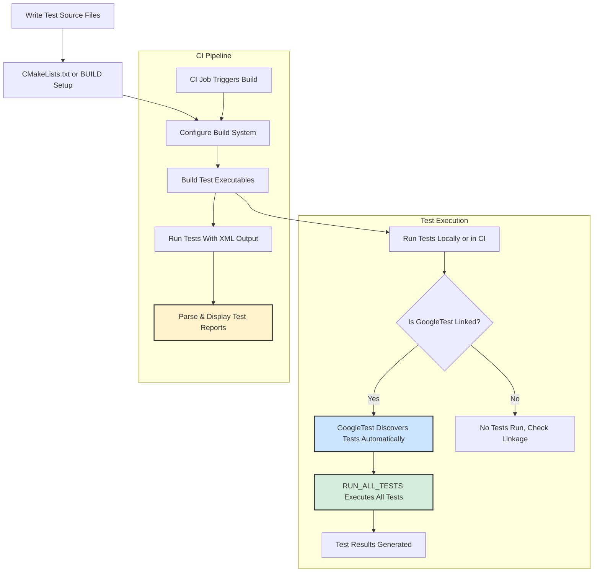

# Integration with Build and CI Systems

GoogleTest is designed to integrate seamlessly into diverse build environments and continuous integration (CI) pipelines, empowering teams to maintain reliable, repeatable, and scalable testing workflows. This guide distills best practices and actionable strategies for embedding GoogleTest and GoogleMock into your build systems and CI infrastructure, ensuring your tests are discoverable, reproducible, and efficient across platforms and environments.

---

## Why Integration Matters

Integrating GoogleTest smoothly with your build and CI systems transforms testing from an ad-hoc activity into a powerful safeguard against defects. Effective integration guarantees:

- **Automatic test discovery:** GoogleTest identifies all tests in your codebase without manual registration.
- **Reproducible test runs:** Tests behave consistently across local and automated environments.
- **Scalability:** Easy to add and run tests as your project grows.
- **Debuggability:** Clear failure output and integration with debugging tools.
- **Efficient CI workflows:** Fast feedback loops through parallel test execution and proper environment setup.

---

## Supported Build Systems

GoogleTest provides robust integration options for commonly used build systems including:

- **CMake:** The officially supported and recommended build system for cross-platform projects.
- **Bazel:** Google's own build tool widely used in large-scale projects.
- **Others:** Support for IDEs like Visual Studio, Xcode, and CLion through project files generated by CMake or direct setup.

### CMake Integration

CMake support is community-maintained but well-documented. To integrate GoogleTest into your CMake project:

1. **Use FetchContent or ExternalProject** to add GoogleTest and GoogleMock sources directly, ensuring consistent compiler and linker settings across your tests and main code.

2. **Add GoogleTest as a subdirectory:**

```cmake
include(FetchContent)
FetchContent_Declare(
  googletest
  URL https://github.com/google/googletest/archive/5376968f6948923e2411081fd9372e71a59d8e77.zip
)
FetchContent_MakeAvailable(googletest)

add_executable(my_test test.cpp)
target_link_libraries(my_test gtest_main gmock_main)
add_test(NAME MyTest COMMAND my_test)
```

3. **Link against `gtest_main` or `gmock_main`:** These libraries provide a main() that initializes and runs your tests, simplifying your test executables.

4. **Set compiler flags to require C++17**, as GoogleTest mandates this standard.

5. **Handle Windows runtime compatibility** by configuring CMake’s `gtest_force_shared_crt` option to avoid linker conflicts.

6. **Enable parallel test execution** with CTest for faster CI runs:

```bash
ctest --parallel 4
```

See the [Quickstart with CMake](../../guides/getting-started/quickstart-cmake) for detailed steps.

### Bazel Integration

For projects using Bazel:

- Declare GoogleTest and GoogleMock repositories in `MODULE.bazel` or `WORKSPACE`.
- Create `BUILD` files for your tests, linking to `@com_google_googletest//:gtest_main`.
- Use Bazel’s test runner to build and execute tests reproducibly across platforms.

Refer to the [Quickstart with Bazel](../../guides/getting-started/quickstart-bazel) for a streamlined integration walkthrough.

### IDE and Other Build Environments

- GoogleTest integrates well with major IDEs by importing test executables built with CMake or Bazel.
- For Visual Studio, ensure correct runtime linkage.
- On Xcode and CLion, rely on CMake integrations.

---

## Continuous Integration Best Practices

Integrating GoogleTest into CI pipelines optimizes your software quality feedback:

- **Isolate tests:** Each test should be independent and stateless, ensuring consistent results on every run.
- **Automate environment setup:** Scripts or containerize your CI environment to install dependencies, set environment variables, and build your tests.
- **Parallelize test execution:** Utilize CTest’s parallelism or your CI provider’s capabilities to reduce feedback cycles.
- **Collect test results and logs:** Enable XML output with `--gtest_output=xml` for CI test reports and dashboards.
- **Fail fast on critical errors:** Configure your CI workflows to fail on test failures or flaky tests requiring immediate attention.

Example of running tests with XML output:

```bash
./my_test --gtest_output=xml:report.xml
```

---

## Test Discoverability

GoogleTest automatically discovers all tests defined in your linked binaries by scanning calls to the `TEST()` and `TEST_F()` macros. To ensure tests are discovered in all build and CI runs:

- Link all test source files into your test executables.
- Avoid conditional compilation that excludes tests unintentionally.
- Use `gtest_discover_tests()` in CTest-enabled CMake projects to integrate test discovery with the build system seamlessly.

```cmake
include(GoogleTest)
gtest_discover_tests(my_test)
```

---

## Troubleshooting Common Integration Issues

- **Linker errors on runtime mismatches:** Ensure consistent use of static or dynamic CRT runtimes, especially on Windows. Configure CMake options accordingly.
- **Tests not discovered or run:** Verify that your test executables include all test definitions and that `RUN_ALL_TESTS()` is called.
- **Compiler incompatibilities or missing C++17 support:** Confirm your compiler version supports C++17; upgrade or configure accordingly.
- **Flaky tests causing CI instability:** Use [Best Practices for Test Design](../../guides/test-design-and-best-practices/best-practices-case-studies) to reduce flakiness.

Consult the [Build System Integration](../../guides/integration-and-troubleshooting/build-system-integration) and [Troubleshooting Common Test Issues](../../guides/integration-and-troubleshooting/troubleshooting-common-issues) guides for in-depth assistance.

---

## Sample CMakeLists.txt for GoogleTest Integration

```cmake
cmake_minimum_required(VERSION 3.14)
project(MyProjectTests LANGUAGES CXX)

set(CMAKE_CXX_STANDARD 17)
set(CMAKE_CXX_STANDARD_REQUIRED ON)

include(FetchContent)
FetchContent_Declare(
  googletest
  URL https://github.com/google/googletest/archive/refs/tags/release-1.17.0.zip
)
FetchContent_MakeAvailable(googletest)

add_executable(
  my_tests
  test_example.cpp
  test_another.cpp
)

target_link_libraries(
  my_tests
  gtest_main
  gmock_main
)

include(GoogleTest)
gtest_discover_tests(my_tests)
```

This configuration:

- Fetches GoogleTest at configure time.
- Compiles your tests along with GoogleTest and GoogleMock.
- Registers tests with CTest for easy execution.

---

## Summary

Integrating GoogleTest into your build and CI systems ensures tests are executed reliably and efficiently. Leveraging CMake or Bazel integration patterns, enabling automatic test discovery, and adopting CI best practices fortifies your development workflow to catch regressions early while scaling test coverage.

---

## Additional Resources

- [Build System Integration Guide](../../guides/integration-and-troubleshooting/build-system-integration)
- [Platform and Toolchain Compatibility](../../guides/integration-and-troubleshooting/platform-support)
- [Troubleshooting Common Test Issues](../../guides/integration-and-troubleshooting/troubleshooting-common-issues)
- [Quickstart with CMake](../../guides/getting-started/quickstart-cmake)
- [Quickstart with Bazel](../../guides/getting-started/quickstart-bazel)
- [GoogleTest Primer](../../docs/primer.md)

---

## Frequently Asked Questions

<AccordionGroup title="Common Questions About Integration">
<Accordion title="How do I link GoogleTest and GoogleMock correctly?">
Link against `gtest_main` or `gmock_main` to get main() automatically. Link your test binaries with these targets in CMake or Bazel to simplify setup.
</Accordion>
<Accordion title="Can I use GoogleTest with build systems other than CMake or Bazel?">
Yes, but support is not official. You can manually include headers and sources, but leveraging CMake or Bazel is recommended for ease of use and compatibility.
</Accordion>
<Accordion title="How do I run tests on CI and get detailed reports?">
Run tests with the flag `--gtest_output=xml:<file>` to produce XML reports consumable by most CI systems, enabling detailed test analysis.
</Accordion>
</AccordionGroup>

---

## Diagram: GoogleTest Integration Workflow with Build and CI Systems



This flowchart illustrates the typical user journey through integrating GoogleTest into build and CI processes.
