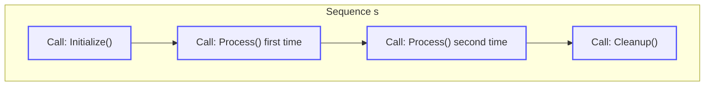

# Call Sequencing and Cardinality

GoogleMock empowers you to specify how many times you expect a mock method to be called and the order in which calls should occur. This guide explains **cardinalities**—the quantifiers of expected call counts—and **call sequences**—the control over the order of these calls—allowing you to express elaborate interaction contracts in your tests with clarity and precision.

---

## Understanding Cardinalities: How Often Will It Be Called?

In testing, it is often crucial not just to know *that* a mock method is called, but *how many times* it should be called. GoogleMock uses **cardinalities** to specify these expectations. Cardinalities allow you to clearly articulate constraints such as "exactly twice" or "at least once".

### The Cardinality Clause: `.Times()`

You use the `.Times()` clause in an `EXPECT_CALL()` to define the number of expected invocations for a mock method. Its argument is a cardinality specifier, and GoogleMock provides a rich set of built-in cardinalities:

- `AnyNumber()` — The method may be called any number of times, including zero.
- `AtLeast(n)` — The method is expected to be called *at least* `n` times.
- `AtMost(n)` — The method is expected to be called *at most* `n` times.
- `Between(m, n)` — The method must be called between `m` and `n` times (inclusive).
- `Exactly(n)` or simply `n` — The method must be called *exactly* `n` times. If `n` is 0, the call must never happen.

If you omit `.Times()`, GoogleMock intelligently infers it based on the presence and count of `.WillOnce()` and `.WillRepeatedly()` clauses:

- No `.WillOnce` or `.WillRepeatedly` → `Times(1)` is assumed.
- `n` `.WillOnce` clauses and no `.WillRepeatedly` → `Times(n)` is assumed.
- `n` `.WillOnce` clauses and one `.WillRepeatedly` → `Times(AtLeast(n))` is assumed.

### Cardinality Semantics in Reality

- **Expecting zero calls:** `.Times(0)` means the method with the given arguments should **never** be called. If it is, GoogleMock will immediately report a failure.
- **Under-saturation:** Calling a method fewer times than expected results in a test failure, usually reported when the mock object is verified or destroyed.
- **Over-saturation:** Excess calls beyond the upper bound also trigger failures instantly when they happen.

### Examples of Cardinalities

```cpp
EXPECT_CALL(mock_obj, Method())
    .Times(AnyNumber());  // Method can be called any number of times.

EXPECT_CALL(mock_obj, Method(_))
    .Times(AtLeast(3));  // Expected to be called at least 3 times.

EXPECT_CALL(mock_obj, Method(_))
    .Times(Between(1, 4));  // Expected between 1 and 4 calls, inclusive.

EXPECT_CALL(mock_obj, Method(42))
    .Times(Exactly(2));  // Must be called exactly twice with argument 42.
```

### Defining Custom Cardinalities

GoogleMock supports advanced customization by allowing you to implement your own cardinality by inheriting from the `CardinalityInterface`. This flexibility enables domain-specific patterns such as "called an even number of times".

---

## Enforcing Call Order: Sequences and Partial Ordering

Besides *how many times* calls should happen, sometimes *when* they should happen matters. GoogleMock lets you enforce strict or partial ordering of mock method calls using **sequences**.

### Using `InSequence` for Strict Ordering

By default, GoogleMock allows matching expectations to be invoked in any order. To enforce strict order, wrap the relevant `EXPECT_CALL()` statements within an `InSequence` scope:

```cpp
{
  testing::InSequence seq;  // All EXPECT_CALLs in this block form a sequential order
  EXPECT_CALL(mock_obj, FirstCall());
  EXPECT_CALL(mock_obj, SecondCall());
  EXPECT_CALL(mock_obj, ThirdCall());
}
```

Under this scope, calls to `FirstCall()`, `SecondCall()`, and `ThirdCall()` must happen **in this exact order**; a call to `ThirdCall()` before `FirstCall()` would fail.

### Using Named `Sequence` Objects for Partial Ordering

The `InSequence` object creates an implicit unnamed sequence. For more flexible partial orders where some methods are ordered relative to others but others are unordered, create explicit `Sequence` objects and associate expectations with them:

```cpp
using testing::Sequence;

Sequence s1, s2;

EXPECT_CALL(mock_obj, Init()).InSequence(s1, s2);
EXPECT_CALL(mock_obj, Load()).InSequence(s1);
EXPECT_CALL(mock_obj, Process()).InSequence(s2);
```

This setup declares the order:

- `Init()` must come before both `Load()` and `Process()`;
- `Load()` and `Process()` have no enforced ordering relative to each other.

Graphically, it represents this partial order:

```
         +----> Load()
         |
   Init()|
         +----> Process()
```

Such partial ordering neatly expresses real-world timing constraints without unnecessarily rigid sequencing.

### Sequencing Implications

- Calls belonging to the same `Sequence` must occur in the order their expectations are declared.
- A mock call is considered **inactive (retired)** and will no longer match once its successors in the sequence are invoked.

### Combining with `.RetiresOnSaturation()`

Normally, expectations remain "sticky" (active) even after they hit their expected number of calls. To automatically retire an expectation once saturated, use the `.RetiresOnSaturation()` clause:

```cpp
EXPECT_CALL(mock_obj, Method())
    .Times(2)
    .RetiresOnSaturation();
```

This is especially useful when combined with sequences, ensuring other expectations in the sequence activate correctly.

---

## Enforcing Call Ordering Using the `.After()` Clause

GoogleMock also supports expressing call ordering relationships directly using the `.After()` clause on expectations.

You can specify that an expectation must occur **after** other expectations:

```cpp
Expectation e1 = EXPECT_CALL(mock_obj, SetUp());
Expectation e2 = EXPECT_CALL(mock_obj, Init()).After(e1);
EXPECT_CALL(mock_obj, TearDown()).After(e1, e2);
```

Here,

- `Init()` must be called after `SetUp()`;
- `TearDown()` must be called after both `SetUp()` and `Init()`.

You can also specify `.After()` with an `ExpectationSet` to enforce ordering after multiple prerequisites.

### Combining `.After()` with Sequences

`.After()` and `.InSequence()` can be combined to express complex partial orders elegantly.

---

## Summary of Usage Patterns

<AccordionGroup title="Using Cardinalities and Sequences">
<Accordion title="Specifying Cardinality">
Use `.Times()` with built-in cardinalities to define call counts:

- `AnyNumber()`, `AtLeast(n)`, `AtMost(n)`, `Between(m,n)`, `Exactly(n)`

Omit `.Times()` to let GoogleMock infer it from your `.WillOnce()` and `.WillRepeatedly()` clauses.
</Accordion>
<Accordion title="Controlling Call Order with `InSequence`">
Create an `InSequence` object to wrap expectations that must be called in strict, linear order.

Example:

```cpp
{
  InSequence seq;
  EXPECT_CALL(mock, A());
  EXPECT_CALL(mock, B());
}
```
</Accordion>
<Accordion title="Partial Ordering with `Sequence`">
Use `Sequence` objects to specify that some calls happen before others, but leave other calls unordered.

Example:

```cpp
Sequence s1, s2;
EXPECT_CALL(mock, A()).InSequence(s1, s2);
EXPECT_CALL(mock, B()).InSequence(s1);
EXPECT_CALL(mock, C()).InSequence(s2);
```
</Accordion>
<Accordion title="Using `.After()` for Order Dependencies">
Express explicit order among calls using `.After()` with named `Expectation` or `ExpectationSet` objects.

Example:

```cpp
Expectation e1 = EXPECT_CALL(mock, Init());
EXPECT_CALL(mock, Start()).After(e1);
```
</Accordion>
</AccordionGroup>

---

## Practical Tips and Best Practices

- **Use sequences or `.After()` to express order only when it matters.** Unnecessary sequencing makes tests brittle.
- **Combine `.RetiresOnSaturation()` with strict order sequences** to avoid "sticky" expectations blocking following calls.
- **Remember that expectations are "sticky" by default**, meaning they remain active beyond their expected calls unless retired.
- **Use `AnyNumber()` for "catch-all" expectations** to allow less constrained calls without failure.
- **Keep your ordering constraints reflective of your real contract**, avoiding over-specification.

---

## Troubleshooting Call Ordering and Cardinalities

### Common Issues

- **Too few calls:** Occurs when the mock method is called less than expected. GoogleMock reports this during verification.
- **Too many calls:** Mock method called beyond the upper bound in cardinality, causing immediate failure.
- **Out-of-order calls:** Calls violate the declared call sequence or `.After()` relations.
- **Sticky expectations blocking calls:** Forgetting `.RetiresOnSaturation()` in sequences.

### How to Diagnose

Run tests with flag `--gmock_verbose=info` to see detailed logs of invoked expectations and their matching.

### Resolving Failures

- Confirm your expectations' cardinalities match the intended contract.
- Use `.RetiresOnSaturation()` to retire saturated expectations that should not remain active.
- Simplify or adjust call sequences if the ordering is unnecessarily strict.

---

## Summary

GoogleMock's cardinalities and call sequencing facilities empower you to rigorously specify the *quantity* and *order* of mock method invocations. By leveraging `.Times()` clauses with descriptive cardinalities, and by structuring call order through `InSequence`, explicit `Sequence` objects, or `.After()` clauses, you gain precise control over your test interactions, enabling robust and expressive testing.

For progressively complex scenarios, these tools let you balance strictness and flexibility, catch unexpected calls early, and maintain clarity in specifying expected interactions.

---

## See Also

- [EXPECT_CALL Reference and Clauses](https://github.com/google/googletest/blob/main/docs/reference/mocking.md#EXPECT_CALL) — full syntax of `EXPECT_CALL` and its modifiers.
- [gMock Cookbook: Setting Expectations and Ordering](https://google.github.io/googletest/gmock_cook_book.html#SettingExpectations) — practical recipes and examples.
- [Matchers and Actions Reference](https://github.com/google/googletest/blob/main/docs/api-reference/core-apis/matchers.md) — learn how to specify argument expectations.
- [Mocking Workflow Guide](https://github.com/google/googletest/blob/main/docs/gmock_for_dummies.md) — understanding the artifact creation and use.

---

## Example: Combining Cardinality and Sequence

```cpp
using ::testing::Sequence;
using ::testing::Exactly;
using ::testing::Return;

Sequence s;
MockFoo mock;

EXPECT_CALL(mock, Initialize())
    .Times(Exactly(1))
    .InSequence(s);
EXPECT_CALL(mock, Process())
    .Times(Exactly(2))
    .InSequence(s)
    .WillRepeatedly(Return(true));
EXPECT_CALL(mock, Cleanup())
    .Times(Exactly(1))
    .InSequence(s);

// The above spec means calls must be: Initialize() → Process() → Process() → Cleanup()
```


---



---

This visual illustrates the strict ordering constraint imposed by the sequence `s`. Each call activates the next in the chain.
