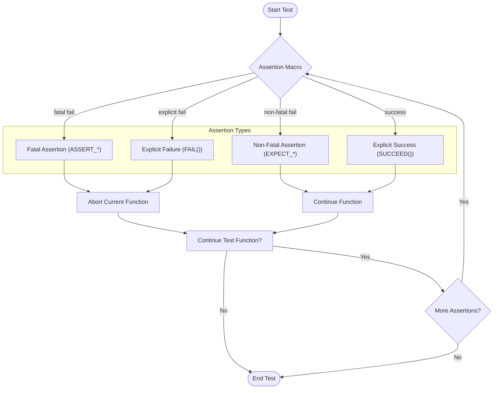

# Assertions and Failure Modes

Understanding assertions is crucial to leveraging GoogleTest effectively. This page delves into the different assertion macros provided by GoogleTest, focusing on how they verify conditions in tests, distinguish between fatal and non-fatal failures, use predicate assertions for expressive diagnostics, and how assertion outcomes propagate through test results.

---

## 1. Overview of Assertion Macros

GoogleTest provides a rich set of assertion macros that let you verify conditions in your tests. These assertions come primarily in two variants:

- **Fatal Assertions (`ASSERT_*`)**: On failure, they abort the current function immediately.
- **Non-Fatal Assertions (`EXPECT_*`)**: On failure, they record the failure but allow the current function to continue executing.

Both variants support streaming of custom failure messages, enhancing the clarity of test failure output.

### 1.1 Explicit Success and Failure

- **`SUCCEED()`**: Generates an explicit success. It does not force the test to pass but documents a successful checkpoint.
- **`FAIL()` or `GTEST_FAIL()`**: Generates an immediate fatal failure.
- **`ADD_FAILURE()` and `ADD_FAILURE_AT(file, line)`**: Generate non-fatal failures optionally at specified locations.

These macros allow explicit signaling of success or failure based on control flow rather than boolean conditions.

### 1.2 Boolean Condition Assertions

Assertions such as `EXPECT_TRUE()`, `ASSERT_FALSE()`, etc., verify Boolean conditions directly. They can test expressions or `AssertionResult` objects for success or failure.

### 1.3 Binary Comparison Assertions

Macros like `EXPECT_EQ()`, `ASSERT_NE()`, `EXPECT_LT()`, and their variants compare two values. GoogleTest prints a detailed message showing both the expressions and their evaluated values when these assertions fail, aiding debugging.

### 1.4 String Assertions

Specialized macros such as `EXPECT_STREQ()` and `ASSERT_STRNE()` compare C-strings by content instead of pointer equality, addressing a common source of confusion.

---

## 2. Fatal vs. Non-Fatal Failures

Understanding failure modes is essential to structuring tests for maximum clarity and effectiveness.

| Failure Mode        | Macro Prefix | Behavior                                             | Use Case                                              |
|---------------------|--------------|------------------------------------------------------|-------------------------------------------------------|
| Fatal Failure       | `ASSERT_`    | Aborts current function but lets test continue on higher stack frames | Stop a test early when continuing makes no sense or risks crash |
| Non-Fatal Failure   | `EXPECT_`    | Records failure but allows function to continue      | Check multiple conditions even after failures        |
| Explicit Success    | `SUCCEED()`  | Marks an explicit success                             | Document logically reachable success points           |
| Explicit Failure    | `FAIL()`     | Aborts current function immediately                   | Unreachable code or unreachable states                |

### Key Notes

- Fatal failures **do not stop the entire test** unless placed at the top test function; they only abort the current function.
- Use `ASSERT_NO_FATAL_FAILURE(statement)` and `EXPECT_NO_FATAL_FAILURE(statement)` to verify whether `statement` generates any fatal failure.

---

## 3. Predicate Assertions for Expressive Checks

Boolean expressions often don't provide informative failure messages. GoogleTest offers **predicate assertions** that allow writing predicates (functions/functors) returning `bool` or `AssertionResult` to improve diagnostics.

### 3.1 Using Predicates Returning `bool`

The `EXPECT_PRED*` and `ASSERT_PRED*` macros invoke predicate functions and print the argument values when the predicate fails.

```cpp
bool IsEven(int n) { return (n % 2) == 0; }
EXPECT_PRED1(IsEven, value);
```

On failure, the output shows which argument value caused the assertion to fail.

### 3.2 Using Predicates Returning `AssertionResult`

Functions returning `AssertionResult` allow custom success and failure messages:

```cpp
AssertionResult IsEven(int n) {
  if ((n % 2) == 0) return AssertionSuccess() << n << " is even";
  else return AssertionFailure() << n << " is odd";
}
EXPECT_TRUE(IsEven(value));
```

Failures then print messages like:

```
Value of: IsEven(value)
  Actual: false (3 is odd)
Expected: true
```

This style encourages richer, more informative diagnostics.

### 3.3 Predicate-Formatter Assertions

To fully customize assertion failure messages, especially when argument streaming is unsupported or awkward, use 
`EXPECT_PRED_FORMAT*` and `ASSERT_PRED_FORMAT*` macros with predicate-formatters,
which receive:
- Expression texts (as strings)
- Actual parameter values

Example:

```cpp
AssertionResult AssertMutuallyPrime(const char* expr1, const char* expr2, int m, int n) {
  if (MutuallyPrime(m, n)) return AssertionSuccess();
  return AssertionFailure() << expr1 << " and " << expr2 << " (" << m << " and " << n << ") "
      << "are not mutually prime.";
}
EXPECT_PRED_FORMAT2(AssertMutuallyPrime, a, b);
```

---

## 4. Floating-Point Comparisons

Due to inherent precision issues, `EXPECT_EQ` and `ASSERT_EQ` are unsuitable for floating-point values.

GoogleTest provides specialized macros:

- `EXPECT_FLOAT_EQ(val1, val2)` / `ASSERT_FLOAT_EQ(val1, val2)`: Compares two `float`s within a tolerance of 4 ULPs.
- `EXPECT_DOUBLE_EQ(val1, val2)` / `ASSERT_DOUBLE_EQ(val1, val2)`: Similar for `double`.
- `EXPECT_NEAR(val1, val2, abs_error)` / `ASSERT_NEAR(val1, val2, abs_error)`: Verifies values are within absolute error bounds.

Additionally, predicate-format functions `FloatLE` and `DoubleLE` allow assertions like:

```cpp
EXPECT_PRED_FORMAT2(FloatLE, val1, val2);
EXPECT_PRED_FORMAT2(DoubleLE, val1, val2);
```

which check that `val1` is less than or almost equal to `val2`.

---

## 5. Windows HRESULT Assertions

GoogleTest supports HRESULT success/failure assertions on Windows platforms:

- `EXPECT_HRESULT_SUCCEEDED(expr)` / `ASSERT_HRESULT_SUCCEEDED(expr)`: Checks that expr returns a success HRESULT.
- `EXPECT_HRESULT_FAILED(expr)` / `ASSERT_HRESULT_FAILED(expr)`: Checks for a failure HRESULT.

These macros include human-readable error messages alongside hexadecimal codes, aiding diagnostics.

---

## 6. Assertion Result Representation and Propagation

Each assertion or explicit test part (`FAIL()`, `ADD_FAILURE()`, etc.) produces a **`TestPartResult`** which encapsulates:

- **Type**: success, non-fatal failure, fatal failure, or skipped.
- **Source Location**: file and line number where the assertion occurred.
- **Message**: detailed failure message and summary.

`TestPartResults` are collected in a test's **`TestResult`** object. The aggregate test result reflects whether it passed, failed, or was skipped, based on the presence of `TestPartResult`s.

GoogleTest exposes API to query these results for processing or custom reporting.

---

## 7. Using Assertions in Subroutines

When assertions are placed inside non-void subroutines:

- Fatal failures (`ASSERT_*`, `FAIL()`) abort the current function but **do not abort the calling test function**.
- To propagate fatal failures upwards, use `ASSERT_NO_FATAL_FAILURE()` macros or check `::testing::Test::HasFatalFailure()` after subroutine calls.

Example:

```cpp
void CheckInput(int x) {
  ASSERT_GT(x, 0);  // If fails, returns immediately but test continues
}

TEST(MyTest, SubroutineCheck) {
  CheckInput(-1);
  if (::testing::Test::HasFatalFailure()) return;
  // Further code assumes x is valid
}
```

---

## 8. Logging Additional Information via Properties

GoogleTest supports recording arbitrary **key-value pairs** associated with tests via `RecordProperty(key, value)`. These are:

- Recorded at the current test, test suite, or global level depending on the context.
- Used in XML/JSON test reports for richer metadata.
- Keys must not clash with reserved XML attributes (`name`, `status`, `time`, etc.).

Example usage:

```cpp
TEST_F(MyTest, RecordsProperties) {
  RecordProperty("MaxMemory", "1024MB");
}
```

Properties can be recorded outside of test bodies (e.g., in `SetUpTestSuite`). This enhances integration with CI pipelines and custom reports.

---

## 9. Example: Checking for Fatal Failures in Subroutines

```cpp
void SubFunction() {
  ASSERT_EQ(1, 2);  // Fatal failure, aborts this function
}

TEST(MyTestSuite, TestBehavior) {
  SubFunction();
  if (::testing::Test::HasFatalFailure()) {
    return;  // Prevent running further code after fatal failure
  }
  // Safe to proceed
}
```

---

## 10. Troubleshooting Assertion Macros

- Ensure assertions are only used in void-returning functions when fatal failures are possible.
- Avoid multiple assertion macros on the same line to prevent compilation issues.
- For custom failure detection, use `EXPECT_FATAL_FAILURE` and `EXPECT_NONFATAL_FAILURE` from `gtest-spi.h` to catch expected failures in tests.

---

## 11. Summary

- Use `EXPECT_*` for non-fatal checks and `ASSERT_*` for fatal ones that should prevent further execution in the current function.
- Predicate assertions and predicate-formatter assertions offer enhanced failure messages with detailed diagnostics.
- Floating-point comparisons require special macros due to rounding errors.
- `TestPartResult` and `TestResult` objects internally represent assertion outcomes and are accessible for custom event listening and reporting.
- Use `RecordProperty` to attach test metadata.

---

## 12. See Also

- [Assertions Reference](reference/assertions.md)
- [Advanced GoogleTest Topics](docs/advanced.md#more-assertions)
- [Using and Extending Matchers](concepts/data-models-assertions/using-and-extending-matchers)
- [Death Tests](concepts/integration-patterns-advanced/death-tests-architecture)
- [Writing Clear and Effective Assertions](guides/integration-and-best-practices/writing-effective-assertions.mdx)

---

## 13. Diagrams



This illustrates assertion impacts on test function flow and overall test execution.

---