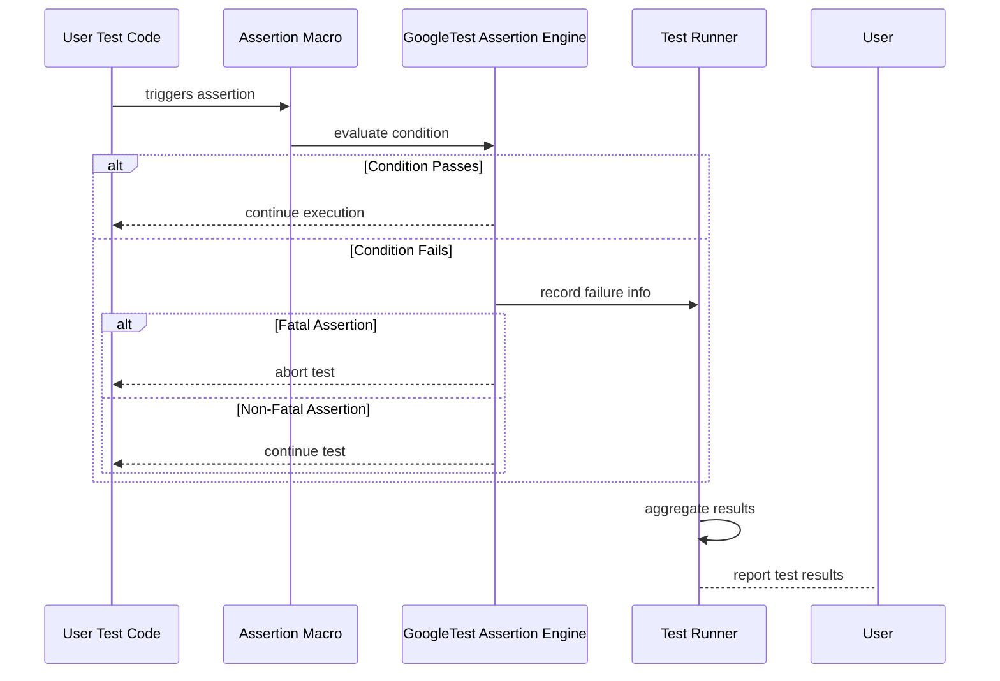

# Assertion and Result Model

GoogleTest models assertions, test results, and failures with a clear and structured framework that enables robust and precise testing. This page explores how GoogleTest distinguishes between fatal and non-fatal assertions, manages test result reporting, and constructs custom assert macros to empower users with fine control over their test validations.

---

## Understanding Assertions

Assertions form the backbone of GoogleTest’s ability to verify program correctness. They come in two primary types:

- **Fatal Assertions:** Stop the current test immediately upon failure, preventing further execution and thus avoiding unknown states or cascading errors.
- **Non-Fatal Assertions:** Record a failure but allow the test to continue to uncover multiple failures in a single test run.

This model balances strictness with flexibility, enabling users to catch critical failures early but also gather comprehensive feedback when appropriate.

### Value to Users

Imagine you are testing a function that processes data from multiple input sources. A fatal assertion failure in the very first input prevents the test from progressing, alerting you immediately to a blocking issue. Alternatively, non-fatal assertions allow the test to evaluate other inputs even if some fail, providing richer diagnostic information in fewer runs.

### Using Assertions Effectively

GoogleTest provides a broad suite of assertion macros that follow the ‘EXPECT_...’ and ‘ASSERT_...’ pattern. By choosing the appropriate assertion variant, you can control whether a failure should halt execution or continue to check other conditions.

```cpp
// Non-fatal assertion: Test continues after failure.
EXPECT_EQ(expected_value, actual_value);

// Fatal assertion: Test aborts upon failure.
ASSERT_TRUE(condition);
```

**Practical tip:** Use fatal assertions for essential invariants where continuing test execution is meaningless or would lead to misleading results, and non-fatal assertions when you want to gather as many failure reports as possible during a test.

---

## Test Result Reporting

When assertions fail, GoogleTest records detailed failure information encapsulated in test results. These results include:

- **File and line of failure:** The exact location in source code for quick navigation.
- **Failure message:** Clear explanation of what condition failed.
- **Stack trace (optional):** A call stack to help diagnose the root cause.

GoogleTest classifies and displays these results so developers can quickly triage issues.

### Nonfatal Failures

Nonfatal failures imply the test continues execution. GoogleTest aggregates these failures and reports them alongside the overall test summary.

### Fatal Failures

Fatal failures abort the current test function execution immediately.

### Example Failure Output

```plaintext
path/to/my_test.cc:119: Failure
Actual function call count doesn't match this expectation:
Expected: called at least once.
Actual: never called.
Stack trace:
...
```

### Best Practices

- Always include descriptive messages or stream messages into assertions to enhance failure reports.
- Use the `--gtest_stack_trace_depth` flag to control the verbosity of stack traces.

---

## Fatal vs. Non-Fatal Assertions in Practice

| Purpose                  | Non-Fatal Assertions               | Fatal Assertions                  |
|--------------------------|----------------------------------|---------------------------------|
| Immediate test abortion   | No                               | Yes                             |
| Use case                 | Verify optional conditions while continuing test | Verify essential conditions that block further execution |
| Common macros            | `EXPECT_*` family                | `ASSERT_*` family               |

**Example:**

```cpp
TEST(MyComponentTest, HandlesErrors) {
  MyComponent c;

  c.Initialize();

  EXPECT_TRUE(c.IsReady());       // Non-fatal, test continues if fails
  ASSERT_NE(nullptr, c.GetData());  // Fatal, aborts test if fails
  ...
}
```

---

## Constructing Custom Assert Macros

GoogleTest enables users to build custom assertion macros combining internal assertions and reporting utilities to calibrate the error behavior and messages.

### Why Custom Assertions?

You may want to enforce project-specific validation logic or encapsulate complex verifying steps while maintaining consistent failure reporting.

### How Custom Assertions Work

Custom assert macros typically use `EXPECT_*` or `ASSERT_*` internals with addition of `GTEST_MESSAGE_AT_` for precise logging with source location.

```cpp
#define EXPECT_IS_EVEN(val) \
  EXPECT_PRED_FORMAT1(IsEvenPredicate, val)

::testing::AssertionResult IsEvenPredicate(const char* expr, int val) {
  if (val % 2 == 0) return ::testing::AssertionSuccess();
  return ::testing::AssertionFailure() << expr << " is not even";
}
```

Here, users define a predicate function that GoogleTest invokes during assertion evaluation, providing rich failure messages.

### Practical Tip

- Use `AssertionResult` to create expressive predicate checks.
- Make custom assertions fail fast or report softly depending on expected usage.

---

## How GoogleTest Models Assertion Flows Internally

Though internal implementation details are abstracted away from users, understanding the flow helps guide better test expression design:

1. Test code runs and triggers an assertion macro.
2. If the assertion fails, GoogleTest records failure details to a per-test context.
3. For non-fatal assertions, test continues; for fatal assertions, test function exits immediately.
4. At test end, all failure information is reported as part of test results.

This model keeps test result reporting uniform and informative.

---

## Troubleshooting Common Assertion Issues

### Assertion Not Triggering Failure

- Confirm you use `EXPECT_` or `ASSERT_` macros correctly.
- Verify logic that might prevent the assertion condition from being evaluated.

### Unexpected Test Abort

- Check that you are not mixing fatal assertions (`ASSERT_`) in situations where non-fatal is expected.
- Use non-fatal assertions to gather more information before aborting.

### Helpful Failure Messages

- Stream additional context into assertions.
- Use `SCOPED_TRACE` to provide local context when assertions fail inside nested calls.

---

## Related Concepts and Next Steps

Understanding the assertion and result model is foundational for writing effective tests and mocks in GoogleTest and GoogleMock. Complement your learning by exploring:

- [Test and TestCase Macros](api-reference/core-testing-api/test-and-testcase-macros) for macro usage.
- [Assertions and Expectations](api-reference/core-testing-api/assertions) for detailed assertion macros.
- [Setting Expectations: EXPECT_CALL and ON_CALL](api-reference/mocking-framework/setting-expectations) to handle mock behavior.

This knowledge enables expressive and reliable test suites that provide immediate and clear feedback on test outcomes.

---

## Visualizing the Assertion and Result Flow



This flow emphasizes how assertions control the test lifecycle and feedback loop.

---

## Tips for Mastery

- Always write assertions that convey clear intent.
- Prefer non-fatal assertions when multiple conditions are to be verified collectively.
- Use `ASSERT_` macros for essential preconditions within a test to prevent pointless further checks.
- Leverage custom assertions to reduce repetitive logic and improve test readability.
- Adjust verbosity flags (e.g., `--gtest_stack_trace_depth`) to balance output clarity with detail.

---

By mastering the assertion and result model, you ensure your tests communicate failure effectively while controlling test execution flow for the most efficient and maintainable C++ testing experience.

---

# References

- [GoogleTest Assertions Reference](https://github.com/google/googletest/blob/main/docs/reference/assertions.md)
- [gMock Setting Expectations](https://github.com/google/googletest/blob/main/docs/reference/mocking.md#EXPECT_CALL)
- [gMock for Dummies Guide](https://github.com/google/googletest/blob/main/docs/gmock_for_dummies.md)
- [Writing Custom Assertion Macros](https://github.com/google/googletest/blob/main/docs/advanced.md#assertion-macros)

---

# Source & Further Examples

This document is based on official GoogleMock test specifications in [`gmock-spec-builders_test.cc`](https://github.com/google/googletest/blob/main/googlemock/test/gmock-spec-builders_test.cc) and output tests that illustrate messaging behavior.

For practical usage, read the [Writing Your First Test Guide](https://github.com/google/googletest/blob/main/docs/guides/getting-started/writing-your-first-test.mdx) to see assertions in context.

---

# Next Steps

Proceed to the **Setting Expectations: EXPECT_CALL and ON_CALL** page for advanced mocking interaction models, or explore **Test and TestCase Macros** to deepen your control over test structures.