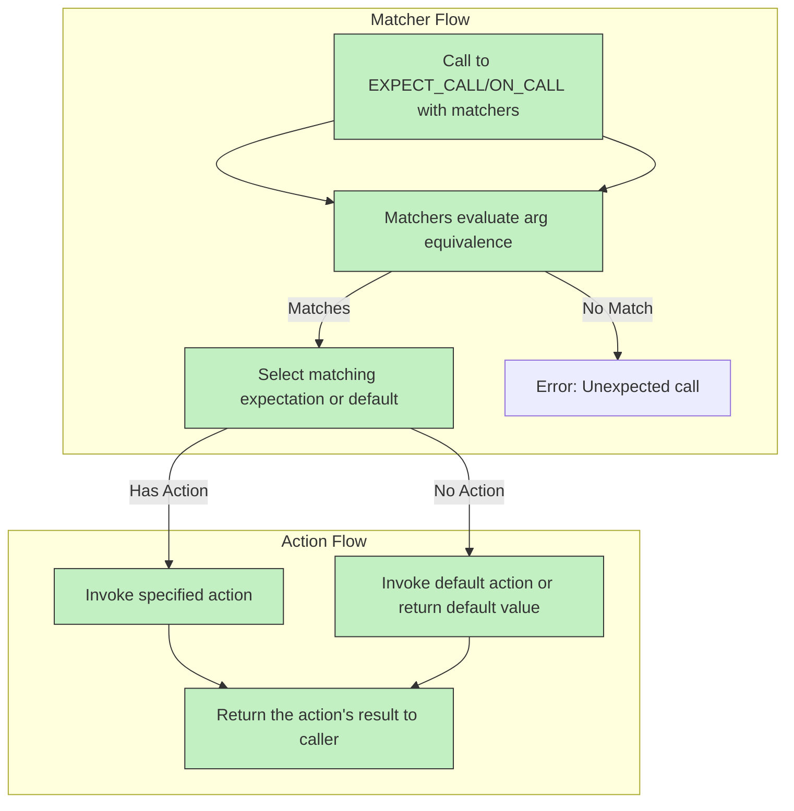

# Matchers and Action Models

Understanding matchers and actions is essential to harnessing the full power of GoogleMock for writing expressive, flexible test assertions and elegant mock behaviors. This guide explores how matchers and actions enable precise argument validation, conditional logic, and dynamic response behavior within mocks.

---

## Introduction to Matchers and Actions

Matchers and actions form the core of GoogleMock's powerful expectation and behavior system. 

- **Matchers** specify *what* arguments a mock method should expect. They allow you to write expressive, readable conditions for argument values.
- **Actions** specify *what happens* when a mock method is called. They control the behavior of mocks by defining return values, side effects, and other dynamic responses.

Together, these mechanisms enable concise yet expressive control over how mocked methods behave and how their calls are verified in tests.

---

## 1. Understanding Matchers

Matchers determine how mock arguments are compared against expectations.

### 1.1 What Is a Matcher?

A matcher is a predicate-like object used inside `EXPECT_CALL` or `ON_CALL` macros to validate arguments passed to mock functions. Simple values like `100` or `"hello"` automatically become equality matchers.

### 1.2 Using Built-in Matchers

GoogleMock ships with a rich set of built-in matchers such as `_` (wildcard), `Eq()`, `Ge()`, `Lt()`, `NotNull()`, `HasSubstr()`, and many others. Combinators like `AllOf()`, `AnyOf()`, and `Not()` enable you to build complex matching logic.

#### Example:
```cpp
using ::testing::_;
using ::testing::Ge;

// Expects Forward() to be called with an argument >= 100
EXPECT_CALL(turtle, Forward(Ge(100)));

// Expects GoTo() called with x == 50 and any y
EXPECT_CALL(turtle, GoTo(50, _));
```

### 1.3 Multi-Argument Matchers with `.With()` Clause

Matchers can also validate the entire argument tuple as a whole using the `.With()` clause in `EXPECT_CALL` or `ON_CALL`. This is useful when the relationship between arguments matters.

```cpp
EXPECT_CALL(my_mock, SetPosition(_, _))
    .With(Lt());  // first argument less than second argument
```

Here, `Lt()` is a 2-tuple matcher checking the order.

### 1.4 Custom Matchers

You can define custom matchers using macros like `MATCHER` or `MATCHER_P` for parameterized matchers, enabling reusable predicates with detailed failure messages.

Example: A matcher that checks divisibility by 7.

```cpp
MATCHER(IsDivisibleBy7, "") {
  return (arg % 7) == 0;
}

EXPECT_CALL(foo, Bar(IsDivisibleBy7()));
```

### 1.5 Matcher Behavior Considerations

- Matchers must be functional *pure* predicates with no side effects.
- The last matching expectation overrides earlier ones, enabling layering of default and specific matchers.
- You can compose matchers and use them as predicates in native assertions via `EXPECT_THAT`.

---

## 2. Actions: Defining Mock Behavior

Actions define the behavior of mock methods when calls occur, enabling return values, side effects, and complex response logic.

### 2.1 Default Actions and Overrides

If no action is specified, GoogleMock uses built-in default actions based on the return type (e.g., returning 0 for numeric types). You can specify default actions for all calls to a method using `ON_CALL()` with `.WillByDefault()`.

### 2.2 Specifying Actions per Call with `EXPECT_CALL()`

`EXPECT_CALL` allows chaining adapter clauses for specifying behavior per call:

- `.WillOnce()` for specifying the action for individual calls (can appear multiple times)
- `.WillRepeatedly()` for specifying default action once `WillOnce()`s are exhausted (can appear once)

Example:
```cpp
EXPECT_CALL(turtle, GetX())
    .WillOnce(Return(100))
    .WillOnce(Return(200))
    .WillRepeatedly(Return(300));
```

### 2.3 Common Built-in Actions

- `Return(value)`: Returns a specified value.
- `ReturnRef(variable)`: Returns a reference to a variable.
- `Invoke(function)`: Calls a user-defined function or method.
- `SetArgPointee<N>(value)`: Sets a value pointed to by the Nth argument.
- `DoAll(action1, action2, ...)`: Combines multiple actions in sequence.

### 2.4 Defining Complex Actions with Lambdas or Functors

You can specify arbitrary callable objects as actions, including lambdas with capture, move-only types, or stateful functors.

Example:
```cpp
EXPECT_CALL(mock, Foo(_))
    .WillOnce([](int x) { return x * 2; });
```

### 2.5 Action Adapters for Argument Selection

Use `WithArgs<N1, N2, ...>(action)` to invoke actions with selected mock call arguments. For example, if your action only needs a subset of arguments, this adapter passes just those.

```cpp
EXPECT_CALL(mock, Foo( _, _, _ ))
    .WillOnce(WithArgs<0, 2>(Invoke(&MyFunction)));
```

### 2.6 Retiring Expectations with `.RetiresOnSaturation()`

By default, expectations remain *sticky*, active even after the expected call count is reached, to help newer expectations override older ones. If you want an expectation to retire (become inactive) after it saturates, use `.RetiresOnSaturation()`. This is useful when you have fallbacks or defaults after limited expectations.

### 2.7 Controlling Mock Strictness Levels

- **NaggyMock** (default): Warns on uninteresting calls (calls that have no expectations).
- **NiceMock**: Suppresses warnings on uninteresting calls.
- **StrictMock**: Treats uninteresting calls as failures.

Example:
```cpp
using ::testing::NiceMock;
NiceMock<MockFoo> nice_mock;
EXPECT_CALL(nice_mock, DoSomething());
```

---

## 3. Practical Examples

### Example 1: Matcher and Simple Action

```cpp
using ::testing::Return;
using ::testing::_;

class MockTurtle : public Turtle {
 public:
  MOCK_METHOD(void, PenDown, (), (override));
  MOCK_METHOD(int, GetX, (), (const, override));
};

MockTurtle turtle;
EXPECT_CALL(turtle, PenDown()).Times(AtLeast(1));
ON_CALL(turtle, GetX()).WillByDefault(Return(10));

// Use turtle in code...
```

### Example 2: Using `.With()` Clause

```cpp
EXPECT_CALL(mock, SetValue(_, _))
     .With(Lt())  // first argument < second argument
     .Times(AnyNumber());
```

### Example 3: Custom Matcher

```cpp
MATCHER_P(IsDivisibleBy, divisor, "") {
  return (arg % divisor) == 0;
}

EXPECT_CALL(mock, Process(IsDivisibleBy(3)));
```

### Example 4: Multiple `WillOnce` and `WillRepeatedly`

```cpp
EXPECT_CALL(mock, Calculate())
    .WillOnce(Return(1))
    .WillOnce(Return(2))
    .WillRepeatedly(Return(3));
```

### Example 5: Retiring Expectations

```cpp
EXPECT_CALL(mock, Update(_))
    .Times(2)
    .RetiresOnSaturation();
EXPECT_CALL(mock, Update(_)).Times(AnyNumber());  // fallback
```

---

## 4. Troubleshooting Common Pitfalls

- **Expectations must be set before calls:** Calling a mock method before setting `EXPECT_CALL` leads to undefined behavior.
- **Order matters for overlapping matchers:** The last matching expectation is chosen; so place more specific expectations *after* more general ones.
- **Uninteresting call warnings:** If you see unexpected warnings for calls without expectations, either add `EXPECT_CALL` with `Times(AnyNumber())` to explicitly allow or use `NiceMock`.
- **Match side-effect free:** Matchers are evaluated multiple times; do not modify state inside.
- **Action side effects:** `WillOnce` actions may be called once; avoid capturing move-only objects without proper semantics.

---

## 5. Summary

Matchers allow comparison of mock call arguments with precise predicates, while actions define the behavior when calls occur. Together, they form a declarative, intuitive DSL for specifying mock interactions and behaviors.

Proper use of matchers and actions empowers you to write robust and maintainable tests that verify both state and interaction aspects with flexibility and control.

---

## References and Further Reading

- [GoogleMock for Dummies](https://google.github.io/googletest/gmock_for_dummies.html) for basic mock usage.
- [GoogleMock Cookbook](https://google.github.io/googletest/gmock_cook_book.html) for advanced recipes.
- [Matchers Reference](https://google.github.io/googletest/reference/matchers.html) for comprehensive matcher documentation.
- [Actions Reference](https://google.github.io/googletest/reference/actions.html) for detail on built-in and custom action creation.
- [Mocking Reference](https://google.github.io/googletest/reference/mocking.html) for full API and macro details.

---

## Visual Overview



---