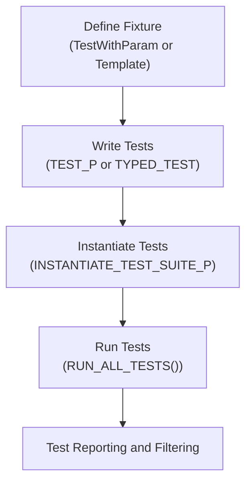

# Parameterized Testing (Value and Type)

GoogleTest’s parameterized testing feature empowers you to run the same test logic multiple times with different input values or types, saving you from duplicating code and enabling broader test coverage effortlessly. This guide introduces both **value-parameterized** and **type-parameterized** tests, explaining how to write them, instantiate test cases, and apply best practices to target complex testing needs.

---

## Why Parameterized Tests?

Imagine you have a function that must behave correctly for a wide range of inputs — writing separate tests for each input would be tedious, error-prone, and hard to maintain. Parameterized tests solve this by letting you define a single test and automatically run it across many values or types, ensuring:

- **Reduced code duplication**
- **Consistent, repeatable coverage**
- **Clear test organization**
- **Easy scaling for additional inputs or implementations**

Whether you are validating different data inputs or multiple implementations of an interface, parameterized tests integrate seamlessly with GoogleTest’s test runner.

---

## Value-Parameterized Tests

Value-parameterized tests allow you to run the same test logic with a set of varying values.

### How to Write Value-Parameterized Tests

1. **Define a fixture class** that inherits from `testing::TestWithParam<T>`, where `T` is the type of your test parameter.

```cpp
class MyValueTest : public testing::TestWithParam<int> {
  // Your usual fixture code here
};
```

2. **Use the `TEST_P` macro** to define parameterized test cases inside the fixture. Access the parameter with `GetParam()`.

```cpp
TEST_P(MyValueTest, IsEven) {
  int value = GetParam();
  EXPECT_EQ(value % 2, 0) << "Value " << value << " is not even.";
}
```

3. **Instantiate the test suite** with specific values using `INSTANTIATE_TEST_SUITE_P` and a parameter generator like `Values()`, `Range()`, or `ValuesIn()`.

```cpp
INSTANTIATE_TEST_SUITE_P(
    EvenNumbers, MyValueTest, testing::Values(2, 4, 6, 8));
```

The above will run `IsEven` four times with the specified values.

### Common Parameter Generators

| Generator           | Description                                                                                       |
|---------------------|------------------------------------------------------------------------------------------------|
| `Values(...)`       | Explicitly list the test parameter values.                                                     |
| `Range(start, end)` | Generate sequence from `start` to `end-1` with optional step size.                              |
| `ValuesIn(container)`| Generate parameters from an array, container, or iterator range.                               |
| `Bool()`            | Generate Boolean parameters `{false, true}`, useful for flag testing.                          |
| `Combine(...)`      | Create combinations (Cartesian product) of multiple generators, producing a tuple of values.    |

### Example: Testing a Function with Different Inputs

```cpp
class StringLengthTest : public testing::TestWithParam<std::string> {};

TEST_P(StringLengthTest, LengthIsCorrect) {
  std::string input = GetParam();
  EXPECT_EQ(input.length(), strlen(input.c_str()));
}

INSTANTIATE_TEST_SUITE_P(
    VariousStrings, StringLengthTest, testing::Values("", "abc", "hello world"));
```

### Customizing Test Names for Reporting

By default, GoogleTest generates numeric suffixes for each parameter. You can improve readability by providing a custom name generator function or using the built-in `PrintToStringParamName`:

```cpp
INSTANTIATE_TEST_SUITE_P(
    NamedTests,
    StringLengthTest,
    testing::Values("foo", "bar"),
    testing::PrintToStringParamName());
```

Or a custom lambda:

```cpp
INSTANTIATE_TEST_SUITE_P(
    NamedTests,
    StringLengthTest,
    testing::Values("foo", "bar"),
    [](const testing::TestParamInfo<std::string>& info) {
      std::string name = info.param;
      // Replace invalid characters
      std::replace_if(name.begin(), name.end(),
                      [](char c) { return !std::isalnum(c); }, '_');
      return name;
    });
```

### Tips and Best Practices

- Inherit from `testing::TestWithParam<T>` for convenience, which already implements required interfaces.
- Keep parameter types copyable and manage pointer lifetimes carefully if used.
- Use `Combine()` to test multiple dimensions simultaneously.
- For reusing parameterized tests without instantiating them, mark with `GTEST_ALLOW_UNINSTANTIATED_PARAMETERIZED_TEST`.
- Ensure parameter names generated are unique and do not contain disallowed characters.

---

## Typed Tests

Typed tests extend parameterization to *types*, running the same test code for different type parameters. This helps validate that multiple implementations conform to common behaviors.

### Defining Typed Tests

1. **Create a fixture class template** derived from `testing::Test`:

```cpp
template <typename T>
class ContainerTest : public testing::Test {
 public:
  T container_;
};
```

2. **Associate a list of types** with the test suite using `TYPED_TEST_SUITE`:

```cpp
using ContainerTypes = ::testing::Types<std::vector<int>, std::list<int>>;
TYPED_TEST_SUITE(ContainerTest, ContainerTypes);
```

3. **Write typed tests using `TYPED_TEST`**, where `TypeParam` refers to the current type:

```cpp
TYPED_TEST(ContainerTest, IsInitiallyEmpty) {
  EXPECT_TRUE(this->container_.empty());
}
```

### Example: Testing Different Container Types

```cpp
template <typename T>
class MyContainerTest : public testing::Test {
  // ...
};

using MyContainerTypes = ::testing::Types<std::vector<int>, std::deque<int>>;
TYPED_TEST_SUITE(MyContainerTest, MyContainerTypes);

TYPED_TEST(MyContainerTest, SupportsPushBack) {
  TypeParam container;
  container.push_back(10);
  EXPECT_EQ(container.size(), 1);
}
```

---

## Type-Parameterized Tests

While similar to typed tests, type-parameterized tests are more flexible, allowing you to define test logic abstractly and instantiate it with type lists elsewhere.

### How to Define Type-Parameterized Tests

1. Define a class template fixture deriving from `testing::Test`:

```cpp
template <typename T>
class AbstractContainerTest : public testing::Test {
};
```

2. Use `TYPED_TEST_SUITE_P` to declare a test suite without specifying types yet.

```cpp
TYPED_TEST_SUITE_P(AbstractContainerTest);
```

3. Define your parameterized tests using `TYPED_TEST_P`:

```cpp
TYPED_TEST_P(AbstractContainerTest, IsEmptyInitially) {
  TypeParam container;
  EXPECT_TRUE(container.empty());
}

TYPED_TEST_P(AbstractContainerTest, CanInsertElement) {
  TypeParam container;
  container.insert(container.end(), 42);
  EXPECT_FALSE(container.empty());
}
```

4. Register the test names using `REGISTER_TYPED_TEST_SUITE_P`:

```cpp
REGISTER_TYPED_TEST_SUITE_P(AbstractContainerTest, IsEmptyInitially, CanInsertElement);
```

5. Instantiate the test suite with the desired types using `INSTANTIATE_TYPED_TEST_SUITE_P`:

```cpp
using MyContainerTypes = testing::Types<std::vector<int>, std::list<int>>;
INSTANTIATE_TYPED_TEST_SUITE_P(MyInstantiation, AbstractContainerTest, MyContainerTypes);
```

### Benefits of Type-Parameterized Tests

- Define test logic once, instantiate with multiple type sets across translation units.
- Ideal for interface or concept conformance verification.
- Flexible naming through the instantiation prefix.

### Example: Defining and Instantiating a Type-Parameterized Test Suite

```cpp
// In header file
template <typename T>
class MyTypeParamTest : public testing::Test {
  // ...
};

TYPED_TEST_SUITE_P(MyTypeParamTest);

TYPED_TEST_P(MyTypeParamTest, SupportsResize) {
  TypeParam container;
  container.resize(5);
  EXPECT_EQ(container.size(), 5);
}

REGISTER_TYPED_TEST_SUITE_P(MyTypeParamTest, SupportsResize);

// In source file
using ContainerTypes = testing::Types<std::vector<int>, std::deque<int>>;
INSTANTIATE_TYPED_TEST_SUITE_P(DefaultInstantiation, MyTypeParamTest, ContainerTypes);
```

---

## Workflows & User Journey

1. **Choose the appropriate parameterization type:** Use value-parameterized tests when you want varied input values; use typed or type-parameterized tests when testing across multiple types.

2. **Define your test fixture according to the parameterization pattern:** Derive from `TestWithParam<T>` for values or create class templates for types.

3. **Write your tests using the respective macros (`TEST_P`, `TYPED_TEST`, or `TYPED_TEST_P`).**

4. **Instantiate your test cases:** Use `INSTANTIATE_TEST_SUITE_P` for value-parameterized and `INSTANTIATE_TYPED_TEST_SUITE_P` for type-parameterized tests.

5. **Run your tests:** Each instantiation will appear as its own test with distinct names for clear reporting and filtering.

---

## Practical Tips & Pitfalls

- **Avoid overly complex parameter lists.** Complex combinations can produce a combinatorial explosion. Pick meaningful parameters.
- **Manage lifetimes with pointer parameters.** GoogleTest does not manage pointer lifetimes for `GetParam()`, so ensure parameters remain valid during test execution.
- **Custom parameter names help debug failures.** When tests fail, readable names make troubleshooting straightforward.
- **Remember test ordering is not guaranteed.** Tests should be independent.
- **Suppress uninstantiated test warnings if purposeful** with `GTEST_ALLOW_UNINSTANTIATED_PARAMETERIZED_TEST`.

---

## Troubleshooting Common Issues

- **Tests not instantiated (no `INSTANTIATE_TEST_SUITE_P`).** GoogleTest reports a failing verification test suite `GoogleTestVerification`. Ensure all `TEST_P` suites have instantiations.
- **Parameter names invalid or duplicate.** Names must be unique and consist of alphanumeric characters or underscores.
- **Pointer parameters stale or dangling.** Confirm the objects referenced by pointers survive tests.
- **Confusing test names with multiple instantiations.** Use custom name generators to clarify.

---

## Summary

GoogleTest parameterized tests simplify running consistent test logic over diverse inputs and types, improving scalability and test quality. Value-parameterized tests cover different input data; typed and type-parameterized tests validate behavior across multiple types or implementations.

---

## Additional Resources

- [GoogleTest Primer](https://github.com/google/googletest/blob/main/docs/primer.md) — A beginner’s guide to writing your first tests.
- [TEST_P Macro](https://github.com/google/googletest/blob/main/docs/reference/testing.md#TEST_P) — Reference documentation on value-parameterized test macros.
- [INSTANTIATE_TEST_SUITE_P](https://github.com/google/googletest/blob/main/docs/reference/testing.md#INSTANTIATE_TEST_SUITE_P) — Details on test suite instantiation.
- [Typed Tests](https://github.com/google/googletest/blob/main/docs/advanced.md#typed-tests) — Advanced guide to typed and type-parameterized tests.

---

## Diagram: Parameterized Test Workflow


