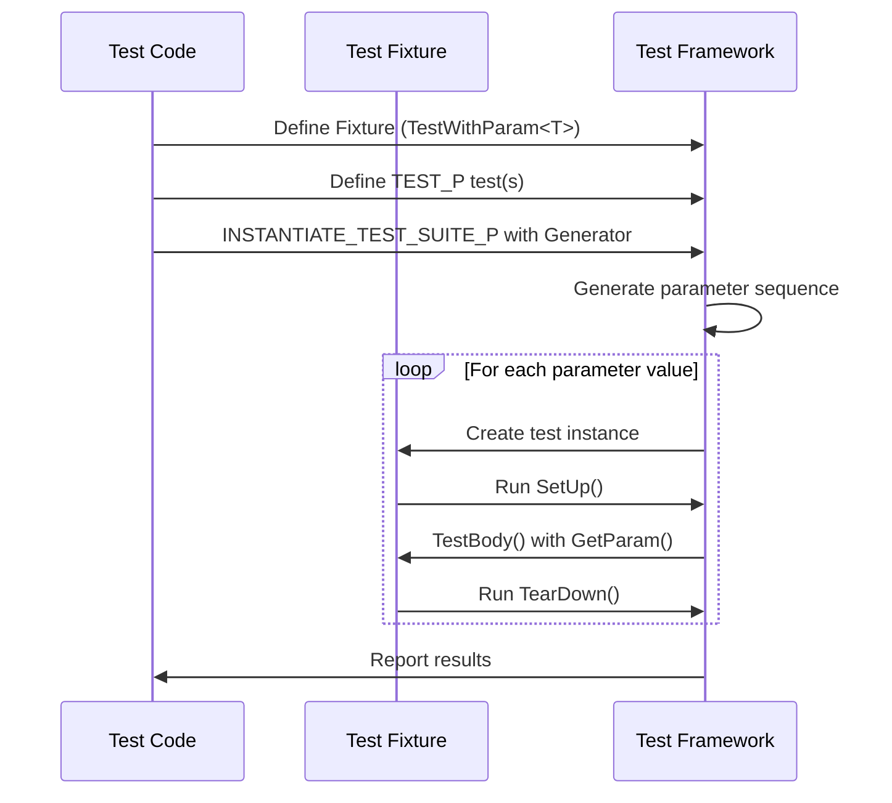
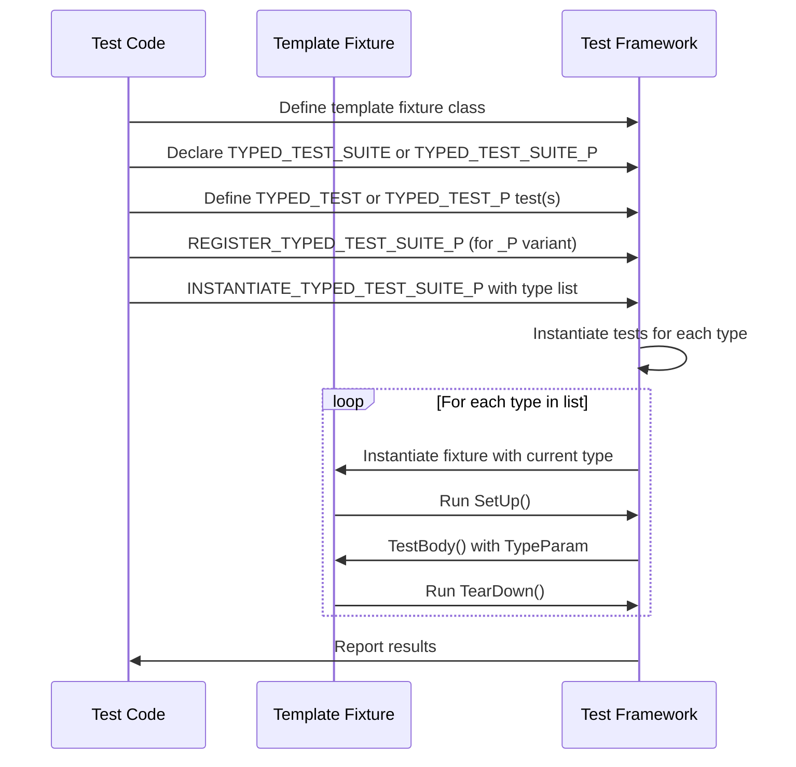

# Value- and Type-Parameterized Testing

Understanding how to efficiently test your code over a variety of inputs and types is essential to scalable, maintainable tests in GoogleTest. This guide explores two powerful patterns offered by GoogleTest: *value-parameterized tests* and *type-parameterized tests*. These patterns allow you to write broad sets of test cases covering distinct input values or types without duplicating code.

---

## Value-Parameterized Tests

Value-parameterized tests let you run the same test logic multiple times with different input *values*. This is ideal when you want to verify that a function or class behaves correctly for an array of data — such as edge cases, typical inputs, or special flags — without writing individual tests for each.

### Workflow to Create Value-Parameterized Tests

1. **Define a Fixture**
   Create a test fixture class derived from `testing::TestWithParam<T>`, where `T` is the type of your test parameter. This enables your test to receive different values.

   ```cpp
   class FooTest : public ::testing::TestWithParam<const char*> {
     // Optional: fixture setup and helper members
   };
   ```

2. **Write Test Logic Using `TEST_P`**
   Use the `TEST_P` macro to write tests that access the current parameter via `GetParam()`. Write as many such tests within the same fixture as you need.

   ```cpp
   TEST_P(FooTest, DoesBlah) {
     EXPECT_TRUE(foo.Blah(GetParam()));
   }

   TEST_P(FooTest, HasBlahBlah) {
     ...
   }
   ```

3. **Instantiate with Parameter Sets Using `INSTANTIATE_TEST_SUITE_P`**
   Instantiate your test suite with a descriptive prefix and a parameter generator such as `Values()`, `ValuesIn()`, `Range()`, or combinations thereof.

   ```cpp
   INSTANTIATE_TEST_SUITE_P(MeenyMinyMoe, FooTest, 
       ::testing::Values("meeny", "miny", "moe"));

   constexpr const char* pets[] = {"cat", "dog"};
   INSTANTIATE_TEST_SUITE_P(Pets, FooTest, ::testing::ValuesIn(pets));
   ```

   Each instantiation runs the full set of `TEST_P` tests with every provided value.

### Parameter Generators

GoogleTest provides flexible generators to specify parameter sequences:

| Generator | Description | Example |
|-----------|-------------|---------|
| `Range(begin, end [, step])` | Produces a sequence from `begin` to (but not including) `end` with optional step size | `Range(0, 3)` yields `0,1,2`
| `Values(v1, v2, ..., vN)` | Explicit list of values to test | `Values(1, 2, 3.5)`
| `ValuesIn(container)` | Values drawn from an STL container, C array, or iterator range | `ValuesIn(my_vector)`
| `Bool()` | Yields `false` and `true` for boolean tests | `Bool()` to test flags
| `Combine(g1, g2, ..., gN)` | Cartesian product of multiple generators, producing tuples of combined parameter sets | `Combine(Values(1, 2), Bool())` yields `(1,false), (1,true), (2,false), (2,true)`

### Customizing Test Names

To generate meaningful test names from parameters, provide an optional naming functor or lambda to `INSTANTIATE_TEST_SUITE_P`. It should accept a `TestParamInfo<ParamType>` and return a valid string suffix.

```cpp
INSTANTIATE_TEST_SUITE_P(
    MyInstantiation, MyTestSuite, testing::Values(...),
    [](const testing::TestParamInfo<MyTestSuite::ParamType>& info) {
      return "Test" + std::to_string(info.index);
    });
```

Avoid underscores in names and ensure each test name suffix is unique.

### Best Practices

- Define the fixture and all `TEST_P` tests in one file, instantiations in another, to create *abstract tests* reusable by other codebases.
- Use expressive parameter generators to cover meaningful input spaces without redundancy.
- Combine generators with `Combine` to test across multiple independent parameter dimensions.
- Suppress missing instantiation warnings with `GTEST_ALLOW_UNINSTANTIATED_PARAMETERIZED_TEST` for abstract or dynamically instantiated tests.

### Common Pitfalls & Troubleshooting

- Forgetting to instantiate `TEST_P` tests leads to silent or verification failure in `GoogleTestVerification` suite.
- Improper naming of test instantiations with duplicate or invalid suffixes will cause failures.
- Parameter generators are evaluated during `InitGoogleTest()`, not at macro instantiation, so avoid depending on side effects.

---

## Type-Parameterized Tests

Type-parameterized tests extend value-parameterized testing by running the same test logic over a list of *types* rather than values. This pattern is invaluable when validating generic code or multiple implementations of an interface.

### Typed Tests vs. Type-Parameterized Tests

- **Typed Tests (`TYPED_TEST_SUITE`)**: You specify a fixed list of types upfront when defining the test suite. Test logic and type list live together.
- **Type-Parameterized Tests (`TYPED_TEST_SUITE_P`)**: Test logic is defined independently of any type list, enabling test *templates* that can be instantiated with multiple type lists in different translation units.

### Creating Typed Tests

1. **Define a Class Template Fixture**

```cpp
template <typename T>
class MyFixture : public testing::Test {
 public:
   // fixture members can use T
   T value_;
};
```

2. **Declare a Type List and Associate it with the Test Suite**

```cpp
using MyTypes = ::testing::Types<char, int, unsigned int>;
TYPED_TEST_SUITE(MyFixture, MyTypes);
```

3. **Define Typed Tests with `TYPED_TEST`**

Inside these tests, refer to `TypeParam` as the placeholder for the current type.

```cpp
TYPED_TEST(MyFixture, TestValueInitialization) {
  TypeParam val = this->value_;
  EXPECT_TRUE(IsValid(val));
}
```

### Creating Type-Parameterized Tests

1. **Define a Class Template Fixture** (like above)
2. **Declare the Test Suite as Parameterized with `TYPED_TEST_SUITE_P`**

```cpp
TYPED_TEST_SUITE_P(MyFixture);
```

3. **Define Tests with `TYPED_TEST_P`**

```cpp
TYPED_TEST_P(MyFixture, HasPropertyA) {
  // Use TypeParam
}

TYPED_TEST_P(MyFixture, DoesWork) {
  // Test logic
}
```

4. **Register all Tests**

```cpp
REGISTER_TYPED_TEST_SUITE_P(MyFixture, HasPropertyA, DoesWork);
```

5. **Instantiate in Separate Translation Units with a Type List and Optional Name Generator**

```cpp
using MyTypes = ::testing::Types<char, int>;
INSTANTIATE_TYPED_TEST_SUITE_P(MyInstantiation, MyFixture, MyTypes);
```

This ability to separate fixture definition and instantiation makes type-parameterized tests highly reusable and modular.

### Naming Conventions and Custom Name Generation

Like value-parameterized tests, you can provide a name generator class exposing a templated static `GetName(int)` to customize test names per type.

```cpp
class NameGenerator {
 public:
  template <typename T>
  static std::string GetName(int) {
    if constexpr (std::is_same_v<T, char>) return "Char";
    else if constexpr (std::is_same_v<T, int>) return "Int";
    else return "Unknown";
  }
};

TYPED_TEST_SUITE(MyFixture, MyTypes, NameGenerator);
```

### Best Practices

- Use typed tests to validate multiple concrete types with the same test logic.
- Use type-parameterized tests when the test logic is generic and you want flexible instantiation with varying type sets.
- Always register tests before instantiating with `REGISTER_TYPED_TEST_SUITE_P`.

### Troubleshooting

- Ensure the fixture class template derives from `testing::Test`.
- When using `TYPED_TEST_P`, you must register tests before instantiation, or there will be linker or runtime errors.
- Custom name generators must produce valid, unique names without underscores.

---

## Illustrative Example: Combining Value- and Type-Parameterized Tests

Imagine testing a templated container supporting multiple value types and various input configurations:

```cpp
// Fixture parameterized on type T and a value parameter
template <typename T>
class ContainerTest : public testing::TestWithParam<int> {
 protected:
  Container<T> container_;
};

TYPED_TEST_SUITE(ContainerTest, ::testing::Types<int, double, std::string>);

TYPED_TEST(ContainerTest, HandlesInsertion) {
  int param = GetParam();
  // Insert 'param' number of elements for each type
  container_.InsertN(param);
  EXPECT_EQ(container_.Size(), param);
}

INSTANTIATE_TEST_SUITE_P(InsertCounts, ContainerTest, testing::Range(0, 5));
```

Here, tests run for each `TypeParam` (`int`, `double`, `std::string`) with multiple integer parameters from 0 to 4.

---

## Summary

Value- and type-parameterized tests provide scalable and maintainable strategies to verify code behavior across wide input spaces and types:

- **Value-Parameterized Tests**: Reuse test logic for various values without code duplication by combining fixtures derived from `TestWithParam<T>`, `TEST_P` macros, and parameter generation.

- **Type-Parameterized Tests**: Scope test logic to multiple types using class templates and macros `TYPED_TEST_SUITE` and `TYPED_TEST`. Use `TYPED_TEST_SUITE_P` and `TYPED_TEST_P` for flexible, reusable abstract test definitions.

Well-designed parameterized tests increase coverage, enhance clarity, and reduce maintenance while maintaining readable test reports and debug-friendly names.

---

## Related Documentation

* [Value-Parameterized Tests Reference](reference/testing.md#TEST_P)
* [Typed Tests Reference](reference/testing.md#TYPED_TEST_SUITE)
* [Type-Parameterized Tests Reference](reference/testing.md#TYPED_TEST_SUITE_P)
* [GoogleTest Primer Guide](docs/primer.md#value-parameterized-tests)
* [Core Testing API: Parameterized & Typed Tests](api-reference/core-test-api/parameterized-tests.md)
* [Guides: Value and Type Parameterized Tests](guides/core-workflows/value-and-type-param-tests.md)

---

## Troubleshooting Tips

- Ensure parameters and type lists are valid and accessible at compile/link time.
- Always invoke `InitGoogleTest()` before instantiating parameterized tests.
- When tests are not executed, verify that `INSTANTIATE_TEST_SUITE_P` or `INSTANTIATE_TYPED_TEST_SUITE_P` macros are used appropriately.
- Use meaningful and unique names for each test instantiation to avoid conflicts.

---

## Diagram: Value-Parameterized Test Lifecycle



This flow shows how GoogleTest uses parameter generators to instantiate and execute tests dynamically with varying input values.

---

## Diagram: Type-Parameterized Test Lifecycle



This illustrates how generic tests specialized for various types are registered and run.

---

## Practical Tips

- Start simple by using value-parameterized tests for common data variations.
- Use type-parameterized tests to verify template classes and interfaces across multiple instantiations.
- Leverage `Combine` generators when multiple independent parameters need cross-product testing.
- Use custom name generators for clarity when test parameters or types have non-obvious or unwieldy default names.
- Avoid overparameterization to keep test execution time manageable.

## Reference Code Snippet: Simple Value-Parameterized Test

```cpp
class MyValueTest : public ::testing::TestWithParam<int> {};

TEST_P(MyValueTest, IsEven) {
  int n = GetParam();
  EXPECT_EQ(n % 2, 0);
}

INSTANTIATE_TEST_SUITE_P(EvenNumbers, MyValueTest,
                         ::testing::Values(2, 4, 6, 8));
```

## Reference Code Snippet: Simple Typed Test

```cpp
template <typename T>
class MyTypedTest : public ::testing::Test {
 public:
  T value_;
};

using MyTypes = ::testing::Types<int, double, char>;
TYPED_TEST_SUITE(MyTypedTest, MyTypes);

TYPED_TEST(MyTypedTest, IsDefaultConstructible) {
  TypeParam v{};
  (void)v;  // Silence unused variable warning
  SUCCEED();
}
```

---

This page empowers you to write flexible and comprehensive tests using parameterization,
enabling high coverage and maintainability without code duplication or complexity.