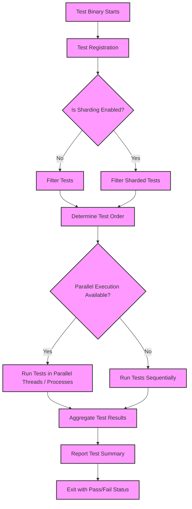

# Scalability, Test Discovery, and Parallel Execution

GoogleTest is designed with scalability and efficiency in mind, enabling seamless discovery, execution, and management of a large number of tests across diverse and complex codebases. This guide focuses on how GoogleTest handles test discovery at runtime, supports scalable test execution, and provides mechanisms and best practices to enable parallel and distributed test runs.

---

## Test Discovery: Automated and Dynamic

### Automatic Test Registration

GoogleTest automatically registers all tests defined using its macros such as `TEST()`, `TEST_F()`, `TEST_P()`, and `TYPED_TEST()` during program initialization. This eliminates the need for manual enumeration and promotes ease of use, especially in large projects.

- **User Intent:** Write tests naturally; no manual registration required.
- **Outcome:** The test framework knows about every test statically linked into the binary.

### Filtering Tests

GoogleTest allows filtering which tests run using the `--gtest_filter` flag or equivalent environment variables. Filters accept positive and negative glob patterns matching test suite and test names.

```bash
--gtest_filter=MySuite.*:-MySuite.UnwantedTest
```

Filtering is critical to scale when you have thousands of tests but want to run a subset quickly.

### Sharding (Test Partitioning)

For large-scale continuous integration, GoogleTest supports sharding, which splits test execution across multiple shards (machines or processes).

- Governed via environment variables such as `GTEST_TOTAL_SHARDS` and `GTEST_SHARD_INDEX`.
- GoogleTest automatically runs only tests assigned to the current shard.
- This boosts throughput and optimizes resource utilization.

---

## Scalable Test Management

### Test Suites and Test Fixtures

Tests are grouped logically into Test Suites (historically called Test Cases). This structuring supports:

- Shared setup and teardown via fixtures (`SetUpTestSuite()`, `TearDownTestSuite()`, `SetUp()`, and `TearDown()`).
- Easier navigation and filtering.
- Parallel test execution boundaries.

### Test Ordering and Reproducibility

By default, GoogleTest runs tests in the order they are registered, but it supports:

- Randomized test runs via `--gtest_shuffle` and `--gtest_random_seed` flags to surface inter-test dependencies.
- Stable replays enabled by specifying the seed.

Controlling test order is crucial for identifying flaky or interdependent tests.

---

## Parallel Execution: Harnessing Multithreading and Clusters

### Thread-Safe Test Execution

GoogleTest is thread-safe on supported platforms (see `GTEST_IS_THREADSAFE`) and allows:

- Concurrent execution of tests in separate threads.
- Safe use of assertions and logging in parallel threads.
- Use of synchronization primitives internally to avoid race conditions.

### Parallel Testing Tools and Integration Patterns

GoogleTest itself does not include a built-in test orchestrator or scheduler but is designed to integrate smoothly with external tools that enable parallel and distributed execution:

- **Test Runners & CI Systems:** Integrate GoogleTest with Jenkins, Bazel, or CMake script parallelism.
- **Sharding:** Run different shards in parallel across machines.
- **Forking:** For platforms supporting forks, GoogleTest’s death tests use forks safely, a behavior that can be leveraged for isolation.

### Recommended Usage for Parallel Runs

- Isolate tests: Use fixtures to ensure tests do not share global mutable state.
- Avoid cross-test dependencies that could introduce flakiness.
- Use sharding environment variables to partition tests for parallel execution.


---

## Performance Considerations and Best Practices

### Minimize Test Setup Overhead

Share expensive resources in `SetUpTestSuite()` rather than in each `SetUp()` call.

### Run Independent Tests in Parallel

Maximize parallelism for smaller, independent tests to fully utilize CPUs.

### Use Test Filtering and Sharding to Manage Scale

During incremental development or debugging, filter tests relevant to the task.

### Monitor Test Duration

Use `--gtest_print_time` option to identify slow tests and optimize or isolate them.

### Common Pitfalls

- Shared mutable state between tests causes concurrency issues.
- Improper use of global state invalidates isolation assumptions.
- Assuming all platforms have full thread safety despite some OS constraints.

---

## Example: Running Tests with Filtering and Sharding

```bash
# Run all tests matching 'FastTests' suite
./my_tests --gtest_filter=FastTests.*

# Run first shard (of 4 shards) in parallel environment
GTEST_TOTAL_SHARDS=4 GTEST_SHARD_INDEX=0 ./my_tests

# Combine filtering and sharding
GTEST_TOTAL_SHARDS=2 GTEST_SHARD_INDEX=1 ./my_tests --gtest_filter=Integration*:-Integration.Slow*
```

---

## Summary

GoogleTest automates test discovery via static registration and enables flexible filtering. For scalability, it provides sharding support to distribute tests across processes or machines. Its design ensures thread-safe assertion management, facilitating parallel execution on supported platforms. Users should leverage test fixtures for isolation and employ filtering, sharding, and CI integration to realize efficient large-scale testing.

---

## References and Further Reading

- [GoogleTest Primer](https://google.github.io/googletest/primer.html) — Learn test writing basics
- [Test Definition & Lifecycle](https://google.github.io/googletest/api-reference/core-test-api/test-definition-and-lifecycle.html)
- [Value- and Type-Parameterized Testing](https://google.github.io/googletest/concepts/data-performance-scalability/parameterized-testing.html)
- [Integration with Development Pipelines](https://google.github.io/googletest/overview/integration-and-ecosystem/integration-overview.html)
- [Test Lifecycle Guide](https://google.github.io/googletest/concepts/core-architecture/test-lifecycle.html)

---

## Diagram: Scalable Test Execution Flow



This flowchart highlights the test registration, filtering (including sharding), determination of execution order, parallel or sequential test running, and final reporting stages.

---

## Troubleshooting

| Issue                                | Cause                                         | Solution                                                  |
|------------------------------------|-----------------------------------------------|-----------------------------------------------------------|
| Tests not discovered or run        | Incorrect test macro usage or linkage issues  | Use GoogleTest macros (`TEST()`, `TEST_F()`) and link test object files correctly |
| Unexpected tests skipped           | Filters do not match any test                   | Verify filter patterns or remove filters                  |
| Flaky tests in parallel runs       | Shared mutable state or race conditions        | Make tests independent; use fixtures to isolate state     |
| Sharding results in missing tests  | Improper shard env vars or sharding config     | Ensure `GTEST_TOTAL_SHARDS` and `GTEST_SHARD_INDEX` are correctly set and consistent |
| Deadlocks or assertion failures on threads | Unsynchronized access to shared data        | Use thread-safe constructs and avoid cross-thread assertions |

---

## Practical Tips

- Always use `TEST_F()` or `TEST_P()` with well-defined fixtures for isolation.
- When scaling up, consider splitting tests into multiple shards to run in parallel CI jobs.
- Use `--gtest_filter` for iterative testing and faster feedback loops.
- Incorporate test duration measuring to detect and refactor slow tests.
- Review your build system and CI pipeline to parallelize GoogleTest invocations safely.

---