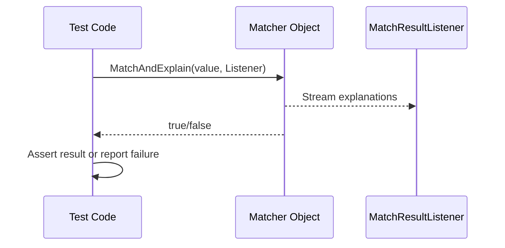

# Assertion and Matcher Data Models

This guide explores how GoogleTest and GoogleMock represent, evaluate, and report assertions and matchers internally. It illustrates the workings of built-in matchers and describes how users can create custom assertions and matchers tailored to specific testing needs.

---

## 1. Introduction to Assertions and Matchers

Assertions in GoogleTest evaluate conditions in test code, indicating success or failure. Matchers are specialized predicates used within assertions to validate values against expected criteria. Together, they form a powerful mechanism for expressive and flexible testing.

### 1.1 Role in Testing

- Assertions verify test outcomes, generating failures on discrepancies.
- Matchers describe complex conditions and facilitate detailed checks on values, especially function arguments in mocks.

---

## 2. Core Data Models

### 2.1 Matcher Interface

Matchers implement an interface that:

- Tests if a value satisfies the match condition.
- Describes what the matcher expects in human-readable form.
- Explains why a match succeeded or failed to improve diagnostics.

**Polymorphic matchers:** act as factories that can create matcher instances for different types depending on context.

### 2.2 AssertionResult

- Represents the result of a predicate or matcher evaluation.
- Contains success or failure status, optionally with explanatory message.
- Used internally by `EXPECT_PRED_FORMAT*` assertions.

---

## 3. Built-in Matchers

GoogleMock provides a comprehensive set of built-in matchers, categorized as:

- **Standard Matchers:** Basic comparisons like equality, inequality, less than, etc.
- **Composite Matchers:** Combine multiple matchers using logical AND/OR/NOT (`AllOf()`, `AnyOf()`, `Not()`).
- **String Matchers:** Compare string content, substrings, prefixes, suffixes, and case-insensitive variants.
- **Container Matchers:** Match STL containers by content, order, and element properties (`ElementsAre`, `Contains`, `UnorderedElementsAre`).
- **Member Matchers:** Match class object members or properties using `Field()` and `Property()`.

### Example: Using Built-in Matchers
```cpp
using ::testing::_
using ::testing::Return;

EXPECT_CALL(mock, ProcessData(Ge(0), HasSubstr("error")))
    .WillOnce(Return(true));
```

---

## 4. Matcher Evaluation and Explanation

### 4.1 MatchAndExplain Method

- Test if a value matches.
- Optionally stream additional explanation to a listener.
- Allows enriched failure diagnostics, for example, indicating specific mismatches.

### 4.2 Descriptive Methods

- `DescribeTo()` outputs what the matcher expects.
- `DescribeNegationTo()` describes the negated match condition.

---

## 5. Custom Assertions and Matchers

Users can define custom matchers and assertion predicates to verify complex or domain-specific logic:

### 5.1 Quick Matchers via Macros

- `MATCHER(name, description) { ... }` lets you create simple custom matchers that return true or false based on user code.
- Supports streaming explanatory failure messages.

Example:
```cpp
MATCHER(IsDivisibleBy7, "") { return (arg % 7) == 0; }
EXPECT_THAT(value, IsDivisibleBy7());
```

### 5.2 Parameterized Matchers

- `MATCHER_P(name, param, description)` supports matchers with parameters.

Example:
```cpp
MATCHER_P(HasAbsoluteValue, value, "") { return abs(arg) == value; }
EXPECT_THAT(x, HasAbsoluteValue(10));
```

### 5.3 Custom Monomorphic Matchers

- Implement `MatchAndExplain()`, `DescribeTo()`, and `DescribeNegationTo()` manually for fine control.
- Useful in cases demanding custom type handling or optimized implementations.

### 5.4 Custom Polymorphic Matchers

- Use `MakePolymorphicMatcher()` to create matchers usable across types.
- Support templates or method overloads internally.

### 5.5 Writing Custom Assertion Functions

- Define predicate-formatters conforming to the `AssertionResult PredicateFormatter(...)` signature.
- Use with `EXPECT_PRED_FORMAT*` macros for flexible assertions with rich failure messages.

---

## 6. Internal Utilities Supporting Matching

- **Tuple Matching:** Compares sets of arguments field-by-field using matcher tuples.
- **MatchResultListener:** Collects explanation strings generated during match evaluation.
- **Type Traits and Safe Matcher Casting:** Ensures matcher types match expected argument types safely, with support for implicit type conversions.

---

## 7. Common Patterns and Best Practices

- **Use built-in matchers when possible** to leverage tested implementations and readable failure messages.
- **Parameterize matchers** to increase reuse and clarity.
- **Use descriptive failure messages** inside custom matchers or predicates to ease debugging.
- **Avoid side effects in matchers** as gMock may invoke them multiple times unpredictably.

---

## 8. Summary

Understanding the assertion and matcher data models enables users to:
- Write expressive, maintainable tests with clear expectations.
- Create rich diagnostics that aid in rapid debugging.
- Extend GoogleMock effectively with domain-specific validation logic.

---

## References and Further Reading

- [Using Matchers in gMock](https://google.github.io/googletest/gmock_cook_book.html#UsingMatchers)
- [Writing Custom Matchers](https://google.github.io/googletest/gmock_cook_book.html#WritingNewMatchers)
- [Matchers Reference](reference/matchers.md)
- [EXPECT_THAT and Assertion Macros](reference/assertions.md#EXPECT_THAT)
- [gMock Cookbook: Advanced Matchers and Actions](guides/mocking-and-advanced-techniques/matchers-actions.md)
- [Mocking Reference](api-reference/mocking-apis/mock-methods.md)

---

## Visual Diagram of Matcher Evaluation



This sequence illustrates the interaction when a matcher checks a value and optionally streams an explanation for match success or failure.

---