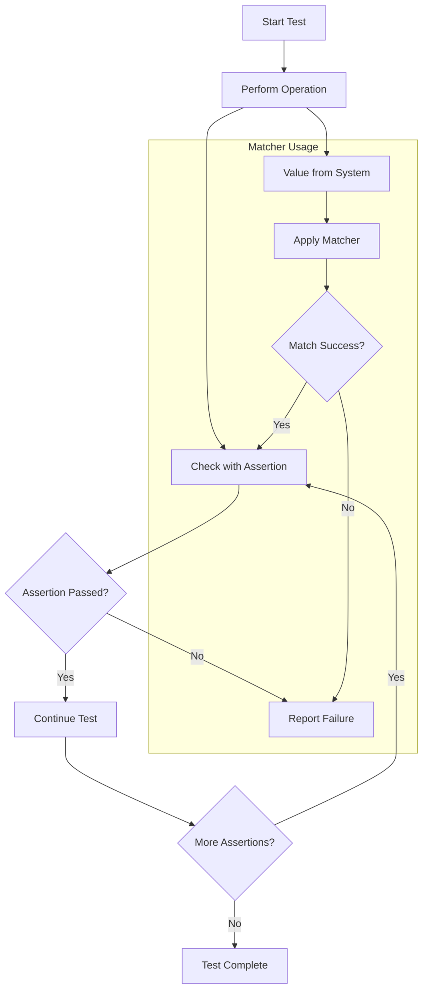

# Assertions & Matchers

Assertions and matchers are the cornerstone of expressing your test intent and verifying outcomes in GoogleTest. They give your tests a precise language, allowing you to specify expected behaviors, verify conditions, and provide rich diagnostic feedback when things go wrong.

This guide breaks down the fundamental concepts and usage patterns around assertions and matchers, helping you craft clear, concise, and robust tests.

---

## Why Assertions and Matchers Matter

Imagine you are testing a function that computes the square root of a number. You could write a plain `if` statement and print an error if the result is wrong — but this won’t integrate well with test frameworks, provide informative failure messages, or halt test execution properly. GoogleTest assertions solve this by embedding checks into your test code.

Matchers elevate this by allowing fine-grained, expressive conditions on values. Instead of just "equals," matchers let you verify ranges, patterns, and complex relationships, making your assertions read like English and your failures easier to understand.

Together, assertions and matchers form a powerful language for test verification.

---

## Understanding Assertions

### What Are Assertions?

Assertions are macros that check whether a condition holds at runtime. GoogleTest provides two primary variants:

- **EXPECT_** assertions: Generate *nonfatal* failures. The test continues running, allowing multiple failures to be reported.
- **ASSERT_** assertions: Generate *fatal* failures. The current test function aborts immediately on failure.

Use `EXPECT_` when you want your test to continue and report multiple issues; use `ASSERT_` when afterward code depends on the assertion being true.

### Common Assertion Macros

- **EXPECT_TRUE / ASSERT_TRUE(condition)**: Verifies that *condition* is true.
- **EXPECT_FALSE / ASSERT_FALSE(condition)**: Verifies that *condition* is false.
- **EXPECT_EQ / ASSERT_EQ(val1, val2)**: Checks `val1 == val2`.
- **EXPECT_NE / ASSERT_NE(val1, val2)**: Checks `val1 != val2`.
- **EXPECT_LT, EXPECT_LE, EXPECT_GT, EXPECT_GE**: Compares values with less than, less or equal, greater than, greater or equal.
- **EXPECT_STREQ / ASSERT_STREQ(cstr1, cstr2)**: Checks if C strings have the same contents.
- **EXPECT_NEAR / ASSERT_NEAR(val1, val2, abs_error)**: Checks that floating-point values are within an absolute error.
- **EXPECT_THROW / ASSERT_THROW(statement, ExceptionType)**: Verifies that the statement throws a specific exception.

### Writing Custom Failure Messages

All assertions support streaming additional failure messages using `<<`. For example:

```cpp
EXPECT_TRUE(IsValid(input)) << "Input validation failed for value: " << input;
```

This helps diagnose issues quickly by conveying the state when the failure occurred.

### Explicit Success and Failure Assertions

- `SUCCEED()`: Marks an explicit success (useful for documenting partial test paths).
- `FAIL()`: Generates a fatal failure immediately.
- `ADD_FAILURE()`: Generates a nonfatal failure.


---

## Harnessing the Power of Matchers

### What Are Matchers?

Matchers express expectations about values in a composable, extensible way. Instead of asserting equality only, matchers let you specify:

- Ranges (e.g., greater than 5)
- Pattern matching (e.g., string starts with "Hello")
- Container contents (e.g., vector contains specific elements)
- Structured conditions, combining simple checks

Matchers can be used inside some assertions (e.g., `EXPECT_THAT`) or with mock object expectations.

### Using `EXPECT_THAT` and `ASSERT_THAT`

`EXPECT_THAT(value, matcher)` asserts that `value` matches the given matcher. Failure messages from matchers are often more informative than simple `EXPECT_EQ`.

Example:

```cpp
EXPECT_THAT(name, StartsWith("Hello"));
EXPECT_THAT(numbers, ElementsAre(1, 2, 3));
```

### Common Built-in Matchers

- **`_`**: Wildcard matcher, matches anything.
- **`Eq(val)`**: Equals `val`.
- **`Ne(val)`**: Not equal to `val`.
- **`Lt`, `Le`, `Gt`, `Ge`**: Less than, less or equal, etc.
- **`HasSubstr(substring)`**: String contains substring.
- **`StartsWith(prefix)`**, **`EndsWith(suffix)`**: String starts or ends with.
- **`Contains(element)`**: Container contains the element.
- **`ElementsAre(...)`**: Matches container elements exactly.
- **`UnorderedElementsAre(...)`**: Matches container elements ignoring order.
- **`Pointee(matcher)`**: Matches the value pointed to by a pointer against the matcher.


### Combining Matchers

You can combine multiple matchers:

- `AllOf(m1, m2, ...)`: Matches if *all* matchers match.
- `AnyOf(m1, m2, ...)`: Matches if *any* matcher matches.
- `Not(m)`: Negates matcher `m`.

Example:

```cpp
EXPECT_THAT(value, AllOf(Ge(10), Le(20)));  // value in [10, 20]
EXPECT_THAT(name, Not(StartsWith("Debug")));
```

### Argument Matchers in Mocks

Matchers are also used to specify what arguments you expect a mock method to be called with:

```cpp
EXPECT_CALL(mock, Foo(Eq(42), _));  // First arg 42, second anything
```

### Partial Argument Matching and Composable Checks

Sometimes you only care about some arguments or specific parts of objects. Matchers let you:

- Use wildcards `_` for unimportant arguments.
- Match on object fields with `Field(&Class::field, matcher)`.
- Match on method results with `Property(&Class::Method, matcher)`.

Example:

```cpp
EXPECT_CALL(mock, Process(Field(&Data::id, Eq(5)), _));
```

Matches any call where the first argument is a `Data` object whose `id` equals 5.

---

## Creating Custom Assertions and Matchers

### Writing Custom Assertions

If existing assertions don’t cover your needs, create custom assertions:

- Implement a predicate function returning `bool`.
- Use `EXPECT_PRED*` macros to assert the predicate, e.g., `EXPECT_PRED2(IsValidPair, x, y);`
- For richer failure messages, use `EXPECT_PRED_FORMAT*` with predicate-formatters.

Example:

```cpp
bool IsEven(int n) { return n % 2 == 0; }
EXPECT_PRED1(IsEven, value);
```

### Writing Custom Matchers Quickly via Macros

The `MATCHER` and `MATCHER_P` macros simplify custom matcher creation.

Example:

```cpp
MATCHER(IsDivisibleBy7, "") { return (arg % 7) == 0; }
EXPECT_THAT(value, IsDivisibleBy7());
```

You can provide custom descriptions and failure explanations inside the matcher body.

### Advanced Matcher Classes

For complex scenarios, define matcher classes implementing:

- `bool MatchAndExplain(value, ostream*) const`
- `void DescribeTo(ostream*) const`
- `void DescribeNegationTo(ostream*) const`

Use polymorphic matchers if you want your matcher to work for multiple types (e.g., pointers of various types).

---

## Practical Tips & Best Practices

- Use assertions to clearly state your test’s success conditions.
- Use matchers to keep tests readable and expressive.
- Avoid over-specifying expectations; focus on what matters.
- Leverage wildcards `_` liberally to allow flexible argument matching.
- Use `EXPECT_THAT` to write clean checks on complex objects or containers.
- When possible, create custom matchers for reusable validation logic.
- For mock tests, expect calls *before* triggering behavior.
- Use `ASSERT_` variants when subsequent code depends on the assertion.
- Provide helpful failure messages to speed up debugging.

---

## Troubleshooting Common Issues

### Assertion Failures

- Inspect failure messages carefully; matchers provide detailed diagnostics.
- Use custom messages to document why an assertion should hold.

### Matcher Misuse

- Ensure matchers are pure functions without side effects.
- When matching pointers, use `Pointee` to check pointed-to values.
- Avoid confusing equality (`Eq`) with pointer equality.

### Unexpected Test Behavior

- Check that you are setting expectations before exercising code.
- For mock expectations, verify correct matcher usage.

---

## Related Concepts & Further Reading

- **Matchers Reference**: Comprehensive list of built-in matchers.
- **Assertions Reference**: Detailed reference on all GoogleTest assertions.
- **Using Mocks Correctly**: How to effectively combine matchers and expectations.
- **Creating Custom Matchers**: Guide to advanced matcher creation.

---

For a deeper dive, explore the [Assertions Reference](https://github.com/google/googletest/blob/main/docs/reference/assertions.md) and [gMock Cheat Sheet](https://github.com/google/googletest/blob/main/docs/gmock_cheat_sheet.md).

---

# Visual Overview: Assertion and Matcher Workflow



This diagram illustrates how test values flow through matchers and assertions to determine test outcomes.
